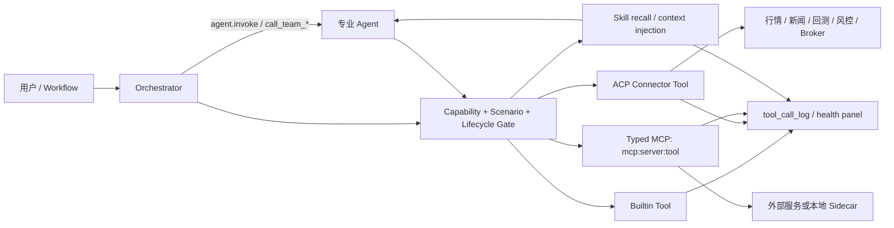
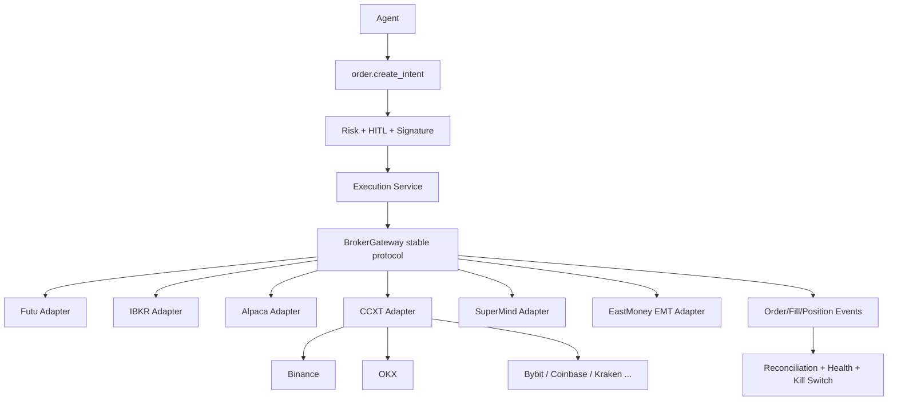

# QUBIT 工具、MCP、Skills 能力目录与交易所接入指南

> 基于 2026-08-09 代码与当前 SQLite 配置盘点。代码基线：`codex/tool-skills-benchmark-hardening`。
>
> 本文回答四个问题：系统当前有什么能力、哪些 Agent 能看到它们、能力还缺什么、怎样以 Connector / MCP / Skill / Codex Plugin 的方式扩展并接入不同交易所。

## 1. 结论先行

QUBIT 当前不是“缺少工具”，而是已经拥有较完整的研究和交易骨架，但存在三类结构性缺口：

1. **执行闭环的生产成熟度低于研究闭环。** 研究侧已有 snapshot → thesis → factor/strategy → backtest；交易侧已有 intent → risk → broker sidecar。当前已统一订单查询/改单、余额/保证金、对账和 Sidecar 事件入口，真正的 venue websocket、完整订单状态机和自动降级仍是上线前门禁。
2. **Catalog、Agent 默认授权和当前 SQLite 状态不完全一致。** Catalog 有较多工具，但不少工具没有进入任何内置 Agent 的默认工具面；SQLite 中也残留旧 MCP transport 和已经隔离的 enabled 配置。
3. **插件形态已经具备雏形，但还不是完整的 Codex Plugin Runtime。** 当前能导入 Codex/Claude Plugin 的 Skills 和 `.mcp.json`，能安装 MCP、Skill、官方 Connector Pack；OpenAI App Connector 会被明确跳过，第三方原生 Connector 还缺少稳定 ABI、签名、权限声明和生命周期管理。

建议的能力优先级：

| 优先级 | 应补能力 | 原因 |
| --- | --- | --- |
| P0 | Broker 订单状态机、幂等 clientOrderId、订单/成交 WebSocket、对账和 kill switch | 直接决定是否能安全接实盘；本轮先补齐统一合同、事件入口与多级开关 |
| P0 | MCP 配置迁移与 quarantine 强制收敛 | 当前 SQLite 与代码推荐状态不一致，可能继续调用已知坏服务 |
| P0 | 全局文件系统 Skill 与角色映射审计 | Skill 不应依赖 project SQLite；`~/.qubit-agent/skills` 是可移植的唯一默认来源 |
| P1 | 微观结构工具正式授权给 market_data | order book / trades / ticks 已有实现，但默认 Agent 看不到 |
| P1 | 多币种、多账户、保证金、费率、交易日历与 instrument master | 接多个交易所后必须统一口径 |
| P1 | Connector Plugin SDK + manifest + conformance test | 让新交易所像插件一样接入，而不是修改核心 switch |
| P2 | 期权、期货、永续、公司行动、税费和借券模型 | 当前订单模型主要覆盖 market/limit 与基础 long/short |
| P2 | 数据许可、entitlement 和来源级审计 | 生产行情不能只判断“接口可连通” |

## 2. 能力模型：Tool、MCP、Skill、Connector、Plugin 的边界



- **Tool**：模型可发起的一次结构化操作。Builtin 在 Bun/Rust 内执行；Connector Tool 通过 ACP 路由到注册 Connector。
- **Dynamic Tool**：运行时由拓扑生成，例如 `agent.invoke`、`call_team_<role>`，不属于静态 78-tool catalog。
- **MCP**：外部或本地进程提供的工具，模型使用 `mcp:<server>:<tool>` 精确调用。是否可用取决于 server enabled、Agent 白名单、binding、cooldown 和 quarantine。
- **Skill**：可检索、可版本化的流程知识，不直接替代工具。Rust Core 在 turn 开始时并行召回 Memory 与 Skill，并将正文注入上下文。
- **Connector**：稳定领域接口的实现，例如 DataConnector、ExecutionConnector。适合高频、强类型、需要治理和 fallback 的核心能力。
- **Plugin**：产品安装单元，可打包 builtin tools、MCP、Skills、Connector 或它们的组合；当前执行最终仍落到 Tool/MCP/Skill/Connector。

### 2.1 “Agent 能用”不是只看 `tools_json`

实际可见工具是以下集合的交集，并且会随 workflow 进度动态缩小：

```text
Agent 声明工具
∩ sandbox/capability 授权
∩ 当前 scenario recipe
∩ lifecycle（retired/deprecated 会被过滤或映射）
∩ 当前 contract progress / stall budget
∩ MCP enabled + binding + cooldown/quarantine
```

因此本文中的“默认 Agent”表示 seed definition 的基线授权。具体运行时仍可能因场景门禁、缺失产物或重试预算而暂时不可见。

## 3. 内置 Agent 与职责

本文使用以下缩写：

| 缩写 | Definition | 作用 |
| --- | --- | --- |
| O | `def-orchestrator` | 场景编排、委派、证据链和最终交付 |
| MD | `def-market-data` | 标的解析、行情源治理、快照、K 线和报价 |
| NE | `def-news-event` | 新闻检索、事件抽取和新闻情绪 |
| FUND | `def-analyst-fundamental` | 财务、估值、竞争力和基本面 thesis |
| TECH | `def-analyst-technical` | K 线、指标、形态和技术 thesis |
| SENT | `def-analyst-sentiment` | 新闻证据和情绪 thesis |
| MACRO | `def-analyst-macro` | 宏观 regime 和宏观 thesis |
| RES | `def-research` | 因子、策略组合和研究报告 |
| BT | `def-backtest` | 因子计算、历史回测和验证报告 |
| RISK | `def-risk` | 规则、流动性、集中度、风险审批和签名 |
| WF | `def-walk-forward-validator` | Walk-Forward / 批量因子评估 |
| CODER | `def-strategy-coder` | Strategy API 编译、合约回测和 paper runtime |

所有专业 Agent 在非严格场景下都会附加 `web.search` 和 `web.fetch`。持有行情工具的 Agent 还会自动附加 `market.resolve_symbol`、`market.data_sources`、`market.readiness`、`market.snapshot.get`。

## 4. 当前全局工具目录

### 4.1 行情数据（12）

| 工具 | 作用 | 默认 Agent |
| --- | --- | --- |
| `market.resolve_symbol` | 识别 CN/HK/US/CRYPTO、交易所和标准 symbol | O、MD；FUND/TECH/MACRO/BT/CODER 自动附加 |
| `market.data_sources` | 查看数据源覆盖、凭证、成功率、P95、熔断和 fallback | MD；持行情工具的专业 Agent 自动附加 |
| `market.readiness` | 启动期真实样本 readiness gate | MD；持行情工具的专业 Agent自动附加 |
| `market.snapshot.get` | 生成不可变行情快照及 quality/tradable 判定 | O、MD；持行情工具的专业 Agent 自动附加 |
| `fetch_klines` | 多市场 OHLCV；按健康度在 Futu/IB/iFinD/Wind/AkShare/东财/Yahoo/Binance 等源间降级 | MD、TECH、MACRO、BT、CODER |
| `fetch_quote` | 标准化实时/准实时报价、新鲜度和来源 | MD |
| `fetch_ticks` | L1 Tick；无真实源时明确失败 | MD |
| `fetch_order_book` | 买卖盘口；当前 CN 东财五档、Crypto Binance 深度 | MD |
| `fetch_trades` | 逐笔成交和主动买卖方向 | MD |
| `fetch_chip_distribution` | A 股筹码分布、成本区间和集中度 | MD；FUND 经 MD 委派 |
| `fetch_fundamentals` | 年度/季度财务与估值字段，数据源不可用时透明失败 | FUND |
| `write_snapshot` | 将行情/研究数据写成可复用快照 | 未默认分配；更适合由 snapshot service 内部调用 |

### 4.2 研究、因子、策略与回测（27）

| 工具 | 作用 | 默认 Agent |
| --- | --- | --- |
| `run_screener` | 对 US/CN-A/HK/CRYPTO 候选池做行业、估值、动量、质量筛选 | O |
| `compute_indicators` | SMA、RSI、MACD、布林带等 | TECH |
| `detect_patterns` | 趋势/震荡、金叉/死叉等形态 | TECH |
| `compute_valuation` | 现价相对 252 日均价的估值代理；不是正式财报 PE | FUND |
| `code.run_python` | 受限 Python 数值沙箱，无网络/文件/子进程 | FUND、TECH、SENT、MACRO、BT、WF、CODER |
| `factor.register` | 注册 qlib/python 因子定义 | O、RES |
| `factor.compute` | 计算并持久化 factor_value | RES、BT |
| `factor.autoEvaluate` | IC、RankIC、IR、衰减、分组收益的一步评估 | RES、WF |
| `factor.evaluate.batch` | 最多 30 个因子的批量评估和排名 | WF |
| `factor.list` | 查询项目因子池 | RES、BT、WF |
| `factor.mine.llm` | 批量表达式挖掘、评价和 promote gate | 未默认分配，建议给 RES/O |
| `factor.promote_backtest` | 因子 → 策略版本 → 组合 → 回测的一键闭环 | 未默认分配，建议给 RES/O |
| `discovery.run` | 运行 Alpha101 / GP 等因子发现任务 | O |
| `discovery.promote` | 将 discovery candidate 提升为正式 factor | O |
| `strategy.create_version` | 创建不可变策略版本 | O、RES、CODER |
| `strategy.compose` | 将因子/规则组合成策略 composition | O、RES |
| `strategy.compile` | 将 Strategy API V2 Python 编译为 manifest | O、CODER |
| `strategy.contract_backtest` | 对 Strategy API 做契约级回测 | O、CODER |
| `backtest.run` | 事件驱动回测并写入 backtest_run/eval | O、RES、BT、WF |
| `recommendation.record` | 保存结构化 DecisionSignal 和后验跟踪 | O |
| `research.thesis.write` | 保存结构化 thesis、证据、置信度和失效条件 | O、FUND、TECH、SENT、MACRO |
| `research.forecast_book.get` | 查询 thesis 与风险、订单、成交、持有期结果的关联 | O |
| `research.forecast_book.link` | 向 forecast book 追加 recommendation/risk/order/fill 关联 | 未默认分配；建议给 O 或由服务自动完成 |
| `rule.register` | 注册并校验规则 DSL | O、RISK |
| `rule.evaluate` | 运行规则并写 evaluation log | RISK |
| `web.search` | 搜索公开网页；不是实时行情源 | 所有内置 Agent（运行时支持工具） |
| `web.fetch` | 读取已知 URL 正文 | 所有内置 Agent（运行时支持工具） |

> `def-research` 仍声明旧名 `factor.evaluate`，生命周期解析会转到 `factor.autoEvaluate`。建议直接更新 seed，避免定义层继续保留旧口径。

### 4.3 交易执行（11）

| 工具 | 作用 | 默认 Agent |
| --- | --- | --- |
| `portfolio.construct` | 由 thesis/candidates 生成确定性目标组合和敞口 | O |
| `order.create_intent` | 创建订单意图，进入风险审批而不是直接下单 | O |
| `strategy.paper_deploy` | 部署策略到 paper runtime | O、CODER |
| `strategy.paper_run` | 推进 paper 策略运行 | O、CODER |
| `submit_paper_order` | 旧式 paper 下单入口 | 未默认分配；建议最终并入 intent engine |
| `get_paper_position` | 查询 paper position | 未默认分配；建议作为 portfolio/monitor 查询能力 |
| `submit_order` | 提交已审批订单到 ExecutionConnector | 未默认分配，刻意不让普通 Agent 直接调用 |
| `cancel_order` | 撤销 broker order | 未默认分配；应只给 execution agent/人工控制面 |
| `get_fills` | 查询 broker fills | 未默认分配；应给 monitor/对账 agent |

当前没有默认可直接下单的 `execution_trader` seed Agent。实盘编组由 O + RES + RISK 组成，订单仍经过 intent → risk → HITL；系统新增了独立只读 Execution Monitor，避免为了“看账户”而扩大 O 或研究 Agent 的交易权限。

### 4.3.1 执行可观测性（新增，默认只读）

| 工具 | 作用 | 默认 Agent |
| --- | --- | --- |
| `execution.account.snapshot` | 读取 Connector capability、持仓、以及可用时的余额/保证金 | Execution Monitor |
| `execution.order.get` | 读取订单状态及成交；超时后查询，不盲目重下 | Execution Monitor |
| `order.list_open` | 列出当前未完成订单；不支持的 Provider 明确返回 capability unavailable | Execution Monitor |
| `provider.capabilities` | 读取当前 Provider/Sidecar 的实时能力矩阵 | Execution Monitor |
| `execution.reconcile.positions` | 生成只读账本/券商持仓对账和修复 proposal | Execution Monitor |
| `execution.kill_switch.status` | 检查五级熔断状态 | Execution Monitor |

新增 `def-execution-monitor`（role=`execution`）是 reactor，订阅 `ALERT`、`RISK_BLOCK`、`ORDER_INTENT`。它没有 submit/cancel/modify 工具，也不在默认实盘编组中自动下单；这是刻意的最小权限设计。

### 4.4 风控（5）

| 工具 | 作用 | 默认 Agent |
| --- | --- | --- |
| `evaluate_risk` | 对策略/订单做统一风险评估 | O、RISK |
| `load_rules` | 加载有效风险规则 | RISK |
| `check_concentration` | 检查单标的/行业集中度 | RISK |
| `assess_liquidity` | 检查流动性和冲击风险 | RISK |
| `sign_intent` | 为通过审批的 intent 生成风险签名 | RISK |

### 4.5 新闻、宏观（3）

| 工具 | 作用 | 默认 Agent |
| --- | --- | --- |
| `fetch_news` | 结构化新闻与来源证据 | NE、SENT |
| `fetch_news_sentiment` | 新闻情绪聚合 | NE、SENT |
| `compute_macro_indicators` | 由基准指数推导 risk-on/off regime | MACRO |

### 4.6 Memory 与 Skills（17）

| 工具 | 作用 | 默认 Agent |
| --- | --- | --- |
| `memory.recall` | Core/Bun 统一记忆召回 | O；Rust Core 在上下文阶段自动执行 |
| `memory.consolidate_longterm` | 将 midterm 提炼成长期知识 | O |
| `memory.refresh_workspace` | 将长期记忆同步到 workspace 文档 | O |
| `memory.summarize_workflow` | 将当前 workflow 归纳成 midterm | 未默认分配；通常由 terminal hook 自动调用 |
| `write_memory` | 写入项目/Agent 记忆 | 未默认分配；建议限制为系统 hook 或专用 memory agent |
| `workspace.context.snapshot` | 读取 workspace 上下文快照 | 未默认分配；系统级 |
| `workspace.memory.search` | 搜索 workspace memory | 未默认分配；`memory.recall` 已是主入口 |
| `skill.search` | 按 goal/关键词检索 Skill | 所有 active 内置 definition |
| `skill.use_record` | 记录 Skill success/fail/partial 和分数 | 所有 active 内置 definition |
| `skill.create` | 将非平凡流程沉淀为新 Skill | O |
| `skill.patch` | 修补 Skill 并 bump version | O |
| `skill.archive` | 软归档 Skill | O |
| `skill.list` | 管理端列出 Skill | 未默认分配 |
| `skill.view` | 管理端查看 Skill 正文与统计 | 未默认分配 |
| `skill.import_market` | 将 Skill 市场安装镜像到 agent_skill | 未默认分配；安装服务调用 |
| `edit_agent_pack` | 修改 Agent soul/user/memory/prompt 文件 | 未默认分配；高权限管理能力 |
| `update_plan` | 更新可见执行计划 | O |
| `tool.catalog.search` | 按需搜索全局 Tool Catalog；标记当前 Agent 是否已经配置 | O、Execution Monitor |

### 4.7 审计与执行沙箱（5）

| 工具 | 作用 | 默认 Agent |
| --- | --- | --- |
| `generate_report` | 汇总信号生成 Markdown 报告 | 未默认分配；当前主要由 pipeline 生成报告 |
| `write_audit_log` | 显式写关键操作审计 | 未默认分配；大部分审计由服务自动完成 |
| `tool.report_gap` | 报告缺失/失败/不会使用的工具 | 未默认分配；建议至少给 O 和专业 Agent |
| `shell.exec` | 只允许白名单 CLI、数组参数、受限 cwd | 未默认分配，experimental |
| `cli_agent.run` | 调用外部 agentic CLI 完成长任务 | 未默认分配，experimental |

### 4.8 动态工具

| 工具 | 作用 | 默认 Agent |
| --- | --- | --- |
| `agent.invoke` | Rust Core L0 专家调用，指定 `callee_spec_id` | O |
| `call_team_<role>` | 根据当前拓扑生成的强类型团队 facade | O；只有拓扑中实际存在的角色才生成 |

## 5. MCP 现状

### 5.1 内置 Agent 默认 MCP 授权

| MCP | 主要工具 | 默认 Agent | 结论 |
| --- | --- | --- | --- |
| `mathjs` | `evaluate` | O、MD、FUND、TECH、MACRO、RES、BT、WF、CODER | 保留；低风险通用计算 |
| `tradingcalc` | PnL、仓位、强平、carry、funding、hedge ratio 等 | O、MD、FUND、TECH、MACRO、RES、BT、WF、CODER | 保留；应按工具粒度缩小角色授权 |
| `investor-agent` | 股票信息、历史价格、期权、财报日历、Fear & Greed、技术指标 | O、MD、FUND、TECH、SENT、MACRO、RES、CODER | 保留 HTTP 版本；`market_movers` 当前默认隔离 |
| `qubit-broker` | health、submit、cancel、fills、positions | 无 Agent 默认 MCP 白名单 | 保留为内部执行适配，不应直接给研究 Agent |
| `mcp-financex` | Yahoo、期权、SEC、DCF 等约 26 个工具 | 无 seed Agent；当前配置仍 enabled | 已知 stdio 崩溃，应强制 disabled |
| `publicfinance` | SEC XBRL、Treasury、BLS | 无 seed Agent；当前配置仍 enabled | 历史 0% 成功，修复 sidecar 后再启用 |
| `us-gov-open-data` | FRED、SEC、BLS、EIA、Congress | 无 seed Agent；当前配置仍 enabled | 历史 0% 成功，缺 key 时禁止启动 |
| `fsi-factset`、`fsi-daloopa`、`fsi-sp-global`、`fsi-aiera`、`fsi-mtnewswires` | 机构数据/新闻 | 当前 DB disabled；面向 O/RES/FUND/SENT/NE | 需订阅和 OAuth/API 凭证 |
| `fsi-lseg`、`fsi-morningstar` | 机构数据 | 当前 DB disabled，且未进入 seed FSI 白名单 | 接入前补 capability 描述和角色策略 |

### 5.2 当前 SQLite 与推荐配置的差异

当前 SQLite 显示 7 个 enabled server：`investor-agent`、`mathjs`、`mcp-financex`、`publicfinance`、`qubit-broker`、`tradingcalc`、`us-gov-open-data`。但 seed 只会给内置 Agent 配 `mathjs`、`tradingcalc`、`investor-agent`；后三个已知不稳定服务已在 seed 层 quarantine。

需要立即做一次配置迁移：

1. 将 `investor-agent` 从旧的 `stdio: npx -y investor-agent` 迁移为 `https://investor.ferdousbhai.com/mcp` HTTP。
2. 强制关闭 `mcp-financex`、`publicfinance`、`us-gov-open-data`，而不是仅依赖 Agent seed 不引用。
3. 为所有 server 做 install-time health probe；当前 MCP install service 主要写 DB/binding，不保证服务真正可运行。
4. `capabilitiesJson.tools` 必须来自 `tools/list` 实际探测并带 schema hash，不能长期依赖手写清单。
5. 将 timeout、rate limit、retry、auth scope 和 data classification 纳入 plugin manifest 与 health panel。

## 6. Skills 现状：文件系统优先，不再要求数据库

### 6.1 已处理：`~/.qubit-agent/skills` 是全局来源

Skill 的默认位置是：

```text
~/.qubit-agent/skills/<skill-name>/SKILL.md
```

也接受根目录下单个 `*.md`。`QUBIT_SKILLS_DIR` 可把根切换到企业共享的只读目录。每个 `SKILL.md` 使用标准 frontmatter（`name`、`description`、可选 `version`/`category`）和 Markdown 正文；文件最大 16 KiB，过大的文件会被跳过，避免把不受控长文塞进 Core prompt。

Rust Core 仍在 turn 开始时并行调用 `memory.recall` 和 `skill.search`。现在 `skill.search` 会先检索文件系统，再把旧的 project SQLite `agent_skill` 作为**兼容性补集**合并；因此没有 projectId、没有 seed、没有数据库记录时，全局 Skill 仍能被 Agent 实际使用。数据库仍保留给历史的 agent-created/market Skill、使用统计与演化，但不再是安装或召回的前提。

当 Core 实际取回一个 Skill 时，bridge 会写一条 `research_team_interaction`（`toolKind=skill`、`phase=skill_context_injection`）。拓扑只应以这类实际注入事件显示 Skill 节点，而不能因为 Agent definition 中出现了一个名称就宣称“已使用”。这也解释了此前拓扑为空：当时可检索 Skill 只在 DB 中且没有命中/注入，并不是 Core 不支持 Skill。

### 6.2 历史 DB 清点（兼容数据，不是全局 Skill 目录）

- 仓库物理内容：17 个 FSI Skill、16 个 quant Skill。
- 当前 SQLite：54 行 active，但按名字去重后只有 15 个 FSI、11 个 quant、2 个 imported，共 28 个不同名字。
- 重复行主要来自不同 project scope，不应把 54 当作 54 项独立能力。
- 当前高使用量集中在 `quant:order-intent-buy-checklist`、`quant:alpha-pead-drift`、`quant:factor-ic-ir-report`；大量 Skill 使用次数仍为 0。

### 6.3 量化 Skill 与角色

| Skill | 作用 | 目标 Agent |
| --- | --- | --- |
| `quant:alpha-pead-drift` | 财报后漂移/SUE alpha | FUND、RES、NE |
| `quant:quality-piotroski-f-score` | Piotroski F-Score 质量过滤 | FUND、RES |
| `quant:momentum-52w-breakout` | 52 周新高动量 | TECH、RES |
| `quant:technical-macd-kdj-volume-factors` | MACD/KDJ/量价因子落库 | TECH、RES、O |
| `quant:mean-reversion-bollinger` | Bollinger + RSI 均值回归 | TECH |
| `quant:vol-regime-classifier` | 波动 regime 门禁 | MACRO、TECH、RES |
| `quant:yield-curve-recession-probe` | 收益曲线衰退概率 | MACRO、RES |
| `quant:news-sentiment-event-scoring` | 新闻事件情绪和半衰期 | SENT、NE、RES |
| `quant:factor-ic-ir-report` | IC/IR/turnover 标准报告 | RES、BT、TECH、FUND |
| `quant:risk-concentration-var-checklist` | HHI/VaR/CVaR/流动性/压力测试 | RISK、RES、BT |
| `quant:backtest-leakage-self-check` | Lookahead/survivorship/restatement 检查 | BT、RES、TECH |
| `quant:order-intent-buy-checklist` | intent → risk signature 的买单清单 | RES、RISK |
| `quant:pairs-cointegration` | 协整、hedge ratio、spread z-score | TECH、RES、BT |
| `quant:kelly-position-sizing` | 分数 Kelly 仓位门禁 | RES、RISK |
| `quant:walk-forward-validation` | Rolling/expanding/purged CV | BT、RES、WF |
| `quant:portfolio-analytics` | CAGR、Sharpe、Sortino、回撤、VaR | RES、RISK、BT |

后五项中的多个文件已在仓库和 seed 代码中，但当前 SQLite 尚未同步。应在 bootstrap migration 中记录 `skill_seed_version`，版本变化时为所有 project 幂等重放 `syncBuiltinQuantSkillsForProject`。

### 6.4 FSI 与导入 Skill

FSI 内容包有 17 项：

| Skill | 作用 | 默认 Agent |
| --- | --- | --- |
| `fsi/earnings-analysis` | 财报结果、偏差和关键驱动分析 | SENT |
| `fsi/earnings-preview` | 财报前预期、情景和关注点 | NE、FUND、SENT |
| `fsi/idea-generation` | 研究想法生成与筛选 | RES、CODER |
| `fsi/initiating-coverage` | 首次覆盖研究框架 | MACRO |
| `fsi/model-update` | 新信息后的模型更新流程 | SENT |
| `fsi/morning-note` | 晨会/晨报格式 | NE、SENT、MACRO |
| `fsi/sector-overview` | 行业概览与比较 | MACRO |
| `fsi/thesis-tracker` | 投资论点持续跟踪 | O、FUND、RES、CODER |
| `fsi/audit-xls` | 表格模型审计 | BT |
| `fsi/clean-data-xls` | 表格数据清洗 | MD、BT |
| `fsi/competitive-analysis` | 竞争格局分析 | FUND、RES、CODER |
| `fsi/comps-analysis` | 可比公司分析 | O、FUND、RES、CODER |
| `fsi/dcf-model` | DCF 建模流程 | FUND、RES、CODER |
| `fsi/xlsx-author` | 生成/维护研究表格 | RES、CODER |
| `fsi/kyc-rules` | KYC/合规检查框架 | RISK |
| `fsi/kyc-doc-parse` | KYC 文档解析 | 未进入默认角色映射，也未出现在当前 SQLite distinct names |
| `fsi/gl-recon` | 总账核对 | 未进入默认角色映射，也未出现在当前 SQLite distinct names |

定义中另有 6 个历史 Skill ref：`technical-analysis`、`momentum-factor`、`fundamental-analysis`、`sentiment-analysis`、`macro-analysis`、`risk-management`。它们只出现在 `ROLE_SKILLS`，仓库没有对应 Skill 文件，当前 SQLite 也没有这些名字，属于悬空声明。应删除这些 ref，或为其建立正式 Skill；不能把“写在 Agent 定义里”当成已经可召回。

当前还有两个 imported Skill：`quant-analyst`、`quant-trader-daily`，但使用次数为 0。应要求 imported Skill 声明：

- `roles` / `modeTags`
- `allowedTools` 或工具 namespace
- 输入与输出 schema
- 所需 MCP/server/auth
- side-effect 等级和是否允许交易
- smoke recipe 与期望产物

没有这些声明的 Skill 只能作为低信任上下文，不得直接扩大 Agent 工具权限。

## 7. 哪些现有能力应该补授权、合并或保持隐藏

### 7.1 建议补授权

| 能力 | 建议 |
| --- | --- |
| `fetch_ticks` / `fetch_order_book` / `fetch_trades` | 加入 MD；按场景和数据源 entitlement 动态显示 |
| `fetch_chip_distribution` | 加入 MD，FUND 可经 MD 委派获取 |
| `factor.mine.llm` / `factor.promote_backtest` | 加入 RES；O 保留编排权，但不直接生产大量表达式 |
| `research.forecast_book.link` | 给 O，或在 order/risk/fill 服务中自动 link |
| `tool.report_gap` | 给全部 Agent，做参数错误/缺失能力的结构化反馈 |
| `get_fills` / positions / order status | 给新的只读 Execution Monitor Agent，而不是研究 Agent |

### 7.2 建议继续隐藏

- `submit_order`、`cancel_order`：只允许最小权限 Execution Agent 或人工控制面。
- `shell.exec`、`cli_agent.run`、`edit_agent_pack`：保持 experimental/admin-only。
- `skill.list/view/import_market`：管理 API 使用即可，不必占用模型工具面。
- `write_snapshot`、`write_audit_log`、`memory.summarize_workflow`：优先由 runtime hook 自动触发。
- `submit_paper_order`：逐步并入统一 intent engine，避免 paper/live 两套状态机。

### 7.3 仍需清理的口径

- Seed 中的 `factor.evaluate` 应改成 `factor.autoEvaluate`。
- Official Quant Data Plugin 仍引用已退役的 `fetch_price_data`，应改为 `fetch_klines` + `compute_indicators`。
- 文档和策略中若仍出现 `assign_task`、`call_mcp`、`run_backtest`、`search_memory`，应迁移到 `agent.invoke`、typed MCP、`backtest.run`、`memory.recall`。

## 8. 能力缺口路线图

### 8.1 数据层

1. **Instrument Master**：统一 symbol、venue、assetClass、currency、tickSize、lotSize、priceScale、timezone、session、expiry、contractMultiplier。
2. **Corporate Actions**：拆股、分红、配股、停牌、退市和复权版本，必须进入 snapshot lineage。
3. **Entitlement**：区分“接口健康”和“账户拥有该市场/深度权限”。
4. **数据一致性**：跨源价格偏差、bar 缺口、重复 tick、时钟漂移和 source sequence 检查。
5. **流式治理**：WebSocket 重连、sequence gap recovery、snapshot+delta 合并、背压和按 symbol 的 freshness SLO。

### 8.2 研究与回测

1. Universe point-in-time、成分股变更和退市样本。
2. 交易费用、滑点、冲击成本、借券费、资金费和税费模型。
3. Portfolio-level 回测与多币种 NAV，而不是主要围绕单策略/单 symbol。
4. Walk-forward、purged CV、regime split 和参数稳定性成为 promotion 硬门禁。
5. 期权链快照、Greek surface、合约到期与 early exercise 模型。

### 8.3 交易与风控

1. `clientOrderId`/idempotency key、replace/modify order、cancel-replace。
2. Open order、partial fill、expired、pending cancel、broker reject 的完整状态机。
3. 余额、购买力、保证金、leverage tier、position mode、reduce-only、post-only。
4. Pre-trade + intraday + post-trade 三层 risk；账户/策略/组合/标的多级限额。
5. Broker/exchange event ingestion、定时 reconciliation、break detection 和自动降级到只读。
6. Kill switch：按全局、provider、account、strategy、symbol 五级关闭下单。
7. Secret Vault、key rotation、IP allowlist、withdraw permission 禁止、双人审批和审计签名。

### 8.4 Agent 与插件

1. 新增 `execution_monitor` Agent：只读 order/fill/position/reconciliation。
2. 新增 `execution_trader` Agent：只能处理已签名 intent，默认 paper，无研究工具。
3. Plugin manifest 增加 capability、schema hash、required env、network domains、data class、side effects、health probe、uninstall hook。
4. 第三方 Connector 运行在独立 sidecar/process；核心只加载 manifest 和稳定协议，避免任意代码进入主进程。
5. 每个 plugin 自动生成 synthetic smoke 和最小 nightly recipe。

### 8.5 建议新增的具体工具

| 建议工具 | 作用 | 所属 Agent | 推荐实现形态 |
| --- | --- | --- | --- |
| `market.instruments.list` | 读取 venue 的合约、精度、lot、状态和到期信息 | MD | Connector；高频强类型 |
| `market.calendar.get` | 查询交易日、session、休市和半日市 | MD、O | Builtin + venue rule provider |
| `market.corporate_actions.get` | 拆股、分红、配股、停复牌、退市 | MD、FUND、BT | Connector |
| `account.get_balances` | 现金、购买力、保证金和币种余额 | Execution Monitor、RISK | Execution Connector，只读 |
| `account.get_positions` | 统一实盘持仓、可用数量、成本和未实现 PnL | Execution Monitor、RISK | Execution Connector，只读 |
| `order.get` | 查询单个订单最终/当前状态 | Execution Monitor | Execution Connector，只读 |
| `order.list_open` | 查询未完成订单 | Execution Monitor | 已实现：Futu、IBKR、CCXT、Alpaca Sidecar；其余 Provider fail-closed |
| `order.replace` | cancel-replace / modify order | Execution Trader | Execution Connector，高风险 |
| `execution.reconcile` | broker fills/positions 与本地账本对账 | Execution Monitor、RISK | Builtin service + Connector |
| `execution.kill_switch` | 按 provider/account/strategy/symbol 停止交易 | RISK、人工控制面 | Builtin，高风险、双确认 |
| `risk.margin_check` | 保证金、杠杆、强平距离和 buying power | RISK | Builtin + broker account data |
| `risk.borrow_check` | short locate、可借量和借券费 | RISK | Connector/MCP 数据源 |
| `derivatives.funding.get` | 永续资金费与历史 | MD、RISK | CCXT Connector |
| `derivatives.options_chain.get` | 标准化期权链、IV 和 Greeks | MD、TECH、RISK | IB/Alpaca/MCP Connector |
| `provider.capabilities` | 运行时返回具体 venue 支持的方法和限制 | Execution Monitor | 已实现：Builtin + Broker MCP 的 Connector introspection |

### 8.6 什么时候用 Tool、MCP、Skill 或 Plugin

| 需求 | 首选 | 原因 |
| --- | --- | --- |
| 核心订单、风控、行情快照、账本 | Builtin/Connector | 强类型、低延迟、可审计、可做 fail-closed |
| 外部数据 SaaS、低频分析服务 | MCP | 标准发现与调用协议，便于独立升级和熔断 |
| 分析方法、checklist、研究流程 | Skill | 只注入知识，不引入新的执行权限 |
| 一整套交易所/厂商能力 | Bundle Plugin | 同时携带 Connector/MCP、Skill、auth、health 和 smoke |
| 临时一次性脚本 | `code.run_python` | 受限执行；验证后应沉淀为 Tool 或 Skill |
| 高权限本地 CLI | Admin-only Tool | 不应通过普通第三方 Skill 自动获得 |

## 9. 如何像 Codex Plugin 一样扩展 QUBIT

QUBIT 已能导入：

- Codex Plugin：`.codex-plugin/plugin.json`、`skills/*/SKILL.md`、`.mcp.json`
- Claude Plugin
- 单个 Agent Skill
- MCP Catalog install
- 官方 builtin/connector pack

导入 Codex Plugin 时，应把 `skills/*/SKILL.md` 安装到全局 `~/.qubit-agent/skills`（或由 `QUBIT_SKILLS_DIR` 指定的受管根）；旧的 `agent_skill` 镜像仅用于历史兼容和统计。`.mcp.json` 会写入 project-scoped `mcp_server_config` 并创建 `*` binding。`.app.json` 中的 OpenAI App Connector ID 不可移植，当前会跳过并给 warning。

建议定义 QUBIT Native Plugin v1：

```json
{
  "schemaVersion": "1.0",
  "id": "exchange.okx",
  "name": "OKX",
  "version": "1.0.0",
  "kind": "bundle",
  "capabilities": ["market.quote", "market.orderbook", "trade.order", "account.position"],
  "runtime": {
    "type": "sidecar",
    "command": ["python", "-m", "qubit_okx_sidecar"]
  },
  "tools": ["fetch_quote", "fetch_order_book"],
  "mcpServers": [],
  "skills": ["skills/okx-pretrade/SKILL.md"],
  "auth": {
    "type": "api_key",
    "requiredSecrets": ["OKX_API_KEY", "OKX_SECRET", "OKX_PASSPHRASE"]
  },
  "safety": {
    "level": "high",
    "sideEffects": ["trade"],
    "forbidCapabilities": ["withdraw"]
  },
  "health": {
    "probe": "account.health",
    "timeoutMs": 5000
  },
  "smoke": ["health", "instruments", "paper_order_roundtrip"]
}
```

核心原则：Plugin 可以贡献实现和知识，但不能自行绕过 QUBIT 的 intent、risk、HITL、audit、health 和 capability gate。

## 10. 接入各种交易所的推荐架构

### 10.1 不建议每家交易所都新增一组 Agent 工具

应该保留统一业务工具：

```text
fetch_quote / fetch_klines / fetch_order_book
order.create_intent / evaluate_risk / sign_intent
submit_order / cancel_order / get_order / get_fills / get_positions
```

交易所差异放在 Provider Adapter 和 Instrument Master 中：



### 10.2 当前已经支持的 Broker Provider

| Provider | 市场 | 当前代码 | 生产前要求 |
| --- | --- | --- | --- |
| `alpaca` | US 股票/ETF，paper/live | REST adapter 已实现 | key/secret、paper 与 live key 隔离、订单事件流和对账 |
| `futu` | HK/US/CN，取决于账户权限 | OpenD 交易 adapter + 行情 bridge 已实现 | 本地 OpenD、`futu-api`、交易解锁、行情权限 |
| `ib` | 多市场股票/期权/期货等 | TWS/IB Gateway adapter + 历史行情已实现 | TWS/Gateway、API 权限、clientId/orderId 管理、订阅权限 |
| `ccxt` | Crypto spot/future，取决于 exchangeId | 通用 REST adapter 已实现 | 每交易所 capability 检查、sandbox、symbol/precision、费率和 WebSocket |
| `supermind` | CN | 本地 TradeAPI adapter 已实现 | Windows/官方 SDK/登录客户端/实盘权限；无真正 paper 语义 |
| `eastmoney_emt` | CN | VeighNa EMT adapter 已实现 | Windows、柜台授权、`vnpy_emt`、内网 sidecar 和 auth token |

当前稳定协议已经覆盖 health、submit、cancel、get order、fills、positions、balances、margin 和 capabilities。`modify_order` 只会在 Sidecar 明确实现时调用，**不会**隐式 cancel-replace：Alpaca 走 `PATCH /v2/orders/{id}`，CCXT 只有在 venue 声明 `editOrder` 时启用，其他 provider 明确返回 `broker_capability_unavailable`，避免安全语义漂移。

Sidecar 可向 `POST /api/reia/broker/events` 推送规范化 `ack`/`partial_fill`/`fill`/`cancel`/`reject`/`modify` 事件（可配置 `QUBIT_BROKER_EVENT_TOKEN`），它们被追加到审计表；position reconciliation 保持只读扫描，任何修复单仍需独立显式确认。多级停机开关也已在 broker dispatch 前 fail-closed：`QUBIT_KILL_SWITCH`（全局）、`QUBIT_KILL_SWITCH_PROVIDERS`、`QUBIT_KILL_SWITCH_ACCOUNTS`、`QUBIT_KILL_SWITCH_PROJECTS` 和 `QUBIT_KILL_SWITCH_STRATEGIES`。

### 10.3 Crypto 交易所：优先通过 CCXT 接入

CCXT 提供 100+ Crypto/Prediction Market 的统一 public/private REST API，支持 `loadMarkets`、ticker、OHLCV、order book、balance、create/cancel order、orders、trades、positions 等共同子集。Sandbox 必须在实例创建后、任何其他调用前执行 `setSandboxMode(true)`，且 sandbox key 不能与生产 key 混用。参考 [CCXT Manual](https://docs.ccxt.com/docs/manual) 和 [API capability matrix](https://docs.ccxt.com/docs/base-spec)。

接入一个新 Crypto venue 的步骤：

1. 在 `CcxtProviderConfig.exchangeId` 配置 `binance`、`okx`、`bybit`、`coinbase`、`kraken` 等。
2. 启动时 `load_markets()`，读取 `exchange.has`、precision、limits、contractSize、settle currency。
3. 把 QUBIT symbol 转换为 CCXT unified symbol，例如 `BTCUSDT` → `BTC/USDT`；永续可能是 `BTC/USDT:USDT`。
4. 只启用 exchange 实际支持的 capability；不能假设所有交易所都有 `fetchOrder`、sandbox、stop order 或完整历史订单。
5. Sandbox 做 health → instruments → small order → cancel → fills/positions roundtrip。
6. Live key 禁止 withdrawal 权限，使用 IP allowlist；先只读，再最小金额灰度。
7. WebSocket 可用 CCXT Pro 或交易所原生 adapter，但事件必须统一成 QUBIT order/fill/position schema。

Binance 官方建议交易和用户数据使用可分离权限的 API key，并提供 Demo/Test API；参考 [Binance Spot API](https://developers.binance.com/en/docs/products/spot/rest-api) 和 [Demo Mode](https://github.com/binance/binance-spot-api-docs/blob/master/demo-mode/general-info.md)。OKX Demo Trading 需要独立 demo key 和 `x-simulated-trading: 1`，参考 [OKX API Guide](https://www.okx.com/docs-v5/)。

### 10.4 美股与全球市场

- **Alpaca**：当前 adapter 最适合先跑 US paper。Paper 使用独立 endpoint/key；官方说明 paper 与 live API 形态基本一致，但撮合和流动性模拟不能代表真实成交。参考 [Alpaca Paper Trading](https://docs.alpaca.markets/us/v1.4.2/docs/paper-trading)。
- **IBKR**：适合全球股票、期权和期货。当前代码走 TWS/IB Gateway；订单提交后是异步 `openOrder`/`orderStatus` 事件，不能只把 `placeOrder` 返回当成最终状态。参考 [IBKR API](https://www.interactivebrokers.com/docs) 和 [Place Order](https://www.interactivebrokers.com/docs/tws-api/doc/orders/place-order/introduction)。
- **Futu**：适合已开通的 HK/US/CN 账户；QUBIT 已有 OpenD trade/quote sidecar。官方架构由 OpenD + SDK 组成，参考 [Futu OpenAPI](https://openapi.futunn.com/futu-api-doc/en/intro/intro.html)。

### 10.5 中国市场

- **行情**：当前已有 AkShare、东财、腾讯、Yahoo、Wind、iFinD、Futu、IB 路由。免费源适合研究兜底，不等同于交易级数据授权。
- **交易**：Futu、SuperMind、东方财富 EMT 已有 adapter；EMT 和多数券商柜台需要 Windows sidecar。
- **后续券商**：建议通过 VeighNa Gateway 或独立厂商 sidecar 接 CTP、QMT、XTP、恒生/UFT，而不是把 SDK 链进 Bun 主进程。
- **必须补齐**：A 股 lot size/T+1/涨跌停/停牌/集合竞价、港股 board lot/印花税、美股 PDT/short locate 等 venue rules。规则应进入 Instrument/Venue Rule Service，不应写在 Agent prompt。

### 10.6 新 Provider 的最小接口

```ts
interface ExchangeAdapter {
  healthCheck(): Promise<Health>;
  listInstruments(): Promise<Instrument[]>;
  getBalances(): Promise<Balance[]>;
  getPositions(): Promise<Position[]>;
  submitOrder(order: NormalizedOrder): Promise<OrderAck>;
  cancelOrder(orderId: string): Promise<OrderAck>;
  getOrder(orderId: string): Promise<NormalizedOrderState>;
  getOpenOrders(): Promise<NormalizedOrderState[]>;
  getFills(since?: string): Promise<Fill[]>;
  subscribeEvents?(sink: EventSink): Promise<Subscription>;
}
```

强制 conformance tests：

1. symbol/precision/lot size normalization
2. idempotent submit 和重复请求
3. partial fill → cancel → final state
4. timeout 后查询订单，禁止盲目重下
5. reconnect 和 sequence gap recovery
6. broker 与本地 position/fill reconciliation
7. paper/live 隔离和 secret redaction
8. kill switch 和未经签名 intent 拒绝

## 11. 推荐实施顺序

### 第一阶段：已落地的可信平台骨架

1. 全局 filesystem Skill recall + Core 拓扑注入事件，DB 仅兼容。
2. 把 ticks/orderbook/trades/chip distribution 授权给 MD；其它专家通过委派获取。
3. Sidecar 补齐 order query/modify、balances/margin、capabilities 和 read-only reconciliation MCP 面。
4. 加入 Sidecar event ingress 和 global/provider/account/project/strategy 五级 kill switch。
5. 既有全局 20-case benchmark 保持唯一；每个 Tool/MCP/动态 Tool 都应在 health panel 记录 smoke/nightly 结果。

### 第二阶段：打通 Agent → 交易所的最后一道关卡（后续计划）

1. **Sidecar Protocol v1**：补 `clientOrderId`、`listOpenOrders`、`listInstruments`、idempotency 查找、账户事件订阅和 sequence/gap recovery；所有调用带 schema version、trace id 和 deadline。
2. **Alpaca Paper first**：独立 paper credentials → health/account/balance → 小额 limit/modify/cancel → order/fill/position events → nightly reconciliation，全部通过后才允许 live onboarding。
3. **IBKR**：Sidecar 必须把官方 `openOrder` 与 `orderStatus` 异步回调转为 ingress 事件；`placeOrder` 返回只算 ACK，断线重连后以 open orders + executions 回放补洞。
4. **Futu**：将 OpenD + SDK 放在本机/内网 Sidecar；同步订单查询和推送回调都映射到同一状态机，并把 unlock、交易权限与行情 entitlement 纳入 health。
5. **Crypto/CCXT**：按 `exchangeId` 复用一个 CCXT Adapter，启动即 `load_markets`/capability matrix，sandbox 必须在任何调用前开启；针对 WebSocket 使用 CCXT Pro 或交易所原生 Sidecar，不增加 Binance/OKX/Bybit 专属 Agent Tool。
6. **上线 Gate**：每个 provider 依次通过 synthetic smoke、nightly paper recipe、event sequence/reconnect 测试、对账连续 7 天、kill-switch drill、HITL 双人审批；之后才允许小额 canary live。

### 第三阶段：实盘门禁

1. 完成多账户、多币种、保证金、费率和交易所规则。
2. 完成 shadow → paper → canary live → production promotion gate。
3. 实盘 promotion 必须同时满足：provider health、paper recipe、reconciliation、risk、HITL、kill switch drill。

## 12. 维护规则

每次新增/删除 Tool、MCP、Skill、Agent 或 Provider 时必须同时更新：

1. Catalog/manifest 和 Agent 默认授权。
2. Tool contract、side-effect/risk 分类。
3. per-tool synthetic smoke。
4. 至少一个 20-case benchmark recipe 的覆盖映射；不新增第二套全局 benchmark。
5. health panel 的 kind、调用、失败、timeout 和 latency。
6. 本文的能力矩阵。

任何“已安装”只能表示配置已写入；只有 health probe 和最小 recipe 成功，才能标记为“可用”。任何“Agent 声明了 Skill”也不表示实际使用；必须以 `skill_recall_log`、`agent_skill_run` 和最终产物为准。

## 13. 用户配置与外部 Agent 产品对标

### 13.1 默认授权不是硬编码上限

每个 Agent 的 `toolsJson`、`mcpServersJson`、`skillsJson`、subscriptions、模型和 sandbox policy 都可在配置页/API 覆盖。更新会写入 `user_overrides_json` sentinel，因此后续 seed 同步不会抹掉用户自己的 Tool/MCP/Skill 绑定；用户可选择“恢复内置默认”清掉 sentinel。

`tool.catalog.search` 是按需发现入口：它只说明某个能力存在、是否已经绑定在当前 Agent，**不会**让模型绕过 capability gate 调用未授权工具。高副作用的交易 Tool 仍应由用户配置 + sandbox + risk/HITL 三重授权。

### 13.2 Codex、Claude Code、Hermes 带来的可借鉴能力

| 能力 | 外部基线 | QUBIT 当前状态 | 建议 |
| --- | --- | --- | --- |
| 按需 Tool Discovery / deferred loading | Claude 的 Tool Search 可按需加载工具；Codex 以 Plugin 组合 Skills、MCP 和 UI | 已新增 `tool.catalog.search`，但还没有 token 级 deferred schema loading | P1：将 tool schema/hash 也做按需加载，并把搜索结果接入配置页一键授权提案 |
| 只读执行监控 | 通用 coding agent 往往只提供 shell/MCP，缺交易边界 | 已新增 Execution Monitor 与六个只读执行工具，含 open-orders 与能力矩阵 | P0：加入事件序号/断点、账户级 dashboard |
| Skills 的渐进披露和可共享目录 | Hermes 将 `~/.hermes/skills` 作为 source of truth，按需加载，支持 tap/Hub | 已切换到 `~/.qubit-agent/skills`，Core 实际注入会写拓扑 | P1：为全局 Skills 加签名、allowlist、版本 pin、团队 registry 和 install review |
| Computer use / browser automation | Codex 有 computer-use QA 路径；Hermes 提供后台桌面控制 | QUBIT 无产品级 browser/computer Tool | P1：独立 Browser/Computer Sidecar，默认无权限，录屏/截图审计、域名 allowlist、禁止交易网站下单 |
| Hook / lifecycle policy | Claude Code 可用 hooks/权限规则；Claude API 支持严格 schema、caller 限制、defer loading | QUBIT 有 tool health、risk/HITL、workflow hooks，但缺通用可安装 lifecycle policy | P1：Plugin manifest 增加 before/after/failure hook、签名、超时、重试、compensation 和审批策略 |
| 长任务/多 Agent 事件回调 | Codex durable goal；Claude Managed Agents 提供 thread/session webhook；Hermes 有 cron/delegate | QUBIT 有 workflow、scheduler、A2A 与 event log | P1：统一公开 webhook/outbox，带 event id 去重、签名和重试，接 Slack/企业微信/告警系统 |
| 自我改进 Skill loop | Hermes 可从经验创建/修订 Skill | QUBIT 保留 DB 兼容的 create/patch/evolve，但 global FS Skill 还不应让 Agent 自改 | P1：Agent 只产生 patch proposal；用户/CI 审批后写入 `~/.qubit-agent/skills`，并必须通过 smoke/benchmark |

外部事实依据：Codex Plugin 可打包 Skills、MCP 和可选 UI，[OpenAI 开发者文档](https://developers.openai.com/)；Claude 支持 MCP、权限 allow/disallow 和结构化 CLI 输出，[Claude Code CLI reference](https://docs.anthropic.com/en/docs/claude-code/cli-usage)，其 API Tool Reference 支持 strict schema、deferred loading 与 caller 限制，[Anthropic Tool Reference](https://platform.claude.com/docs/en/agents-and-tools/tool-use/tool-reference)；Hermes 的 Skills 使用全局目录、渐进披露和可安装来源，[Hermes Skills System](https://github.com/NousResearch/hermes-agent/blob/main/website/docs/user-guide/features/skills.md)。
