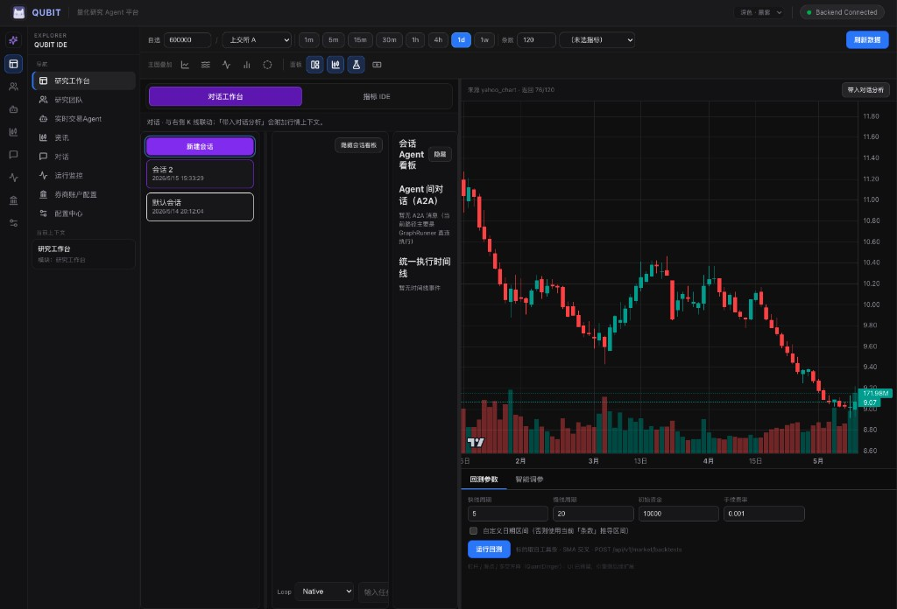
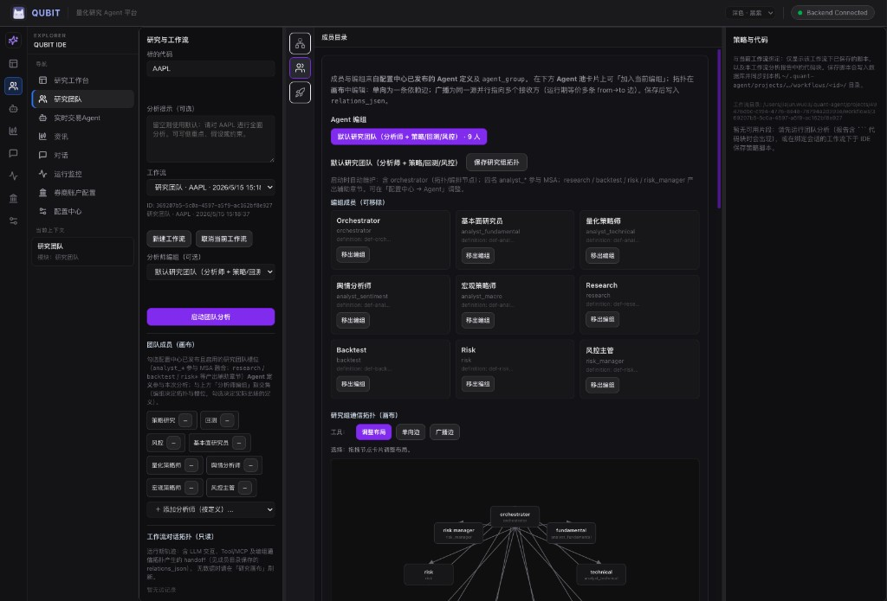
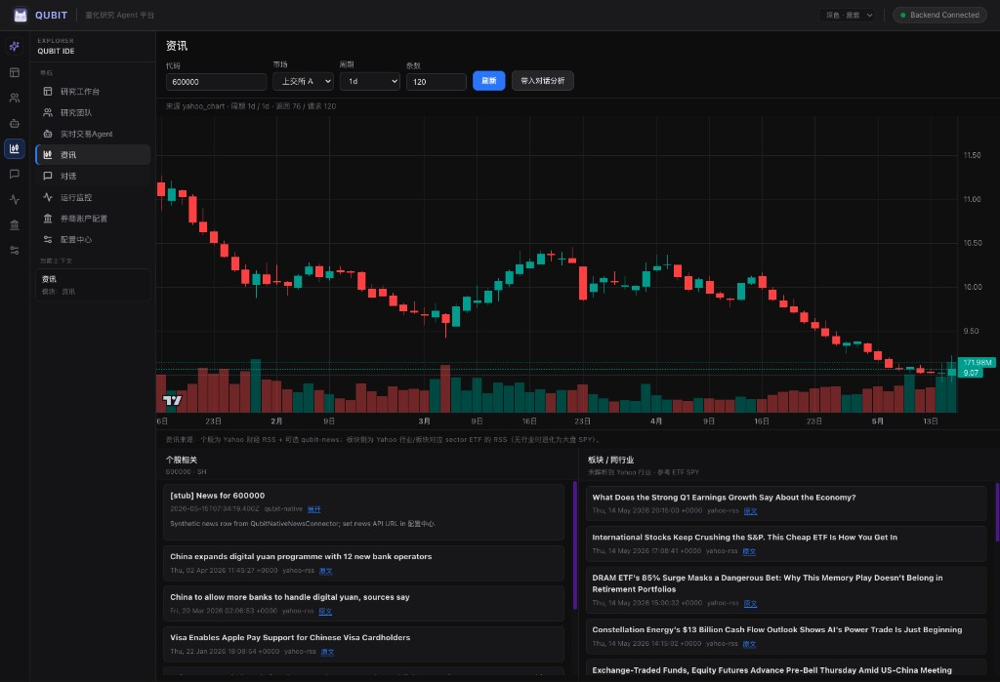

# QUBIT Agent Platform

**量化研究多 Agent 平台** — 对话驱动研究、多分析师协作、K 线 IDE、回测与实盘编排，一体化交付。

[](LICENSE)
[](https://bun.sh)
[](https://tauri.app)

---

## 简介

QUBIT 面向量化研究与交易自动化场景，将 **LangGraph Agent Runtime**、**多角色分析师团队**、**MCP 工具市场** 与 **可视化 IDE** 整合在同一工作台中。你可以：

- 在对话中带入 K 线上下文，由编排 Agent 调度研究 / 回测 / 风控等角色
- 在「研究团队」画布上勾选参与分析的 Agent，查看拓扑与 A2A 协作轨迹
- 在 IDE 中编辑指标与 Python 信号代码，运行 SMA 等回测
- 通过配置中心接入 MCP（Anthropic Registry）、Skills（SkillsMP）与券商（Futu / IB）

数据与策略脚本默认落在本地 `~/.quant-agent`（可通过 `QUBIT_DATA_DIR` 修改）。

---

## 截图

### 研究工作台 · 对话 + K 线 + 回测

对话会话、Agent 看板与 K 线、回测坞同屏协作；支持将行情上下文带入对话分析。



### 研究团队 · 多 Agent 拓扑

按工作流组织研究任务；可配置分析师编组、启动团队分析，并在右侧绑定策略与代码（落盘至工作流目录）。



### 资讯 · 个股与板块新闻

个股 K 线叠加 Yahoo / 内置新闻源；支持「带入对话分析」与板块 ETF 资讯。



---

## 功能特性

| 模块 | 说明 |
|------|------|
| **Agent Runtime** | LangGraph `perceive → reason → act → observe`，Sandbox 策略校验与违规审计 |
| **研究团队** | 多分析师并行、辩论 / 风控、信号融合；工作流可读名称与策略脚本按 run 绑定 |
| **QUBIT IDE** | K 线（QuantDigger）、指标编辑、Python 回测坞、策略脚本入库 |
| **对话工作台** | Session 管理、消息关联 workflow、Agent 看板与执行时间线 |
| **运行监控** | Session / Workflow / Step / Tool / Sandbox 多层观测 |
| **配置中心** | Workspace diff、模型配置、Agent 草稿发布、MCP & Skills 市场 |
| **实盘与券商** | Intent → 风控 → 执行；Futu / IB（mock / sandbox / live） |
| **桌面端** | Tauri v2 客户端，Sidecar 拉起后端并显示连接状态 |

---

## 技术栈

| 层级 | 技术 |
|------|------|
| 后端 | Bun · TypeScript · Hono · Drizzle · SQLite |
| 编排 | LangGraph.js · OpenAI SDK（多 Provider） |
| 前端 | Vite · React · Zustand |
| 桌面 | Tauri v2（Rust） |
| 连接器 | Python（`python_connectors/`，行情 / 券商桥） |

---

## 快速开始

### 环境要求

- [Bun](https://bun.sh) `>= 1.3`
- Node.js `>= 20`（部分工具链）
- Rust / Cargo（仅构建 Tauri 时需要）

### 安装与启动

```bash
# 克隆后安装依赖
bun install

# 首次或 schema 变更后生成迁移
bun run db:generate
bun run db:migrate

# 终端 1：后端（默认 http://localhost:3000）
bun run dev

# 终端 2：前端（默认 http://localhost:3041）
bun run dev:frontend
```

浏览器打开 **http://localhost:3041**。顶部显示 `Backend Connected` 即表示 API 可用。

### 桌面客户端（可选）

开发调试（仍建议 `bun run dev` + `bun run dev:frontend`，Tauri 仅作壳）：

```bash
bun run dev:tauri
```

**打包成可安装应用**（含后端二进制、迁移、Python 连接器、内容包；详见 [docs/PACKAGING.md](docs/PACKAGING.md)）：

```bash
bun run build:app:release
```

安装后首次启动会自动：数据库迁移、种子 Agent/MCP/Tool、按需创建 Python venv。亦可调用 `POST /api/v1/system/bootstrap` 或 `./dist/bundle/bin/qubit bootstrap`。

### 种子数据（可选）

```bash
bun run seed:agent-definitions    # 预置 Agent 定义与研究团队编组
bun run seed:recommended-mcp      # 推荐 MCP（数学 / 金融等）
```

---

## 配置

### 模型（配置中心 / `.qubit/model.json`）

支持 Provider：`openai` · `anthropic` · `ollama` · `deepseek` · `qwen` · `zhipu` · `mock`。

未在前端保存时，将回退环境变量，例如 `OPENAI_API_KEY`、`ANTHROPIC_API_KEY`、`DASHSCOPE_API_KEY` 等。

### 数据目录

| 变量 | 默认值 | 说明 |
|------|--------|------|
| `QUBIT_DATA_DIR` | `~/.quant-agent` | SQLite、Agent Pack、工作流策略落盘目录 |
| `PORT` / `HOST` | `3000` / `localhost` | 后端监听 |
| `SKILLSMP_API_KEY` | — | SkillsMP 搜索配额（可选） |

工作流策略文件示例路径：

`$QUBIT_DATA_DIR/projects/<projectId>/workflows/<workflowRunId>/report.md`  
`$QUBIT_DATA_DIR/projects/<projectId>/workflows/<workflowRunId>/strategies/...`

---

## 项目结构

```
qubit-agent/
├── src/                 # 后端 API、LangGraph runtime、路由
├── frontend/            # Web UI（Vite + React）
├── src-tauri/           # Tauri 桌面壳
├── python_connectors/   # 行情 / 券商 HTTP 桥
├── docs/
│   ├── ARCHITECTURE.md  # 平台架构说明
│   ├── screenshots/     # README 用图
│   └── LOOP_DRIVERS.md  # Loop 驱动说明
└── drizzle/             # 迁移产物
```

---

## 开发与质量

```bash
bun run lint          # Biome lint
bun run check         # lint + format 检查
bun test              # 集成测试
bun run acceptance:langgraph
```

---

## 常用 API（节选）

<details>
<summary>展开 REST 端点列表</summary>

- `POST /api/v1/workflows` — 创建 workflow
- `GET /api/v1/workflows/:id/stream/:runId` — 步骤流
- `GET /api/v1/agents/definitions` — Agent 定义与草稿
- `GET /api/v1/chat/sessions` · `POST .../messages` — 对话
- `GET /api/v1/monitor/sessions/:id/overview` — 会话监控聚合
- `GET /api/v1/analyst/fusion/:workflowId` — 团队信号融合
- `GET /api/v1/agents/mcp/market/catalog` — MCP 市场（分页）
- `GET /api/v1/agents/skills/market/search` — Skills 市场（分页）
- `POST /api/v1/reia/broker/accounts/upsert` — 券商账户

完整路由见 `src/routes/`。

</details>

### 券商（Futu / IB）

交易链路：`intent_order` → 风控 / 确认 → `executeIntentLive`。需先启动 OpenD 与 Python 桥：

```bash
cd python_connectors && pip install futu-api
python broker_http_server.py   # 默认 http://127.0.0.1:18765
```

在 UI「券商账户配置」中设置 `mock` / `sandbox` / `live` 与 `baseUrl`。详见 [Futu OpenAPI 文档](https://openapi.futunn.com/futu-api-doc/intro/intro.html)。

### 外部 MCP

在 `mcp_server_config` 中配置 **stdio** / **http** / **ws** 传输；工具超时可在 `mcp_tool_binding` 按服务名配置。

---

## 文档

- [平台架构说明](docs/ARCHITECTURE.md)
- [Loop 驱动说明](docs/LOOP_DRIVERS.md)

---

## 参与贡献

欢迎 Issue 与 Pull Request。提交前请尽量通过 `bun run check` 与 `bun test`。

---

## 许可证

[Apache License 2.0](LICENSE)
