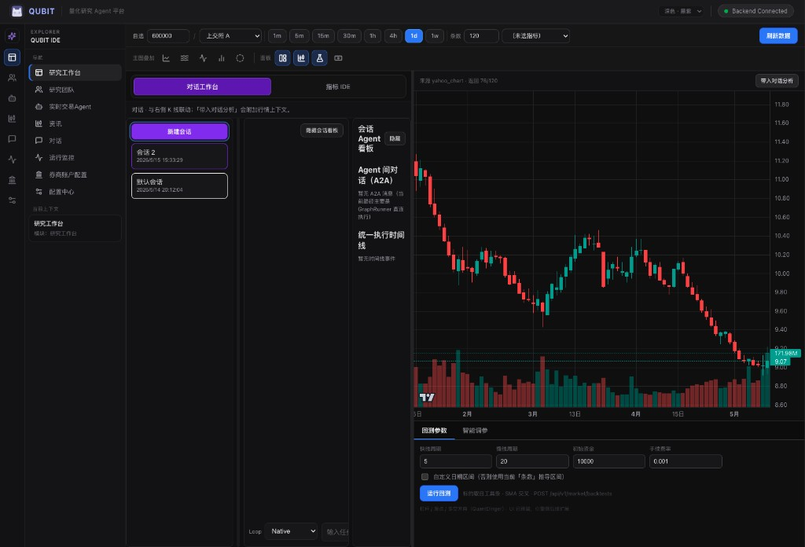
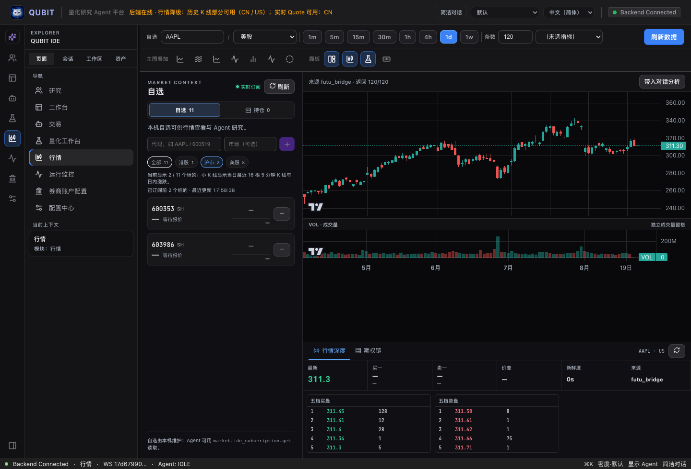
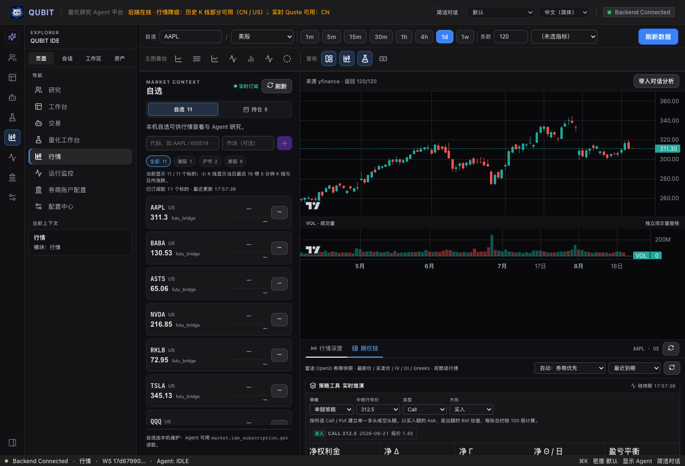
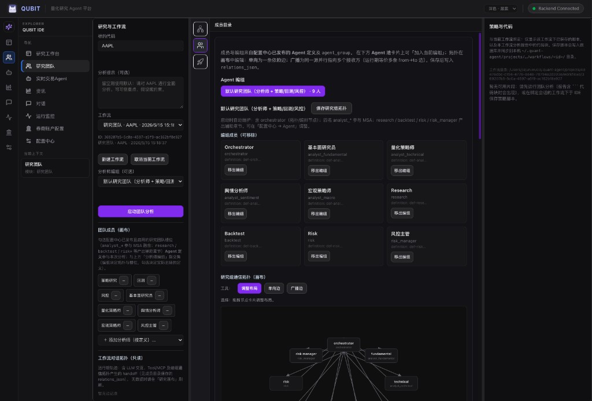
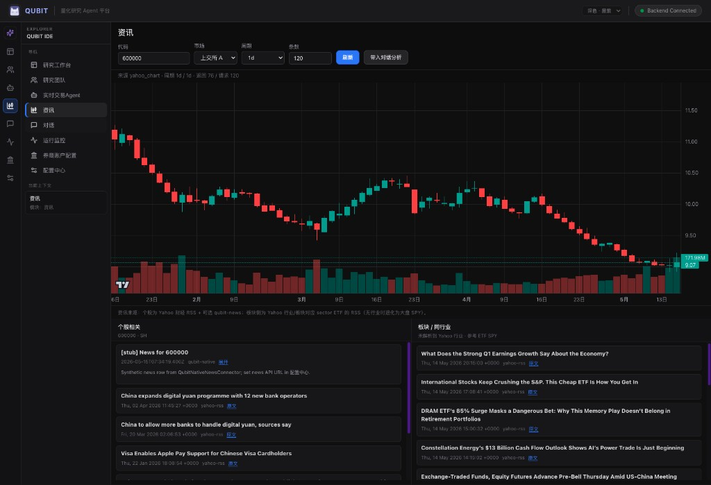

# QUBIT Agent Platform

[English](README.en.md)

**量化研究多 Agent 平台** — 对话驱动研究、多分析师协作、真实行情治理、量化工坊、回测与实盘编排，一体化交付。

[](LICENSE)
[](https://bun.sh)
[](https://tauri.app)

---

## 简介

QUBIT 面向量化研究与交易自动化场景，将 **自研 ReAct Agent Runtime**、**A2A 多角色分析师团队**、**MCP 工具市场** 与 **可视化 IDE** 整合在同一工作台中。你可以：

- 在对话中带入 K 线上下文，由编排 Agent 调度研究 / 回测 / 风控等角色
- 在「研究团队」画布上勾选参与分析的 Agent，查看拓扑与 A2A 协作轨迹
- 在量化工坊中查看 Agent 产出的因子 / 策略 / 脚本，编辑指标与 Python 信号并运行回测
- 在行情中心维护本机自选、读取已配置券商的持仓；自选可直接作为 Agent 研究上下文
- 覆盖股票、期权、期货与加密资产的行情研究路径，并通过行情源控制面管理 Wind、Tushare、EastMoney、AKShare、yfinance、Yahoo 与 Binance
- 将已选策略绑定到匹配的标的与 K 线周期，在图表上发起回测并回写信号 / 成交标记
- 用内置 10 场景 benchmark 对 Agent 的终态、证据、工具治理、研究产物和执行能力持续评分
- 通过配置中心接入 MCP（Anthropic Registry）、Skills（SkillsMP）与券商（Futu / IB）

数据与策略脚本默认落在本地 `~/.quant-agent`（可通过 `QUBIT_DATA_DIR` 修改）。

---

## 截图

### 研究工作台 · 对话 + K 线 + 回测

对话会话、Agent 看板与 K 线、回测坞同屏协作；支持将行情上下文带入对话分析。



### 行情中心 · 自选、持仓与盘口

本机自选同时服务于行情查看和 Agent 研究；每个标的可展示当日迷你 K 线与日内涨跌。配置券商后，持仓会在相邻页签从券商桥读取；移除自选会先要求确认。



### 期权链 · Greeks 与策略推演

期权链与行情深度并列展示，支持按到期日、行权价、Call / Put 与方向构建策略，并展示报价、IV、OI、Greeks、盈亏平衡与到期情景。



### 研究团队 · 多 Agent 拓扑

按工作流组织研究任务；可配置分析师编组、启动团队分析，并在右侧绑定策略与代码（落盘至工作流目录）。



### 资讯 · 个股与板块新闻

个股 K 线叠加 Yahoo / 内置新闻源；支持「带入对话分析」与板块 ETF 资讯。



---

## 功能特性

| 模块 | 说明 |
|------|------|
| **Agent Runtime** | 自研 `perceive → reason → act → observe` ReAct 状态机；工具语义校验、失败域熔断、有限重试与 Sandbox 审计 |
| **工作模式** | Agent：直接回答 / 按需执行；Plan：只生成可验证计划并硬性禁用业务工具；Goal：自主规划、执行、验证并经完成门禁闭环 |
| **研究团队** | Orchestrator 定向调度专家，A2A 结果回收、超时隔离、辩论 / 风控与信号融合 |
| **行情治理** | 按市场 / 周期 / 凭证 / 健康度 / 优先级路由；成功率、P95、最近错误、熔断与 fallback 可观测 |
| **自选与持仓** | 本机自选由 `market.ide_subscription.get` 统一读取；每行支持日内迷你 K 线、涨跌与删除确认。配置券商后可从券商桥读取持仓 |
| **多资产行情** | 股票 / ETF、OPRA 美股期权链、期货连续合约与 Binance 现货在同一行情工作台呈现；具体可用市场取决于已配置的数据源 |
| **期权链与策略推演** | Call / Put 链、报价、IV、OI、Greeks、策略组合、盈亏平衡与到期情景；研究级行情明确标识，不能直接用于交易决策 |
| **量化工坊** | Agent 产出的因子 / 策略 / 脚本与 workflow 关联；支持编辑、评估、回测及产物跳转 |
| **图表内回测** | 回测前校验策略的标的 / 标的池与 K 线周期维度；匹配后在当前图表运行，信号与成交标记回写 K 线 |
| **新闻证据** | 当前分析默认 7 天 freshness window；过滤无日期、过期、无关及 synthetic / stub 内容 |
| **对话工作台** | Session 管理、消息关联 workflow、Agent 看板与执行时间线 |
| **运行监控** | Session / Workflow / Step / Tool / MCP / Sandbox 多层观测与失败归因 |
| **配置中心** | Workspace diff、模型配置、Agent 草稿发布、MCP & Skills 市场 |
| **Agent Benchmark** | 10 个研究 / 选股 / 因子 / 策略 / 交易场景，AQM 多维评分、trace 与版本对比 |
| **实盘与券商** | Intent → 风控 → 执行；Futu / IB（mock / sandbox / live） |
| **桌面端** | Tauri v2 客户端，生产 Sidecar、迁移 / seed、DuckDB 原生依赖与后端 readiness 状态 |

三种工作模式与研究团队角色的推理引擎配置相互独立；团队角色仍可选择自研进程内
ReAct、Claude CLI 或 Codex CLI。Plan 的“只规划”由运行时工具权限强制执行；Goal 把目标文本
作为完成条件，持久化结果、约束、验证标准和证据，并支持暂停、恢复、编辑与清除。计划仍有
`pending / in_progress` 步骤、全部步骤被跳过或缺少实际执行证据时不会提前结束。旧工作流中的
`experience: native / coding_agent` 会分别兼容映射为 Agent / Goal，新接口统一使用
`loopOptionsJson.agentMode`。

### 自选、持仓与研究数据边界

- **自选**由 IDE 本机维护，Agent 通过 `market.ide_subscription.get` 获取真实条目；接口为空或不可用时，Agent 不会用历史对话中的标的冒充自选清单。
- **持仓**默认从已配置券商桥读取；未配置账户或桥不可用时，界面会显示空态而不会伪造仓位。
- **行情与期权链**会携带数据源与可用性信息。研究级 / 降级数据仅供研究、回测与策略推演，不能作为交易决策依据。
- **图表回测**只可在策略覆盖的标的（或明确指定的标的池成员）与匹配的 K 线周期上执行；篮子策略必须明确回测标的后才可运行。

---

## 技术栈

| 层级 | 技术 |
|------|------|
| 后端 | Bun · TypeScript · Hono · Drizzle · SQLite · DuckDB · Rust Prime Core |
| 编排 | 自研 ReAct 状态机 · A2A 消息总线 · OpenAI SDK（多 Provider） |
| 前端 | Vite · React · Zustand |
| 桌面 | Tauri v2（Rust） |
| 连接器 | Python（`python_connectors/`，行情 / 券商桥） |

---

## 快速开始

### 0. 前置条件

| 组件 | 必须 | 用途 |
|------|------|------|
| [Bun](https://bun.sh) `>= 1.3` | 是 | 后端运行时 + 包管理 + 前端 dev server |
| Node.js `>= 20` | 推荐 | 部分构建工具链（Vite / Drizzle Kit） |
| Git | 是 | 克隆与 FSI vendor 同步 |
| Rust / Cargo（stable） | 仅构建 Tauri 客户端 | `bun run dev:tauri` / `bun run build:tauri` |
| Xcode Command Line Tools / MSVC Build Tools | 同上 | Tauri 编译原生壳 |
| Python `>= 3.10` + pip | 可选 | 行情 / 回测 / 券商 HTTP 桥（`python_connectors/`） |
| OpenD（富途）/ IB Gateway | 可选 | 实盘交易时使用 |

> 数据与策略脚本默认落在 `~/.quant-agent`，可通过 `QUBIT_DATA_DIR` 修改；macOS 桌面打包后默认为 `~/Library/Application Support/app.qubit.agent/`。

### 1. 公共步骤：克隆与安装依赖

```bash
git clone <your-fork-or-this-repo>.git qubit-agent
cd qubit-agent

# 安装根（后端）+ 前端 workspace 依赖
bun install

# 首次启动或 schema 变更后生成迁移并初始化 SQLite
bun run db:generate
bun run db:migrate
```

可选种子数据（推荐首次执行，以便配置中心 / 研究团队有内容可用）：

```bash
bun run seed:agent-definitions    # 预置 Agent 定义与研究团队编组
bun run seed:recommended-mcp      # 推荐 MCP（数学 / 金融等）
```

### 2. 后端（必启）

自研 ReAct / A2A runtime + Hono HTTP/WS 服务，默认 **http://localhost:3000**。

**前置条件**：完成步骤 1；如需调用云端大模型，至少配置一个 Provider 的 Key（见下文「[配置](#配置)」）。

```bash
# 终端 1
bun run dev
```

可通过环境变量覆盖监听地址：

```bash
PORT=3000 HOST=localhost bun run dev
```

启动成功后会看到 `Server listening on http://localhost:3000`，并可访问 `GET /api/v1/system/health`。

桌面联调建议使用带 watch 的后端脚本。它复用 Tauri 数据目录，默认监听
`127.0.0.1:17385`，修改 `src/**` 后会自动重启：

```bash
bun run dev:backend
```

### 3. 前端（Web 调试）

Vite + React，默认 **http://localhost:3041**。`/api` 与 `/ws` 已在 `frontend/vite.config.ts` 中代理到后端 `:3000`。

**前置条件**：后端已通过 `bun run dev` 在 `:3000` 启动。Vite 的 `/api` 与 `/ws`
代理默认指向该端口；`dev:backend` 的 `:17385` 主要用于桌面客户端联调。

```bash
# 终端 2
bun run dev:frontend
```

浏览器打开 **http://localhost:3041**，顶部显示 `Backend Connected` 即表示 API 可用。

### 4. 桌面客户端（Tauri v2，可选）

Tauri 仅作为壳，`tauri dev` 会自动启动前端 dev server 并加载 `http://localhost:3041`；
Debug 构建会由 Tauri 内置逻辑拉起 Bun 后端 fallback，不需要另外启动 `bun run dev`。
启动前会自动创建一个被 git 忽略的 sidecar 占位文件，满足 Tauri 对 `externalBin` 的开发态校验；
实际开发后端仍使用源码 watch 模式。

**前置条件**：
- 已安装 Rust（`rustup` 推荐）与平台原生编译工具链
- 步骤 1 完成依赖与迁移
- 如果要使用预编译 sidecar，先执行 `bun run build:app`；否则直接使用下面的开发命令即可

```bash
# 终端 1
bun run dev:tauri
```

**打包成可分发的安装包**（含 Bun 编译的后端 sidecar、SQLite 迁移、`python_connectors/`、`content-packs/`）：

```bash
bun run build:app:release
```

产物：`src-tauri/target/release/bundle/`（`.dmg` / `.app` / `.msi` 等）。

打包态客户端首次启动会自动：拉起内置 sidecar（监听 `127.0.0.1:38473`）→ 数据库迁移 → 种子 Agent/MCP/Tool → 按需创建 Python venv。亦可手动 `POST /api/v1/system/bootstrap` 或 `./dist/bundle/bin/qubit bootstrap`。

### 5. Python 连接器（可选）

仅当需要 **AKShare / 腾讯 A 股、yfinance Yahoo（含分红与基本面）、Python 回测、
券商实盘桥（Futu/IB/CCXT）** 时启用；后端在 Python 环境或单个上游不可用时会按
市场能力和健康状态降级，并明确返回 unavailable，而不是生成模拟行情。

**前置条件**：本机 `python3 >= 3.10`，建议使用 venv 隔离。

```bash
cd python_connectors
python3 -m venv .venv && source .venv/bin/activate
pip install -r requirements.txt          # 基础：numpy / pandas / akshare / yfinance / pytest

# 实盘 Futu 示例（需额外依赖与 OpenD）
pip install futu-api
python broker_http_server.py             # 默认 http://127.0.0.1:18765
```

启动后在 UI「券商账户配置」中登记 `mock` / `sandbox` / `live` 与 `baseUrl`。打包态下 venv 在数据目录自动创建，无需手工 `pip install`。

### 速查：三种最常见的开发组合

| 场景 | 终端 1 | 终端 2 | 终端 3 |
|------|--------|--------|--------|
| 仅 Web 调试 | `bun run dev` | `bun run dev:frontend` | — |
| 桌面客户端调试 | `bun run dev` | — | `bun run dev:tauri` |
| 完整链路（含实盘桥） | `bun run dev` | `bun run dev:frontend` | `python broker_http_server.py` |

### 修改后端代码后什么会发生？

| 方式 | ts 改动如何生效 | 适用 |
|------|-----------------|------|
| `bun run dev` | **不会自动重载**，改完要手动 Ctrl-C 重启 | 不推荐 |
| `bun run dev:backend` | **自动**，bun --watch 监听 `src/**`，1~2s graceful restart | 推荐（独立终端运行后端） |
| `bun run dev:tauri` | **自动**，Tauri sidecar 已切到 `bun --watch`（含数据目录与 Tauri 完全一致） | 推荐（桌面壳） |

**怎么确认后端跑的是不是最新代码？**

```bash
curl -s http://localhost:17385/api/v1/_meta/build-info | jq
# 返回 pid / startedAt / commit / indexMtime / watchMode 等
```

- `dev-backend.log` 头部每次重启都会打 banner 横线 + `pid / commit / watchMode`，`tail -f` 一眼可数；
- 如果你需要**关闭** watch（例如长时间跑回测不想被改文件打断），加 `QUBIT_DEV_NO_WATCH=1`：
  ```bash
  QUBIT_DEV_NO_WATCH=1 bash scripts/dev-backend.sh    # 独立后端
  QUBIT_DEV_NO_WATCH=1 bun run dev:tauri              # Tauri 壳
  ```
- 极端情况下端口被旧进程占住（macOS Tauri 关窗口不一定 kill sidecar）：
  ```bash
  kill $(lsof -ti :17385)
  ```

---

## 配置

### 模型（配置中心 / `.qubit/model.json`）

支持 Provider：`openai` · `anthropic` · `ollama` · `deepseek` · `qwen` · `zhipu` · `mock`。

未在前端保存时，将回退环境变量，例如 `OPENAI_API_KEY`、`ANTHROPIC_API_KEY`、`DASHSCOPE_API_KEY` 等。

### 数据目录

| 变量 | 默认值 | 说明 |
|------|--------|------|
| `QUBIT_DATA_DIR` | `~/.quant-agent` | SQLite、Agent Pack、工作流策略落盘目录 |
| `PORT` / `HOST` | `3000` / `localhost` | 后端监听 |
| `SKILLSMP_API_KEY` | — | SkillsMP 搜索配额（可选） |
| `TOPOLOGY_TASK_TIMEOUT_MS` | `120000` | Orchestrator 等待单个专家 A2A 结果的上限（10s–300s） |

工作流策略文件示例路径：

`$QUBIT_DATA_DIR/projects/<projectId>/workflows/<workflowRunId>/report.md`  
`$QUBIT_DATA_DIR/projects/<projectId>/workflows/<workflowRunId>/strategies/...`

---

## 行情数据源与证据治理

QUBIT 会在启动时注册并探测以下真实数据源：

| 数据源 | 主要市场 | 角色 |
|--------|----------|------|
| Wind | A 股 / 港股 | 高优先级终端数据 |
| Tushare Pro | A 股日线 | Token 数据源 |
| EastMoney | A 股 | 公共 fallback |
| AKShare / 腾讯证券 | A 股 / 港股 | Python 与独立上游 fallback |
| yfinance / Yahoo Chart | 美股、港股、A 股及多个海外市场 | 全球市场 fallback |
| Binance | Crypto | 分钟到日线 |

配置中心的行情源面板会展示支持市场和周期、凭证状态、最近健康检查、成功率、
P95 延迟、最近错误、熔断状态、优先级、fallback 能力及网络路由。行情页和 Agent
工具使用同一份健康状态，自适应跳过不可用数据源。

启动 readiness gate 会对目标市场请求真实样本。只有至少一个目标市场数据源返回
有效数据，后端才会报告相应市场 ready；所有源失败时，工具返回包含尝试源和失败分类的
`market_data_unavailable`，不会把空结果或 synthetic 数据当作成功。

常用检查：

```bash
curl -s http://localhost:3000/api/v1/market/data-sources | jq
curl -s -X POST http://localhost:3000/api/v1/market/data-sources/health | jq
curl -s http://localhost:3000/api/v1/market/readiness | jq
```

新闻也经过证据门：当前行情分析默认只接收最近 7 天、带有效发布时间、与标的相关且
非 synthetic / stub 的内容。历史新闻必须显式使用 `historical_validation` 模式，
不能作为近期催化使用。

---

## 项目结构

```
qubit-agent/
├── src/                 # 后端 API、自研 ReAct / A2A runtime、路由
├── frontend/            # Web UI（Vite + React）
├── src-tauri/           # Tauri 桌面壳
├── python_connectors/   # 行情 / 券商 HTTP 桥
├── docs/
│   ├── ARCHITECTURE.md  # 平台架构说明
│   ├── screenshots/     # README 用图
│   └── LOOP_DRIVERS.md  # Loop 驱动说明
└── drizzle/             # 迁移产物
```

---

## 开发与质量

```bash
bun run lint          # Biome lint
bun run check         # lint + format 检查
bun test              # 集成测试
bun run build         # 编译生产后端（含项目约定的 DuckDB external 处理）
```

> **执行链路**：自研 ReAct 状态机在 `src/runtime/react/`（`run-react-loop.ts` + `nodes/*`）。
> Agent 间派发统一走 A2A 消息总线，恢复使用自研 `agent_checkpoint_snapshot`。
> 已不再依赖 LangGraph 框架。

### Agent Benchmark

每次大幅修改 Agent、工具治理或研究产物链路后，建议运行 readiness benchmark。当前
覆盖 10 个任务：单标的研究、多标的对比、主题研究、long / short 选股、因子生成、
long-only / long-short 策略、做多 / 做空执行。

```bash
# 先启动桌面联调后端（默认 :17385）
bun run dev:backend

# 全量 10 场景；无额外 LLM judge 时可先跑确定性评分
bun run scripts/run-readiness-evaluation.ts --no-judge

# 只跑部分场景
QUBIT_READINESS_SCENARIOS=research,factor,strategy \
  bun run scripts/run-readiness-evaluation.ts --no-judge

# 对已有 workflow 重新评分或导出 trace
bun run scripts/agent-readiness-runner.ts \
  --scenario=research --workflow=<workflowRunId> --output-dir=./out/agent-readiness
bun run scripts/agent-readiness-runner.ts \
  --trace=<workflowRunId> --output-dir=./out/agent-readiness
```

输出位于 `out/agent-readiness/`，包含每个 workflow 的指标快照、Markdown 报告、
完整 trace、汇总健康报告和跨版本 diff。评分同时检查终态回复、有效数据、工具治理、
研究质量、结构化产物与执行效率，避免只用“是否跑完”判断 Agent 能力。

---

## 常用 API（节选）

<details>
<summary>展开 REST 端点列表</summary>

- `GET /api/v1/workflows/:id/stream/:runId` — 步骤流
- `GET /api/v1/agents/definitions` — Agent 定义与草稿
- `GET /api/v1/chat/sessions` · `POST /api/v1/chat/sessions/:sessionId/turns` — 唯一对话执行入口
- `GET /api/v1/monitor/sessions/:id/overview` — 会话监控聚合
- `GET /api/v1/research-artifacts/fusion/:workflowId` — 历史研究产物融合结果
- `GET /api/v1/market/data-sources` — 行情源能力、健康、延迟、熔断与优先级
- `POST /api/v1/market/data-sources/health` — 执行真实样本健康检查
- `GET /api/v1/market/readiness` — 启动行情 readiness gate 状态
- `GET /api/v1/agents/mcp/market/catalog` — MCP 市场（分页）
- `GET /api/v1/agents/skills/market/search` — Skills 市场（分页）
- `POST /api/v1/reia/broker/accounts/upsert` — 券商账户

完整路由见 `src/routes/`。

</details>

### 券商（Futu / IB）

交易链路：`intent_order` → 风控 / 确认 → `executeIntentLive`。需先启动 OpenD 与 Python 桥（启动方式见上文「[Python 连接器](#5-python-连接器可选)」），并在 UI「券商账户配置」中设置 `mock` / `sandbox` / `live` 与 `baseUrl`。详见 [Futu OpenAPI 文档](https://openapi.futunn.com/futu-api-doc/intro/intro.html)。

### 外部 MCP

在 `mcp_server_config` 中配置 **stdio** / **http** / **ws** 传输；工具超时可在 `mcp_tool_binding` 按服务名配置。

---

## 文档

- [平台架构说明](docs/ARCHITECTURE.md)
- [Loop 驱动说明](docs/LOOP_DRIVERS.md)
- [Agent Benchmark v2](docs/AGENT_BENCHMARK_V2.md)
- [Quant Research Integrity 项目规格](docs/QUANT_RESEARCH_INTEGRITY_PLAN.md)

---

## 参与贡献

欢迎 Issue 与 Pull Request。提交前请尽量通过 `bun run check` 与 `bun test`。

---

## 许可证

[Apache License 2.0](LICENSE)
