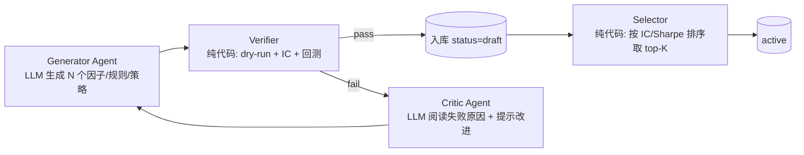
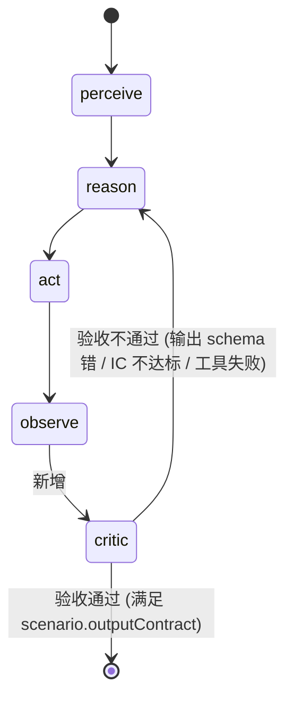
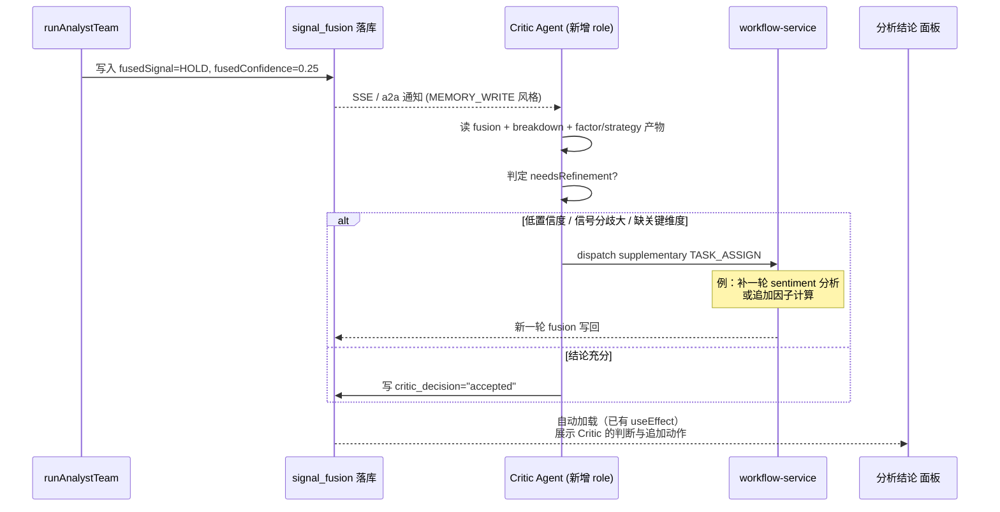

# QUBIT Agent 设计盘点 & 因子/策略生产稳定性优化

| 文档状态 | 草稿 |
|----------|------|
| 版本 | v0.1 |
| 更新日期 | 2026-05-22 |
| 关联文档 | [`ARCHITECTURE.md`](./ARCHITECTURE.md)、[`QUANT_READINESS_ASSESSMENT.md`](./QUANT_READINESS_ASSESSMENT.md)、[`FACTOR_RULE_STRATEGY_DESIGN.md`](./FACTOR_RULE_STRATEGY_DESIGN.md) |

> 本文回答三个问题：
> 1. 现在的 Agent 设计、Graph 形式、A2A 形式分别是什么？
> 2. 在 **选股 / 分析因子 / 生成策略 / 交易** 这几个场景下能不能跑通？
> 3. 让 Agent 生产因子和策略不稳定，可以怎么优化？

---

## 一、当前 Agent 设计盘点

### 1.1 派发与执行分层

```
派发：dispatchTaskToRole (agent-pool.ts)
   └─ loopKind = native | claude_cli | codex_cli   ← 谁来跑这一步
        └─ executionPath = graph | a2a             ← 仅 native 有意义
              └─ executeAgentReact()               ← perceive → reason → act → observe
                   ↑↑↑ 这是真正的"Agent 内核"

并行存在的另一条线（不走通用 ReAct）：
   research-team-execute → runAnalystTeam（MSA）
        └─ Orchestrator 规划 + wave 并行 + signal-fusion + 可选 debate / veto / PM
```

| 概念 | 在哪 | 关键点 |
|------|------|--------|
| **ReAct 内核** | `execute-agent-react.ts` + `nodes/{perceive,reason,act,observe}.ts` | 强约束：每步只能跑 **1 个工具**；多轮判定看 `def.maxIterations` 与 `loopOptions.reactLoop` |
| **GraphRunner** | `langgraph/graph-factory.ts` | LangGraph state machine + sqlite-checkpoint-saver；resume/retry 走 checkpointer |
| **A2APool** | `a2a/a2a-pool.ts` + `handlers/role-handlers.ts` | 长驻 instance，按 `subscriptions` 订阅消息；默认 handler 也是 `runA2aReactTaskAssign → executeAgentReact` |
| **MSA 编排** | `msa/analyst-team*.ts` | 拓扑 wave，**不**进入 ReAct 工具循环，只单次 LLM + 预取数据 |
| **场景注册** | `research-scenario/` | 11 个内置场景：每个场景声明 `requiredCapabilities` + `toolPreset` + `loopDefaults` |
| **Provider 抽象** | `runtime/provider/` | factor / rule / backtest / live_ems / market_data 已抽象；首发 `qlib_expr` / `jsonlogic` / `sma_legacy` |

### 1.2 Graph vs A2A 对比

| 维度 | **Graph（默认）** | **A2A** |
|------|------------------|---------|
| 入口 | `graphRunner.runRoleTask` → `executeAgentReact` | `a2aRouter.send(TASK_ASSIGN)` → `AgentRuntime` → `runA2aReactTaskAssign` → `executeAgentReact` |
| 实例 | 每次任务新建 `agent_instance` | 长驻 `agent_instance`（pool workflow） |
| 消息总线 | 不发 A2A 消息 | 完整 A2A 时间线 + 治理（HMAC、`risk_signature`） |
| 检查点 | LangGraph SqliteCheckpointSaver；可 `workflow_resume/retry` 续跑 | A2A 自己没存 graph state；resume 仍要回到 GraphRunner |
| 多 Agent 协作 | 由 Orchestrator 工具串行调度（一次一步） | 总线广播 + 订阅，可天然多角色并行交互 |
| 调试观感 | 时间线纯净（步骤流） | 看 agent ↔ agent 消息流，更像「公司」 |

> **关键事实**：在 ReAct 语义上 **两者等价**。差异在调度外壳。换成 A2A 不会让"生成因子更准"——因为 LLM 怎么写表达式、工具怎么调，都是同一段 `executeAgentReact` 代码。

---

## 二、场景能力评估

✓ = 已闭环；△ = 能跑但有明显短板；✗ = 未实装。

| 场景 | 路径 | 现状结论 |
|------|------|----------|
| **选股** | `stock_screening` scenario → `runStockScreener` / `rule.evaluate` / `factor.query` | △ — `stock-screener.ts` 是**写死公式**，没真接 `factor_value`；`factor.query` 工具未在 `tool-catalog` 出现（场景 preset 引用但实际未注册） |
| **分析因子** | `factor_research` scenario → `factor.register` / `factor.compute` / `factor.evaluate` / `discovery.run` | △ — `discovery_service` 的 `factor_alpha101` / `factor_gp` 已实现；`factor_llm` 还没；`factor.evaluate` 评估器是 builtin 简化版；真实 PIT 数据缺失 |
| **生成策略** | `strategy_authoring` / `discovery` scenario → `strategy.compose` / `backtest.run` | △ — `strategy_composer.ts` 已能把 factor + rule 组成 picks；但 `rank_ic_weighted` / `ic_ir_weighted` **全部回退到 equal**（composer.ts L330-333），LLM 给出的权重方法不生效 |
| **回测** | `backtest.run` → SMA legacy / Backtrader（计划中） | △ — SMA 单股能跑；事件驱动回测（Backtrader/VeighNa）在文档里 P2/P4，**当前代码未落** |
| **交易** | `live_trading` scenario → `broker.placeOrder` / `qubit-broker` connector + REIA | △ — Paper 即时成交、HTTP 轮询 broker；OMS/EMS 双轨债（`order_intent` vs `intent_order`），无 tick 推送 |

**一句话总结**：研究台的「结构」都搭起来了，但**最关键的几条「LLM → 可量化资产」的闭环还没有自动闸门**，所以让 Agent 自己挖因子/生成策略，最终的稳定性取决于 LLM 单次输出的运气。

---

## 三、为什么 Agent 生成因子/策略不稳定（6 个根因）

### 根因 1：ReAct 单步只能调用一个工具，多步合成易半途偏题

`act.ts` 里 `parseToolCallFromReason` 只接受**唯一一个** JSON 块（`tool-call-format.ts` L94-104 用 `extractJsonToolBlock` 抓最后一个 `{"tool":...}`）。LLM 一旦在思考中冒出多个 JSON 片段（很常见，尤其本地模型），就会被解析到错的那个。

### 根因 2：循环退出条件过于宽松

```ts
// src/runtime/langgraph/react-loop-policy.ts L22-30
export function shouldStopReactLoopAfterObserve(state: AgentGraphState): boolean {
  const last = state.observations.at(-1) as { skippedToolCall?: boolean } | undefined;
  if (last?.skippedToolCall && state.plannedAction !== "tool_call") {
    return true;
  }
  return false;
}
```

模型只要在某一步声称「无需工具」就立刻结束，不会做「我注册的因子真的入库了吗？我有真实 IC 评估结果吗？」这种**输出契约校验**。

### 根因 3：因子表达式生成 → 落库无强制 dry-run + IC 评估闸门

`factor.register`（`builtin-tools.ts` L640-660）只调 `factorService.register` → 内部走 `Provider.validateExpr`。**注册成功就算完成**；不强制：

- 在小样本上跑一遍 `evalExpr`
- 立即调 `factor.evaluate` 跑出真实 IC
- 拿 IC vs 阈值决定 `status='draft' | 'active' | 'archived'`

`discovery.run` 闭环更完整（自动 evaluate + 按 |IC| 排序），但**单点的 `factor.register` 工具没有这个保护**，所以 Agent 自由生成时 IC 是噪音的因子也会写进 `factor_definition`。

### 根因 4：策略合成的权重计算"装样子"

```ts
// src/runtime/strategy/strategy-composer.ts L315-333
if (comp.weightMethod === "manual") {
  // ... 实际生效
}
// P0 阶段：rank_ic_weighted / ic_ir_weighted 暂回退到 equal（待 P1 接 factor_evaluation 自动权重）
const equal = 1 / ids.length;
for (const fid of ids) out[fid] = equal;
return out;
```

LLM 写「`weight_method: rank_ic_weighted`」时其实跑出来是 equal，但它**误以为**自己用上了 IC 加权——结果不可复现，看起来很随机。

### 根因 5：场景 toolPreset 与真实工具白名单不对齐

`scenarios-seed.ts` 里多个场景声明的工具名在 `builtin-tools.ts` / `tool-catalog.ts` 里 **不存在**：

| 场景声明的工具 | tool-catalog 是否存在 |
|----------------|----------------------|
| `factor.query` | ✗（用 `factor.list` 代替） |
| `portfolio.optimize` / `portfolio.rebalance` | ✗ |
| `rule.mine.llm` / `factor.mine.llm` / `discovery.evolve` | ✗（builtin 只有 `discovery.run`） |
| `broker.placeOrder` / `broker.cancelOrder` / `broker.getPositions` | ✗（实际命名是 `submit_order` 等） |
| `queryBars` / `newsBrief` / `runSmaBacktest` / `queryAuditLog` / `queryFills` | ✗（实际命名是 `fetch_bars` / `fetch_news` / `run_backtest` 等） |

`parseToolCallFromReason` 严格校验 `isAllowedTool`（L142-149），所以 LLM 按场景手册调 `factor.query` 时会被 `parse_error` 退回，导致看起来"Agent 卡住、半成品输出"。

### 根因 6：研究上下文里"没有真实数据"，LLM 在猜

`discovery-service.ts` 的 `loadPriceData` 一旦行情拉不到就回退到合成 GBM 数据（L347-348）。LLM 在没有提示的情况下不会知道自己正在"用伪数据生成因子"——结果 IC 看上去 0.05 也是噪音。

---

## 四、优化方案（按 ROI 排序）

### 🔥 P0 一周内：硬化「LLM 输出 → 入库」的契约

| 优化 | 改动点 | 预期效果 |
|------|--------|----------|
| **1. 收紧 ReAct 单步只能 1 工具的格式** | `tool-call-format.ts`：要求严格 fenced `` ```json `` 包裹；reason prompt 末尾加 `<TOOL_CALL>` … `</TOOL_CALL>` sentinel，正则锚定整段；解析失败时**强制重试一次 reason**（带上"刚才你的输出格式错了，原因：…"） | parse_error 大幅下降，工具调用首轮成功率↑ |
| **2. 把工具白名单与 scenarios 对齐** | 修 `scenarios-seed.ts`：用真实工具名（`fetch_bars` / `fetch_news` / `run_backtest` / `submit_order`），或者反过来在 `builtin-tools.ts` 注册 `factor.query` / `portfolio.optimize` 别名 | LLM 不再"调到不存在的工具" |
| **3. `factor.register` 强制 dry-run + 立即评估** | `factor-service.ts` 注册流程：先用 `qlib_expr` evaluator 跑前 30 天合成/真实数据；返回值含 NaN/全常数 → 拒绝；通过则**立即异步触发 `factor.autoEvaluate`**，`status` 在 `draft`，IC 跑出来 ≥ 阈值才允许 promote 到 `active` | LLM 写"语义错误的表达式"被挡在外面；`factor_definition` 表里不再混进无用因子 |
| **4. composer 真接 IC 权重，不暗中回退** | `strategy-composer.ts` L330-333：从 `factor_evaluation` 表取最近一次 `rank_ic`/`ir`；缺值的因子按 0 权重；如果**所有**因子都没评估，**抛错**而不是 silently equal | LLM "声明 rank_ic_weighted" 时，行为可复现且可解释 |

### 🚀 P1 两周：用「评估器」直接评判 LLM 产出 —— Generator / Verifier / Critic 三角

经验上让 LLM 既生产又自评，是不稳定的主因。更稳的范式：



落地建议：

1. **新增 `factor.mine.llm` builtin tool**（文档已列，但未实装）：
   - 接收 `theme` / `seedExpressions` / `count=12`
   - 让 LLM **一次性产出 12 个候选表达式**（而不是单步只出一个）
   - 内部用 `discovery-service.runGp` 的同一套 `evaluateOne` 闸门，跑 IC 评估
   - 返回的不是文字，是 12 个候选 + 各自的 IC + `error`
   - LLM 后续只看 IC 表做"哪几个值得 promote"——它擅长这个判断

2. **同理 `rule.mine.llm`**：让 LLM 一次性产 N 条 JSONLogic，代码层跑 `ruleService.evaluate` 在历史 universe 上验证 hitRate / 收益分布，返回评估表给 LLM 二次决策。

3. **`strategy.compose` 后强制接 `backtest.run`**：编排层（不是 LLM）保证"合成完立刻回测"，把 Sharpe / MaxDD 喂回 LLM 作为下一轮 prompt 上下文。

### 🧠 P2 进阶：Best-of-N + Self-Consistency

LLM 写表达式或权重本质上是采样问题：

- **同一 prompt 跑 N=5 次**（不同 temperature 或 seed），代码侧聚合：
  - 因子表达式：N 个里取 IC 最高的
  - 规则 DSL：N 个里取 hitRate × precision 最高的
  - 信号融合：N 个里取多数派

- 在 `executeAgentReact` 之上加一个 `executeAgentBestOfN(N, fitness)` 包装函数。N=3~5 时已能显著降低单次抽风的影响，成本可控。

### 🔄 P3 ReAct 多轮变 reflective ReAct（ReWOO / Reflexion 思路）

当前 `react-loop-policy.ts` 只看「模型说"我不需要工具了" → 退出」，判断太弱。建议加 **Critic 节点**：



`critic` 是**纯代码节点**（不是 LLM）：

- 读 `scenario.outputContract.primary`（如 `factor_definition_batch`）
- 检查这次循环里有没有真的产生这个 artifact
- 没有 → 给 reason 回一条"请补齐 X"的合成观察 → 再跑一轮
- 有 → 调 fitness 函数（IC / Sharpe / hitRate）评估 → 通过才结束

这是把现有 `loopOptions.requireDebate` / `requireRiskVeto` 升级成"按场景声明的真闸门"。

#### P3.1 Critic Agent 接管低置信度结论（前端"分析结论"块的长期形态）

**背景**：当前 `frontend/src/components/layout/MainContent.tsx` 的「分析结论」面板（短期 B 已精简）只是 `signal_fusion` 表的只读回放——低置信度时仅显示一个静态"⚠️ 建议触发辩论"标签，**没有任何后续动作**。这跟 Agent 自驱架构不一致。

**目标**：把"分析结论"从被动回放升级为 **Critic Agent 主动评估 + 自动追加分析**。

**触发链路**：



**关键设计点**：

| 项 | 设计 |
|----|------|
| Agent 角色 | 新增 `critic` 角色（`src/types/entities.ts`），独立 handler |
| 触发条件 | `fusion.fusedConfidence < threshold` ‖ `breakdown` 方差 > 阈值 ‖ `outputContract.primary` 未产出 |
| 决策动作 | 写 `signal_fusion.critic_decision`（`accepted` / `needs_refinement` / `rejected`）+ 可选 `supplementary_workflow_run_id` |
| 追加动作 | 通过 `createAndDispatchWorkflow({ skipDispatch: false, source: "critic" })` 启新工作流，复用现有 scenario |
| 防死循环 | 同一原工作流最多触发 Critic 追加 N=2 次 |
| 数据库 | `signal_fusion` 加列 `critic_decision text`、`critic_notes text`、`supplementary_workflow_run_id text`（新增 migration） |

**前端配合**：

`分析结论` 面板原"⚠️ 建议触发辩论"位置改为：

- `critic_decision=needs_refinement` → 显示"🔄 已自动追加 sentiment 补研 →`供应 workflow link`"
- `critic_decision=accepted` → 显示"✅ Critic 已确认"
- `critic_decision=rejected` → 显示"❌ Critic 拒绝采纳，原因：…"

UI 不再有任何静态"建议"，**所有提示都对应 Critic Agent 的真实判断**。

**与 P3 主体的关系**：

- P3 主体是把 Critic **作为代码节点**嵌进 ReAct 状态机（每轮 observe 后调用）
- P3.1 是 Critic **作为独立 Agent 角色**在 MSA 流水线之后跑一次
- 两者互补：ReAct 内的 Critic 解决"单 Agent 自检"，MSA 后的 Critic 解决"整团队结论自检"

**落地节奏**：

1. Schema migration 加列（0.5 人日）
2. 实现 `critic-role` handler，复用 `executeAgentReact`（1 人日）
3. `analyst-team-pipeline.ts` 末尾插入"调用 Critic"步骤（0.5 人日）
4. 前端 `分析结论` 面板按 `critic_decision` 渲染（0.5 人日）

合计约 **2.5 人日**。这是当前"分析结论"面板从短期 B（只读回放）演进到长期 C（Agent-driven）的标准路径。

### 🧬 P4 让 gene-pool 真正接管演化（文档里 P3 的事）

```text
src/runtime/gene/gene-pool.ts: 当前只演化 4 个固定权重
```

把演化对象升到 `strategy_composition` 的 `(factorIds, ruleIds, weights)` 三元组，fitness 函数 = 回测 Sharpe × (1 − maxDD)。这一步**才**是 Agent 自己进化策略，前面三步是把"单次生成稳"。

---

## 五、Graph vs A2A 怎么选

针对几类典型场景：

| 场景 | 建议路径 | 理由 |
|------|----------|------|
| 选股 / 分析因子 / 生成策略 | **Graph + Generator-Verifier** | 单 Agent 多轮，需要严格的步骤流和 checkpointer 可恢复；不需要多角色总线 |
| 多分析师辩论（已实装） | **MSA 流水线**（既不是 graph 也不是 A2A 通用 ReAct） | 拓扑 wave + 信号融合是定制路径，最稳 |
| 实时交易 | **A2A** | 多角色（trader / risk / execution）有真并发，A2A 治理（HMAC、`risk_signature`）天然吻合 OMS/EMS 分层 |
| 复盘归因 / 风控审查 | **Graph** | 类似单 Agent 长任务 + checkpointer |

---

## 六、行动建议（按优先级）

以**最少改动**让 Agent 生成因子/策略明显更稳，按这个顺序做：

| # | 任务 | 预估工时 | 关键文件 |
|---|------|----------|----------|
| 1 | 修 `scenarios-seed.ts` 的工具名错配 | 0.5 人日 | `src/runtime/research-scenario/scenarios-seed.ts` |
| 2 | `factor.register` 加 dry-run + 强制评估闸门 | 1 人日 | `src/runtime/factor/factor-service.ts`、`src/runtime/tools/builtin-tools.ts` |
| 3 | `strategy-composer` 真接 IC 权重 / 缺值抛错 | 0.5 人日 | `src/runtime/strategy/strategy-composer.ts` |
| 4 | 新增 `factor.mine.llm` builtin tool：一次性产 N 个 + 内置评估闸门 | 2 人日 | `src/runtime/discovery/discovery-service.ts`、`src/runtime/tools/builtin-tools.ts`、`src/runtime/tools/tool-catalog.ts` |
| 5 | ReAct 解析层加重试 + sentinel 锚定 | 1 人日 | `src/runtime/tools/tool-call-format.ts`、`src/runtime/langgraph/nodes/reason.ts` |

**合计 ~5 人日**，应能让"Agent 输出 → 入库通过率"和 "IC > 阈值的因子占比"翻倍以上。

再之上才是 Best-of-N、Critic 节点、gene-pool 升级这种更系统化的改造（P2 / P3 / P4）。

### 6.1 实施记录（2026-05-25 闭环）

下表记录第六章 5 项 P0 任务的落地状态、关键变更点和单元测试覆盖。**全部 90/90 测试通过**。

| # | 任务 | 状态 | 关键变更 | 单测 |
|---|------|------|----------|------|
| 1 | scenarios-seed 工具名对齐 | ✅ | analyst_debate / strategy_authoring / rule_research / stock_screening / risk_review / portfolio_management / discovery / live_trading / postmortem / news_event_radar 中 11 处"不存在的工具名"全部替换为 builtin/connector 真实注册名（如 `queryBars`→`fetch_bars`、`broker.placeOrder`→`submit_order`、`factor.query`→`factor.list`）；`portfolio.optimize`/`portfolio.rebalance` 标 TODO 待 P3 | 新增 `tool-preset-contract.test.ts`（11 个场景的契约测试，未来再脱钩会直接 fail） |
| 2 | factor.register dry-run 闸门 | ✅ | `FactorRegisterInput.dryRun` 新字段；`runRegistrationDryRun` 用合成 GBM 序列 + qlib-expr parser/evaluator 离线跑表达式，拒绝 parse_error / insufficient_values / degenerate_constant；builtin tool `factor.register` 默认开启 dryRun（Agent 路径强制） | 4 条新增：dry-run pass / parse-error reject / 常数表达式 reject / 非 qlib_expr 跳过 |
| 3 | strategy-composer 真接 IC 权重 | ✅ | `computeWeights` 改为 async；`rank_ic_weighted` / `ic_ir_weighted` 从 `factor_evaluation` 取每个因子最近一次 `rankIc` / `ir`，按 \|metric\| 归一化；**所有因子缺评估 → 直接抛 `validation_failed`**（不再 silently 退到 equal）；全为 0 才退 equal 并 console.warn | 3 条新增：缺评估 reject / 部分缺值按 0 / 全 0 退 equal |
| 4 | factor.mine.llm 新工具 | ✅ | `DiscoveryService` 解锁 `factor_llm` kind + 新增 `expressions[]` 字段 + `runLlm()`（复用 `loadPriceData`+`evaluateOne`）；builtin tool `factor.mine.llm` 强制 `expressions.length >= min_count`（默认 5）、跑 IC、按 `ic_threshold`（默认 0.02）自动 promote 为 draft 因子并保留 lineage；注册到 `tool-catalog` + `discovery` scenario | 6 条新增：discovery 层 3 条（happy / 空 expressions reject / 语法错混合）+ builtin 层 3 条（min_count / 缺 symbols / 端到端 promote） |
| 5 | ReAct 解析层 sentinel + 重试 | ✅ | `tool-call-format` 引入 `<TOOL_CALL>…</TOOL_CALL>` sentinel 作为首选格式（解析优先级最高，取最后一个），fenced JSON 取最后含 `"tool"` 的块作为 fallback；`reason.ts` 在 LLM 第一轮返回 `parse_error` 时**单次重试**（带"上一轮无法解析"提示），可由 `QUBIT_REASON_RETRY_DISABLED=1` 关闭，重试用量计入 `parseRetryUsed` meta | 3 条新增：sentinel 优先 / sentinel none / 多 fenced 取最后含 tool 字段 |

#### 关键累积效应

- **闸门 ×2**：P0-2（register dry-run）+ P0-4（mine.llm IC 阈值）= Agent 生成的"垃圾因子"在入库前两道闸门拦截
- **权重透明**：P0-3 + UI（如未来加 weight provenance）= 用户可解释"为什么这个因子权重是 0.42"
- **格式收敛**：P0-1（工具名）+ P0-5（sentinel）= "LLM 在 prompt → tool call 之间走丢"的概率显著降低

#### 后续观测点（建议接入 Datadog 监控）

| Metric | 数据源 | 期望趋势 |
|--------|--------|----------|
| `agent.reason.parse_retry_count` | `reason.ts` meta.parseRetryUsed | 上线后短期可能↑（监控 LLM 输出质量），稳定后应↓ |
| `factor.register.dry_run_reject_rate` | `FactorServiceError.code=validation_failed` + `dry_run_failed` 前缀 | 上线后应快速上升再回落（早期挡掉烂表达式 → 后期 LLM 学会生成更好的） |
| `factor.mine.llm.promote_rate` | tool 返回的 `promoted_count / requested` | 持续 > 0.2 视为健康 |
| `strategy.composer.weight_method_distribution` | composition 落库时的 weightMethod 字段 | `rank_ic_weighted` / `ic_ir_weighted` 占比上升说明 Agent 真的在用 IC 信息 |

---

## 七、相关代码地图

| 主题 | 路径 |
|------|------|
| ReAct 内核 | `src/runtime/langgraph/execute-agent-react.ts` |
| ReAct 节点 | `src/runtime/langgraph/nodes/{perceive,reason,act,observe}.ts` |
| 循环退出策略 | `src/runtime/langgraph/react-loop-policy.ts` |
| 工具调用解析 | `src/runtime/tools/tool-call-format.ts` |
| 工具目录 | `src/runtime/tools/tool-catalog.ts` |
| 内置工具实现 | `src/runtime/tools/builtin-tools.ts` |
| 因子服务 | `src/runtime/factor/factor-service.ts` |
| 规则服务 | `src/runtime/rule/rule-service.ts` |
| 策略合成 | `src/runtime/strategy/strategy-composer.ts` |
| 挖掘服务 | `src/runtime/discovery/discovery-service.ts` |
| 场景注册 | `src/runtime/research-scenario/scenarios-seed.ts` |
| A2A 角色 handler | `src/runtime/handlers/role-handlers.ts` |
| MSA 编排 | `src/runtime/msa/analyst-team*.ts` |
| Gene Pool | `src/runtime/gene/gene-pool.ts` |

---

## 七、ADR：MSA × ReAct 边界（P2-C 定型）

### 7.1 现状

- 每个 analyst slot 通过 `runResearchTeamSlotReact` 走 `executeAgentReact`，
  即每个 slot 都是独立的 ReAct loop（perceive → reason → act → observe）
- MSA `analyst-team.ts` 是「Batch LLM Job 协调器」：
  解析编组拓扑 → 划 wave → `Promise.allSettled` fan-out → 收集
  `RawAnalystSignal` → `fuseSignals` MSA 融合
- Slot 之间不共享 LangGraph thread / state；前置 wave 的结论通过
  `outputByRole / auxDigestByRole` 两个内存 map 注入下一 wave 的 ctx 字符串

### 7.2 决定

**保留方案 B：Batch LLM Job + 独立 slot ReAct loop**

### 7.3 拒绝方案 A（LangGraph subgraph）的理由

1. **资源 / 复杂度**：subgraph 嵌套要为每个 slot hash 子图、共享 checkpointer，
   timeline / 监控复杂度爆炸；当前 wave fan-out 已经能用 `Promise.allSettled`
   做到 / 失败隔离 / 部分成功，没有抓痒不到的痛点。
2. **独立观点原则**：MSA 的核心价值是「四位分析师独立给出观点 → 后置融合」，
   slot 之间本就不该共享 state，subgraph 强行共享反而破坏独立性。
3. **已落地稳定性**：B 方案已通过 P0/P1/P2 全部 batch 验证（含 HITL pause /
   resume / 失败重试），改 A 没有对应的稳定性收益。

### 7.4 不变量（违反请拒绝合并）

- 每个 slot 必须经 `executeAgentReact`（享受 schema / tool / mcp / sandbox 公共体系）
- 不在 slot 内复用 orchestrator 的 LangGraph thread（thread id 不共享）
- slot 之间只通过 `analyst-team.ts:outputByRole / auxDigestByRole`
  这两个内存 map 串接前置结论（不通过 LangGraph 状态）
- Fan-out 顶层用 `Promise.allSettled`，单 slot 失败不阻塞整批
  （详见 `analyst-team.ts` 525-720）

代码内同步注释位置：
- `src/runtime/msa/analyst-team-slot-react.ts` 顶部
- `src/runtime/msa/analyst-team.ts` 顶部

---

*本文档为分析快照（2026-05-22）。若代码已演进，请以实际实现为准。*
