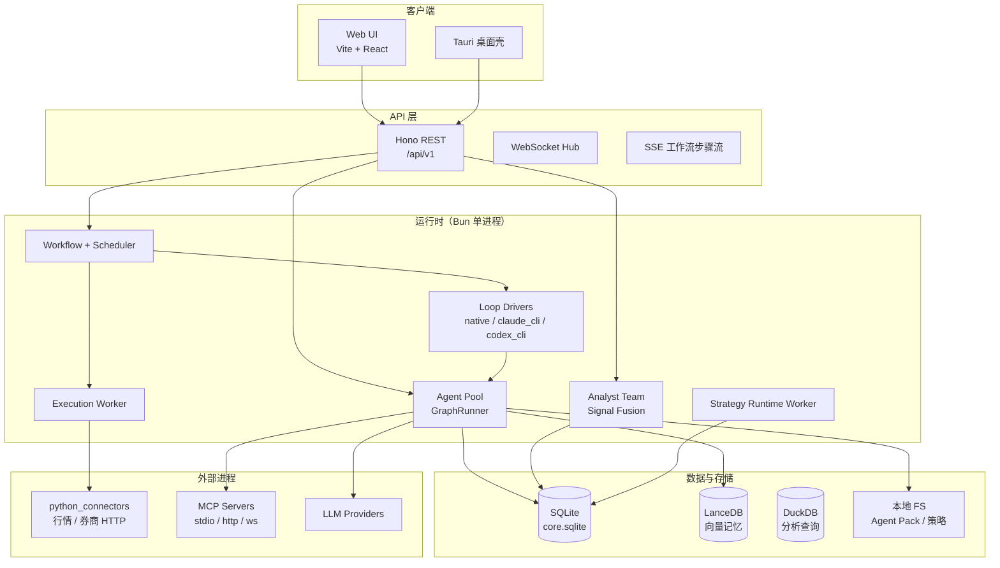
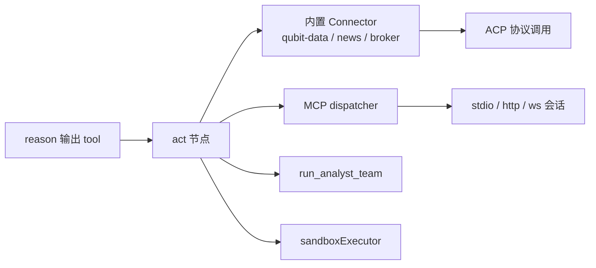
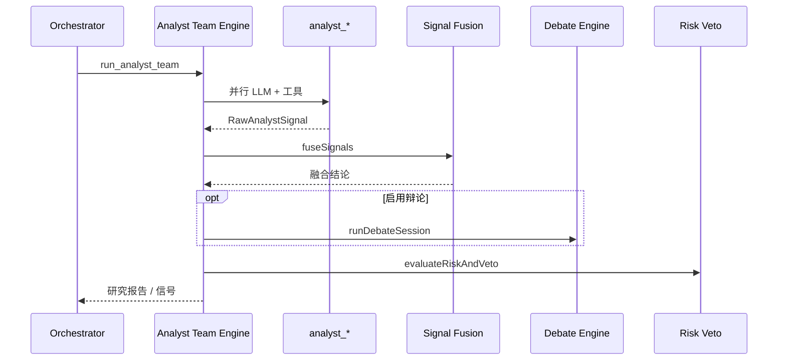
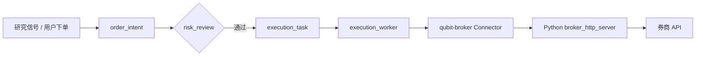

# QUBIT Agent 平台架构说明

本文档描述 **qubit-agent** 仓库的整体架构、核心模块边界与数据流，供研发 onboarding、方案评审与二次开发参考。产品简介与快速启动见根目录 [README.md](../README.md)；Loop 驱动细节见 [LOOP_DRIVERS.md](./LOOP_DRIVERS.md)。

---

## 1. 定位与目标

QUBIT 是面向**量化研究与交易自动化**的多 Agent 平台，将以下能力整合在同一工作台：

| 能力域 | 说明 |
|--------|------|
| 对话驱动研究 | 用户通过 Chat Session 发起目标，编排 Agent 调度子任务 |
| 多分析师协作 | 基本面 / 技术 / 情绪 / 宏观等角色并行，经 MSA 融合与辩论 / 风控 |
| 可视化 IDE | K 线、指标编辑、Python 信号与回测坞 |
| 工具生态 | MCP 市场、Skills 市场、内置 Connector |
| 实盘编排 | Intent → 风控 → 统一执行队列 → 券商桥（Futu / IB / CCXT） |

默认数据与策略落盘目录：`~/.quant-agent`（环境变量 `QUBIT_DATA_DIR` 可覆盖）。

---

## 2. 系统总览

下图使用 [Mermaid](https://mermaid.js.org/) 语法，在 GitHub、GitLab、VS Code（含 Markdown 预览）等支持 Mermaid 的 Markdown 渲染器中可直接显示。



**分层一览**（纯 Markdown 表格，任意预览器均可读）：

| 层级 | 组件 | 职责 |
|------|------|------|
| 客户端 | Web UI、Tauri | 用户交互；Tauri 可 Sidecar 拉起后端 |
| API | Hono、WebSocket、SSE | REST `/api/v1`、实时推送、工作流步骤流 |
| 运行时 | GraphRunner、Loop、Workflow、MSA、Execution、Strategy | Agent 编排、任务调度、研究融合、下单执行 |
| 数据 | SQLite、LanceDB、DuckDB、本地 FS | 业务主库、向量记忆、分析查询、Pack 与策略落盘 |
| 外部 | Python 桥、MCP、LLM | 行情/券商、扩展工具、模型推理 |

**进程模型（单节点 V1）**：后端由 `src/index.ts` 启动一个 Bun 进程，内含 HTTP/WS、LangGraph 运行时、定时调度器与执行 Worker。Tauri 可选通过 Sidecar 拉起同一后端；前端开发时通常独立运行在 `3041` 端口。

---

## 3. 技术栈

| 层级 | 技术选型 |
|------|----------|
| 运行时 | [Bun](https://bun.sh) ≥ 1.3 |
| 语言 | TypeScript |
| HTTP | [Hono](https://hono.dev) |
| ORM / 迁移 | [Drizzle](https://orm.drizzle.team) + SQLite |
| Agent 编排 | [LangGraph.js](https://langchain-ai.github.io/langgraphjs/) |
| LLM 调用 | OpenAI SDK（多 Provider 网关） |
| 前端 | Vite · React · Zustand |
| 桌面 | Tauri v2（Rust，`src-tauri/`） |
| 分析存储 | DuckDB（`@duckdb/node-api`） |
| 向量记忆 | LanceDB |
| 外部桥 | Python（`python_connectors/`） |

代码质量：`biome` lint/format，`bun test` 集成测试。

---

## 4. 仓库结构

```
qubit-agent/
├── src/                      # 后端：API、运行时、路由、连接器
│   ├── index.ts              # 进程入口：迁移、种子、Worker、HTTP
│   ├── server.ts             # Hono 路由挂载 + Bun.serve + WebSocket
│   ├── config.ts             # 环境变量 → 配置对象
│   ├── routes/               # REST 路由（按域拆分）
│   ├── runtime/              # 核心业务运行时
│   ├── connectors/           # 内置 Connector 注册与实现
│   ├── db/                   # SQLite / LanceDB / DuckDB 客户端
│   ├── messaging/            # A2A 消息总线、ACP 协议
│   └── types/                # 实体与协议类型
├── frontend/                 # Web UI
├── src-tauri/                # 桌面壳
├── python_connectors/        # Python 行情 / 券商 HTTP 服务
├── docs/                     # 文档（架构说明、LOOP 驱动等）
└── drizzle/                  # Drizzle 迁移产物
```

---

## 5. 启动与生命周期

`src/index.ts` 按固定顺序引导系统：

1. **数据库**：`runMigrations()` 应用 SQLite 迁移  
2. **种子数据**：`seedAgentDefinitions()` 预置 Agent 定义  
3. **工作区配置**：`ensureWorkspaceRuntimeConfigFiles()` 同步 `.qubit/` 下 JSON 与默认 Sandbox 策略  
4. **连接器**：`registerBuiltinConnectors()` 注册 `qubit-data` / `qubit-news` / `qubit-broker`  
5. **Agent 运行时**：`startAllAgents()` 启动 `GraphRunner`  
6. **后台 Worker**：`workflowScheduler.start()`、`executionWorker.start()`  
7. **HTTP 服务**：`createServer()` 监听 `HOST:PORT`  

`SIGINT` / `SIGTERM` 时逆序关闭 Scheduler、Execution Worker、GraphRunner 与 HTTP。

---

## 6. API 层

### 6.1 HTTP 路由

所有业务 API 前缀为 `/api/v1`，在 `src/server.ts` 挂载：

| 前缀 | 模块 | 职责 |
|------|------|------|
| `/workspaces` | workspace | 工作区、项目 |
| `/workflows` | workflow | 工作流创建、状态、步骤流 |
| `/agents` | agent | Agent 定义、草稿、MCP/Skills 市场 |
| `/chat` | chat | 会话与消息 |
| `/monitor` | monitor | 会话 / 工作流 / 工具调用观测 |
| `/analyst` | analyst | 研究团队、信号融合 |
| `/debate` | debate | 多空辩论 |
| `/risk` | risk | 风控与 veto |
| `/screener` | screener | 选股 |
| `/gene` | gene | 策略基因相关 |
| `/reia` | reia | 券商账户、Intent、REIA 执行 |
| `/execution` | execution | 统一执行队列与任务事件 |
| `/market` | market | K 线、回测、资讯简报 |
| `/integrations` | integrations | 第三方集成 |

工作流步骤流支持 SSE：

- `GET /api/v1/workflows/:id/stream?runId=...`
- `GET /api/v1/workflows/:id/stream/:runId`

### 6.2 WebSocket

同一 `Bun.serve` 实例处理 WebSocket 升级。客户端可 `subscribe` 主题，`broadcastWs(topic, payload)` 向订阅者推送（用于实时 UI 更新）。

### 6.3 健康检查

`GET /health` 返回 `{ status, version, ts }`，前端与 Tauri 用于探测后端可用性。

---

## 7. Agent 运行时

### 7.1 LangGraph 四段循环

默认 **native** 路径使用 LangGraph 状态图，节点位于 `src/runtime/langgraph/nodes/`：

```
START → perceive → reason → act → observe → (循环或 END)
```

| 节点 | 职责 |
|------|------|
| **perceive** | 汇聚上下文（工作流目标、历史步骤、订阅消息） |
| **reason** | 调用 LLM，产出下一步意图或工具调用 JSON |
| **act** | 执行工具：内置 Connector、MCP、研究团队、回测等 |
| **observe** | 记录步骤、推送 SSE、更新 workflow / agent_step |

`GraphRunner`（`graph-factory.ts`）负责：

- 从 SQLite `agent_definition` 或种子定义加载角色配置  
- 监听 `.qubit/` 工作区配置变更并热同步到 DB  
- 为每个 `workflow_run` 创建独立图执行实例  

步骤事件经 `stepStreamBus`（`event-stream.ts`）对外 SSE 推送。

### 7.2 Agent Pool 与任务派发

`agent-pool.ts` 是对外统一入口：

- `startAllAgents` / `stopAllAgents`：生命周期  
- `dispatchTaskToRole`：根据 `workflow_run.loop_kind` 选择 Loop Driver，向指定 `AgentRole` 派发 `TaskAssignPayload`  

### 7.3 Loop 驱动（可插拔）

`workflow_run.loop_kind` 支持三种执行后端（详见 [LOOP_DRIVERS.md](./LOOP_DRIVERS.md)）：

| `loop_kind` | 实现 |
|-------------|------|
| `native` | 服务端 LangGraph `GraphRunner` |
| `claude_cli` | 子进程 `claude`，可选 MCP Bridge |
| `codex_cli` | 子进程 `codex exec`，可选 MCP Bridge |

CLI 路径在 `.qubit/loop-runs/<workflowId>/` 生成 `qubit-mcp-bridge.json`，通过 `mcp-bridge-server.ts` 将外部 CLI 的工具调用代理回平台内 `dispatchMcpToolCall`。

### 7.4 工具执行路径（act 阶段）

`act.ts` 将 LLM 解析出的工具名路由到不同后端：



内置工具与 Connector 映射示例：`fetch_klines` → `qubit-data`，`submit_order` → `qubit-broker`。

### 7.5 Sandbox 与权限

每个 `agent_definition` 关联 `sandbox_policy`，限制：

- 可用工具 / MCP Server / Connector  
- 文件系统路径、外网 Host  
- 是否可写记忆、读实时行情、提交订单  
- 单次工具超时、最大迭代次数  

违规与审计写入 `tool_call_log` 等观测表。

### 7.6 Agent 定义与工作区

- **DB 主数据**：`agent_definition`、`agent_instance`、`agent_profile`（Pack 文件引用）  
- **文件配置**：`.qubit/agents.json`、`model.json` 等，经 `workspace-config.ts` 与 DB 双向同步  
- **Pack**：`agent-pack-service` 合并 DB prompt、SOUL、用户模板与记忆片段  

预置角色种子见 `seed-agent-definitions-data.ts`（orchestrator、各 analyst、risk、execution 等）。

---

## 8. 工作流与子系统

### 8.1 Workflow 模型

`workflow_run` 表记录一次运行：

- `mode`：`research` | `backtest` | `simulation` | `live`  
- `source`：`chat` | `manual` | `api`  
- `loop_kind` / `loop_options_json`：执行后端选项  
- `agent_group_id`：研究团队编组  

`workflow-service.ts` 的 `createAndDispatchWorkflow`：

1. 插入或复用（同 session 的 chat 源）workflow 行  
2. 若不 `skipDispatch`，向 **orchestrator** 角色派发 `workflow_start` 任务  

### 8.2 对话关联

`chat_message` ↔ `workflow_run` 通过 `chat_message_workflow_link` 关联；用户消息可触发编排 Agent 创建/复用工作流。

### 8.3 研究团队（MSA）

`src/runtime/msa/` 实现多分析师协作：



- **拓扑**：`analyst-team-topology.ts` 支持分波次、关系边  
- **编组**：`agent_group` + `agent_group_member`  
- **融合**：`signal-fusion.ts` 产出 `signal_fusion` 记录，API `GET /analyst/fusion/:workflowId`  
- **交互日志**：`research_team_interaction` 表 + `interaction-log.ts`  

### 8.4 定时调度

`workflow/scheduler.ts` 每分钟 tick，处理：

- `scheduled_job` 的 cron 触发（当前支持 `* * * * *` 与 `*/N * * * *`）  
- 新闻 / 事件 / K 线等触发门控  
- 与 `auto-execution` 联动实盘意图  

### 8.5 策略运行时

`runtime/strategy/` 提供 IDE 保存的 Python 信号脚本的**持续运行**能力：

- `strategy-runtime-worker`：轮询活跃策略实例  
- `signal-evaluator`：评估买卖信号  
- 与统一执行层对接下单意图  

相关表：`strategy_runtime_instance` 等（迁移 `0031_strategy_runtime.sql`）。

---

## 9. 交易与执行链路

### 9.1 统一执行（V2）

迁移 `0030_unified_execution` 起，执行路径统一为：

```
order_intent → risk_review_ticket（可选）→ execution_task → 券商 Connector
```

| 组件 | 文件 | 说明 |
|------|------|------|
| 意图服务 | `order-intent-service.ts` | 创建 `order_intent` |
| 执行 Worker | `execution-worker.ts` | 轮询 pending 任务，风控过期处理 |
| 分发器 | `execution-dispatcher.ts` | 调用 broker / mock |
| 实盘门控 | `live-trading-gate.ts` | live 模式确认与开关 |
| REIA 桥 | `reia-bridge.ts` | 与 REIA Intent 引擎衔接 |

`execution_task_event` 记录全链路事件，供监控与排错。

### 9.2 REIA（实盘意图引擎）

`src/runtime/reia/`：

- **intent-engine**：从研究信号 / 用户操作生成交易意图  
- **broker-service**：账户配置、provider（Futu / IB / CCXT）  
- **auto-execution**：定时任务触发的自动执行  
- **safety-gate**：额外安全校验  

券商实现：

- TypeScript：`qubit-broker.connector.ts` → HTTP 调 Python  
- Python：`python_connectors/broker_http_server.py` + `broker_gateway/`（futu、ib、ccxt_adapter）  
- MCP：`broker-mcp-server.ts` 暴露券商工具给 Agent  

### 9.3 数据流简图



---

## 10. 市场、回测与 IDE 数据

`src/runtime/market/` 与 `routes/market.routes.ts`：

| 能力 | 关键模块 |
|------|----------|
| K 线查询 | `klines-data-source.ts`、`klines-query.ts` |
| 资讯简报 | `news-brief-query.ts`、`rss-headlines.ts`、Yahoo 等 |
| Python 回测 | `backtest-engine.ts`、`python_backtest_runner.py` |
| 回测任务 | `backtest-job-runner.ts` |
| 信号运行 | `python-signal-runner.ts` |

IDE 侧策略脚本持久化在 `indicator_strategy_script`；工作流目录下还可落盘 `report.md`、`strategies/`（路径见 README）。

`instrument-router.ts`、`trading-calendar.ts` 负责标的与市场时段路由。

---

## 11. 连接器架构

### 11.1 注册表

`connectors/registry.ts` 维护命名 Connector 实例。`bootstrap.ts` 在启动时注册：

| ID | 类型 | 用途 |
|----|------|------|
| `qubit-data` | data | K 线、快照、行情 |
| `qubit-news` | data | 新闻、情绪 |
| `qubit-broker` | execution | 下单、撤单、成交 |

配置来自 SQLite `builtin_connector_settings`，支持 `reloadBuiltinConnectorsFromSettings()` 热加载。

### 11.2 ACP 调用约定

Agent **act** 阶段通过 `messaging/acp.ts` 构建 ACP 请求，经 `sandboxExecutor` 校验后调用 Connector。调用日志写入 `acp_call`、`tool_call_log`。

### 11.3 记忆 Connector

`connectors/memory/native/` 提供中期 / 长期记忆存储，可选对接 LanceDB；由 `memory` 相关配置与环境变量控制写入模式。

---

## 12. MCP 与 Skills

### 12.1 MCP

| 层次 | 说明 |
|------|------|
| 配置 | `mcp_server_config`（stdio / http / ws） |
| 绑定 | `mcp_tool_binding` 按项目或 Agent 定义限定工具 |
| 调度 | `mcp/dispatcher.ts`、`stdio-session.ts` |
| 市场 | `mcp/market-service.ts` + Registry 同步 `mcp_catalog` |

外部 CLI Loop 通过 **MCP Bridge** 复用同一套配置。

### 12.2 Skills

`runtime/skills/` 对接 SkillsMP 等开放市场，`open-skill-market-registry.ts` 管理安装与启用状态（表 `skill_market_install` 等）。

---

## 13. 消息与协作协议

### 13.1 A2A（Agent-to-Agent）

`messaging/bus.ts`：进程内 `EventEmitter` 实现的发布/订阅总线。消息类型定义于 `types/a2a.ts`，信封为 `A2AMessageEnvelope`。

V1 为单进程；V2 可替换为 NATS / Redis Streams 而不改 API 表面。

### 13.2 ACP（Agent-Connector Protocol）

`messaging/acp.ts`：Agent 调用 Connector 的标准请求/响应结构，与 `acp_call` 表审计对齐。

---

## 14. 数据架构

### 14.1 SQLite（主库）

路径：`$QUBIT_DATA_DIR/db/core.sqlite`（由 `getDb()` 管理）。

Schema 按域划分（见 `src/db/sqlite/schema.ts`）：

| 域 | 代表表 |
|----|--------|
| 组织与任务 | `workspace`, `project`, `chat_session`, `workflow_run`, `chat_message` |
| Agent 运行时 | `agent_definition`, `agent_instance`, `agent_step`, `sandbox_policy` |
| MCP / Skills | `mcp_server_config`, `mcp_tool_binding`, `mcp_catalog`, skill 相关表 |
| 研究团队 | `agent_group`, `agent_group_member`, `signal_fusion`, `research_team_interaction` |
| 执行与券商 | `order_intent`, `execution_task`, `broker_account`, `risk_review_ticket` |
| 回测与策略 | `backtest_job`, `indicator_strategy_script`, `strategy_runtime_instance` |
| 观测 | `tool_call_log`, `mcp_call_log`, `alert_event`, observability metrics |

迁移文件位于 `src/db/sqlite/migrations/`，启动时自动 `runMigrations()`。

### 14.2 LanceDB

`db/lancedb/client.ts`：向量记忆与检索（按功能模块写入）。

### 14.3 DuckDB

`db/duckdb/client.ts`：分析型查询与指标计算场景。

### 14.4 文件系统

| 路径 | 内容 |
|------|------|
| `$QUBIT_DATA_DIR/projects/<projectId>/workflows/<runId>/` | 研究报告、策略脚本 |
| `.qubit/agents.json` | 工作区 Agent 配置 |
| `.qubit/model.json` | 模型 Provider 配置 |
| `.qubit/loop-runs/<workflowId>/` | CLI Loop 产物与 MCP Bridge |

---

## 15. 前端架构

`frontend/` 为独立 workspace（`bun run dev:frontend`，默认端口 **3041**）。

```
frontend/src/
├── App.tsx                 # 布局、后端健康探测、Tauri 启动
├── api/                    # backend.ts / client.ts / types.ts
├── store/                  # Zustand 全局状态
├── components/
│   ├── layout/             # Sidebar、TopBar、MainContent
│   ├── chat/               # 对话与时间线
│   ├── ide/                # 研究工作台、回测坞、指标 IDE
│   ├── chart/              # KlinePanel、资讯
│   ├── team/               # 研究团队拓扑画布
│   ├── config/             # 配置中心、Agent 运行时
│   ├── monitor/            # 运行监控大盘
│   ├── broker/             # 券商账户
│   └── trader/             # 实盘面板
└── lib/                    # 角色枚举、图表 spec、事件分组等
```

**与后端交互**：

- REST：`api/backend.ts` 封装 `/api/v1`  
- SSE：工作流步骤流  
- WebSocket：可选主题订阅  
- Tauri：`api/tauri.ts` 启动 Sidecar 后端并轮询健康状态  

UI 不直接访问数据库；所有持久化经后端 API。

---

## 16. 桌面端（Tauri）

`src-tauri/` 提供原生壳：

- 嵌入 WebView 加载前端构建产物或 dev server  
- Rust 命令启动 / 检测 Bun 后端子进程  
- 顶部栏展示 **Backend Connected** 状态  

开发与打包：`bun run dev:tauri`、`bun run build:tauri`。

---

## 17. Python 连接器

`python_connectors/` 以独立 HTTP 服务形式运行（默认 `127.0.0.1:18765`）：

```
python_connectors/
├── broker_http_server.py      # 券商 API 入口
└── connectors/
    ├── broker_gateway/          # futu、ib、ccxt_adapter
    └── ...                      # 行情等（按模块扩展）
```

TypeScript 侧 `QubitBrokerConnector` 将 ACP 调用转为 HTTP 请求；未启动 Python 桥时券商相关工具失败并在日志中体现。

---

## 18. 配置与环境变量

| 变量 | 默认 | 说明 |
|------|------|------|
| `QUBIT_DATA_DIR` | `~/.quant-agent` | 数据根目录 |
| `PORT` / `HOST` | `3000` / `localhost` | API 监听 |
| `NODE_ENV` | `development` | 运行环境 |
| `QUBIT_RISK_SIGNING_KEY` | dev 占位 | 风控签名 |
| `SKILLSMP_API_KEY` | — | Skills 市场（可选） |
| 各 `*_API_KEY` | — | LLM Provider（亦可 `.qubit/model.json`） |

内存相关：`MEMORY_SESSION_TTL_HOURS`、`MEMORY_EXTERNAL_ENABLED`、`MEMORY_WRITE_MODE`。

---

## 19. 观测与质量

`runtime/monitor/`：

- 会话 / 工作流 / 步骤 / 工具 / Sandbox 多层聚合（`monitor.routes.ts`）  
- `alert-service.ts`、`quality-metrics.ts`  

数据库迁移 `0012_observability_metrics.sql` 等支撑指标落库。

开发自检：

```bash
bun run check          # lint + format
bun test               # 集成测试
bun run acceptance:langgraph
```

---

## 20. 扩展点与演进建议

| 扩展点 | 方式 |
|--------|------|
| 新 Agent 角色 | `agent_definition` + 种子 / 工作区 JSON + LangGraph 工具列表 |
| 新内置工具 | Connector 实现 + `TOOL_CONNECTOR_ROUTES` + Sandbox 白名单 |
| 新 MCP 服务 | `mcp_server_config` + `mcp_tool_binding` |
| 新 Loop 驱动 | 实现 `LoopDriver` 接口并注册到 `loop/registry.ts` |
| 新券商 | Python `broker_gateway` + `broker_provider_config` |
| 分布式消息 | 替换 `MessageBus` 单例实现，保持 A2A 信封不变 |

---

## 21. 相关文档

| 文档 | 路径 |
|------|------|
| 项目 README | [README.md](../README.md) |
| Loop 驱动说明 | [LOOP_DRIVERS.md](./LOOP_DRIVERS.md) |
| 本文档 | [ARCHITECTURE.md](./ARCHITECTURE.md) |

---

## 22. 版本说明

- 文档版本：与仓库 `0.1.0` 对齐（2026-05）  
- Schema 以 `src/db/sqlite/migrations/` 最新迁移为准；若表名与本文不一致，以代码为准  

如有架构变更，请同步更新本文档并在 PR 中注明影响面。
