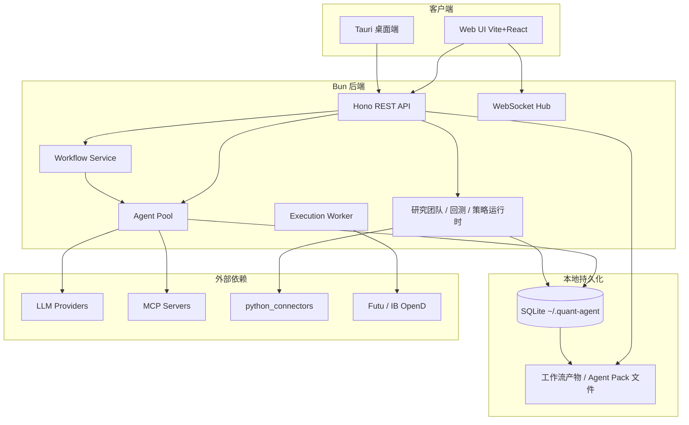
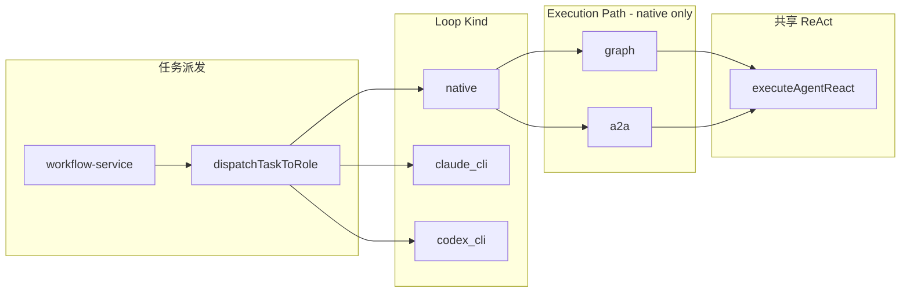
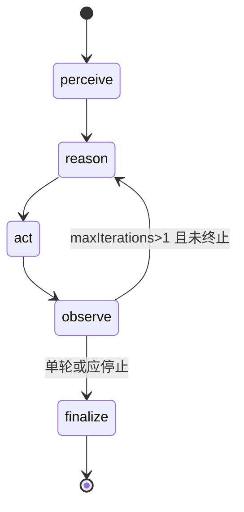
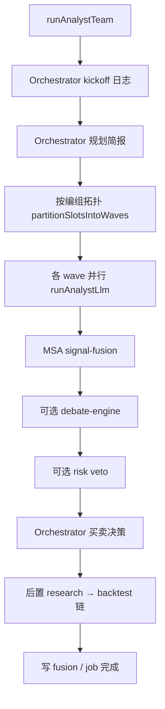
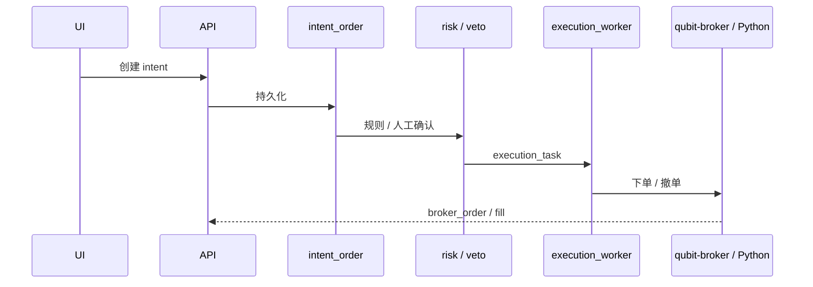

# QUBIT Agent 平台架构说明

本文档描述 **当前代码实现** 下的系统架构，供研发、运维与二次开发参考。产品定位为：**量化研究多 Agent 平台**——对话驱动研究、多分析师协作、K 线 IDE、回测与实盘编排一体化。

---

## 1. 设计目标与边界

| 目标 | 实现方式 |
|------|----------|
| 可观测的多 Agent 协作 | `workflow_run` + `agent_instance` / `agent_step` + SSE 步骤流 + A2A 消息持久化 |
| 统一的 Agent 推理循环 | Native 路径内建 **ReAct**：`perceive → reason → act → observe`（Graph / A2A 共用 `executeAgentReact`） |
| 可切换的执行形态 | **Loop Kind**（native / 外部 CLI）× **Execution Path**（graph / a2a） |
| 研究团队专用编排 | `runAnalystTeam`：拓扑 wave、MSA 融合、Orchestrator 规划/决策（**不经过** ReAct 图，单次 LLM + 预拉数据） |
| 工具与数据可扩展 | 内置工具、MCP、Connector 三层；Python 桥接行情/券商 |
| 风控与实盘隔离 | A2A 治理规则、`ORDER_INTENT` 签名校验、REIA 意图→执行闸门 |

**不在本文展开**：具体 Prompt 文案、种子 Agent 列表、各 Provider API 细节（见 `src/runtime/seed-agent-definitions-data.ts` 与配置中心）。

---

## 2. 系统上下文



---

## 3. 进程与启动顺序

入口：`src/index.ts`

1. `runMigrations()` — SQLite schema
2. `seedAgentDefinitions()` — 预置 Agent / 编组（可重复、幂等）
3. `ensureWorkspaceRuntimeConfigFiles()` — `.qubit/` 工作区 JSON
4. `registerBuiltinConnectors()` — 注册 `qubit-data`、`qubit-news` 等 Connector
5. `startAllAgents()` — 启动 **GraphRunner** + **A2APool**
6. `restoreRunningStrategies()` — 恢复未停止的策略运行时
7. `workflowScheduler` / `executionWorker` / `strategyRuntimeWorker` — 后台轮询
8. `createServer()` — HTTP（Hono）+ WebSocket

HTTP 路由聚合于 `src/server.ts`；步骤流 SSE：`GET /api/v1/workflows/:id/stream/:runId` → `stepStreamBus`。

---

## 4. 领域模型（数据与任务）

### 4.1 组织层级

```
workspace
  └── project（marketScope、status）
        ├── chat_session（对话工作台）
        │     └── chat_message ↔ workflow_run（经 chat_message_workflow_link）
        └── workflow_run（一次可观测的 Agent 任务）
              ├── agent_instance（某次运行中的 Agent 实例）
              │     └── agent_step（perceive / reason / act / observe 持久化）
              ├── a2a_message（A2A 总线消息审计）
              ├── tool_call_log / mcp_call_log
              └── 产物目录（策略脚本、report.md 等，落盘于 QUBIT_DATA_DIR）
```

### 4.2 Workflow 关键字段

表：`workflow_run`（`src/db/sqlite/schema.ts`）

| 字段 | 含义 |
|------|------|
| `mode` | `research` \| `backtest` \| `simulation` \| `live` |
| `source` | `chat` \| `manual` \| `api` |
| `loopKind` | `native` \| `claude_cli` \| `codex_cli` |
| `executionPath` | `graph` \| `a2a`（仅 `loopKind=native` 时有效） |
| `loopOptionsJson` | CLI 参数、可选 `executionPath` / `reactLoop` 覆盖等 |
| `agentGroupId` | 研究团队选用的 Agent 编组 |

创建与派发：`createAndDispatchWorkflow()`（`src/runtime/workflow/workflow-service.ts`）默认向 **orchestrator** 发送 `TASK_ASSIGN`（`taskType: workflow_start`），除非 `skipDispatch: true`（如实时交易占位工作流）。

---

## 5. Agent 运行时（核心）

### 5.1 概念分层



**Agent Pool**（`src/runtime/agent-pool.ts`）对外统一：

- `startAllAgents()` / `stopAllAgents()`
- `dispatchTaskToRole({ workflowId, role, payload })`
- `getRuntimeAgents()` — 合并 Graph 视图与 A2A Pool 视图（带 `executionPath` 标记）

派发逻辑：

1. 读取 `workflow_run` 的 `loopKind`、`executionPath`、`loopOptionsJson`
2. `resolveExecutionPath()`（`src/runtime/resolve-execution-path.ts`）
3. 若 `native` + `a2a` → `a2aLoopDriver`（发 A2A 消息）
4. 否则 → `getLoopDriver(loopKind).dispatchTask()`（native 默认 `graphRunner.runRoleTask`）

环境变量：`QUBIT_AGENT_EXECUTION_PATH`（默认 `graph`）作为新工作流的默认 `executionPath`。

### 5.2 ReAct 内建循环（Native）

**ReAct 是 Agent 的默认运行方式**，不是可选「技能开关」。实现：`src/runtime/langgraph/execute-agent-react.ts`。



| 节点 | 职责 | 主要代码 |
|------|------|----------|
| **perceive** | 读入 `TASK_ASSIGN`、会话上下文、记忆 | `nodes/perceive.ts` |
| **reason** | LLM 推理；组装 system prompt（Pack + FSI + 工具说明） | `nodes/reason.ts` |
| **act** | 解析 tool call；走 builtin / MCP / connector | `nodes/act.ts` |
| **observe** | 汇总工具结果写回 state | `nodes/observe.ts` |

**多轮条件**（`react-loop-policy.ts`）：

- 默认：`agent_definition.maxIterations > 1` 时，observe 后可回到 reason
- 提前结束：`shouldStopReactLoopAfterObserve`（模型未请求工具且已有文字结论）
- 显式关闭：任务 `params.forceLoop: false` 或 `loopOptions.reactLoop: false`
- 沙箱：`sandboxExecutor.checkIterationLimit` 可终止并写 `SANDBOX_ITERATION_LIMIT`

**Graph 路径**：`GraphRunner.executeGraph()` → `executeAgentReact()`（`streamSource: native`）

**A2A 路径**：`AgentRuntime` 订阅消息 → `role-handlers` 默认 handler → `runA2aReactTaskAssign()` → 同一 `executeAgentReact()`（`streamSource: a2a`）→ 回 `TASK_RESULT`

> 编排器 `research_team_execute`、风控签名链、`risk` / `execution` 等 **专用 handler** 仍走定制逻辑，不进入通用 ReAct 短路。

### 5.3 GraphRunner vs A2APool

| | GraphRunner | A2APool |
|---|-------------|---------|
| 入口 | `nativeLoopDriver` → `graphRunner.runRoleTask` | `a2aLoopDriver.dispatchTask` → `a2aRouter.send(TASK_ASSIGN)` |
| 实例模型 | 每次任务新建 `agent_instance` | 长驻 `agent_instance` 绑在 pool workflow 上 |
| 角色行为 | 直接调 `executeAgentReact` | `AgentRuntime` + `RuntimeRoleHandler` |
| 配置热更新 | 监听 `.qubit/*.json` 可 reload 定义 | 启动时加载 DB 定义 |
| 适用场景 | 默认；与 LangGraph 状态机一致 | 需要完整 A2A 消息轨迹、多角色总线协作 |

两者在 **ReAct 语义上等价**；差异在调度与消息外壳。

### 5.4 外部 CLI Loop

`claude_cli` / `codex_cli`（`src/runtime/loop/cli-loop-driver.ts`）：

- 子进程跑外部 CLI，按行协议解析步骤
- 仍向 `stepStreamBus` 发事件，便于前端统一时间线
- **不**走 `executeAgentReact`；execution path 解析时强制视为 graph 等价

---

## 6. A2A 消息与治理

组件：

- `A2ARouter`（`src/messaging/a2a.ts`）— 治理校验 + 持久化 + `messageBus`
- `AgentRuntime`（`src/runtime/agent-runtime.ts`）— 按 `subscriptions` 订阅类型处理消息
- `role-handlers.ts` — 按 `AgentRole` 注入行为

治理要点（`A2A_GOVERNANCE`）：

- `ORDER_INTENT` 到达执行角色前须带 `riskSignature`（HMAC，密钥 `QUBIT_RISK_SIGNING_KEY`）
- Orchestrator 为工作流主决策入口；研究团队任务可指定 `research_team_execute`

消息类型（节选）：`TASK_ASSIGN`、`TASK_RESULT`、`ALERT`、`ORDER_INTENT`、`MODEL_UPDATE`、`MEMORY_WRITE`。

---

## 7. 研究团队编排（MSA）

与单 Agent ReAct **并行存在的另一条流水线**，服务「多分析师 + 融合 + 策略/回测」场景。

入口：

- HTTP / 工具：`runAnalystTeam`（`src/runtime/msa/analyst-team.ts`）
- Graph / A2A Orchestrator：`taskType === research_team_execute"`

流程概要：



| 概念 | 说明 |
|------|------|
| **编组** `agent_group` | `relations_json`：`from → to` 表示前置完成后再将结论传给后置 |
| **Orchestrator 星型边** | 仅 kickoff/拓扑展示；**不进入** analyst wave 分层（`slotOnlyRelationEdges`） |
| **分析师槽位** | `analyst_fundamental` / `technical` / `sentiment` / `macro` |
| **后置角色** | `research`、`backtest` 等在 MSA 之后（`analyst-team-pipeline.ts`） |
| **数据预取** | `analyst-team-context.ts` 拉 K 线、新闻等写入上下文（非 ReAct 工具循环） |

拓扑展示与过滤：`frontend/src/lib/teamGraphDisplay.ts`、`team-workflow-graph.ts`。

---

## 8. 工具、Connector 与 MCP

### 8.1 三层调用（act 节点）

```
reason 输出 tool call
    ├─ isBuiltinTool → dispatchBuiltinTool (builtin-tools.ts)
    ├─ MCP 绑定     → dispatchMcpToolCall
    └─ connector    → connectorRegistry (bootstrap 注册)
```

内置 Connector（`src/connectors/bootstrap.ts`）：

| ID | 用途 |
|----|------|
| `qubit-data` | K 线、行情源路由 |
| `qubit-news` | 新闻简报 |
| `qubit-backtest` | 回测任务 |
| `qubit-research` | 研究/团队工具 |
| `qubit-sim` | 仿真 |
| `qubit-risk` | 风控 |
| `qubit-broker` | 券商桥 |

工具目录 API：`tool-catalog.ts`；配置中心勾选写入 `agent_definition.tools_json` / `mcp_servers_json`。

### 8.2 MCP

- 配置表：`mcp_server_config`、`mcp_tool_binding`
- 传输：stdio / http / ws（`runtime/mcp/`）
- 市场：Registry 同步、`mcp_catalog` 安装到项目

### 8.3 Sandbox

`SandboxExecutor` 按 `sandbox_policy_id` 限制工具、MCP、Connector、迭代次数、超时；违规写 `sandbox_violation_log`。

---

## 9. FSI 内容包（可选）

Anthropic Financial Services 内容包集成（`src/runtime/fsi/`），默认 **关闭**。

启用：`QUBIT_FSI_ENABLED=true`，`QUBIT_FSI_CONTENT_ROOT`，`QUBIT_FSI_BUNDLES=quant-research,...`

| 模块 | 作用 |
|------|------|
| `fsi-manifest-loader` | 读 `content-packs/*/manifest.json` |
| `fsi-prompt-enricher` | 向分析师 / ReAct system prompt 注入技能正文 |
| `fsi-output-validator` | 结构化输出 JSON Schema 校验 |
| `fsi-skill-resolver` | 角色 → 技能映射 |
| `seed-fsi-integration` | 启动种子 MCP 目录、Agent skills |

研究团队与 Graph `reason` 节点均可调用 `enrichSystemPromptWithFsi`。

---

## 10. 对话、IDE 与监控

### 10.1 对话工作台

- `POST /api/v1/chat/...` 创建消息 → 常触发 `createAndDispatchWorkflow`（`source: chat`）
- 同 session 可 `reuseSessionWorkflow` 复用最近 `workflow_run`
- Session Agent 看板、A2A 时间线：`getSessionAgentsBoard`、`getSessionA2AMessages`

### 10.2 QUBIT IDE（前端）

- K 线：QuantDigger + 多数据源（`klines-data-source.ts`：Tushare、Yahoo、东财、AkShare 等）
- 指标 / Python 信号脚本：`indicator_strategy_script`，可导出到工作流目录
- 回测：`backtest-job-runner`、SMA 等

### 10.3 运行监控

`src/runtime/monitor/`：`observability-hook` 在工作流终态触发指标；`monitor.routes` 提供 session/workflow 聚合视图。

---

## 11. 交易与执行（REIA）



要点：

- `live-trading-gate.ts` — 实盘安全闸
- `trader-agent-service.ts` — 实时交易 session 绑定专用 `workflow_run`（`skipDispatch`，避免重复编排）
- `python_connectors/broker_http_server.py` — Futu / IB 桥
- MCP：`broker-mcp-server` 可选暴露券商工具

策略运行时（`strategy-runtime-service` + worker）与 IDE 信号解耦，可周期性评估并产生 `order_intent`。

---

## 12. Agent 配置与 Pack

| 概念 | 存储 | 说明 |
|------|------|------|
| `agent_definition` | SQLite | role、tools、skills、maxIterations、llmProvider |
| `agent_definition_draft` | SQLite | 草稿；配置中心保存 |
| `agent_definition_release` | SQLite | 发布版本 |
| `agent_profile` | SQLite | displayName、promptMode、configRootUri、memoryNamespace |
| Agent Pack 文件 | `QUBIT_DATA_DIR/...` | soul.md、prompt.md、agent.md、user/memory 快照 |

`promptMode`：`db_primary` \| `file_primary` \| `merged`（`agent-pack-service.ts`）。

工作区 JSON：`.qubit/agents.json` 等，可由 GraphRunner 监听并 `syncWorkspaceConfigToDb`。

---

## 13. 前端架构（概要）

```
frontend/
  src/
    api/backend.ts      # REST 客户端
    api/types.ts        # DTO
    components/
      layout/MainContent.tsx   # 主壳：对话 / 配置 / 研究团队 / IDE
      config/                  # Agent / MCP / 模型配置
    lib/
      workflowKind.ts          # 工作流类型分组
      teamGraphLayout.ts       # 研究团队拓扑布局
      teamGraphDisplay.ts      # 拓扑边/节点展示规则
    store/                     # Zustand 全局 UI 状态
```

桌面端 `src-tauri/` Sidecar 拉起后端，UI 仍访问同一 REST/SSE API。

---

## 14. 配置与环境变量（节选）

| 变量 | 默认 | 说明 |
|------|------|------|
| `QUBIT_DATA_DIR` | `~/.quant-agent` | SQLite + Pack + 工作流产物 |
| `PORT` / `HOST` | `3000` / `localhost` | 后端监听 |
| `QUBIT_AGENT_EXECUTION_PATH` | `graph` | 新 workflow 默认 native 路径 |
| `QUBIT_RISK_SIGNING_KEY` | dev 密钥 | A2A 订单签名 |
| `QUBIT_FSI_*` | 关闭 | FSI 内容包 |
| `OPENAI_API_KEY` 等 | — | LLM（亦可 UI 写入 model.json） |

---

## 15. 代码地图（按职责）

| 路径 | 职责 |
|------|------|
| `src/index.ts` | 进程启动、worker、Agent Pool |
| `src/server.ts` | HTTP 路由、SSE、WebSocket |
| `src/routes/*.routes.ts` | REST 域边界 |
| `src/runtime/agent-pool.ts` | 派发入口 |
| `src/runtime/langgraph/execute-agent-react.ts` | **共享 ReAct 循环** |
| `src/runtime/langgraph/graph-factory.ts` | GraphRunner、研究团队短路 |
| `src/runtime/a2a/a2a-pool.ts` | 长驻 A2A 运行时 |
| `src/runtime/a2a/a2a-react-task.ts` | A2A TASK_ASSIGN → ReAct |
| `src/runtime/handlers/role-handlers.ts` | 角色级 A2A 行为 |
| `src/runtime/msa/analyst-team*.ts` | 研究团队 |
| `src/runtime/workflow/workflow-service.ts` | 创建/派发工作流 |
| `src/runtime/loop/` | Loop 驱动注册表 |
| `src/messaging/a2a.ts` | A2A 路由与治理 |
| `src/connectors/` | 领域 Connector |
| `src/runtime/tools/builtin-tools.ts` | 内置工具实现 |
| `src/runtime/fsi/` | FSI 可选集成 |
| `src/db/sqlite/schema.ts` | 全库表定义 |
| `frontend/src/components/` | 主要 UI |

---

## 16. 扩展指南（简）

1. **新增内置工具**：在 `builtin-tools.ts` 注册 → `tool-catalog.ts` 暴露元数据 → Agent `tools_json` 勾选。
2. **新增 Agent 角色**：`types/entities.ts` 角色枚举 → seed 定义 → `role-handlers` 或复用默认 ReAct handler。
3. **新增 Connector**：实现接口 → `bootstrap.ts` 注册 → sandbox 白名单。
4. **自定义研究团队拓扑**：`agent_group.relations_json`，参考 `analyst-team-topology.ts`。
5. **强制单轮 ReAct**：`maxIterations: 1` 或 workflow `loopOptions.reactLoop: false`。

---

## 17. 相关文档

- [README.md](../README.md) — 快速开始与功能概览
- [LOOP_DRIVERS.md](./LOOP_DRIVERS.md) — Loop Kind 与 Execution Path 对照

---

*文档随代码演进更新；若行为与本文不一致，以 `src/` 实现为准。*
