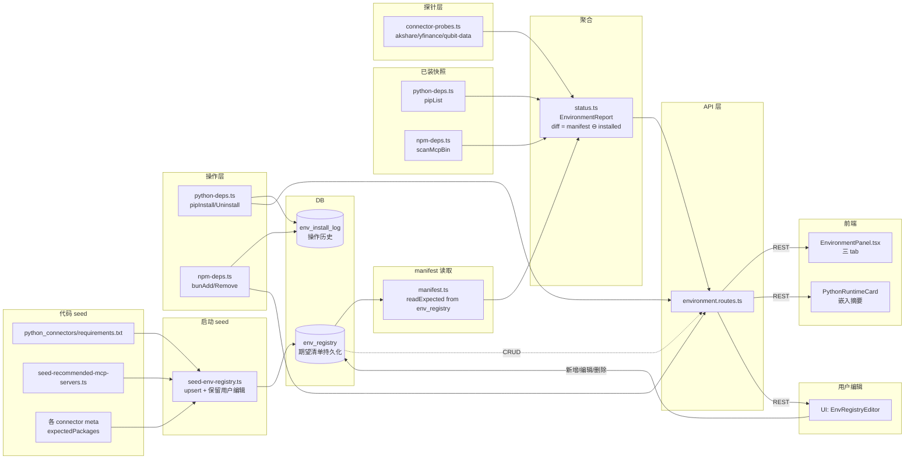

# QUBIT 环境管理（EnvironmentManager）技术方案

| 项 | 内容 |
|----|------|
| 文档状态 | 评审完成 / 已定稿（v0.2） |
| 版本 | v0.2 |
| 作者 | 吴佳峻 · Cursor Agent |
| 更新日期 | 2026-06-01 |
| 评审结论 | 见 §十「评审结论与决议」 |

> **关联记录**：本文档由 [QUBIT 监控/打点 v2 升级 方案对齐](64a1b3df-d8ec-4f96-b9c5-fa1ac3d4ad81)
> 后续会话讨论"yfinance 接入 + Python/npm 依赖管理散乱"派生而来。

---

## 前言

QUBIT 当前的「运行时依赖管理」分散在 4 个互不感知的子系统：

1. **Python 解释器解析** — `src/runtime/app-paths.ts:resolvePythonBin()`
2. **venv 创建 + pip 安装** — `src/runtime/bootstrap/packaged-setup.ts:ensurePythonVenv()`
3. **Python 健康自检** — `src/runtime/sandbox/python-runtime.ts:checkPythonHealth()`（仅查 pandas/numpy/scipy）
4. **MCP npm 包安装** — `src/runtime/mcp/package-manager.ts:resolveMcpStdioArgv()`（懒装到 `~/.quant-agent/mcp-bin`）

带来的问题：

- 想知道「我装没装 akshare/yfinance/futu_api」，得 SSH 进 venv `pip list`，UI 没视图；
- 新增 Python 数据源（如 yfinance）只能手改 `requirements.txt` + 让用户重跑 bootstrap；
- MCP 推荐目录（`seed-recommended-mcp-servers.ts`）和 `mcp-bin` 实装互不感知，看不出"已装版本 vs 推荐版本"差异；
- 用户一次只想加 1 个包（"我只要 yfinance"），现在做不到，必须改 requirements.txt 全量重装；
- `provider_registry`（factor/rule/backtest 算法注册中心）名字像但其实跟环境管理是两条线，新人易混淆。

本期目标：

- **L1（本期 P0/P1）**：把上面 4 个子系统的"已装/期望/版本/错误"统一成一个 API + 一个前端面板（`EnvironmentPanel`），并提供"单包 install/uninstall"能力；顺手把 yfinance 作为标准接入流程的"试金石"落地。
- **L2（P2/P3）**：MCP 推荐目录与已装 diff、一键升降级、重置 venv、卸载孤儿包、跨平台预制 wheel 自动选取。

**适用性判断**：研发工作量 ~3 人/日、影响面横跨 Python venv + MCP npm + 配置中心 + 前端，
满足"研发技术优化项目 + 影响面较广"，按 tech-design-doc 团队模板撰写。

---

## 一、背景

### 1.1 技术现状

| 维度 | 现状 | 痛点 |
|---|---|---|
| **Python 解释器解析** | `resolvePythonBin()` 4 级 fallback + `--version` 探针 | OK，**不动** |
| **Python venv 创建** | `ensurePythonVenv()` 首启在 `~/.quant-agent/python-venv` 跑 venv + pip；走 `wheels/` 离线优先 | OK，**不动**；但 _不支持单包安装_ |
| **Python 已装包查询** | 无 | **缺**：UI 看不到 venv 里到底装了哪些包、哪些版本 |
| **Python 健康自检** | `checkPythonHealth()` 只查 pandas/numpy/scipy 三项 | 硬编码三依赖；想加 akshare/yfinance 检测要改源码 |
| **MCP npm 包安装** | `resolveMcpStdioArgv()` 懒装到 `mcp-bin/`；首次 spawn 时触发 `bun add` | OK；但 _无离线视图_：进程外不知 mcp-bin 装了啥 |
| **MCP 推荐目录** | `seed-recommended-mcp-servers.ts` 写死 4 个推荐 | UI 不展示"已装 vs 推荐"diff |
| **配置中心 Provider 注册中心** | `provider_registry` 表，管 factor/rule/backtest **算法**优先级 | **不管**运行时环境，名字易混淆 |
| **新增 Python 数据源** | 改 requirements.txt + 改 `python-runtime.ts` REQUIRED_DEPS + 用户重跑 bootstrap | 心智重，且只能全量重装 |

### 1.2 期望收益

- **新增 Python 包从"全量重跑 bootstrap"降到"UI 点一下安装"** —— 用户加 yfinance/futu_api/talib 不用关心 venv 命令。
- **环境状态一站式可见** —— 一张页能看到：解释器路径 / 已装 Python 包 / 已装 MCP npm 包 / 各 connector 健康。
- **运维与排障 -50% 时间** —— 用户报"akshare 不工作"，第一步看面板就能确认是没装 / 版本旧 / venv 跑挂 / connector 探针挂哪个环节。
- **新接入 Python 数据源（如 yfinance）从此走标准流程**：贡献者只需照 akshare 抄 + 在依赖清单加一行 + 选个 capability 标签，无需碰 EnvironmentManager 自身。

---

## 二、名词解释

| 名词 | 释义 |
|------|------|
| **EnvironmentManager** | 本期新增模块，统一汇集 Python/npm/connector 的"期望 vs 实际"。 |
| **依赖清单（manifest）** | 期望装的包列表：Python 来自 `requirements.txt`、MCP 来自 `seed-recommended-mcp-servers.ts`。 |
| **已装快照（installed snapshot）** | 实际装的包列表：Python 来自 `pip list --format=json`、MCP 来自 `mcp-bin/node_modules/*/package.json`。 |
| **diff** | manifest ∩ 已装 = 已装齐；manifest \ 已装 = 待装；已装 \ manifest = 多装（孤儿包，仅警示）。 |
| **可选包（optional）** | manifest 里标 `optional=true` 的包，未装不影响 `ok=true`，仅 hint 提示。 |
| **能力标签（capability tag）** | 包的语义标签，如 `data-source/akshare`、`broker/futu`，用于 UI 分组与按需启用判断。 |

---

## 三、产研协作信息

| 项 | 内容 |
|----|------|
| 文档状态 | 草稿（待 review） |
| 相关文档 | [MONITORING_V2_DESIGN.md](MONITORING_V2_DESIGN.md)（同期工程优化，运维面板互补） |
| 产品 | 吴佳峻（自驱） |
| 需求技术 owner | 吴佳峻 |
| 服务端 | 吴佳峻 |
| 前端 | 吴佳峻 |
| 外部依赖方 | 无（纯本地，不依赖第三方服务） |
| 测试 | 自测 + bun test 单测 |

---

## 四、需求分析

### 4.1 功能影响范围

| 类型 | 影响项 | 变更说明 |
|------|--------|----------|
| **模块/服务** | `src/runtime/environment/`（**新增目录**） | EnvironmentManager 主目录 |
| | `src/runtime/environment/manifest.ts` | 期望清单解析（Python requirements.txt + MCP 推荐表 + 各 connector 期望包） |
| | `src/runtime/environment/python-deps.ts` | 调 `pip list/show/install/uninstall` 子进程；解析 venv 已装包 |
| | `src/runtime/environment/npm-deps.ts` | 解析 `mcp-bin/node_modules/`；触发 `bun add` / `bun remove` 单包；与 `mcp/package-manager.ts` 共用 ensureMcpBinDir |
| | `src/runtime/environment/connector-probes.ts` | 聚合 connector 健康（封 akshare、yfinance、qubit-data 等的 healthcheck） |
| | `src/runtime/environment/status.ts` | 顶层聚合：把 manifest、已装快照、connector 健康合成一个 `EnvironmentReport` |
| | `src/runtime/sandbox/python-runtime.ts` | **保留**；`checkPythonHealth` 改为内部 helper，由 `status.ts` 调用，REQUIRED_DEPS 从 manifest 动态拼 |
| | `src/runtime/market/yfinance-klines.ts`（**新增**） | yfinance Python bridge，照 `akshare-klines.ts` 抄 |
| | `python_connectors/connectors/yfinance/__init__.py`（**新增**） | yfinance Python connector：fetch_bars / fetch_dividends / fetch_earnings / fetch_asset_info |
| | `src/connectors/data/native-data.connector.ts` | 增加 `effective === "yfinance"` 分支 + 失败回退 yahoo_chart；新增 fetch_dividends/fetch_earnings/fetch_asset_info 三个 operation 分发 |
| | `src/runtime/market/klines-data-source.ts` | `KlinesDataSourceSetting / KlinesDataSourceMeta` 增加 `"yfinance"`；`resolveEffectiveKlinesSource` 加分支 |
| | `src/connectors/data/data.connector.ts` | DataConnector 抽象类增加 `fetchDividends / fetchEarnings / fetchAssetInfo` 抽象方法（默认空实现） |
| **接口** | `GET /api/v1/environment/summary` | **新增**：一站式状态报告（Python + MCP + connector） |
| | `GET /api/v1/environment/python/packages` | **新增**：venv 已装包 + 期望 diff |
| | `POST /api/v1/environment/python/install` | **新增**：`{ name, version?, source?: "pypi" \| "wheels" }` |
| | `POST /api/v1/environment/python/uninstall` | **新增**：`{ name }` |
| | `GET /api/v1/environment/mcp/packages` | **新增**：mcp-bin 已装包 + 推荐 diff |
| | `POST /api/v1/environment/mcp/install` | **新增**：`{ name, version? }`（即时安装 stdio MCP server） |
| | `POST /api/v1/environment/mcp/uninstall` | **新增**：`{ name }` |
| | `GET /api/v1/environment/registry` | **新增**：列出 env_registry 全部项（按 kind 分组） |
| | `POST /api/v1/environment/registry` | **新增**：新增一条期望包（用户自定义） |
| | `PATCH /api/v1/environment/registry/:id` | **新增**：编辑（versionSpec/optional/status/displayName） |
| | `DELETE /api/v1/environment/registry/:id` | **新增**：删除一条（仅允许删用户自建项；isBuiltin=true 不可删，仅可 disabled） |
| | `GET /api/v1/system/python-health` | **保留**；其逻辑改为薄封装到 `/environment/summary.python` |
| **数据表/缓存** | `env_install_log`（**新增**） | 记录 install/uninstall 历史，便于排障与审计 |
| | `env_registry`（**新增，v0.2 增加**） | 期望清单的持久化层；代码 seed → DB upsert → 用户可编辑（新增推荐包/启停） |
| **配置/开关** | `.qubit/environment.json`（**新增**） | 控制项：`pipExtraIndexUrl`、`installTimeoutMs`、`autoInstallOnConnectorInit` |
| | `src/runtime/environment/seed-env-registry.ts`（**新增**） | 启动时把代码常量（requirements.txt + 推荐 MCP + connector meta）upsert 到 `env_registry`；保留用户编辑过的 status/displayName |
| **前端** | `frontend/src/components/config/EnvironmentPanel.tsx`（**新增**） | 三 tab：Python 依赖 / MCP 包 / Connector 健康 |
| | `frontend/src/components/common/PythonRuntimeCard.tsx` | **保留**；变成 EnvironmentPanel 的"摘要卡"嵌入位 |
| | `frontend/src/components/config/EnvRegistryEditor.tsx`（**新增**） | env_registry 编辑器：新增/编辑/删除推荐包、调 status |
| | `frontend/src/components/layout/MainContent.tsx` | `klinesDataSource` 选项加 `yfinance`；新增"环境管理"入口（已有"系统设置"页内嵌） |
| | `frontend/src/api/backend.ts` | 新 7 个 API 客户端方法（含 env_registry CRUD） |

### 4.2 问题拆解分析

**大问题**：让用户在 UI 上看清并管理"运行时依赖"（Python 包 + MCP npm 包），并把 yfinance 作为新数据源标准化接入示例。

- **子问题 1：期望清单与已装状态需要 diff**
  - 期望清单分两类来源：Python `requirements.txt`（文件解析）+ MCP `seed-recommended-mcp-servers.ts`（代码常量）
  - 已装状态：`pip list --format=json` + `mcp-bin/node_modules` 目录扫描
  - **解法**：`manifest.ts` 提供统一类型 `ExpectedPackage = { name, version?, optional, capability, source }`；`python-deps.ts / npm-deps.ts` 各自实现 `listInstalled() → InstalledPackage[]`；`status.ts` 做 diff
- **子问题 2：单包 install/uninstall 必须是子进程异步任务**
  - `pip install yfinance` 通常 5-30 秒，`bun add @x/y` 类似
  - 不能阻塞 HTTP 请求线程；前端要看到进度
  - **解法**：本期采用"短轮询 + 任务记录" —— 触发安装写一条 `env_install_log`（status=running），后台 spawn；完成后更新；前端 poll `/environment/python/packages` 看 status 翻转。**不引入 SSE/WS**（保持现有 HTTP 简单架构）
- **子问题 3：安装失败如何排障**
  - 网络挂、wheel 不兼容、pip 不存在等都会失败
  - **解法**：`env_install_log.errorMessage` 存最后 800 字符 stderr；前端面板有"查看日志"展开
- **子问题 4：与现有 ensurePythonVenv 边界**
  - `ensurePythonVenv` 是首装路径，本模块是运行期增量管理
  - **解法**：`python-deps.ts` 假定 venv 已存在；若 `resolvePythonBin().includes("python-venv") === false`，前端面板提示"先运行 bootstrap 创建 venv"，禁用安装按钮
- **子问题 5：yfinance 这次接入要做哪些操作来落地"标准流程"**
  - 一并验证：新增 Python connector 时不需要改 EnvironmentManager 自身，只需要：① `requirements.txt` 加一行；② 写 `python_connectors/connectors/yfinance/`；③ 在 manifest 里标 capability；④ `native-data.connector.ts` 加分发分支
  - **解法**：把这一流程写在 §6.3，作为 SOP 模版

- **子问题 6：manifest 走 DB 后如何处理"代码 seed"与"用户编辑"的合并冲突（v0.2 新增）**
  - 代码 seed 来源（requirements.txt / 推荐 MCP / connector meta）会随版本升级变化；用户也可能在 UI 编辑过 status/displayName/versionSpec
  - **解法**：参考 `provider_registry` 的现成模式（见 `src/runtime/provider/registry.ts:syncToDb`）—— upsert 时仅覆盖 `displayName/description/version/capability/isBuiltin`，**不动**用户已编辑的 `status/priority/userVersionSpec`；新增字段 `isBuiltin: true` 区分"系统默认"vs"用户自建"，仅后者允许 DELETE。

### 4.3 数据库表结构变更

#### 4.3.1 新增表

##### `env_install_log`

| 字段 | 类型 | 说明 |
|---|---|---|
| `id` | text PK | UUID |
| `kind` | text NOT NULL enum(python/npm) | 哪种包管理器 |
| `operation` | text NOT NULL enum(install/uninstall/upgrade) | |
| `packageName` | text NOT NULL | 如 `yfinance` / `@houtini/fmp-mcp` |
| `requestedVersion` | text | 用户请求的版本（可空） |
| `installedVersion` | text | 安装完成后实际落定的版本（uninstall 时为空） |
| `status` | text NOT NULL enum(running/success/failed/timeout) | |
| `errorMessage` | text | stderr 截断 800 字符 |
| `startedAt` | text NOT NULL | ISO timestamp |
| `finishedAt` | text | |
| `triggeredBy` | text | "user" / "bootstrap" / "connector_init" |
| **索引** | `(kind, packageName, startedAt DESC)`、`(status, startedAt DESC)` | |

##### `env_registry`（v0.2 新增）

> 设计参考 `provider_registry`：代码 seed → DB upsert → 用户在 UI 改 `status/userVersionSpec/displayName` 后不被覆盖。

| 字段 | 类型 | 说明 |
|---|---|---|
| `id` | text PK | UUID |
| `kind` | text NOT NULL enum(python/npm) | python = pip 包；npm = mcp-bin 下 npm 包 |
| `packageName` | text NOT NULL | `yfinance` / `@houtini/fmp-mcp` |
| `displayName` | text NOT NULL | 人类可读名（"YFinance — Yahoo 数据 Python 客户端"） |
| `description` | text | 简介 |
| `versionSpec` | text | 默认版本约束（来自 seed），如 `>=0.2.40` |
| `userVersionSpec` | text | 用户在 UI 覆写的版本（优先于 versionSpec） |
| `optional` | integer (0/1) NOT NULL | 缺失是否影响 ok |
| `capability` | text NOT NULL | `data-source/yfinance` / `broker/futu` / `core` 等 |
| `source` | text NOT NULL enum(requirements/connector-meta/seed-mcp/user) | seed 来源；`user` 表示用户自建 |
| `status` | text NOT NULL enum(enabled/disabled) default 'enabled' | disabled 项不参与 missing 计算 |
| `isBuiltin` | integer (0/1) NOT NULL default 1 | 系统默认项；DELETE 仅允许 isBuiltin=0 |
| `extraJson` | text json | 透传字段，例如 npm 包的 `npxArgs` 默认值；P2 用 |
| `createdAt` | text NOT NULL | |
| `updatedAt` | text NOT NULL | |
| **索引** | UNIQUE `(kind, packageName)`、`(kind, status, capability)` | |

> **唯一索引说明**：`(kind, packageName)` 唯一保证 seed upsert 幂等；不支持"同名不同 capability"分两条（实际不存在该用例）。

#### 4.3.2 修改表

无。**不动 `provider_registry`**（它是算法注册中心，与本期解耦）。

#### 4.3.3 迁移与回滚

- drizzle-kit generate 生成 `00XX_environment_manager.sql`（**两个**新表，无字段变更）。
- 全 nullable / 有默认值；旧代码不读它们，0 风险。
- 回滚：手写 `down-00XX.sql`（`DROP TABLE env_install_log; DROP TABLE env_registry;`）。
- 首次启动 `seed-env-registry.ts` 自动 upsert 默认项（pandas/numpy/scipy/akshare/yfinance/futu_api 等 + 4 个推荐 MCP），基于 UNIQUE 索引天然幂等。

---

## 五、总体设计

### 5.1 技术调研 & 候选方案对比

| 方案 | 优点 | 缺点 | 适用条件 |
|------|------|------|----------|
| **A. 引入 Poetry / uv / pip-tools 做依赖锁** | 业界主流；锁文件保证可复现 | 增加构建工具依赖；与现有 venv + requirements.txt 打架 | 多人协作、强可复现需求 |
| **B. 自建 EnvironmentManager**（**选定**） | 与现有架构一致（venv + requirements.txt + mcp-bin）；零新依赖；前端可控制台化 | 自己写 pip/npm 包查询与触发；安装日志要自己维护 | 单机/桌面应用、用户体验优先 |
| **C. 让用户手动改 requirements.txt + 重跑 bootstrap** | 零开发成本 | 体验差，且没法解决"看到已装包"的诉求 | — |
| **D. 接通用包管理服务（如 conda）** | 跨语言统一 | 引入 conda 数百 MB；与 pip venv 冲突 | 数据科学场景 |

**选定方案**：**B（自建 EnvironmentManager）**。

**选择依据**：

1. 产品定位"**本地优先**"（PRODUCT_OVERVIEW.md）排除 D。
2. 现有 `ensurePythonVenv + requirements.txt + mcp-bin` 已经是这个方向，本模块只是在它们之上加"查询 + 单包操作 + 前端可视化"，最小侵入。
3. 锁文件可在 P3 引入（导出 `pip freeze` 到 `requirements.lock`）；本期不必先做。

### 5.2 总体架构



**关键设计原则**：

1. **manifest 持久化到 `env_registry`（v0.2 调整）** —— 代码 seed 仅作"默认值与第一次启动",DB 是 source of truth；用户在 UI 编辑过的字段（status / userVersionSpec）不被代码 seed 覆盖。
2. **manifest 与 installed 分离** —— 期望（DB 维护）和现实（磁盘扫描）解耦，diff 在 `status.ts` 一层做。
3. **operations 异步化** —— install/uninstall 写 `env_install_log` 后立即返回 `{ logId }`，前端轮询 `/python/packages` 看 status 翻转；不引入 SSE/WS。
4. **单一聚合端点 `/environment/summary`** —— 给前端一次拉全；细分端点（`/python/packages`、`/mcp/packages`、`/registry`）只在需要操作时调用。
5. **manifest 可扩展** —— 后续 connector 在自己的 meta 里声明 `expectedPythonPackages: ['yfinance>=0.2.40']`，`seed-env-registry.ts` 自动收集 upsert（避免硬编码到 EnvironmentManager 自身）。

---

## 六、各模块详细设计

### 6.0 env_registry：期望清单持久化与 seed 流程（v0.2 新增）

**目标**：把"期望装哪些包"沉淀到 DB（`env_registry`），实现"代码 seed → DB upsert → UI 编辑"三层不打架，参考 `provider_registry`（`src/runtime/provider/registry.ts:syncToDb`）。

**核心模块**：

- `src/runtime/environment/seed-env-registry.ts` — 启动期 upsert
- `src/runtime/environment/registry-service.ts` — CRUD 服务（list / create / update / delete）

**seed 数据来源（启动时按顺序合并）**：

1. `python_connectors/requirements.txt` 解析 → 标 `source='requirements'`、`optional=true`（除 pandas/numpy 外）
2. 各 connector 的 meta（DataConnector 抽象类新增 `expectedPackages: ExpectedPackage[]` 字段）→ 标 `source='connector-meta'`
3. `seed-recommended-mcp-servers.ts:buildRecommendedMcpPresets()` 中 `transport='stdio'` 的项 → 标 `source='seed-mcp'`、`kind='npm'`

**upsert 规则**（关键）：

```ts
// pseudocode
for each seed item:
  existing = SELECT * FROM env_registry WHERE kind=? AND packageName=?
  if not existing:
    INSERT (id, ..., isBuiltin=true, status='enabled', source=seed.source)
  else:
    // 仅更新"系统侧"字段，不动用户编辑的字段
    UPDATE env_registry SET
      displayName = seed.displayName,
      description = seed.description,
      versionSpec = seed.versionSpec,         // 系统默认
      capability  = seed.capability,
      isBuiltin   = true,
      updatedAt   = now
    WHERE id = existing.id
    -- 不更新：status, userVersionSpec, optional（用户可能改过）
```

**用户编辑（CRUD 端点）**：

- `POST /api/v1/environment/registry` 新增（`source='user'`、`isBuiltin=false`）
- `PATCH /api/v1/environment/registry/:id` 更新（允许字段：`status / userVersionSpec / displayName / description / optional`）
- `DELETE /api/v1/environment/registry/:id` 仅当 `isBuiltin=false`，否则 400 + hint "请改 status=disabled"
- `GET /api/v1/environment/registry?kind=python&status=enabled` 列表，按 `(kind, capability, packageName)` 排序

**生效约定**：`manifest.ts:readExpected()` 从 DB 读 `WHERE status='enabled'`，并优先用 `userVersionSpec ?? versionSpec` 作为最终版本约束。

**异常与边界**：

- seed 启动期 DB 未就绪（迁移未跑）→ `seed-env-registry.ts` 跳过 + console.warn；下次启动重试
- 用户 UI 把某 builtin 项 disabled → 该项不进 missing，但保留在表里供下次启用
- seed 时发现某 builtin 项被用户删了（不应发生，因为 isBuiltin=true 不可删）→ 直接重新 INSERT 当成新项

### 6.1 Python 依赖管理（python-deps.ts）

**目标**：查询 venv 已装包；触发单包 install/uninstall；写 `env_install_log`。

**核心类型**（与 manifest 共享）：

```ts
export interface ExpectedPackage {
  id: string;                // env_registry.id
  name: string;              // 'yfinance'
  versionSpec?: string;      // 系统默认
  userVersionSpec?: string;  // 用户覆写
  effectiveVersionSpec?: string;  // userVersionSpec ?? versionSpec
  optional: boolean;         // true → 缺失不影响 ok
  capability: string;        // 'data-source/yfinance' | 'broker/futu' | 'core'
  source: 'requirements' | 'connector-meta' | 'seed-mcp' | 'user';
  isBuiltin: boolean;
  status: 'enabled' | 'disabled';
}

export interface InstalledPackage {
  name: string;
  version: string;           // '0.2.43'
  installPath?: string;      // venv site-packages 下的路径
}

export interface PackageDiff {
  expected: ExpectedPackage[];
  installed: InstalledPackage[];
  satisfied: ExpectedPackage[];  // 期望且已装且版本 OK
  missing: ExpectedPackage[];    // 期望但未装
  versionMismatch: Array<{ expected: ExpectedPackage; installed: InstalledPackage }>;
  orphan: InstalledPackage[];    // 已装但不在期望表（仅 warn）
}
```

**关键 API**：

```ts
// python-deps.ts
export async function pipList(): Promise<InstalledPackage[]>;
export async function pipInstall(spec: { name: string; version?: string; source?: 'pypi' | 'wheels' }): Promise<{ logId: string }>;
export async function pipUninstall(name: string): Promise<{ logId: string }>;
export async function getInstallLog(logId: string): Promise<EnvInstallLogRow | null>;
```

**实现要点**：

- `pipList` 走 `<venv>/bin/python -m pip list --format=json`，解析 `[{name,version}]`。
- `pipInstall` spawn 子进程，立即写 `env_install_log(status='running')` 并返回 `logId`；后台 spawn 完成后 update 行（success/failed/timeout）。
- 默认 `installTimeoutMs = 5*60*1000`；超时 kill 子进程，标 `timeout`。
- 走离线优先：若 `python_connectors/wheels/` 有 .whl，pipInstall 默认追加 `--no-index --find-links wheels/`，失败回退 PyPI。
- 不允许"安装非 manifest 中的包"——pipInstall 入口校验 `name` 必须存在于 `env_registry WHERE kind='python' AND status='enabled'`（白名单严格模式）。如用户想装新包，先用 `POST /environment/registry` 新增条目（`source='user'`），再 install。
- pipUninstall 走 `python -m pip uninstall -y`。

**异常与边界**：

- venv 不存在（resolvePythonBin 返回系统 python3）→ install 接口返回 400，提示先 bootstrap。
- pip 不存在（旧 venv 没装 pip）→ stderr 含 "No module named pip" → status='failed'，hint 引导 `python -m ensurepip`。
- 并发同包 install → 通过"`logId` inflight 去重"，相同 `(name, requestedVersion)` running 中直接返回原 logId。

### 6.2 MCP npm 包管理（npm-deps.ts）

**目标**：扫 `mcp-bin/node_modules/`，触发 `bun add` / `bun remove`，与 `mcp/package-manager.ts` 配合。

**核心 API**：

```ts
// npm-deps.ts
export async function scanMcpInstalled(): Promise<InstalledPackage[]>;
export async function npmInstall(spec: { name: string; version?: string }): Promise<{ logId: string }>;
export async function npmUninstall(name: string): Promise<{ logId: string }>;
```

**实现要点**：

- `scanMcpInstalled` 读 `mcp-bin/node_modules/<pkg>/package.json#version`；scoped 包遍历 `@scope/*`。
- `npmInstall` 复用 `mcp/package-manager.ts:installNpmPackage`（已封 bun add → npm install 兜底链）；额外写 `env_install_log`。
- `npmUninstall` 走 `bun remove <pkg> --cwd mcp-bin`；失败回退 `npm uninstall <pkg>`。
- 期望清单从 `env_registry WHERE kind='npm' AND status='enabled'` 读取（HTTP/WS 类的 MCP 不入此表，仅在 `connector-probes` 中健康检查）。seed 阶段从 `buildRecommendedMcpPresets()` 中 `transport='stdio'` 的项正则提取 `npx -y <pkg>@<ver>` 写入。
- 与 `mcp/package-manager.ts` 的内存 cache 共享：安装完成后调用 `_resetMcpPackageManagerCache()` 让下次 spawn 走最新 bin。

**异常与边界**：

- bun 与 npm 都不存在 → status='failed'；hint "请安装 bun（推荐）或 npm"。
- npm 仓库不可达 → 标 'failed'，errorMessage 含网络错误前 800 字符。
- 卸载在用 MCP 包 → 不阻拦，但用户会在下次 spawn 时报 "package not found"；UI 在卸载按钮加二次确认弹窗。

### 6.3 yfinance 接入（试金石 + 标准 SOP）

**目标**：把 yfinance 作为新 Python 数据源接入，验证 EnvironmentManager 设计、并新增 dividends/earnings/asset_info 三个 capability。

**Python 端**（照 `python_connectors/connectors/akshare/__init__.py` 抄）：

```text
python_connectors/connectors/yfinance/__init__.py
  class YFinanceConnector(BaseConnector):
    name = "yfinance"
    version = "1.0.0"
    def init(self, config):
      import yfinance as yf
      self._yf = yf
    def execute(self, op, payload):
      if op == "fetch_bars":          → yf.Ticker(symbol).history(start, end, interval)
      if op == "fetch_dividends":     → yf.Ticker(symbol).dividends
      if op == "fetch_earnings":      → yf.Ticker(symbol).income_stmt / earnings_dates
      if op == "fetch_asset_info":    → yf.Ticker(symbol).info（剥除 secret 字段）
```

**TS bridge**（照 `src/runtime/market/akshare-klines.ts` 抄）：

```text
src/runtime/market/yfinance-klines.ts
  export async function fetchYfinanceBars(params): Promise<BarData[]>
  export async function fetchYfinanceDividends(params): Promise<DividendItem[]>
  export async function fetchYfinanceEarnings(params): Promise<EarningsItem[]>
  export async function fetchYfinanceAssetInfo(params): Promise<AssetInfo>
  export async function probeYfinanceAvailable(): Promise<boolean>
```

**配置中心扩展**（`klines-data-source.ts`）：

```ts
export type KlinesDataSourceSetting =
  | "auto" | "tushare_daily" | "yahoo_chart" | "eastmoney"
  | "akshare" | "yfinance"          // ← 新增
  | "binance_crypto" | "synthetic";
```

`resolveEffectiveKlinesSource` 增分支：`if (mode === "yfinance") return "yfinance";`，`auto` 不变（默认仍走 yahoo_chart 直连，避免没装 Python 的用户被坑）。

**native-data.connector.ts 扩展**：

- 增 `effective === "yfinance"` 分支，try → 失败回退 `yahoo_chart`（A 股则保留 eastmoney 回退）。
- `onExecute` 新增三个 operation：`fetch_dividends` / `fetch_earnings` / `fetch_asset_info`，仅当 `klinesDataSource === "yfinance"` 或显式调用时启用。
- DataConnector 抽象类加三个抽象方法（默认抛 `not supported`）。

**manifest 声明**（在 yfinance connector 元信息或单独 connector-spec 文件里）：

```ts
export const YFINANCE_EXPECTED: ExpectedPackage = {
  name: "yfinance",
  versionSpec: ">=0.2.40",
  optional: true,                      // 仅 klinesDataSource=yfinance 时需要
  capability: "data-source/yfinance",
  source: "connector-meta",
};
```

**新数据源接入 SOP（贡献者文档侧）**：

1. 在 `python_connectors/connectors/<name>/__init__.py` 实现 BaseConnector
2. `python_connectors/requirements.txt` 加一行（带版本下限）
3. `src/runtime/market/<name>-klines.ts` 包一层 PythonConnectorBridgeImpl
4. `src/runtime/market/klines-data-source.ts` 加枚举值与 resolve 分支
5. `src/connectors/data/native-data.connector.ts` 加 effective 分支与失败回退
6. 声明 `ExpectedPackage`（用 `connector-meta` 来源），EnvironmentManager 自动收集

**异常与边界**：

- yfinance 没装 → fetchYfinanceBars 抛 ImportError；native-data 捕获 → 回退 yahoo_chart；同时 `connector-probes.ts` 报 unhealthy
- yfinance 命中 Yahoo 反爬限流 → stderr 包含 "Too Many Requests"；记录到 `tool_call_log.errorMessage`（与 monitoring v2 衔接）
- `fetch_asset_info` 含 `info.previousClose` 等大量字段，**剥除 `info["address1"]/email/phone` 等 PII**；返回值在 Python 端先过滤白名单

### 6.4 Connector 健康聚合（connector-probes.ts）

**目标**：把 akshare、yfinance、qubit-data、qubit-news 的 healthcheck 聚合到一处展示。

**API**：

```ts
export async function probeAllConnectors(): Promise<ConnectorProbeReport[]>;

interface ConnectorProbeReport {
  connector: string;       // 'qubit-data' / 'akshare-python' / 'yfinance-python'
  ok: boolean;
  message?: string;
  latencyMs: number;
  capability: string[];
  expectedPackages: string[];   // 关联的 manifest 项，UI 联动 Python tab
}
```

**实现**：调每个 connector 的 `healthcheck()` 并并发执行，`Promise.allSettled` 收集；不让单个挂掉影响整体。

### 6.5 顶层聚合 status.ts + API 层

**端点**：

```ts
// GET /api/v1/environment/summary
{
  python: {
    binPath: string,
    binKind: 'system' | 'venv' | 'explicit',
    pythonVersion?: string,
    diff: PackageDiff,
    overallOk: boolean,           // 必需包齐 + venv 健康 = ok
    hint?: string,
  },
  mcp: {
    binDir: string,
    diff: PackageDiff,
    overallOk: boolean,
  },
  connectors: ConnectorProbeReport[],
  recentLogs: EnvInstallLogRow[],   // 最近 10 条 install/uninstall 记录
  checkedAt: string,
}
```

**前端调用模式**：进入 EnvironmentPanel 调一次 `/summary` 拉全量 → 每个 tab 内子操作（install/uninstall）调对应单端点 → 操作完成回到 `/summary` 重拉。

### 6.6 前端 EnvironmentPanel

**目录**：

```
frontend/src/components/config/
  EnvironmentPanel.tsx        (主控，拉 /environment/summary，~200 行)
  PythonDepsTab.tsx           (依赖列表 + 安装/卸载按钮 + 日志展开，~250 行)
  McpDepsTab.tsx              (MCP 包列表 + 推荐 diff，~200 行)
  ConnectorHealthTab.tsx      (并排展示各 connector 探针，~150 行)
  EnvRegistryEditor.tsx       (env_registry CRUD：新增/编辑/启停/删除推荐项，~250 行)
  EnvironmentInstallLogModal  (弹窗：查看 logId 的 stderr 全文，~80 行)
```

**入口**：在现有 Settings 页（`MainContent.tsx`）"系统设置"区块下方新增"环境管理"折叠卡，默认折叠。

**交互**：

- 顶部摘要：`Python ✓ 28/29 包已装` + `MCP ✓ 3/4` + `Connector ⚠ 1 unhealthy`
- 每个包一行：name / 期望版本（带 user/system 标识）/ 已装版本 / 状态徽章 / 操作（安装 / 卸载 / 升级到 X / 编辑 / disabled）
- 安装按钮按下 → POST `/install` → 拿到 logId → 行变 `running`（带 spinner） → 每 3s 轮询 `/python/packages` → status 翻转后展开 success 或 error
- "查看日志"打开 modal 显示 stderr 全文（已截 800 字符）
- 顶部"管理推荐目录"按钮 → 打开 `EnvRegistryEditor` 抽屉，可新增/编辑/启停/删除 env_registry 条目；isBuiltin=true 项的删除按钮置灰提示"请改 status=disabled"

---

## 七、非功能设计

### 7.1 安全设计

| 数据 | 数据来源 | 数据敏感性(0-9) | 存放方式 | 安全级别 | 隔离级别 |
|------|----------|-------------------|----------|----------|----------|
| install stderr | pip/npm 进程输出 | 3 | SQLite `env_install_log.errorMessage`（截 800） | 中 | 单机进程内 |
| Python venv 路径 | 系统 | 1 | 仅运行时返回，不持久化 | 低 | — |
| pip extraIndexUrl | 用户配置 | 5 | `.qubit/environment.json`（已分离 secret 存储位） | 中 | 文件 mode 600 |
| yfinance Ticker.info | Yahoo | 4 | 仅运行时返回；剥除 PII（address/email/phone） | 中 | 单机内存 |

**安全问题一览**：

| 安全事项 | 是否涉及 | 考察结果 |
|----------|----------|----------|
| install API 是否会被 LLM/工具误触发装恶意包 | 是 | **强制白名单**：默认仅允许装 manifest 内的包；非清单包要前端 confirm = true |
| stderr 是否含 token 等敏感信息 | 可能 | 安装失败 stderr 可能含 URL；P1 加 `redactSecrets()` 复用 connector 现有规则 |
| yfinance Ticker.info 含的电话/地址 | 是 | Python 端用白名单字段过滤，不返回 address1/email/phone |
| 跨工作区是否泄漏 venv 路径 | 否 | 单机单用户，无多租户 |
| install 进程是否能逃出 venv | 否 | 子进程 cwd 锁定到 `getPythonConnectorsDir()` / `mcp-bin` |

### 7.2 稳定性设计

- **install 失败不影响主链路**：失败仅写 log，业务继续按当前已装情况运行（除非业务方显式依赖该包）。
- **超时硬限制**：默认 5 分钟；超时 kill 子进程，标 `timeout`。
- **进程内 dedupe**：相同 `(kind, name, version)` 同时只允许一个 running task；后续请求复用 logId。
- **DB busy 重试**：复用 `runInTransaction` 的 SQLITE_BUSY 退避策略。
- **失败缓存淘汰**：`env_install_log` 不做自动清理（数据量小，单包失败记录有助于审计）；P3 引入 30 天清理任务。

### 7.3 性能设计

- `pipList` 走 `--format=json` 比 grep 文本快；典型 venv 50 个包 ~150ms。
- `scanMcpInstalled` 读目录 + JSON.parse；mcp-bin 目录通常 < 10 个包，~20ms。
- `/environment/summary` 聚合多源；预算 < 800ms（pipList 150ms + npm 20ms + connector 探针并发 ~500ms）。
- 前端轮询 `/python/packages` 间隔 3s，仅在有 running task 时启用，无 task 时停止；避免无意义 QPS。

### 7.4 数据一致性 & 对账

- **manifest 来源（v0.2 调整）**：`env_registry` 表为 source of truth；代码 seed 仅在启动时 upsert 系统侧字段（displayName/description/versionSpec/capability），用户编辑过的字段不被覆盖。**对账规则**：seed 仅 INSERT 或更新系统侧字段；用户字段（status / userVersionSpec）只通过 PATCH 端点变更。
- **installed 是磁盘扫描**：天然以磁盘为真相，无需额外对账。
- **env_install_log 与磁盘状态短暂不一致**（安装中 → log running 但 site-packages 还没写完）：前端用"running"状态展示，等 finishedAt 翻转。
- 删除 venv 后再重启：`/environment/summary.python.diff.installed = []`，旧 log 行 status='success' 但实际没装；前端 hint "已装版本与日志不一致，可能 venv 被重置；建议触发 bootstrap"。
- **env_registry 与代码 seed 不一致**（如某 builtin 项在新版代码中被移除）：seed 不主动删除 DB 行，只新增/更新；可在 P3 引入"清理孤儿系统项"任务，但本期不做（数据量小，孤儿项无害）。

### 7.5 监控 & 统计

- 在 `/environment/summary` 端点同时增加：
  - 24h 内 install 失败次数（可作为告警阈值，连续 5 次失败触发"网络/源不可用"提醒）
  - 当前 missing required 包数量（>0 即视为环境不健康）
- 复用 monitoring v2 的 `alert_event` 表（如已上线）：新增告警类型 `env_install_failed_streak`（5 次 install 连续失败）。
- 不在 EnvironmentManager 内自建 metrics 表，直接走 `/summary` 端点的当下计算。

### 7.6 容灾设计

- **本地优先**：所有数据在 `~/.quant-agent`；用户备份 .qubit + python-venv + mcp-bin 即可。
- **venv 损坏**：用户在 UI 看到"binKind=system + 大量 missing"，引导跑 bootstrap 重建。
- **mcp-bin 删除**：UI 显示"全部未装"，引导一键重装推荐目录。
- **DB 损坏丢失 env_install_log**：不影响功能，磁盘扫描仍可重建当前状态视图。

### 7.7 部署方案

- 单机/桌面应用，无灰度概念；按用户升级到下一个 release 节点上线。
- migration 自动执行（启动时跑 `db/sqlite/migrate.ts`）；新表 nullable，老数据可读。
- 升级后首次进 EnvironmentPanel：`recentLogs` 为空，但 `python.diff/mcp.diff` 立即可用（基于磁盘扫描）。
- 灰度策略：通过 `.qubit/environment.json:enabled = false`（默认 true）让用户手动关闭新面板，回退到旧 `PythonRuntimeCard`。

---

## 八、工作量和排期

### 8.1 工作量

| 功能 | 项目 | 预估工时 | 备注 |
|------|------|----------|------|
| **P0-1 yfinance Python connector + TS bridge** | Python + 后端 | 4h | 照 akshare 抄；OHLCV + dividends + earnings + asset_info |
| **P0-2 native-data 集成 + klinesDataSource 枚举扩展 + 失败回退** | 后端 | 2h | 影响 3 个文件；含单测（symbol → yahoo 等映射） |
| **P0-3 前端 klinesDataSource 下拉框加 yfinance 选项** | 前端 | 0.5h | MainContent.tsx 改字符串 |
| **P0-4 yfinance 单测（解析、PII 剥除、回退）** | 测试 | 1.5h | bun test |
| **P1-1 env_registry + env_install_log 表 + migration** | DB | 2h | 两个新表；drizzle generate + down 脚本 |
| **P1-2 seed-env-registry.ts + registry-service.ts (CRUD)** | 后端 | 4h | requirements.txt 解析 + connector meta 收集 + 推荐 MCP 收集；upsert 保留用户字段 |
| **P1-3 manifest.ts（从 env_registry 读 ExpectedPackage）** | 后端 | 1.5h | 较薄一层 |
| **P1-4 python-deps.ts (pipList/Install/Uninstall)** | 后端 | 5h | 子进程 + env_install_log 写入 + 超时 + dedupe + 白名单校验 |
| **P1-5 npm-deps.ts (scanMcpInstalled/Install/Uninstall)** | 后端 | 4h | 复用 mcp/package-manager.ts 的 install 路径 |
| **P1-6 connector-probes.ts + status.ts 顶层聚合** | 后端 | 3h | Promise.allSettled 并发 |
| **P1-7 environment.routes.ts（9 个端点：summary + python×3 + npm×3 + registry×4 - 1）** | 后端 | 3h | REST + zod 校验 |
| **P1 单测** | 测试 | 4h | manifest diff、pipInstall mock、log 状态机、registry seed upsert 不覆盖用户字段 |
| **P2-1 EnvironmentPanel.tsx 主控 + 三 tab 子组件** | 前端 | 5h | 拉 /summary、轮询、tab 切换 |
| **P2-2 PythonDepsTab + 安装/卸载按钮 + 轮询** | 前端 | 3h | 含 install 进度态 |
| **P2-3 McpDepsTab + ConnectorHealthTab** | 前端 | 3h | |
| **P2-4 EnvRegistryEditor.tsx + 抽屉集成** | 前端 | 4h | 新增/编辑/启停/删除；isBuiltin 限制 |
| **P2-5 EnvironmentInstallLogModal** | 前端 | 1h | stderr 显示 |
| **P2-6 入口集成 + PythonRuntimeCard 改为嵌入式** | 前端 | 1h | MainContent.tsx |
| **P2 联调 + 文档收尾** | 测试 + 文档 | 3h | 含贡献者 SOP 写到 README |
| **P3（不在本期）** | | | requirements.lock 导出 / 推荐 MCP 目录 diff 高亮 / 跨平台 wheel 自动选取 / 孤儿 builtin 项清理任务 |
| **总计 P0-P2** | | **~54h ≈ 6.75 人日** | v0.2 因 env_registry 增加 ~9h；P0 单独 ~1 人日（yfinance） |

### 8.2 Milestone 任务拆分

| 阶段 | 任务 | 负责人 | 工时 | 依赖 |
|------|------|--------|------|------|
| **P0**（~1 天） | yfinance Python connector | 吴佳峻 | 0.5d | - |
| | TS bridge + native-data 集成 | 吴佳峻 | 0.25d | Python connector |
| | 前端枚举扩展 + 单测 | 吴佳峻 | 0.25d | 后端集成 |
| | P0 提 PR | 吴佳峻 | - | 全部 P0 完成 |
| **P1**（~3 天） | env_registry + env_install_log 表 + migration | 吴佳峻 | 0.25d | P0 PR 合并 |
| | seed-env-registry + registry-service (CRUD) | 吴佳峻 | 0.5d | 表 |
| | manifest.ts + python-deps.ts | 吴佳峻 | 0.75d | seed/registry-service |
| | npm-deps.ts | 吴佳峻 | 0.5d | manifest |
| | connector-probes + status 聚合 + routes（9 端点） | 吴佳峻 | 0.5d | python-deps + npm-deps |
| | P1 单测 + 提 PR | 吴佳峻 | 0.5d | 全部 P1 |
| **P2**（~2.5 天） | EnvironmentPanel 主控 + Python tab | 吴佳峻 | 1d | P1 PR 合并 |
| | MCP tab + Connector tab + Modal | 吴佳峻 | 0.5d | Python tab |
| | EnvRegistryEditor 抽屉 | 吴佳峻 | 0.5d | Python tab |
| | 入口集成 + 联调 + 文档 | 吴佳峻 | 0.5d | 全部 P2 |

**关键节点**：

- **P0 完成（1 天后）**：yfinance 可在配置中心选用，OHLCV/dividends/earnings/asset_info 四个能力可用 —— 与 EnvironmentManager 主体解耦，可独立 ship
- **P1 完成（3.5 天后）**：后端 API 全部就绪，可 curl 验证；CLI 工具可作为 P2.5 加 `bun src/cli.ts env list/install`
- **P2 完成（5.5 天后）**：用户在 UI 即可看到 + 操作所有依赖；本期收口

---

## 九、参考

| 标题 | 链接 |
|------|------|
| MONITORING_V2_DESIGN.md | docs/MONITORING_V2_DESIGN.md |
| PRODUCT_OVERVIEW.md | docs/PRODUCT_OVERVIEW.md |
| ARCHITECTURE.md | docs/ARCHITECTURE.md |
| pip CLI 文档 | https://pip.pypa.io/en/stable/cli/pip_install/ |
| bun add 文档 | https://bun.sh/docs/cli/add |
| yfinance | https://github.com/ranaroussi/yfinance |
| AKShare（参考接法） | https://github.com/akfamily/akshare |

---

## 十、评审结论与决议（v0.2 定稿）

| # | 决策点 | 决议 | 落地章节 |
|---|--------|------|---------|
| 1 | 白名单 vs 自由安装 | **白名单严格模式**：仅允许 install `env_registry` 中 `status='enabled'` 的包；想装新包先 `POST /environment/registry` 新增 user 项 | §6.1 实现要点 |
| 2 | install 进度回传 | **短轮询 3s**：写 log → 返回 logId → 前端 poll；不引入 SSE/WS | §4.2 子问题 2、§6.5 |
| 3 | yfinance 是否进 `auto` 模式 | **否**：auto 保持走 yahoo_chart 直连（零 Python 依赖、行为可预测）；用户显式选 `yfinance` 才走 Python | §6.3 配置中心扩展 |
| 4 | `fetch_asset_info` 字段白名单 | **采纳建议白名单**：`shortName / longName / sector / industry / country / currency / marketCap / sharesOutstanding / beta / trailingPE / dividendYield / fiftyTwoWeekHigh / fiftyTwoWeekLow / longBusinessSummary` | §6.3 异常与边界 |
| 5 | 是否立 `env_registry` DB 表 | **是**：manifest 进 DB，代码 seed → DB upsert → UI 可编辑（参考 provider_registry 模式）；区分 isBuiltin | §4.3 / §6.0 / §5.2 架构图 |
| 6 | MCP HTTP/WS 类是否进 npm-deps 视图 | **否**：系统内设的远程 MCP（mathjs/tradingcalc 等 HTTP 类）不入 `env_registry`，仅在 ConnectorHealthTab 展示其健康状态 | §6.2 期望清单来源 |

**实施顺序确认**：P0 → P1 → P2，每阶段一个 PR；P0 完成后 yfinance 即可 ship，独立于 EnvironmentManager 后端。

---

## 成稿自检

- [x] 适用性判断已说明（§前言）
- [x] 背景与目标清晰，非功能需求已识别（§一、§七）
- [x] 影响范围覆盖模块、接口、数据、配置、上下游（§4.1）
- [x] 问题已拆解；方案对比含取舍依据（§4.2、§5.1）
- [x] 总体架构/主流程有图（§5.2 mermaid）
- [x] 模块设计可指导开发（含错误与边界）（§6.0-6.6）
- [x] 涉及表变更时有字段级说明与迁移/回滚（§4.3）
- [x] 安全/稳定性/性能/监控/部署按需填写（§七）
- [x] 子任务与排期可执行，与协作方对齐（§八）
- [N/A] 新接口有 Proto/Thrift 草案（HTTP REST + 内部 TS 类型，§6.0/6.1/6.5 已给）
- [x] 图表与正文命名一致，关键异常路径已覆盖
- [x] 评审决议已记录（§十）
