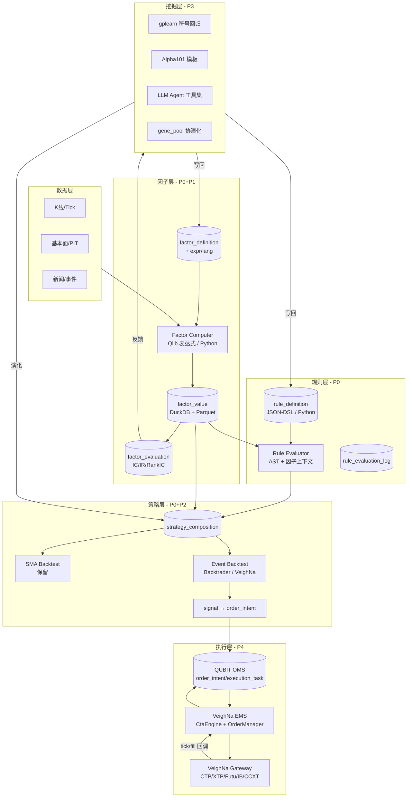
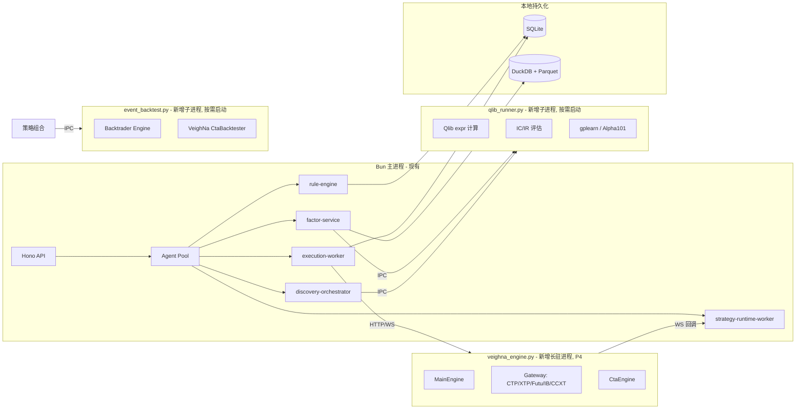
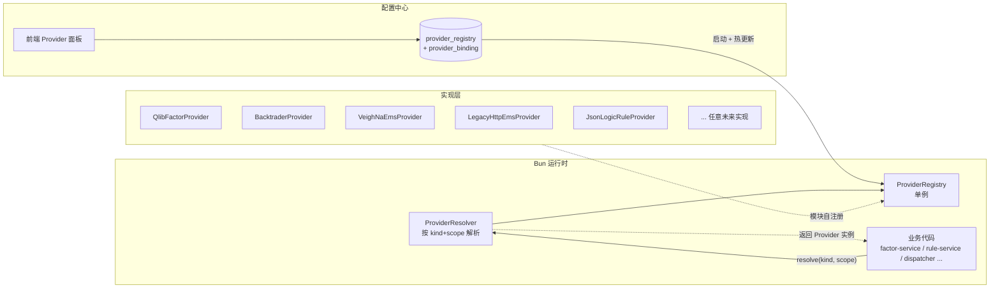
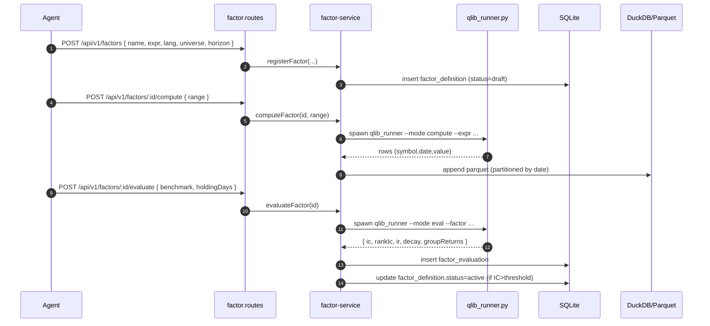
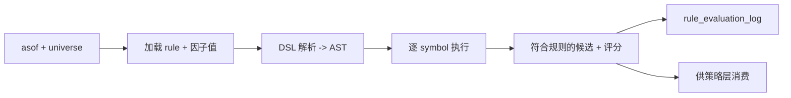
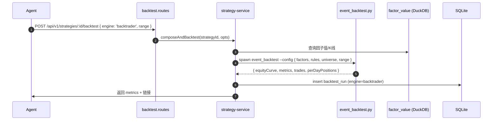
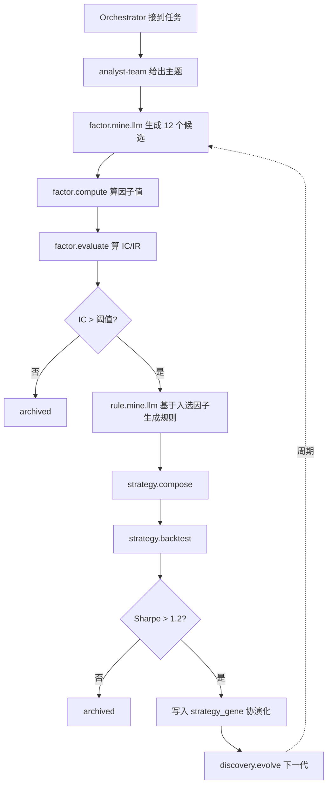
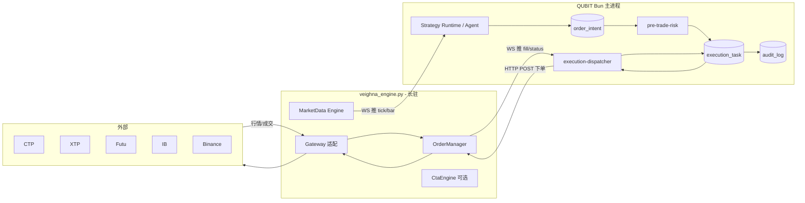
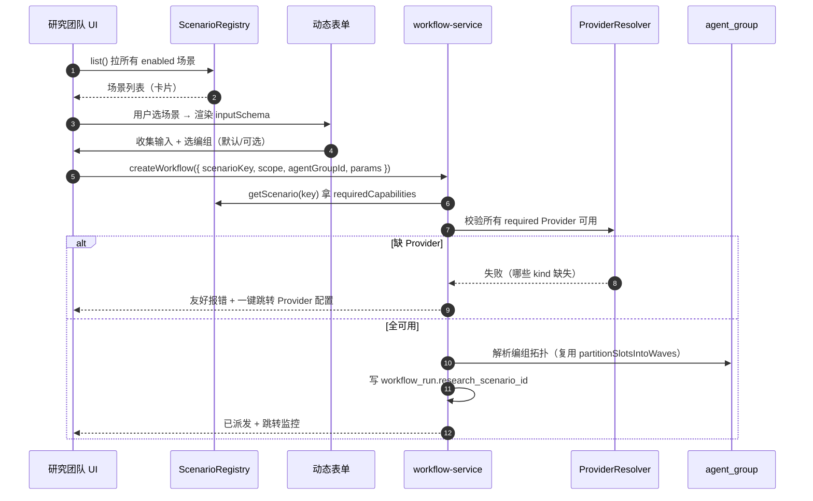
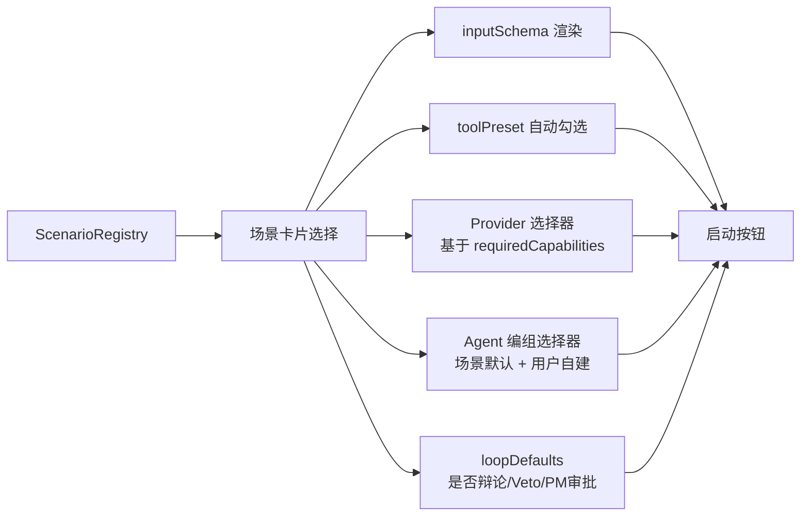

# QUBIT Agent - 因子/规则/策略 + 实时引擎接入 技术方案

| 文档状态 | 草稿 |
|----------|------|
| 版本 | v0.1 |
| 作者 | QUBIT Platform Team |
| 更新日期 | 2026-05-20 |
| 关联文档 | [`QUANT_READINESS_ASSESSMENT.md`](./QUANT_READINESS_ASSESSMENT.md)、[`ARCHITECTURE.md`](./ARCHITECTURE.md) |

> 本方案在 `QUANT_READINESS_ASSESSMENT.md` 的差距评估之上，给出 **因子–规则–策略** 三段式模块设计、**Agent 挖掘** 闭环、以及 **VeighNa 实时引擎** 接入方案，覆盖路线图 P0–P4。

---

## 前言

本方案适用，原因如下：

- 跨 schema / runtime / connector / 前端多模块，**研发工作量明显超过 2 人日**
- 引入 Microsoft Qlib、Backtrader/VeighNa 两类外部依赖，影响面广
- 直接决定项目从「研究台 + 简易执行」是否能升级到「因子驱动 + 事件驱动实盘」

---

## 一、背景

### 1.1 业务需求

- 用户希望 QUBIT 不仅能让 Agent **写策略脚本**，还能像量化公司一样 **拥有因子库、规则库、策略库** 三层资产并支持 **Agent 自动挖掘**
- 用户希望具备 **事件驱动实盘** 能力，能接入主流券商而不必每家自研

### 1.2 技术现状（基于现有代码核对）

| 层 | 现状 | 关键代码 |
|----|------|----------|
| 策略 | 只有「单股 Python 信号脚本」一种形态，30s 轮询日线 | `src/runtime/strategy/strategy-runtime-worker.ts`、`signal-evaluator.ts` |
| 因子 | 仅有 `factor_definition` 表骨架（name + category + definitionJson），**没有因子值仓库、没有计算管线、没有 IC/IR 评估** | `src/db/sqlite/schema.ts` L739 |
| 规则 | 散落在 `pre-trade-risk.ts`（风控 JSON）+ `veto-engine`（启发式）+ `stock-screener.ts`（写死公式），**无统一 DSL** | 同上 |
| 挖掘 | `gene_pool.ts` 仅演化 4 个固定权重（factorWeightMomentum/Value/stopLoss/takeProfit），**非真正的因子/规则发现** | `src/runtime/gene/gene-pool.ts` |
| 回测 | `backtest-engine.ts` 单股 SMA，bar-by-bar 简化版，**非事件驱动、无滑点冲击、无组合** | `src/runtime/market/backtest-engine.ts` |
| 实盘 | `order_intent → execution_task → execution-dispatcher → python_connectors/broker_http_server.py`，**HTTP 轮询、无 tick 推送** | `src/runtime/execution/execution-dispatcher.ts` |

### 1.3 预期收益

- **能力升级**：从「单股脚本 + 日线回测 + 纸交易」升级到「因子+规则+策略三段式 + 事件驱动回测 + tick 级实盘」
- **降低自研成本**：复用 Qlib（因子+IC 评估）、Backtrader/VeighNa（事件驱动回测+多券商 Gateway），节省 6–12 个月自研投入
- **强化 Agent 差异化**：Agent 不再只是写脚本，能 **挖掘因子、生成规则、组合策略、协演化**，形成「研究 → 入库 → 演化 → 上线」闭环
- **对齐机构架构**：满足 `QUANT_READINESS_ASSESSMENT.md` §5 的目标分层（OMS = QUBIT、EMS = VeighNa）
- **可插拔架构（强制要求）**：所有外部能力（因子计算、规则引擎、回测引擎、实盘 EMS、行情源、LLM）**必须**通过 Provider 接口隔离，无论实现是自研、开源还是商业，都能在**配置中心**一键切换、并存或灰度，不绑死任何具体实现。详见 §5.4。
- **研究场景化（新增）**：研究团队从「分析辩论 + 策略撰写」两种场景扩展为多场景研究台——**分析辩论 / 策略撰写 / 因子研究 / 规则研究 / 选股研究 / 风控审查 / PM 组合管理 / 因子规则挖掘 / 实盘交易 / 复盘归因** 等专业场景；每个场景对应自己的 **Agent 编组 + 工具预设 + 输入/输出契约 + Provider 能力要求**，由配置中心驱动，详见 §6.6。

---

## 二、名词解释

| 名词 | 释义 |
|------|------|
| Factor / 因子 | 把行情/财务/新闻映射成 `(symbol, date) → value` 的标量函数，是策略的最小可复用单元 |
| Rule / 规则 | `when (条件) → score/order (动作)` 形式的可解释决策片段，使用 JSON-DSL 或 Python 描述 |
| Strategy / 策略 | 因子组合 + 规则编排 + 参数 + 回测/实盘配置的完整可执行单元 |
| Qlib | Microsoft 开源的 AI 量化研究平台，自带 Alpha158/Alpha360 因子集、表达式引擎、IC/IR 评估 |
| VeighNa（vn.py） | 国内主流开源量化框架，覆盖 CTP/XTP/华鑫奇点/Futu/IB/CCXT 等十余种 Gateway 与事件驱动回测 |
| Backtrader | Python 经典事件驱动回测库，社区活跃，适合策略原型 |
| gplearn | 基于遗传规划（GP）的符号回归库，用于因子公式挖掘 |
| Alpha101 | World Quant 公开的 101 个 alpha 因子模板，可程序化复现 |
| IC / RankIC / IR | 因子有效性指标：信息系数、秩相关、信息比率 |
| PIT（Point-In-Time） | 财务/基本面数据按"当时可获取"形态存储，防止前视偏差 |
| OMS / EMS | Order / Execution Management System——管订单生命周期 vs 管成交质量 |
| Feature Store | 因子值存储层（本方案用 DuckDB + Parquet 列存实现） |

---

## 三、产研协作信息

| 项 | 内容 |
|----|------|
| 文档状态 | 草稿 |
| 相关文档 | `QUANT_READINESS_ASSESSMENT.md`、`ARCHITECTURE.md`、`LOOP_DRIVERS.md` |
| 产品 | QUBIT Platform Team |
| 需求技术 owner | Platform Lead |
| 服务端 | `src/runtime/*`（Bun + TS）、`python_connectors/*`（Python 子进程/长驻进程） |
| 前端 | `frontend/src/components/`（IDE / 配置中心 / 监控） |
| 外部依赖方 | Microsoft Qlib、Backtrader、VeighNa、gplearn |
| 测试 | 单元测试随各模块；事件驱动回测对齐 paper/live 语义；实盘走 `QUBIT_LIVE_TRADING_ENABLED` 闸门 |

---

## 四、需求分析

### 4.1 功能影响范围

| 类型 | 影响项 | 变更说明 |
|------|--------|----------|
| 模块/服务 | `src/runtime/research-scenario/`（新增） | 研究场景注册中心、场景 → 编组/工具/Provider 解析 |
| 模块/服务 | `src/runtime/factor/`（新增） | 因子注册/计算/评估服务 |
| 模块/服务 | `src/runtime/rule/`（新增） | 规则 DSL 解析与评估器 |
| 模块/服务 | `src/runtime/discovery/`（新增） | 因子/规则挖掘流水线 |
| 模块/服务 | `src/runtime/strategy/` | 扩 `strategy.kind`：`script` → +`factor_score` / `rule` / `hybrid` |
| 模块/服务 | `src/runtime/market/backtest-engine.ts` | 增加事件驱动回测通道（保留旧 SMA 作 fallback） |
| 模块/服务 | `src/runtime/execution/execution-dispatcher.ts` | 增加 `live_veighna` 派发模式 |
| 模块/服务 | `python_connectors/` | 新增 `qlib_runner.py`、`event_backtest.py`、`veighna_engine.py` |
| 接口 | 内置工具（builtin-tools） | 新增 `factor.*`、`rule.*`、`discovery.*`、`strategy.compose/backtest` 系列 |
| 接口 | Connector | 新增 `qubit-quant-research`（封装上述工具暴露给 Agent） |
| 接口 | REST | 新增 `/api/v1/factors/*`、`/api/v1/rules/*`、`/api/v1/strategies/compose`、`/api/v1/discovery/*` |
| 数据表 | SQLite | 扩 `factor_definition`；新增 `rule_definition`、`rule_evaluation_log`；扩 `strategy.kind` |
| 数据表 | DuckDB / Parquet | 新增 `factor_value`、`factor_evaluation`（列存，按 date 分区） |
| 配置/开关 | 环境变量 | `QUBIT_QLIB_PROVIDER_URI`、`QUBIT_QLIB_REGION`、`QUBIT_VEIGHNA_ENABLED`、`QUBIT_VEIGHNA_GATEWAY` 等 |
| 前端 | 配置中心 | 新增「因子库 / 规则库 / 策略组合」面板；策略详情页增加 `kind` 切换 |

### 4.2 问题拆解

1. **因子层缺失** — 没有"计算→入库→评估→打分"的标准管线
   - 子问题 1.1：因子定义如何统一表达（Qlib expr / Python / SQL / JSON）
   - 子问题 1.2：因子值如何高效存储与查询（列存 / 分区）
   - 子问题 1.3：因子质量如何标准化评估（IC / RankIC / IR / 衰减 / 换手）
   - 子问题 1.4：Qlib 进程如何与 Bun 主进程集成且可监控

2. **规则层缺失** — 没有"Agent 可读写、可解释、可演化"的规则承载
   - 子问题 2.1：规则 DSL 选型（自研轻量 JSON-DSL vs 借 jsonlogic vs 直接 Python AST）
   - 子问题 2.2：规则评估器如何与因子上下文耦合
   - 子问题 2.3：规则结果如何可视化、可审计

3. **策略层升级** — 现状只支持脚本，未支持「多因子+规则」组合
   - 子问题 3.1：`strategy.kind` 如何扩展且向下兼容
   - 子问题 3.2：组合策略如何生成可执行的 `signal`（与现有 `signal-evaluator.ts` 适配）

4. **挖掘层从无到有** — Agent 如何"挖因子、挖规则、挖策略"
   - 子问题 4.1：开源挖掘工具的接入方式（gplearn / Alpha101 / AlphaGen）
   - 子问题 4.2：LLM 生成的表达式如何安全 sandbox 评估并入库
   - 子问题 4.3：如何复用 `gene_pool` 让"因子集/规则集/参数"共同协演化

5. **回测层升级** — 从 SMA 简版到事件驱动
   - 子问题 5.1：Backtrader vs VeighNa CtaBacktester 选型
   - 子问题 5.2：与现有 `backtest-job-runner` 如何共存
   - 子问题 5.3：paper 仿真器如何与 live 语义对齐

6. **实盘事件驱动** — 从 HTTP 轮询日线到 tick 推送
   - 子问题 6.1：VeighNa 进程如何与 Bun 主进程通信（IPC / WebSocket）
   - 子问题 6.2：QUBIT 的 OMS 边界与 VeighNa 的 EMS 边界如何划分
   - 子问题 6.3：strategy-runtime-worker 如何从轮询模型升级为事件回调模型

### 4.3 数据库表结构变更

| 表名 | 变更类型 | 字段/索引 | 说明 |
|------|----------|-----------|------|
| `factor_definition` | 修改 | 新增 `expr text`、`lang enum('qlib_expr','python','sql','jsonlogic')`、`universe text`、`horizon integer`、`status enum('draft','active','archived')` | 让因子可表达、可寻址 |
| `factor_value` | 新增（DuckDB / Parquet） | `(factor_id, symbol, date, value)`，按 `date` 分区 | 不进 SQLite，避免行数爆炸 |
| `factor_evaluation` | 新增（SQLite） | `id, factor_id, asof, universe, ic, rank_ic, ir, turnover, decay_curve_json, group_returns_json, sample_size, created_at` | 因子质量留痕 |
| `rule_definition` | 新增（SQLite） | `id, project_id, name, lang enum('jsonlogic','python'), dsl_json, applies_to enum('select','filter','score','order','risk'), status, created_at` | 规则库 |
| `rule_evaluation_log` | 新增（SQLite） | `id, rule_id, asof, input_hash, output_json, latency_ms, error, created_at` | 评估留痕，方便 debug 与归因 |
| `strategy` | 修改 | `kind` 枚举追加 `factor_score`/`rule`/`hybrid` | 兼容现有 `low_freq/mid_freq/...` style 字段 |
| `strategy_composition` | 新增（SQLite） | `id, strategy_version_id, factor_ids_json, rule_ids_json, weight_method, rebalance_freq, universe, params_json` | 描述"因子+规则"如何组合 |
| `discovery_job` | 新增（SQLite） | `id, project_id, kind enum('factor_gp','factor_llm','rule_llm','genome_evolve'), input_json, output_json, status, started_at, ended_at` | 挖掘任务编排留痕 |
| `veighna_session` | 新增（SQLite，选填） | `id, gateway, account_ref, status, last_heartbeat_at, error` | VeighNa 进程连接状态 |
| `provider_registry` | 新增（SQLite） | `id, kind enum('factor_compute','factor_eval','rule_engine','backtest','live_ems','market_data','llm'), provider_key, display_name, capability_json, status enum('enabled','disabled'), priority, config_json, created_at, updated_at` | **Provider 注册中心**：所有外部能力的实现统一登记，配置中心读写，runtime 按 kind+priority 选型，见 §5.4 |
| `provider_binding` | 新增（SQLite） | `id, scope enum('project','workflow','strategy_version','global'), scope_id, kind, provider_id, params_json, created_at` | Provider 与业务对象的绑定，支持 project/strategy 粒度切换 |
| `research_scenario` | 新增（SQLite） | `id, key, display_name, description, default_agent_group_id, input_schema_json, output_contract_json, required_capabilities_json, tool_preset_json, loop_defaults_json, status, sort_order, created_at, updated_at` | **研究场景注册中心**，详见 §6.6 |
| `research_scenario_group` | 新增（SQLite） | `id, scenario_id, agent_group_id, is_default, sort_order` | 同一场景可绑定多个编组（轻量 / 深度 / 用户自建） |
| `workflow_run` | 修改 | 新增列 `research_scenario_id text` | 让一次研究 workflow 携带场景标签，便于产物归类与监控 |

迁移文件：`src-tauri/resources/bundle/db/migrations/0035_factor_rule_strategy.sql` 起依次新增。**所有 schema 变更必须 backward compatible**：旧 `strategy.kind` 默认 `script`、旧因子定义 `lang` 默认 `python`。

---

## 五、总体设计

### 5.1 技术调研 & 候选方案对比

#### 5.1.1 因子库 / 因子计算

| 方案 | 优点 | 缺点 | 适用条件 |
|------|------|------|----------|
| A. 自研 Python 表达式引擎 | 完全可控 | 6+ 个月自研，IC 评估等还要再做一遍 | 团队 ≥ 3 人专投 |
| B. **Microsoft Qlib**（选定） | 自带 Alpha158/360、表达式引擎、IC/IR/decay、AI 模型接口；社区活跃；A 股优先 | 进程边界与 Bun 主程序的通信成本 | 想快速形成机构级研究台 |
| C. Alphalens + 自研计算 | IC 评估业界标准 | 计算层还要自己写 | 已经有自己的因子计算 |

**选定 B**。**依据**：Qlib 的表达式 DSL（`Mean($close, 20) / $close - 1`）天然适合 LLM 生成与解释；Alpha158/360 立刻可用；评估管线完整；与我们 Python 子进程模式兼容。

#### 5.1.2 规则引擎

| 方案 | 优点 | 缺点 | 适用条件 |
|------|------|------|----------|
| A. Drools / OpenL Tablets | 工业级 | Java，过重；不利于 Agent 读写 | 大型企业 BPM |
| B. json-rules-engine / GoRules | 轻量 JS 库 | 缺少与因子上下文的耦合；缺 Python 表达力 | 纯前端规则 |
| C. **自研轻量 DSL（JSONLogic 子集 + Python 双形态）**（选定） | Agent 可读写；可演化；与因子无缝；二进制小 | 自研 = 自维护 | 我们的差异化场景 |

**选定 C**。**依据**：本方案核心差异化是「Agent 挖规则」，规则必须**对 LLM 友好**——JSONLogic 子集天然符合 LLM 生成 schema，Python 形态留作进阶。开源规则引擎都偏 BPM/审批场景。

#### 5.1.3 事件驱动回测

| 方案 | 优点 | 缺点 | 适用条件 |
|------|------|------|----------|
| A. **Backtrader**（首选） | 老牌、文档完善、单机即可、与 pandas/qlib 互通 | 多资产组合略弱；不再积极维护 | 策略原型 + 中频 |
| B. **VeighNa CtaBacktester**（次选） | 与实盘 Gateway 共用模型、可向 CTP/股票/期货统一迁移 | 文档相对中文化偏多 | 想回测与实盘语义完全一致 |
| C. Nautilus Trader | Rust 内核、低延迟、多市场 | 学习曲线陡 | 机构级、有专人投入 |
| D. Zipline-reloaded | Quantopian 系；分钟级 OK | 国内行情接入麻烦 | 美股研究 |

**选定 A + B 共存**：日常研究走 Backtrader；走 VeighNa 实盘的策略可直接用 VeighNa Bt 做"上线前最后一轮回测"，避免回测/实盘语义偏差。

#### 5.1.4 实盘 EMS / Gateway

| 方案 | 优点 | 缺点 | 适用条件 |
|------|------|------|----------|
| A. 继续扩 `python_connectors/broker_http_server.py` | 现状 | 每加一家券商写一份适配 + 没有 tick 推送 | 临时方案 |
| B. **VeighNa 长驻进程**（选定） | CTP/XTP/华鑫/Futu/IB/CCXT 全有；事件驱动；社区活跃 | 增加一个 Python 进程依赖 | 国内 + 多市场 |
| C. Nautilus Trader | Rust 内核、低延迟 | A 股 Gateway 偏少 | 海外 + 低延迟 |
| D. 自研每家适配 | 全可控 | 工作量 12+ 月 | 不推荐 |

**选定 B**。**依据**：QUBIT 的 OMS（`order_intent`/`execution_task`）保留作为权威账本，VeighNa 只承担 EMS+Gateway 职责；后续若有低延迟需求再切 Nautilus。

#### 5.1.5 因子挖掘

| 方案 | 优点 | 缺点 | 适用条件 |
|------|------|------|----------|
| A. **gplearn + Alpha101 模板 + LLM 生成（多通道并行）**（选定） | 覆盖"统计挖掘 / 模板复用 / 创造性表达式" | 多套工具协同 | 我们的 Agent 编排正擅长这种 |
| B. AlphaGen（RL 生成 Qlib 表达式） | 论文级先进 | 训练成本高；研究性偏强 | 团队有研究投入 |
| C. AutoML 库（FeatureTools 等） | 标准化 | 偏特征工程，非 alpha 因子 | 数据科学场景 |

**选定 A**，**AlphaGen 留作 P5 可选**。**依据**：让 Agent 编排"统计 + 模板 + 创造性"三种来源，结果统一进 `factor_evaluation` 决定优胜劣汰。

### 5.2 总体架构



### 5.3 部署形态（进程视角）



### 5.4 可扩展性与 Provider 抽象（架构强制原则）

> **本节为强制约束**：本方案中所有涉及"外部能力"的模块——因子计算、因子评估、规则引擎、回测引擎、实盘 EMS、行情源、LLM——其代码组织必须遵循 Provider 抽象，**不允许**任何模块直接 import / 调用具体实现（如 Qlib、VeighNa、Backtrader）。所有具体实现都通过 Provider 接口注入，**可在配置中心切换、并存、灰度**。

#### 5.4.1 设计目标

| 目标 | 具体含义 |
|------|----------|
| **不绑定具体实现** | 今天用 Qlib，明天换 AlphaForge 或自研；今天用 VeighNa，明天换 Nautilus；切换不动业务代码 |
| **多 Provider 并存** | 同一类能力可注册多个实现（如 Backtrader + VeighNa Bt 同时存在），按项目/策略/回测任务独立选择 |
| **配置中心驱动** | 启用/禁用、优先级、参数全部在配置中心（DB + 前端面板），**不**通过改代码 |
| **AB / 灰度** | 同一策略可在两个 Provider 上并行跑做对比；新 Provider 默认 `disabled`，灰度后才 enable |
| **能力声明** | 每个 Provider 必须声明 `capabilityJson`（支持哪些操作、哪些资产类型、性能等级），业务侧按能力路由 |
| **Provider 自治** | Provider 内部实现可换语言/进程/远程，只要满足契约（TS interface / Proto / JSON Schema） |

#### 5.4.2 Provider 矩阵（首发覆盖）

| 能力 `kind` | 内置 Provider（首发） | 计划接入 | 备选 / 未来 |
|------------|----------------------|----------|------------|
| `factor_compute` | `qlib`、`python_inline`（沙箱跑用户脚本） | `sql_duckdb`（用 SQL 写因子） | 自研 vectorized 引擎 / AlphaForge |
| `factor_eval` | `qlib_alphalens`（Qlib 内置）、`builtin`（轻量 IC/IR 计算） | — | Alphalens 单独版 |
| `rule_engine` | `jsonlogic`（自研轻量）、`python_sandbox` | — | `json_rules_engine`（npm 库适配） |
| `backtest` | `sma_legacy`（保留旧 SMA）、`backtrader` | `veighna_bt`、`qlib_bt` | Nautilus、Zipline-reloaded |
| `live_ems` | `legacy_http`（现有 `broker_http_server.py`） | `veighna` | Nautilus、自研直连 |
| `market_data` | `legacy_rest`（现有多源 K 线） | `veighna_md`（tick 推送） | CCXT Pro、QMT XTQuant |
| `llm` | `openai`、`anthropic`、`local_ollama`（现有） | — | 任何 OpenAI-compatible 端点 |
| `factor_miner` | `gplearn`、`alpha101_template`、`llm_generator` | — | AlphaGen（RL） |

#### 5.4.3 统一 Provider 接口（TypeScript 契约）

所有 Provider 实现一个统一基接口，再各自实现领域子接口：

```typescript
export interface ProviderMeta {
  readonly kind: ProviderKind;
  readonly key: string;
  readonly displayName: string;
  readonly capability: {
    supportedAssetClasses: Array<"stock" | "future" | "option" | "crypto" | "fx">;
    supportedUniverses: string[];
    features: string[];
  };
  readonly version: string;
}

export interface Provider {
  meta: ProviderMeta;
  healthCheck(): Promise<{ ok: boolean; latencyMs?: number; error?: string }>;
  init?(config: Record<string, unknown>): Promise<void>;
  dispose?(): Promise<void>;
}

export interface FactorComputeProvider extends Provider {
  compute(input: FactorComputeRequest): Promise<FactorComputeResult>;
  validateExpr(expr: string, lang: string): Promise<{ ok: boolean; error?: string }>;
}

export interface FactorEvaluationProvider extends Provider {
  evaluate(input: FactorEvalRequest): Promise<FactorEvaluationResult>;
}

export interface RuleEngineProvider extends Provider {
  parse(dsl: unknown, lang: string): Promise<{ ok: boolean; ast?: unknown; error?: string }>;
  evaluate(rule: RuleDefinition, ctx: RuleEvalContext): Promise<RuleEvalResult>;
}

export interface BacktestProvider extends Provider {
  run(input: BacktestRequest): Promise<BacktestResult>;
  cancel(jobId: string): Promise<void>;
}

export interface LiveEmsProvider extends Provider {
  placeOrder(req: PlaceOrderRequest): Promise<PlaceOrderResult>;
  cancelOrder(req: CancelOrderRequest): Promise<void>;
  replaceOrder?(req: ReplaceOrderRequest): Promise<void>;
  getPositions(accountRef: string): Promise<PositionSnapshot[]>;
  subscribeOrderflow(callback: OrderflowCallback): Promise<{ unsubscribe: () => void }>;
}

export interface MarketDataProvider extends Provider {
  queryBars(req: BarQuery): Promise<BarData[]>;
  subscribeTicks?(symbols: string[], cb: TickCallback): Promise<{ unsubscribe: () => void }>;
  subscribeBars?(symbols: string[], period: string, cb: BarCallback): Promise<{ unsubscribe: () => void }>;
}
```

#### 5.4.4 Provider 注册与解析



**解析优先级**（高 → 低）：

1. 显式参数（API 调用时指定 `providerId`）
2. `provider_binding.scope='strategy_version'`
3. `provider_binding.scope='workflow'`
4. `provider_binding.scope='project'`
5. `provider_binding.scope='global'`
6. `provider_registry` 中 `status=enabled` 且 `priority` 最高的同 kind Provider
7. 内置 fallback（如 `sma_legacy`、`legacy_http`）

**关键代码（草案）**：

```typescript
export class ProviderRegistry {
  register<T extends Provider>(provider: T): void;
  unregister(key: string): void;
  list(kind: ProviderKind, filter?: { status?: "enabled" | "disabled" }): ProviderMeta[];
  get<T extends Provider>(key: string): T | null;
  reload(): Promise<void>;
}

export class ProviderResolver {
  resolve<T extends Provider>(
    kind: ProviderKind,
    scope: { projectId?: string; workflowRunId?: string; strategyVersionId?: string },
    override?: { providerId?: string }
  ): Promise<T>;
}

export const providerRegistry: ProviderRegistry;
export const providerResolver: ProviderResolver;
```

**目录布局（新增）**：

```text
src/runtime/provider/
  types.ts                  # ProviderKind / ProviderMeta / 各子接口
  registry.ts               # ProviderRegistry 单例 + DB 同步
  resolver.ts               # 解析优先级实现
  bootstrap.ts              # 启动时注册内置 Provider
  impls/
    factor/
      qlib-factor-provider.ts
      python-inline-factor-provider.ts
    rule/
      jsonlogic-rule-provider.ts
      python-sandbox-rule-provider.ts
    backtest/
      sma-legacy-backtest-provider.ts
      backtrader-backtest-provider.ts
      veighna-bt-backtest-provider.ts
    live-ems/
      legacy-http-ems-provider.ts
      veighna-ems-provider.ts
    market-data/
      legacy-rest-md-provider.ts
      veighna-md-provider.ts
```

#### 5.4.5 配置中心：能切换什么

| 操作 | 入口 | 影响范围 | 是否需要重启 |
|------|------|----------|-------------|
| 启用 / 禁用 Provider | 前端「Provider 管理」面板 | 全局 | 否（registry 热重载） |
| 调整 Provider 优先级 | 同上 | 全局 | 否 |
| 为某项目绑定特定 Provider | 项目设置 → Provider 绑定 | 该项目所有 workflow | 否 |
| 为某策略版本绑定特定 Provider | 策略详情页 → 高级 | 该策略 | 否 |
| 设置某次回测使用的 Provider | 触发回测时 UI 下拉选 | 单次任务 | 否 |
| 修改 Provider 参数（如 Qlib 数据目录） | Provider 详情页 | 全局 | Provider 实例热重载（调用 `init`） |
| 注册自定义 Provider | 通过插件目录 + Connector 注册 | 全局 | 取决于插件机制 |

#### 5.4.6 强制开发规范

| 规范 | 说明 |
|------|------|
| **禁止直接 import 实现** | 业务模块不允许出现 `import { qlib }` / `import { backtrader }`；必须 `providerResolver.resolve('factor_compute', scope)` |
| **能力声明优先** | 业务代码按 `capability` 路由（如 `if (provider.capability.features.includes('tick_subscribe'))`），不按 `provider.key` 硬编码 |
| **降级链** | 每个 kind 必须有一个 **内置 fallback Provider**（如 `sma_legacy` / `legacy_http`），所有外部 Provider 不可用时业务仍能跑（可能是低保真） |
| **Provider 单元测试** | 同一接口下，所有实现共享一组「契约测试」（contract test），保证语义一致 |
| **审计** | Provider 切换、参数变更必须写 `audit_log`（actor='admin', action='provider_*'） |
| **可观测** | 每个 Provider 必须暴露 `healthCheck()`，监控页定期检查并展示状态 |

#### 5.4.7 验收标准

P0 阶段结束时，必须满足：

1. `ProviderRegistry` + `ProviderResolver` 主体代码完成，**所有新模块通过 Resolver 获取实现**
2. 至少 3 个 kind（`factor_compute` / `rule_engine` / `backtest`）已注册 ≥ 2 个 Provider
3. 前端配置中心可看到 Provider 列表、状态、优先级，可一键切换
4. 一次回测任务在 UI 上能选择 `sma_legacy` 和 `backtrader` 两个 Provider 各跑一次，结果都能落库
5. 关闭 Qlib（`QUBIT_QLIB_ENABLED=false`）后，因子计算自动降级到 `python_inline`，业务不报错

---

## 六、各模块详细设计

### 6.1 因子层（P0 + P1）

**目标**：让"因子"成为一等公民：可注册、可计算、可查询、可评估、可被规则/策略引用。

> **Provider 强制约束**：`FactorService` 不直接调用 Qlib 或任何具体计算实现；所有计算/评估均通过 `providerResolver.resolve('factor_compute' | 'factor_eval', scope)` 拿到 Provider 实例。首发实现包括 `qlib`、`python_inline`，可在配置中心新增/切换。

**流程（注册一个新因子）**：



**目录布局（新增）**：

```text
src/runtime/factor/
  factor-service.ts          # registerFactor / computeFactor / evaluateFactor / queryValue
  factor-store.ts            # DuckDB+Parquet 读写抽象
  qlib-bridge.ts             # 与 qlib_runner.py 子进程通信
python_connectors/
  qlib_runner.py             # 唯一入口：--mode compute|eval|gp ；stdin/stdout JSON
```

**关键接口（TypeScript 草案）**：

```typescript
export interface FactorDefinitionInput {
  projectId: string;
  name: string;
  category: "value" | "momentum" | "volatility" | "news" | "quality" | "macro";
  expr: string;
  lang: "qlib_expr" | "python" | "sql" | "jsonlogic";
  universe: "CN-A" | "US" | "HK" | "Crypto";
  horizon: number;
}

export interface FactorComputeRange {
  symbols?: string[];
  startDate: string;
  endDate: string;
}

export interface FactorEvaluationResult {
  factorId: string;
  asof: string;
  ic: number;
  rankIc: number;
  ir: number;
  turnover: number;
  decayCurve: number[];
  groupReturns: number[];
  sampleSize: number;
}

export class FactorService {
  registerFactor(input: FactorDefinitionInput): Promise<{ factorId: string }>;
  computeFactor(factorId: string, range: FactorComputeRange): Promise<{ rows: number }>;
  evaluateFactor(factorId: string, opts: { holdingDays?: number; benchmark?: string }): Promise<FactorEvaluationResult>;
  queryFactorValue(factorId: string, range: FactorComputeRange): Promise<Array<{ symbol: string; date: string; value: number }>>;
  listFactors(filters: Partial<FactorDefinitionInput> & { status?: string }): Promise<unknown[]>;
}
```

**与现有代码的落点**：

- 复用现有 `src/db/sqlite/schema.ts` L739 的 `factor_definition`，仅 ALTER 加列（迁移 0035）
- 复用 `python_connectors/connector_runner.py` 的子进程模型；新增 `qlib_runner.py` 遵循同样的 stdin/stdout JSON 协议
- `factor-service.ts` 注册成 `qubit-quant-research` Connector 的子工具集

**异常与边界**：

- Qlib 子进程超时 / OOM → 工具层 `executeWithPolicy` 重试一次，失败写 `factor_evaluation.error`
- 表达式语法错误 → 不入库，返回 4xx，给 Agent 可解释报错
- DuckDB 锁冲突 → factor_store 串行化写入
- 因子值为空（停牌、未上市）→ 不写行，不当作 0

### 6.2 规则层（P0）

**目标**：规则 = "**when (条件) → score/order (动作)**"，Agent 可读写、可演化、可解释。

> **Provider 强制约束**：`RuleService` 不绑定 JSONLogic 实现；通过 `providerResolver.resolve('rule_engine', scope)` 拿 `RuleEngineProvider`。首发 `jsonlogic` + `python_sandbox`，未来可接 json-rules-engine、Drools-thin 等。

**DSL 草案（JSONLogic 子集 + 因子原语）**：

```jsonc
{
  "id": "rule_value_momentum_combo",
  "applies_to": "score",
  "lang": "jsonlogic",
  "when": {
    "and": [
      { "lt": [{ "factor": "pe_ttm" }, 30] },
      { "gt": [{ "factor": "mom_20" }, 0.05] },
      { "gt": [{ "factor": "amount_20" }, 1e8] },
      { "in": [{ "var": "industry" }, ["consumer", "tech"]] }
    ]
  },
  "score": {
    "weighted_sum": [
      { "factor": "mom_20", "w": 0.5 },
      { "factor": "quality", "w": 0.3 },
      { "factor": "low_vol_60", "w": 0.2 }
    ]
  },
  "order": { "top_n": 30, "weight": "rank_ic_weighted" }
}
```

**Python 形态（保底，给复杂规则）**：

```python
def rule(ctx):
    if ctx["pe_ttm"] < 30 and ctx["mom_20"] > 0.05:
        return {"score": 0.5 * ctx["mom_20"] + 0.3 * ctx["quality"]}
    return None
```

**评估器流程**：



**目录布局（新增）**：

```text
src/runtime/rule/
  rule-service.ts          # registerRule / evaluateRule / listRules
  rule-ast.ts              # JSON-DSL 解析 + 操作符注册表
  rule-evaluator.ts        # 与 factor-service 配合做截面评估
  rule-python-runner.ts    # Python 形态评估（走 sandbox 子进程）
```

**关键接口**：

```typescript
export interface RuleDslInput {
  projectId: string;
  name: string;
  appliesTo: "select" | "filter" | "score" | "order" | "risk";
  lang: "jsonlogic" | "python";
  dsl: Record<string, unknown> | string;
}

export interface RuleEvalContext {
  asof: string;
  universe: string;
  factorIds: string[];
}

export interface RuleEvalResult {
  symbols: Array<{ symbol: string; passed: boolean; score?: number; payload?: unknown }>;
  metrics: { latencyMs: number; sampleSize: number };
}

export class RuleService {
  registerRule(input: RuleDslInput): Promise<{ ruleId: string }>;
  evaluateRule(ruleId: string, ctx: RuleEvalContext): Promise<RuleEvalResult>;
}
```

**异常与边界**：

- DSL 校验失败 → 注册时直接 4xx；不允许"运行时再爆"
- 因子值缺失 → 当 NaN，规则评估时按 `null-safe` 短路
- Python 形态走 `sandboxExecutor`，超时 5s

### 6.3 策略层（P0 + P2）

**目标**：扩展 `strategy.kind`，让"因子+规则"可以组合成可执行策略；事件驱动回测替换 SMA 简版。

> **Provider 强制约束**：回测能力通过 `providerResolver.resolve('backtest', scope)` 选定 `BacktestProvider`。首发 `sma_legacy` / `backtrader` / `veighna_bt`，触发回测的 API/UI 允许显式指定 `providerId`；不指定时按 §5.4.4 优先级解析。`backtest_run` 表追加 `provider_id` 列做留痕。

**新增策略类型**：

| kind | 描述 | 信号生成方式 |
|------|------|--------------|
| `script` | 保留现状 | `signal-evaluator.ts` 跑 Python 脚本 |
| `factor_score` | 选 N 个因子 + 权重 + 选股域 | `factor-service` 查值 → 截面排序 → 取 Top N |
| `rule` | 引用一组 `rule_definition` | `rule-service` 评估 → 候选 + 评分 |
| `hybrid` | 因子打分 + 规则过滤 + LLM 解释 | 三段串联 |

**`strategy_composition` 表语义**：

```jsonc
{
  "strategy_version_id": "...",
  "factor_ids_json": ["fid_mom_20", "fid_value_pe", "fid_quality"],
  "rule_ids_json": ["rid_liquidity_filter"],
  "weight_method": "rank_ic_weighted",
  "rebalance_freq": "1d",
  "universe": "CN-A:hs300",
  "params_json": { "top_n": 30, "rebalance_window": "close" }
}
```

**事件驱动回测流程**：



**目录布局（新增/修改）**：

```text
src/runtime/strategy/
  strategy-composer.ts       # 新增：把 factor_ids + rule_ids 编排成 signal
  signal-evaluator.ts        # 保留：script kind 走旧逻辑
src/runtime/market/
  backtest-engine.ts         # 保留：SMA fallback
  backtest-job-runner.ts     # 改造：按 strategy.kind 路由到 Backtrader/VeighNa Bt
python_connectors/
  event_backtest.py          # 新增：--engine backtrader|veighna ；stdin/stdout JSON
```

**异常与边界**：

- 事件驱动子进程超时 → 默认 10 分钟，超过判失败
- 回测结果落 `backtest_run.performanceJson`（已有表），增加 `engine` 字段标识引擎
- 旧 SMA `runSmaCrossoverBacktest` 保留并仍能跑，作为最简健康检查

### 6.4 挖掘层（P3）

**目标**：让 Agent 通过工具集自动产出因子/规则/策略候选，并自动入库 + 评估 + 协演化。

> **Provider 强制约束**：`factor.mine.*` / `rule.mine.*` 各自走 `providerResolver.resolve('factor_miner' | 'rule_miner', scope)`。首发 `gplearn` / `alpha101_template` / `llm_generator`；AlphaGen、RL 因子生成等未来实现按相同 `FactorMinerProvider` 契约接入即可，挖掘流水线代码无需改动。

**Agent 工具集（注册到 `qubit-quant-research` connector）**：

```text
factor.register(input)
factor.compute(factorId, range)
factor.evaluate(factorId, opts)
factor.mine.gp({ seedFactors, targetIc, populationSize, generations })
factor.mine.alpha101({ category, sampleSize })
factor.mine.llm({ theme, seedExpressions, count })

rule.register(input)
rule.evaluate(ruleId, ctx)
rule.mine.llm({ availableFactors, theme, count })

strategy.compose({ factorIds, ruleIds, weightMethod, universe })
strategy.backtest({ strategyId, engine, range })
strategy.promote(strategyId)       # 通过门槛 → 进 strategy-runtime-worker

discovery.evolve({ projectId, populationSize, fitnessFn })
discovery.rankByIC({ universe, asof })
```

**典型挖掘 workflow**：



**与 `gene_pool` 现有代码的复用**：

- `src/runtime/gene/gene-pool.ts` 当前演化 4 个固定权重 → 改成演化 `strategy_gene.gene_type ∈ {factor_id, rule_id, weight, threshold}`，**`evolveFromGeneration` 算法不变**
- `genesSnapshotJson` 升级为完整的 `strategy_composition` 快照
- `applyBacktestResult` 改成读取 `backtest_run.performanceJson` 的 Sharpe/MaxDD/TotalReturn

**目录布局（新增）**：

```text
src/runtime/discovery/
  discovery-service.ts         # 编排：因子挖掘 → 规则挖掘 → 策略组合 → 回测 → 协演化
  factor-miner-gp.ts           # 调 qlib_runner --mode gp
  factor-miner-llm.ts          # 调 LLM 生成 Qlib 表达式 + 自动入库
  factor-miner-alpha101.ts     # 模板化生成 101 因子
  rule-miner-llm.ts            # LLM 看 factor list → 生成 JSONLogic
  gene-evolve.ts               # 复用 gene-pool.ts，扩展演化对象
```

**异常与边界**：

- LLM 生成的表达式 → 必须先过 Qlib 语法校验 + dry-run（前 30 天）才落库
- 挖掘任务可中断 → `discovery_job.status` 支持 `cancelled`
- 防"刷池"：每代演化前剔除连续 N 代未提升的基因（早停）

### 6.5 实盘事件驱动层（P4）

**目标**：用 VeighNa 长驻进程做 EMS+Gateway，QUBIT 的 `order_intent`/`execution_task` 继续是权威 OMS 账本。

> **Provider 强制约束**：`execution-dispatcher.ts` 不直接 import VeighNa 客户端；通过 `providerResolver.resolve('live_ems', { brokerAccountId })` 拿 `LiveEmsProvider`。首发 `legacy_http`（现有 broker_http_server）+ `veighna`，未来 Nautilus / 自研直连按同接口接入。同样 `market_data` kind 提供 `legacy_rest` + `veighna_md`，strategy-runtime-worker 通过 capability 自动决定走轮询还是订阅。

**架构分层**：



**通信协议（HTTP + WebSocket）**：

| 方向 | 协议 | 端点 | 用途 |
|------|------|------|------|
| Bun → VN | HTTP | `POST /vn/order` | 下单（带 idempotency_key） |
| Bun → VN | HTTP | `POST /vn/order/cancel` | 撤单 |
| Bun → VN | HTTP | `GET /vn/positions` | 拉持仓快照（对账用） |
| VN → Bun | WS | `/ws/marketdata` | tick / bar 推送 |
| VN → Bun | WS | `/ws/orderflow` | order ack / fill / reject |

**OMS / EMS 边界**：

| 职责 | QUBIT (OMS) | VeighNa (EMS) |
|------|-------------|---------------|
| Intent 生命周期 | ✓ | ✗ |
| pre-trade risk | ✓ | ✗ |
| 风控签名 (HMAC) | ✓ | ✗ |
| audit_log / 不可篡改 | ✓ | ✗ |
| 直连 Gateway 下单 | ✗ | ✓ |
| tick / fill 订阅 | ✗ | ✓ |
| 改撤、TWAP/VWAP | 调用 | ✓ |
| 行情质量监控 | 消费 | ✓（VN 侧 watchdog） |

**目录布局（新增）**：

```text
src/runtime/execution/
  execution-dispatcher.ts        # 修改：新增 dispatchMode='live_veighna'
  veighna-client.ts              # HTTP + WS 客户端
  veighna-orderflow-listener.ts  # 订阅 fill/status，回写 execution_task / fill 表
python_connectors/
  veighna_engine.py              # 新增长驻进程；启动 MainEngine + 选定 Gateway
  veighna_http_routes.py         # /vn/order /vn/order/cancel /vn/positions
  veighna_ws_server.py           # /ws/marketdata /ws/orderflow
```

**`execution-dispatcher.ts` 改造点**（参照 `src/runtime/execution/execution-dispatcher.ts` L110 `dispatchLiveBroker`）：

- 新增 `dispatchLiveVeighNa(db, input, intent, fillPrice, nowIso)` 分支
- 触发条件：`brokerAccount.provider === 'veighna_ctp'` / `veighna_xtp` / `veighna_futu` 等
- 走 `veighna-client.placeOrder()` 而不是 `connector.submitOrder()`
- Fill / status 通过 `veighna-orderflow-listener` 异步回写，避免阻塞 dispatch

**strategy-runtime-worker 事件驱动改造**：

- 现状（`src/runtime/strategy/strategy-runtime-worker.ts` L226）：30s `setInterval` 拉日线
- P4 改造：订阅 `/ws/marketdata`；收到 bar close 事件 → 触发对应 strategy 的 tick；保留 30s 兜底轮询
- 信号去重 `recordSignalDedup` 不变

**异常与边界**：

- VeighNa 进程异常退出 → `veighna_session.status = error`；DS 自动 fallback 到 `live`（旧 broker_http_server）
- WS 断线 → 自动重连 + 重新订阅；订阅期间错过的 bar 用 HTTP 补齐
- 下单超时 → `order_intent.status` 保持 `submitted`，`execution_task.lastError` 记录；不重复下单（idempotency_key）

### 6.6 研究场景化与编组矩阵（P0 + P1，贯穿全阶段）

**目标**：把研究团队从"分析辩论 + 策略撰写"两种场景，升级为**可扩展的多专业场景研究台**。当前 UI 上的「研究类型」只是研究对象维度（单标的/篮子/板块），缺少 **研究场景维度**——本节正式补齐。

> **设计要点**：场景化与 Provider 抽象（§5.4）正交：
> - **Provider** 决定"用谁的能力"（Qlib / VeighNa / Backtrader …）
> - **Scenario** 决定"做什么研究"（因子研究 / 风控审查 / PM 组合管理 …）
> 一个场景声明它需要哪些 `capability`（如因子研究要 `factor_compute` Provider），Resolver 自动从注册中心拿到当前可用实现。

#### 6.6.1 当前 vs 目标

| 维度 | 当前（基于代码核对） | 目标 |
|------|---------------------|------|
| 研究类型下拉 | 单标的 / 篮子 / 板块（**研究对象**） | 增加**研究场景**维度（独立下拉） |
| 内置 Agent 编组 | 3 个：`DEFAULT_ORCHESTRATION_GROUP` / `FULL_ANALYST_GROUP` / `STRATEGY_PIPELINE_GROUP`（`src/runtime/seed-agent-catalog.ts` L100-172） | 10+ 个，覆盖主流研究场景 |
| Agent 角色定义 | 22 个已声明（`src/types/entities.ts` L39），但 `portfolio_manager` / `risk_manager` / `stock_screener` / `backtest_engineer` 等**没有专门 handler**也没有编组使用 | 为每个新场景实现专门 handler 或复用通用 ReAct，并组进编组 |
| 工具与配置面板 | 一个大面板堆满所有字段（gene、screener、broker、风控混在一起） | 按场景动态渲染表单 + 工具 preset，**专业化** |
| 输入契约 | 只有 `ResearchScopeInput`（标的/工具类型/方向） | 每个场景自带 `inputSchema`（如因子研究要"标的池+目标因子类别+回看窗口"） |
| 产出契约 | 都是 Markdown 报告 + 信号 + 可选策略代码 | 每个场景声明 `outputContract`（因子定义/规则/策略/组合方案/归因报告） |

#### 6.6.2 场景矩阵（首发覆盖）

| 场景 key | 中文名 | 主要 Agent 角色 | 主输出 | 依赖 Provider kind | 对应文档章节 |
|---------|--------|-----------------|--------|---------------------|-------------|
| `analyst_debate` | 分析辩论（已有） | orchestrator + analyst_fundamental/technical/sentiment/macro + researcher_bull/bear | MSA 融合信号 + 多空辩论纪要 | `market_data`、`llm` | 现有 `analyst-team.ts` |
| `strategy_authoring` | 策略撰写（已有） | orchestrator + research + backtest + risk | 可回测策略脚本 / 因子+规则组合 | `backtest`、`factor_compute`（可选）、`rule_engine`（可选） | §6.3 |
| `factor_research` | 因子研究 | orchestrator + research + analyst_fundamental + analyst_technical | `factor_definition` 入库 + IC/IR 报告 | `factor_compute`、`factor_eval` | §6.1 |
| `rule_research` | 规则研究 | orchestrator + research + risk_manager | `rule_definition` 入库 + 评估报告 | `rule_engine`、`factor_compute` | §6.2 |
| `stock_screening` | 选股研究 | orchestrator + stock_screener + analyst_fundamental + analyst_sentiment | 候选股池 + 入选理由 | `factor_compute`、`market_data` | 现有 `stock-screener.ts` + §6.1 |
| `risk_review` | 风控审查 | orchestrator + risk_manager + audit | 风险规则 + 限额建议 + 审计报告 | `rule_engine`、（读）`order_intent` 历史 | §6.2 + 现有 `pre-trade-risk.ts` |
| `portfolio_management` | PM 组合管理 | orchestrator + portfolio_manager + risk_manager + research | 多策略权重 + 再平衡方案 + 暴露报告 | `factor_compute`、`backtest`、（读）`strategy_position_snapshot` | `QUANT_READINESS_ASSESSMENT.md` §3.6 |
| `discovery` | 因子/规则/策略挖掘 | orchestrator + research + backtest_engineer | 候选因子/规则/策略 + 演化谱系 | `factor_miner`、`factor_compute`、`factor_eval`、`backtest` | §6.4 |
| `live_trading` | 实盘交易 | orchestrator + execution_trader + risk_manager | 实盘下单 + 监控 + 风控记录 | `live_ems`、`market_data`、`rule_engine` | §6.5 |
| `postmortem` | 复盘归因 | orchestrator + research + analyst_macro | 归因报告（行业/因子/事件） | `factor_compute`、（读）`backtest_run` + `fill` | 暂无（新增） |
| `news_event_radar` | 事件雷达 | orchestrator + news_event + analyst_sentiment | 事件清单 + 影响评估 + 预警 | `market_data`、`llm` | 现有 `news-brief-query.ts` |

> 用户可在配置中心**自建场景或克隆已有场景**，绑定自定义编组。

#### 6.6.3 场景定义示意（JSON 草案）

```jsonc
{
  "key": "factor_research",
  "displayName": "因子研究",
  "description": "围绕目标因子类别（动量/价值/质量/情绪…），生成候选因子、计算因子值、评估 IC/IR，入库为可复用因子。",
  "defaultAgentGroupId": "grp-factor-research",
  "requiredCapabilities": [
    { "kind": "factor_compute", "level": "required" },
    { "kind": "factor_eval",    "level": "required" },
    { "kind": "market_data",    "level": "required" },
    { "kind": "llm",            "level": "required" }
  ],
  "inputSchema": {
    "universe":        { "type": "enum", "values": ["CN-A:hs300","CN-A:csi500","US:sp500","HK:hsi","Crypto:top50"], "required": true },
    "factorCategory":  { "type": "enum", "values": ["value","momentum","volatility","news","quality","macro"], "required": true },
    "lookbackDays":    { "type": "number", "default": 504, "min": 60, "max": 2520 },
    "horizonDays":     { "type": "number", "default": 5, "min": 1, "max": 60 },
    "icThreshold":     { "type": "number", "default": 0.03 },
    "seedExpressions": { "type": "string[]", "optional": true }
  },
  "outputContract": {
    "primary":  "factor_definition_batch",
    "secondary": ["factor_evaluation_report", "discovery_job_summary"]
  },
  "toolPreset": {
    "builtinTools":  ["factor.register", "factor.compute", "factor.evaluate", "factor.mine.llm", "factor.mine.alpha101"],
    "connectors":    ["qubit-quant-research", "qubit-data"],
    "mcpServers":    [],
    "defaultParams": { "populationSize": 12, "concurrency": 4 }
  },
  "loopDefaults": {
    "maxIterations": 6,
    "reactLoop": true,
    "requireDebate": false,
    "requireRiskVeto": false,
    "requirePmApproval": false
  }
}
```

#### 6.6.4 默认编组（首发新增）

| Group ID | 名称 | 成员（角色） | 备注 |
|----------|------|--------------|------|
| `grp-factor-research`（新增） | 因子研究 | orchestrator, research, analyst_fundamental, analyst_technical | 复用 def-research，新增 def-factor-miner |
| `grp-rule-research`（新增） | 规则研究 | orchestrator, research, risk_manager | risk_manager 现有定义需补 handler |
| `grp-stock-screening`（新增） | 选股研究 | orchestrator, stock_screener, analyst_fundamental, analyst_sentiment | stock_screener 现有 |
| `grp-risk-review`（新增） | 风控审查 | orchestrator, risk_manager, audit | audit 现有但未实装 |
| `grp-portfolio-management`（新增） | PM 组合管理 | orchestrator, portfolio_manager, risk_manager, research | portfolio_manager 现有但未实装 |
| `grp-discovery`（新增） | 因子/规则/策略挖掘 | orchestrator, research, backtest_engineer | 挂 §6.4 的工具集 |
| `grp-live-trading`（新增/合并） | 实盘交易 | orchestrator, execution_trader, risk_manager | 复用 trader-agent-service 现有路径 |
| `grp-postmortem`（新增） | 复盘归因 | orchestrator, research, analyst_macro | — |
| `grp-news-event-radar`（新增） | 事件雷达 | orchestrator, news_event, analyst_sentiment | — |
| `grp-full-analyst-team`（已有） | 全分析师（MSA + 辩论） | 不变 | 绑 `analyst_debate` |
| `grp-strategy-pipeline`（已有） | 策略撰写（研究→回测→风控） | 不变 | 绑 `strategy_authoring` |
| `grp-default-analyst-team`（已有） | 默认编排团队（10 Agent） | 不变 | 全场景兜底 |

#### 6.6.5 场景解析流程



#### 6.6.6 工具与配置面板（前端专业化）

当前面板（参见用户截图）是"所有字段堆在一起"，**新方案按场景动态渲染**：



**前端拆分**（新增/重构）：

```text
frontend/src/components/research-team/
  ScenarioPicker.tsx          # 场景卡片列表
  ScenarioForm.tsx            # 按 inputSchema 渲染表单
  ScenarioToolPanel.tsx       # 工具 preset + 高级覆盖
  ScenarioProviderPanel.tsx   # Provider 选择（复用 §5.4 面板）
  ScenarioAgentGroupPanel.tsx # 编组选择 + 拓扑预览
  ScenarioLoopOptions.tsx     # 多轮 / 辩论 / Veto / PM 审批
  ResearchTeamPage.tsx        # 总壳：按场景切换视图
```

**典型场景界面差异示例**：

| 场景 | 标的输入 | 关键字段 | 工具默认 |
|------|---------|---------|---------|
| `analyst_debate` | 单标的/篮子 | 时间窗、情绪源、辩论轮数 | 现有 analyst tools |
| `factor_research` | **标的池**（universe 下拉） | 因子类别、回看窗口、IC 阈值、种子表达式 | factor.mine.* 系列 |
| `stock_screening` | **标的池** + 候选数 N | 选股规则集、行业过滤、流动性下限 | screener + rule.evaluate |
| `risk_review` | 策略 ID 或时间段 | 限额类型、违规阈值 | rule.* + audit 查询 |
| `portfolio_management` | 多策略 ID 数组 | 风险预算、目标暴露、再平衡频率 | portfolio.optimize + backtest |
| `live_trading` | 策略 + 账户 | 资金上限、kill switch、确认级别 | broker.* + risk.* |
| `postmortem` | 时间段 + 策略 ID | 归因维度（因子/行业/事件） | factor.query + fill.* |

> 字段是从 `inputSchema` 渲染的，**前端代码不写死任何场景特定字段**。

#### 6.6.7 关键接口（TypeScript 草案）

```typescript
export interface ResearchScenarioSpec {
  key: string;
  displayName: string;
  description: string;
  defaultAgentGroupId: string;
  inputSchema: Record<string, FieldSchema>;
  outputContract: { primary: string; secondary?: string[] };
  requiredCapabilities: Array<{ kind: ProviderKind; level: "required" | "optional" }>;
  toolPreset: {
    builtinTools: string[];
    connectors: string[];
    mcpServers: string[];
    defaultParams: Record<string, unknown>;
  };
  loopDefaults: {
    maxIterations: number;
    reactLoop: boolean;
    requireDebate?: boolean;
    requireRiskVeto?: boolean;
    requirePmApproval?: boolean;
  };
  status: "enabled" | "disabled";
}

export interface ResearchScenarioRegistry {
  list(filter?: { status?: "enabled" | "disabled" }): Promise<ResearchScenarioSpec[]>;
  get(key: string): Promise<ResearchScenarioSpec | null>;
  upsert(spec: ResearchScenarioSpec): Promise<void>;
  clone(srcKey: string, newKey: string, overrides?: Partial<ResearchScenarioSpec>): Promise<void>;
  reload(): Promise<void>;
}

export interface ResearchScenarioValidateResult {
  ok: boolean;
  missingCapabilities?: Array<{ kind: ProviderKind; reason: string }>;
  invalidInputs?: Array<{ field: string; error: string }>;
}

export interface ResearchScenarioService {
  validate(scenarioKey: string, input: Record<string, unknown>): Promise<ResearchScenarioValidateResult>;
  launchWorkflow(input: {
    scenarioKey: string;
    scope: ResearchScopeInput;
    agentGroupId?: string;       // 不传走 default
    inputParams: Record<string, unknown>;
    providerOverrides?: Array<{ kind: ProviderKind; providerId: string }>;
    loopOverrides?: Partial<ResearchScenarioSpec["loopDefaults"]>;
  }): Promise<{ workflowRunId: string }>;
}
```

#### 6.6.8 与现有代码的落点 & 兼容性

| 现状 | 改动 |
|------|------|
| `agent_group` / `agent_group_member` / `relations_json`（迁移 0023） | **保留不动**，新增 `research_scenario_group` 关联 |
| `BUILTIN_AGENT_GROUPS`（`seed-agent-catalog.ts`）3 个编组 | 追加 9 个新编组到 `BUILTIN_AGENT_GROUPS` |
| `workflow_run.agentGroupId` | 保留；新增 `research_scenario_id` 列（4.3 已列） |
| `ResearchScopeInput`（`research-scope.ts`） | 保留（继续表达"研究对象"），场景层在它之上叠加 `inputParams` |
| `runAnalystTeam`（`analyst-team.ts`） | 改造为通用调度器：根据 `research_scenario_id` 决定走 MSA wave 还是直接 ReAct；现有"analyst_debate"行为成为它的一种特化 |
| `isStrategyPipelineGroup` 这类硬判断 | 逐步废弃，改为读 scenario 的 `loopDefaults.requireDebate` 等开关 |
| 前端 `MainContent.tsx` + 研究团队页 | 接入 `ScenarioPicker`，老 UI 兼容 fallback（场景 = `analyst_debate`） |

**向后兼容**：

- 老 workflow 没有 `research_scenario_id` → runtime 视作 `analyst_debate`，行为不变
- 老前端不读场景 schema → 仍能跑 `analyst_debate` / `strategy_authoring`

#### 6.6.9 验收标准

P0 阶段结束时：

1. `research_scenario` + `research_scenario_group` 表 + Registry 主体代码完成
2. 至少 **6 个**新场景内置（factor_research / rule_research / stock_screening / risk_review / portfolio_management / discovery）
3. 前端「研究团队」页改造为场景驱动；用户选场景即可看到对应字段、工具、Provider 要求
4. 一个 demo：用户选「因子研究」场景，填标的池+因子类别，启动后跑出 IC 报告并入库 5 个因子定义
5. 旧 `analyst_debate` / `strategy_authoring` 流程**行为不变**

#### 6.6.10 异常与边界

- **Provider 不全**：场景 `requiredCapabilities` 缺失时直接拒绝启动 workflow，前端引导跳转 §5.4 Provider 配置
- **编组成员缺失**：用户自建编组缺关键角色（如 PM 场景没 `portfolio_manager`）→ 给出 warning + 阻止启动
- **输入校验**：`inputSchema` 校验失败按字段返回错误，前端表单内联展示
- **场景禁用**：`status='disabled'` 的场景在 UI 隐藏但已有 workflow 可继续运行
- **场景克隆**：clone 出来的场景默认 `status='disabled'`，编辑完再 enable，避免误用

---

## 七、非功能设计

### 7.1 安全设计

#### 7.1.1 存放方式 checklist

| 存放方式 | 安全级别-高 | 安全级别-中 | 安全级别-低 |
|----------|-------------|-------------|-------------|
| SQLite | broker 密钥摘要、规则 DSL | 因子定义、策略组合 | runtime 日志 |
| DuckDB / Parquet | — | 因子值、回测明细 | — |
| 文件系统 | — | 工作流产物、回测报告 | Pack 元数据 |
| 配置中心 | LLM API Key（已有）、VeighNa 账户 | 环境开关 | 默认参数 |
| 仅内存 | HMAC 签名密钥（已有） | — | — |

#### 7.1.2 系统数据安全级别说明

| 数据 | 数据来源 | 敏感性(0-9) | 存放方式 | 安全级别 | 隔离级别 |
|------|----------|-------------|----------|----------|----------|
| `factor_definition.expr` | Agent / 用户 | 4 | SQLite | 中 | per-project |
| `factor_value` 历史值 | Qlib 计算 | 3 | DuckDB | 中 | per-project 文件 |
| `rule_definition.dsl_json` | Agent / 用户 | 4 | SQLite | 中 | per-project |
| VeighNa 账户/密码 | 用户 | 9 | 配置中心 + 加密 | 高 | 单机 + 不外发 |
| Tick / Fill 流 | VeighNa 实时 | 5 | 仅内存 + 落 SQLite 摘要 | 中 | per-account |

#### 7.1.3 安全事项

| 事项 | 是否涉及 | 处置 |
|------|----------|------|
| 数据库是否需要加密存储 | 是（VeighNa 账户） | 复用现有 `BrokerAccount` 加密链路 |
| 临时文件清理 | 是 | Qlib / Backtrader 子进程产物落 `QUBIT_DATA_DIR/tmp`，每天清 |
| Python 子进程沙箱 | 是 | 走 `sandboxExecutor`；规则/挖掘任务限制 import 黑名单 |
| LLM 生成表达式安全 | 是 | 必须先 Qlib 语法校验 + dry-run，禁止 `os.system` / 文件 I/O |
| 实盘下单签名 | 是 | 沿用 `QUBIT_RISK_SIGNING_KEY` HMAC，VeighNa 端校验签名 |

### 7.2 稳定性设计

| 风险 | 对策 |
|------|------|
| Qlib 子进程 OOM | 单任务行数上限 + 分批；进程级 memory_limit_mb 配置 |
| DuckDB 并发写 | factor-store 内部 mutex，串行写入；读取可并发 |
| VeighNa 长驻进程崩溃 | systemd / Tauri sidecar 自启 + heartbeat 检查（30s）；崩溃时新建 `veighna_session(error)` 并告警 |
| 事件驱动回测死锁 | 子进程默认 10 分钟 hard timeout；中途允许 cancel |
| LLM 表达式幻觉 | 强制语法校验 + dry-run 30 天 + 沙箱 import 白名单 |
| order 重复下单 | `order_intent.id` 即 idempotency_key，VeighNa 侧 dedup |
| WS 断线 | 指数退避重连 + HTTP 补齐缺失 bar |
| 演化早停异常 | 连续 3 代无提升 → 自动停 evolve，写 `discovery_job.status=stopped_early` |

### 7.3 性能设计

| 场景 | 目标 | 优化手段 |
|------|------|----------|
| 因子计算（300 标的 × 10 年日线） | < 60s | Qlib 表达式 vectorized；DuckDB 列存读 K 线 |
| 因子查询（单 factor 截面） | < 200ms | DuckDB 按 date 分区 + zone-map |
| 规则评估（300 标的 × 10 规则） | < 1s | JSONLogic AST 缓存；因子值批量预拉 |
| 事件驱动回测（300 标的 × 5 年） | < 5min | Backtrader cheat-on-close；多进程并行不同策略 |
| 实盘下单 → ack | < 200ms（不含券商） | VeighNa 直接事件回调，不走轮询 |
| tick 推送延迟 | < 50ms（局域网） | WS 长连接，bun ws server 复用 `WebSocket Hub` |
| 挖掘并行度 | 4 个并发 | Qlib 子进程池上限可配置；FactorMiner 使用 worker queue |

### 7.4 数据一致性 & 对账

| 数据对 | 一致性策略 |
|--------|------------|
| `factor_value` ↔ `factor_evaluation` | evaluation 必须带 `(asof, sample_size)`；compute 后才能 evaluate |
| `strategy_composition` ↔ `backtest_run` | composition 变更 → 新建 `strategy_version` + 新 `backtest_run`，绝不覆盖历史 |
| QUBIT `execution_task.fill` ↔ VeighNa `OrderManager.fill` | 日终对账任务：拉 VN positions/orders/fills vs 本地，差异写 `alert` |
| `order_intent.id` ↔ VN `order_ref` | 唯一映射，双向可查 |
| LLM 生成因子 ↔ `factor_definition` | 必须先 dry-run 通过才落 `status=draft`；通过 IC 阈值才 `status=active` |

### 7.5 监控 & 统计

新增监控指标（接入现有 `MonitorDashboard`）：

| 指标 | 阈值/告警 |
|------|-----------|
| `factor.compute.latency_p95_ms` | > 30000 → warn |
| `factor.compute.error_rate` | > 5% → warn |
| `factor.active_count` | < 10 → info（健康度） |
| `factor.evaluation.median_ic` | < 0.02 持续 3 天 → warn |
| `rule.evaluation.latency_p95_ms` | > 1000 → warn |
| `backtest.event.success_rate` | < 90% → warn |
| `discovery.factor_yield_per_gen` | = 0 持续 5 代 → 自动暂停演化 |
| `veighna.session.heartbeat` | 60s 无心跳 → critical |
| `veighna.ws.disconnect_count` | > 5/小时 → warn |
| `veighna.order.ack_latency_p95_ms` | > 1000 → warn |
| `veighna.order.reject_rate` | > 5% → critical |
| `scenario.launch_count` by `scenario_key` | — info（健康度） |
| `scenario.launch_failed.missing_capability_rate` | > 5% → warn（说明 Provider 没准备好） |
| `scenario.median_duration_ms` by `scenario_key` | 异常突增 > 200% → warn |

日志：所有新模块沿用现有 `audit_log` + `discovery_job` 结构化记录；监控页面新增「因子库 / 规则库 / 挖掘任务 / 实盘 Gateway」四个面板。

### 7.6 容灾设计

| 组件 | 容灾策略 |
|------|----------|
| Qlib / Backtrader 子进程 | 每任务独立子进程，挂掉只影响单任务 |
| VeighNa 长驻进程 | 健康检查 + 自动重启；连接失败时 `execution-dispatcher` 自动 fallback 到 `broker_http_server.py` 旧路径 |
| DuckDB 文件 | 与 SQLite 同目录，纳入 `QUBIT_DATA_DIR` 备份策略；支持 snapshot + 增量 |
| 因子定义 / 规则定义 | 仅在 SQLite，已有 sqlite-wal 备份 |
| 实盘正在跑的策略 | VeighNa session 断 → strategy-runtime 自动转入"只观望、不下单"安全模式（参考 `live-trading-gate.ts` 模式） |

### 7.7 部署方案

**单机一体化（保留现状）**：

- Bun 主进程 + 按需 Python 子进程 + 可选 VeighNa 长驻进程
- Tauri sidecar 启动顺序新增：步骤 5.5 启动 VeighNa（如启用）

**环境变量新增**：

| 变量 | 默认值 | 说明 |
|------|--------|------|
| `QUBIT_QLIB_ENABLED` | `false` | 是否启用因子层 Qlib 通道 |
| `QUBIT_QLIB_PROVIDER_URI` | `~/.qlib/qlib_data/cn_data` | Qlib 数据目录 |
| `QUBIT_QLIB_REGION` | `cn` | `cn` / `us` |
| `QUBIT_QLIB_PROC_POOL_SIZE` | `2` | 并发子进程数 |
| `QUBIT_BACKTEST_ENGINE` | `sma` | `sma` / `backtrader` / `veighna_bt` |
| `QUBIT_VEIGHNA_ENABLED` | `false` | 是否启用实时引擎 |
| `QUBIT_VEIGHNA_HOST` | `127.0.0.1` | VeighNa HTTP 监听 |
| `QUBIT_VEIGHNA_PORT` | `8765` | VeighNa HTTP 端口 |
| `QUBIT_VEIGHNA_WS_PORT` | `8766` | VeighNa WS 端口 |
| `QUBIT_VEIGHNA_GATEWAYS` | `""` | 启用 Gateway 列表，逗号分隔 |
| `QUBIT_FACTOR_STORE_DIR` | `$QUBIT_DATA_DIR/factor_store` | DuckDB + Parquet 目录 |

**灰度策略**：

1. 因子/规则/策略层默认 **影子模式**：写入 DB 但不触发实盘
2. `QUBIT_VEIGHNA_ENABLED=true` 仍需 `QUBIT_LIVE_TRADING_ENABLED=true` 双闸门
3. 单策略可独立切换 `dispatchMode`：`paper` → `live` → `live_veighna`
4. 回测引擎切换走环境变量；老 SMA 始终保留作 fallback

**回滚策略**：

- DB migration 0035–0040 均提供 `down.sql`
- 关闭 `QUBIT_QLIB_ENABLED` / `QUBIT_VEIGHNA_ENABLED` 即可回到现有形态，无强依赖
- 任何 Provider 出问题：在配置中心 `disabled` 该 Provider，runtime 自动按优先级 fallback 到内置 Provider（如 `sma_legacy` / `legacy_http`），业务不中断

**通过配置中心切换 Provider（运维流程）**：

1. 前端「Provider 管理」面板看到所有 `provider_registry` 记录：kind / key / 状态 / 优先级 / 健康度
2. 单击某 Provider → 编辑参数（如 Qlib 数据目录、VeighNa Gateway 配置）→ 保存即触发 `init()` 热重载
3. 切换优先级：拖拽排序 → 写入 `priority` → `ProviderRegistry.reload()` 通知所有业务模块下次 resolve 用新顺序
4. AB 测试：在「策略详情」页为某策略绑定特定 Provider（写 `provider_binding(scope='strategy_version')`），不影响其他策略
5. 单次任务覆盖：触发回测/计算时 UI 下拉直接选 `providerId`，**永远**优先于绑定关系
6. 灰度新 Provider：先 `enabled` + `priority=低`，再用 `provider_binding` 局部启用观察，最后再提优先级全局推广
7. 紧急回滚：一键 `disabled`，runtime 立即降级到下一个可用 Provider；所有切换均写 `audit_log`

> 这意味着：未来如果决定 **把 Qlib 换成自研因子引擎、把 VeighNa 换成 Nautilus、把 JSONLogic 换成 Drools**，**业务代码（factor-service / rule-service / dispatcher）一行都不用动**，只需实现新的 Provider 并在配置中心切换。

---

## 八、工作量和排期

### 8.1 工作量

| 阶段 | 功能 | 项目 | 预估工时 | 备注 |
|------|------|------|----------|------|
| **P0** | **Provider 抽象层（强制基础）** | `provider/types.ts` + `registry.ts` + `resolver.ts` + bootstrap + `provider_registry/binding` 表 + 前端 Provider 管理面板 | 3 人日 | **所有后续模块的前置依赖**，详见 §5.4 |
| **P0** | **研究场景注册中心** | `research-scenario/` 模块 + `research_scenario` / `research_scenario_group` 表 + Registry / Service + scenarios.json 种子 | 2 人日 | 详见 §6.6 |
| **P0** | **9 个新场景 + 9 个新编组（含 seed）** | 在 `seed-agent-catalog.ts` 追加编组；在 `research-scenarios-seed.ts` 写场景规格 | 2 人日 | 复用现有 agent role；不实装 handler 的角色用通用 ReAct |
| **P0** | **前端研究团队场景化改造** | `ScenarioPicker` + `ScenarioForm`（schema-driven）+ `ScenarioToolPanel` + `ScenarioProviderPanel` + 编组拓扑预览 | 4 人日 | 替换/兼容现有研究团队页 |
| **P0** | 三段式骨架 | 迁移 0035 + factor/rule schema 扩展 | 1 人日 | backward compatible |
| **P0** | factor-service 雏形 | register / list / queryValue + DuckDB store | 2 人日 | 不接 Qlib，先用 Python 表达式跑通 |
| **P0** | rule-service 雏形 | JSONLogic 子集解析 + 单元测试 | 2 人日 | |
| **P0** | strategy-composer | factor_score / rule kind 接通 backtest-engine SMA | 1 人日 | hybrid 留到 P2 |
| **P1** | qlib_runner.py 子进程 | compute + eval + 错误协议 | 2 人日 | |
| **P1** | qlib-bridge.ts | Bun 侧子进程封装 + 超时 + 重试 | 1 人日 | |
| **P1** | factor.compute / factor.evaluate 工具 | 注册到 `qubit-quant-research` connector | 1 人日 | |
| **P1** | 前端「因子库」面板 | 列表 + 详情 + IC 曲线 | 2 人日 | |
| **P2** | event_backtest.py（Backtrader） | 单股 + 组合两种模式 | 3 人日 | |
| **P2** | backtest-job-runner 路由 | 按 kind 分发引擎 | 1 人日 | |
| **P2** | 前端「策略组合」面板 | factor_ids/rule_ids 选择 + 回测触发 | 2 人日 | |
| **P3** | factor.mine.gp（gplearn） | qlib_runner --mode gp + Bun 工具 | 2 人日 | |
| **P3** | factor.mine.alpha101 | 101 模板枚举 + 自动入库 | 1 人日 | |
| **P3** | factor.mine.llm / rule.mine.llm | LLM 表达式生成 + 语法校验 + dry-run 入库 | 2 人日 | |
| **P3** | discovery-orchestrator + gene-pool 升级 | 演化对象扩展为因子/规则 | 2 人日 | 复用现有算法 |
| **P3** | 前端「挖掘任务」面板 | discovery_job 状态 + 谱系图 | 2 人日 | |
| **P4** | veighna_engine.py | MainEngine + 1 个 Gateway（先 CTP 或 Futu） | 4 人日 | |
| **P4** | veighna_http_routes / ws_server | 下单/撤单/持仓 + tick/fill WS | 2 人日 | |
| **P4** | veighna-client.ts + listener | Bun 客户端 + fill 回写 | 2 人日 | |
| **P4** | execution-dispatcher 改造 | 新增 live_veighna 分支 + fallback | 2 人日 | |
| **P4** | strategy-runtime-worker 事件化 | WS 触发 + 兜底轮询 | 2 人日 | |
| **P4** | 实盘对账 worker | 日终拉 VN positions / fills vs 本地 | 2 人日 | |
| **跨阶段** | 单元/集成测试 + 文档 | 各模块自带 + 更新 ARCHITECTURE.md | 5 人日 | 分摊 |

**合计**：约 **53 人日**（含 Provider 抽象 3 人日 + 研究场景化 8 人日；不含 PM/产品/前端深度优化）

### 8.2 Milestone 拆分

| Milestone | 阶段 | 目标 | 完成判据 | 依赖 |
|-----------|------|------|----------|------|
| M1（3 周） | P0 | **Provider 抽象层 + 研究场景注册中心** 落地；三段式骨架可用；前端研究团队改造为场景驱动；旧 SMA 回测可消费 factor_score | 单元测试 + demo 工作流；至少 3 个 Provider kind 已注册 ≥ 2 个实现；至少 6 个新场景内置且可在 UI 启动；旧 `analyst_debate` / `strategy_authoring` 行为不变（§5.4.7 + §6.6.9 验收标准） | 无 |
| M2（2 周） | P1 | Qlib 接通；Alpha158 可在 Agent 工具里跑出 IC | 5 个示例因子入库 + IC 报表前端展示 | M1、Qlib 数据准备 |
| M3（2 周） | P2 | 事件驱动回测替代 SMA；hybrid 策略可回测 | 同一策略 SMA vs Backtrader 结果差异 < 阈值 | M1 |
| M4（3 周） | P3 | Agent 能完整跑「挖掘 → 入库 → 协演化」闭环 | 启动一次演化跑出至少 1 个 Sharpe>1 的新策略 | M2、M3 |
| M5（4 周） | P4 | VeighNa 单 Gateway（先 Futu 或 CTP）实盘 tick + 下单跑通 | paper → live_veighna 一笔订单完整链路 + 对账无差异 | M3、VeighNa 账户准备 |

**风险与缓冲**：

- Qlib 数据准备需要单独申请（A 股需要拉 baostock / Tushare）→ M2 起多 3 天缓冲
- VeighNa 不同 Gateway 适配复杂度差异大 → M5 首选 Futu（最稳）或 CTP（接入门槛最低）
- 实盘灰度需要小资金账户配合 → 提前 1 个 milestone 通知合规/账户准备

---

## 九、参考

| 标题 | 链接 |
|------|------|
| QUBIT 量化就绪度评估 | [`QUANT_READINESS_ASSESSMENT.md`](./QUANT_READINESS_ASSESSMENT.md) |
| QUBIT 架构说明 | [`ARCHITECTURE.md`](./ARCHITECTURE.md) |
| Loop Drivers | [`LOOP_DRIVERS.md`](./LOOP_DRIVERS.md) |
| Microsoft Qlib | https://github.com/microsoft/qlib |
| Backtrader | https://github.com/mementum/backtrader |
| VeighNa（vn.py） | https://github.com/vnpy/vnpy |
| Nautilus Trader | https://github.com/nautechsystems/nautilus_trader |
| gplearn | https://github.com/trevorstephens/gplearn |
| AlphaGen（清华 RL-MLDM） | https://github.com/RL-MLDM/alphagen |
| Alpha101 公开论文 | https://arxiv.org/abs/1601.00991 |
| JSONLogic | https://jsonlogic.com/ |
| Hummingbot（备选 crypto 做市） | https://github.com/hummingbot/hummingbot |

---

## 成稿自检

- [x] 适用性判断已说明（前言）
- [x] 背景与目标清晰，非功能需求已识别
- [x] 影响范围覆盖模块、接口、数据、配置、上下游（§4.1）
- [x] 问题已拆解；方案对比含取舍依据（§4.2、§5.1）
- [x] 总体架构 / 主流程图齐全（§5.2、§5.3）
- [x] 模块设计可指导开发，含错误与边界（§6.1–§6.5）
- [x] 表变更含字段级说明（§4.3）；迁移以 backward compatible 为前提
- [x] 安全/稳定性/性能/监控/容灾/部署按需填写（§7）
- [x] 子任务与排期可执行（§8）
- [x] 图表与正文命名一致；异常路径在 §6 各小节体现
- [x] **可扩展性强制原则已声明并体现到模块设计中（§5.4 + §6 各模块的 "Provider 强制约束" 提示框 + §7.7 配置中心切换流程）**
- [x] **研究团队多场景化已声明（§6.6）：场景矩阵、动态表单、编组绑定、Provider 能力校验、向后兼容、验收标准齐全**
