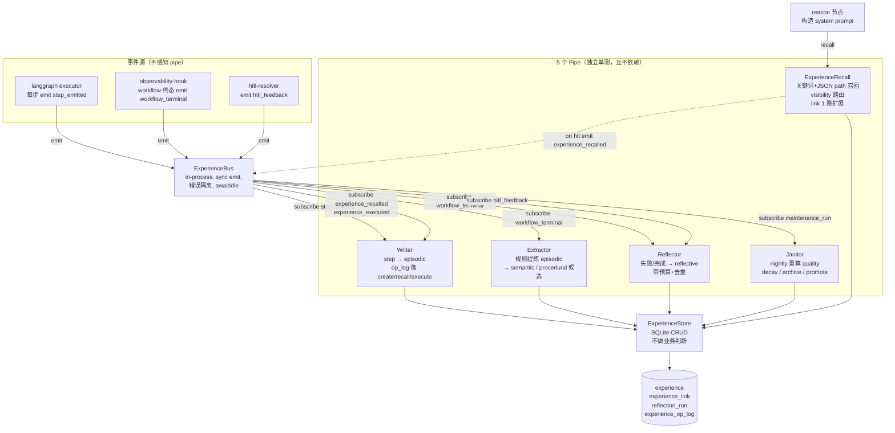

# QUBIT 记忆系统（Memory V2）技术方案

| 项 | 内容 |
|----|------|
| 文档状态 | 已定稿（v0.5 · **P0+P1+P1.5+P2+P3 已落地**） |
| 版本 | v0.5 |
| 作者 | 吴佳峻 · Cursor Agent |
| 更新日期 | 2026-06-03 |
| 评审结论 | 用户已对齐 4 个关键架构选择（见 §5.1） |
| P1 实现状态 | Writer / Extractor / Reflector / Janitor / Recall 5 pipe + onWorkflowTerminal 接入 + reason 节点 Recall 拼接全部完成 |
| P1.5 实现状态 | Janitor cron 入主进程、双写对账 CLI/API、in-process 监控指标 + `/api/v1/monitor/memory/*` 路由、Reflector few-shot + playback 工具全部完成（见 §6.10–6.13、§8.2） |
| P2 实现状态 | EmbeddingClient（OpenAI + Mock）+ ExperienceVectorStore（LanceDB + InMemory）+ Embedder pipe（pull-mode）+ Recall hybrid 升级 + legacy sunset feature flag 全部完成（见 §6.14–6.17、§8.2） |
| P3 实现状态 | Inspector 后端 4 个只读 API + 前端 MemoryTab（指标卡 + 列表筛选 + 详情 + link 邻居 + op_log timeline）全部完成（见 §6.18、§8.2） |

> **关联上下文**：本文档由前序会话 [QUBIT 记忆系统现状盘点与诊断](6eca186f-e145-49ac-af73-5a5fc7a28fb0)
> 派生而来；目的是把"记忆 = 一锅杂烩"重整为"5 个可解耦 pipe + 1 个统一经验体"，
> 并让 agent 能基于失败 / 成功循环真正自我进化。

---

## 前言

QUBIT 当前的「记忆」由 3 张表（`session_memory` / `midterm_memory` / `longterm_memory`）+ 1 张关系表
（`memory_link`，**0 行**）+ `agent_skill` 程序性记忆 + LanceDB 向量索引 +
`memory.md` 镜像文件构成。诊断后归纳出 3 类共 13 个 gap：

- **B-bug 类（5 个）**：写返回的 id 不能查回（B1）、search 完全忽略 query（B2）、向量搜索只取 ids[0]（B3）、`session_memory` 24h TTL 从未触发清理（B4）、`upsertEmbedding` 没有 caller（B5）。
- **D-design 类（5 个）**：`memory_link` 没人写、`memoryType` 硬编码枚举僵化、`memory.md` 整文件覆盖、`session_memory` 几乎闲置、namespace 形同虚设。
- **E-evolution 类（5 个）**：reason 节点只召回 skill 不召回 memory、`reflection_request` 无消费者、skill 评分与记忆评分脱节、失败无专属记忆、skill evolve 走模板。

L1（**本期 P0**，已 100% 落地）：物理表 + Store/Bus 边界 + 5 个 bug 中的 3 个生产端必修项；L2 / L3
依然待做，详见 §8 排期。

**适用性判断**：影响范围横跨记忆 / 反思 / skill / observability 4 个域、估算 ≥ 5 人日，
满足"研发技术优化项目 + 影响面较广"，按 tech-design-doc 团队模板撰写。

---

## 一、背景

### 1.1 技术现状

| 维度 | 现状 | 痛点 |
|---|---|---|
| **记忆物理表** | `session_memory` / `midterm_memory` / `longterm_memory` 3 张表 | 时间维度（session 24h、midterm 项目期、longterm 永久）切得细，**心智维度**（事件流、事实、流程、反思）没有 |
| **`memory_link`** | 表存在 | **0 行**：没人写、没人读 |
| **`memoryType` 字段** | enum 写死 `factor_archive` / `playbook` 等 | 想加"failure_mode""user_preference"得改 schema + migration |
| **`session_memory`** | 仅 `runSummary` 写一次 | 24h TTL 字段存在但 `deleteExpired()` **无 caller**；agent 之间的 step trail 没在用 |
| **Skill 系统** | `agent_skill` + `skill-curator` + `skill-evolve` 已上线 | 与 memory 是两套表、两套召回、两套审计 |
| **Reflection** | `requestReflection` 把消息发到 A2A 总线 | **没人订阅消费**；失败信息丢失 |
| **`memory.md`** | `syncMemoryFromDb` 整文件 overwrite | 无版本、无 diff、人改了会被下次同步覆盖 |
| **召回** | `reason` 节点只 `skillService.searchWithMeta`，长期记忆不召回 | agent 系统提示里的 `## Memory` 是静态镜像，热路径里没有动态 recall |
| **打分** | `agent_skill.successCount` / `failCount` 由 `skill-run-recorder` 推 | 记忆侧三张表完全没有 outcome 反馈 |
| **检索能力** | LanceDB 写入有，召回有 bug；关键词搜索"假装"实为 list | P1 阶段先把关键词 + JSON path 用起来，P2 再接 embedding |

### 1.2 期望收益

- **自我进化的事实基础**：每条 experience 都能记自己"被召回 / 被采纳 / 成败"，nightly Janitor 据此重算 `qualityScore` → 召回排序自适应。
- **失败必反思**：100% workflow_failed 走 Reflector（带 24h 签名去重 + 每项目每日 token 预算上限），失败模式沉淀为 `reflective` 经验体并在下次同类任务直接召回。
- **解耦换演进速度**：Writer / Extractor / Reflector / Janitor / Recall 5 个 pipe 各自一个文件 + 一份单测；新增一个 pipe（如"用户反馈反思"）不动其它 4 个。
- **统一审计**：experience 全生命周期事件落 `experience_op_log`，回答"哪条记忆从未被读 / 哪条总被读但每次执行都 fail"只需一条 SQL。

---

## 二、名词解释

| 名词 | 释义 |
|------|------|
| **Experience（经验体）** | 取代旧 3 张记忆表 + agent_skill 的统一对象。5 个 kind：episodic / semantic / procedural / reflective / identity。 |
| **kind** | 经验的"心智角色"：事件流（episodic）、世界事实（semantic）、流程（procedural）、自我反思（reflective）、画像（identity）。 |
| **visibility** | 召回路由决策位：`agent_private`（仅产生者可见，reflective 强制）/ `role_shared`（同 role 共享）/ `project_shared`（同 project 共享，semantic 默认）。 |
| **scope** | 经验的归属范围：org / workspace / project / strategy / workflow（与 longterm 旧 scope 对齐）。 |
| **subKind** | 自由 string 取代旧硬编码 `memoryType` enum；常见值：`fact` / `failure_mode` / `playbook` / `iteration_summary` / `persona` 等。 |
| **5 个 pipe** | Writer（写入）、Extractor（规则提炼）、Reflector（LLM 反思）、Janitor（衰减 / 归档 / 重算分）、Recall（召回） —— 全部经由 ExperienceBus 协作，对 Store 解耦。 |
| **ExperienceStore** | Memory V2 唯一持久化层，只做 CRUD；不判 kind 路由、不算 quality。 |
| **ExperienceBus** | 进程内同步事件总线；emit 不抛错、handler 失败不影响其它 handler、提供 `awaitIdle()` 给测试用。 |
| **failure_signature** | 同一类失败的归一化指纹（worktree_role + tool_name + error_class + workflow_mode 哈希）；用于 24h 内反思去重。 |
| **qualityScore** | 经验的 0~1 综合分，由 Janitor 用 `successCount / max(useCount, k)` 配合最近性衰减、HITL 反馈、conflicts_with 关系算出。 |

---

## 三、产研协作信息

| 项 | 内容 |
|----|------|
| 文档状态 | 已定稿（P0+P1+P1.5+P2+P3 已落地） |
| 相关文档 | [ENVIRONMENT_MANAGER_DESIGN.md](ENVIRONMENT_MANAGER_DESIGN.md) · [MONITORING_V2_DESIGN.md](MONITORING_V2_DESIGN.md) |
| 产品 | — |
| 需求技术 owner | 吴佳峻 |
| 服务端 | 吴佳峻 |
| 前端 | 暂不涉及（P3 才会暴露 memory inspector 面板） |
| 外部依赖方 | 无（4 张新表、bun:sqlite 内置） |
| 测试 | 单测 + 集成测试随 PR 一起出（已含 32 case，全过） |

---

## 四、需求分析

### 4.1 功能影响范围

| 类型 | 影响项 | 变更说明 |
|------|--------|----------|
| **数据表** | `experience`（新） / `experience_link`（新） / `reflection_run`（新） / `experience_op_log`（新） | P0 新增；migration `0059_memory_v2_p0.sql`，回滚 `down-0059.sql`。**旧 4 张记忆表不动** |
| **模块** | `src/runtime/experience/`（新） | 三文件：`experience-store.ts` / `experience-bus.ts` / `types.ts` + 1 个 barrel `index.ts` |
| **模块** | `src/connectors/memory/native/native.memory.connector.ts` | 修 B1（id 返回）+ B2（search 真过滤） |
| **模块** | `src/connectors/memory/native/longterm.store.ts` | 修 B3（`inArray` 取全 N 条） |
| **类型** | `src/types/entities.ts` | 新增 9 个 Experience 相关类型 |
| **接口** | 无（5 个 pipe 在 P1 上线时才接 reason / onWorkflowTerminal） | P0 不切热路径，0 风险 |
| **配置/开关** | 无 | Bus 是 in-process 单例，Store 默认 SQLite，无 feature flag |

### 4.2 问题拆解分析

1. **大问题：当前架构如何阻碍 agent 自我进化？**
   - 子问题 1：**写不出反思** → 没有专属表 + 没人订阅 reflection_request → 失败信息消散。
   - 子问题 2：**写了也用不上** → reason 节点只 recall skill，不 recall memory；`memory.md` 是冷镜像。
   - 子问题 3：**用了无打分** → memory 三张表没有 outcome 字段；skill 有但与 memory 隔离。
   - 子问题 4：**打分无依据** → 没有"召回了哪几条 / 执行结果如何"的审计；qualityScore 无源数据。

2. **大问题：为什么"先修旧表"不如"造新表"？**
   - 子问题 1：旧 3 张表的"时间维度切分"是基于 mem0 论文，**和"心智角色"维度正交**；强加 kind 列会让 enum 爆炸（5 × 旧 memoryType 列表）。
   - 子问题 2：旧 `memoryType` enum 在 schema 写死；改一次 = migration + 触动 9 处 caller，迭代成本高。
   - 子问题 3：旧 `memory_link` 表设计但 0 行，已废弃；继续硬塞反而误导新人。

3. **大问题：为什么要"先 Store/Bus 边界，后 5 个 pipe"？**
   - 子问题 1：5 个 pipe 是业务策略层，**未来要并发演进**（Writer 可换流式、Reflector 可换不同 LLM）；先固化 Store/Bus 这条薄边界，pipe 内部就有"重写自由"。
   - 子问题 2：5 个 pipe 都要单测；Store 必须可 mock。InMemoryStore + InProcessBus 是 P0 的硬要求。

### 4.3 数据库表结构变更

详见 `src/db/sqlite/migrations/0059_memory_v2_p0.sql`。摘要：

| 表名 | 变更类型 | 字段/索引 | 说明 |
|------|----------|-----------|------|
| `experience` | 新增 | id / kind / sub_kind / scope / scope_id / definition_id / visibility / content_json / tags_json / quality_score / use_count / success_count / fail_count / decay_at / valid_from / valid_to / parent_id / source_run_id / embedding_ref / pinned / metadata_json | 统一经验体；5 个 kind 共享一张表；`embedding_ref` 留给 P2 |
| `experience` 索引 | 新增 5 | (scope, scope_id, kind, quality_score) / (definition_id, kind, valid_from) / (kind, sub_kind) / (decay_at) / (parent_id) | 覆盖召回 / Janitor / 谱系查询 3 类热路径 |
| `experience_link` | 新增 | from_id → to_id with relation: derive_from / summarize_to / evidence_of / conflicts_with / supersedes | 取代死表 `memory_link`；唯一索引 (from, to, relation) 保证幂等 |
| `reflection_run` | 新增 | scope / subject_run_id / failure_signature / definition_id / status / budget_tokens_used / produced_experience_ids_json | status 含 3 类 skipped_*（dedup / budget / sampled_out），可区分"为什么没反思" |
| `experience_op_log` | 新增 | experience_id / op(create/update/recall/execute/decay/archive/promote) / outcome / actor | qualityScore 计算的事实表 |

**兼容性**：4 张表均为新增；旧 `session_memory` / `midterm_memory` / `longterm_memory` / `memory_link` / `agent_skill` 不动；reason 节点 P0 内不切走，0 风险。

**回滚**：`down-0059.sql` 按 FK 反序 DROP；rollback 不影响旧路径数据。

---

## 五、总体设计

### 5.1 技术调研 & 候选方案对比

记忆系统升级有 4 个关键架构选择，用户已对齐如下：

| 决策点 | 候选 A | 候选 B | 选定 | 选择依据 |
|------|------|------|------|----------|
| **数据载体** | 在旧 3 表上加 kind 列 | 新建 `experience` 物理表 | **B** | 旧表 memoryType enum 已经爆，强加 kind 会撑成 30+ 行的枚举；新表一次性迁移 + 查询简洁 |
| **失败反思策略** | 仅采样 N% | **必反思 + 24h failure_signature 去重 + 每项目每日 token 预算** | **B** | 失败信号最贵，全采集；签名去重防"同 bug 反思 50 次"；token 预算防 LLM 账单爆炸 |
| **召回机制** | P0 起就上 embedding | **P1 先关键词 + JSON path，P2 接 embedding** | **B** | embedding 链路目前 `upsertEmbedding` 0 caller，先把廉价的关键词路径打通，避免一上来就被向量库成本拖住 |
| **共享 vs 隔离** | 全部共享 / 全部隔离 | **semantic 共享、reflective 隔离** | **B** | 事实人人能用；反思是 agent 个人偏好，泄露给别的 agent 容易"互相劝退"互相污染 |

附加原则：**高内聚低耦合**。Store / Bus 是薄边界（< 800 行），5 个 pipe 各自一个文件，互不 import；event union 用 discriminated `type` 收口。

### 5.2 总体架构



关键设计：

- **事件源完全不感知 pipe**：langgraph executor 只 emit，不知道有多少订阅者。新增一个 pipe = 在某处 `bus.subscribe()`，零侵入其它代码。
- **Store 与 Bus 互不依赖**：Pipe A 写 Store 之后想通知 Pipe B，**不要** 在 Store 里偷塞 emit；Pipe 自己 emit。Store 保持纯 CRUD。
- **唯一的循环**：Recall 命中后会 emit `experience_recalled` → Writer 落 op_log；这是一个良性循环（不形成 emit 风暴，因 recall 本就被节流）。

### 5.3 与现有系统的并存路径

```
旧 path（P0 仍然在用）：
  reason 节点 → memory.md 镜像注入 → write_memory 工具走 NativeMemoryConnector → 旧 3 张表
  onWorkflowTerminal → consolidateFromWorkflow → midterm/longterm 写入

新 path（P0 仅落地基础设施，P1 开始切流量）：
  langgraph emit → Bus → Writer/Extractor/Reflector/Janitor/Recall → ExperienceStore → 新 4 张表
  reason 节点 P1 起追加调用 Recall → 经验体注入 prompt
```

P0 只动新链路的"地基"，不动任何旧消费者，所以可以**回滚 = 删表**，零业务影响。

---

## 六、各模块详细设计

### 6.1 ExperienceStore — 持久化薄层（P0 已落地）

**位置**：`src/runtime/experience/experience-store.ts`

**目标**：Memory V2 唯一 DB 入口。不做任何业务判断。

**接口契约**（详见源码 `ExperienceStore` interface）：

```typescript
interface ExperienceStore {
  insert(input: InsertExperienceInput): Promise<Experience>;
  update(id: string, patch: UpdateExperienceInput): Promise<Experience>;
  findById(id: string): Promise<Experience | null>;
  findManyByIds(ids: string[]): Promise<Experience[]>;
  query(filter: ExperienceQuery): Promise<Experience[]>; // 仅结构化过滤，不含 keyword
  linkAdd(fromId: string, toId: string, relation, weight?): Promise<ExperienceLink>;
  linkList(experienceId: string): Promise<ExperienceLink[]>;
  linkExpand(params: LinkExpandParams): Promise<Experience[]>; // 1..3 跳邻居
  logOp(input: OpLogInput): Promise<ExperienceOpLog>;
  listOps(experienceId: string, limit?: number): Promise<ExperienceOpLog[]>;
}
```

**两种实现**：

| 实现 | 用途 | 关键点 |
|---|---|---|
| `SqliteExperienceStore` | 生产 | 走 drizzle；`linkAdd` 用 `UNIQUE constraint failed` 异常做幂等读回；`query` 的 `definitionId=null` 用手写 `IS NULL` 片段（drizzle `eq(col, null)` 在 SQLite 不生效）；`linkExpand` BFS 1..3 跳带去重 |
| `InMemoryExperienceStore` | 5 个 pipe 的单测 | 纯 Map/Array；同一份接口；无 DB 依赖；< 50ms 跑完全套用例 |

**边界 & 异常**：

- `query` 不接受 keyword / vector —— 那是 Recall 的事；让 Store 只做"SQL 直观能力"
- `linkAdd` 禁止 self-link（throw）
- `linkExpand` maxDepth clamp 到 1..3（防爆炸）
- 所有 JSON 列读出时统一走 `normalizeJson(raw, fallback)`，兼容 string / 已解析对象两种返回值

**单测覆盖**：26 case（InMemory）+ 6 case（SqliteIntegration），全过。

### 6.2 ExperienceBus — 进程内事件总线（P0 已落地）

**位置**：`src/runtime/experience/experience-bus.ts`

**设计原则**：极简，避免演化成"分布式系统"。

| 属性 | 决策 | 理由 |
|---|---|---|
| **范围** | 进程内、同步 emit | 多 agent 在一进程；分布式延后到真有需要 |
| **错误隔离** | handler 抛错被 catch + warn，不阻塞其它 handler | 一个 pipe bug 不能让 emit 流瘫痪 |
| **顺序保证** | 不保证（虽然实现是注册顺序） | 防止 caller 写出依赖顺序的脆弱代码 |
| **类型安全** | event union 用 discriminated `type`；`subscribe<T>` 自动窄化 | IDE 自动补全 + 编译期防错 |
| **持久化** | 零持久化 | 重放需求由订阅方自己定时器扫 DB |
| **awaitIdle** | 暴露给测试 | 避免 `setTimeout(0)` hack |

**事件 union**（6 类）：

| event.type | 谁 emit | 谁可能 subscribe |
|---|---|---|
| `step_emitted` | langgraph executor 每步 | Writer → 折叠成 episodic |
| `workflow_terminal` | `onWorkflowTerminal`（completed / failed） | Extractor + Reflector |
| `experience_recalled` | Recall 命中后 | Writer → 落 op_log(op=recall) |
| `experience_executed` | act 节点采纳了召回经验 | Writer → 落 op_log(op=execute, outcome) |
| `hitl_feedback` | HITL resolver | Reflector + Writer |
| `maintenance_run` | Janitor / Curator 跑完一轮 | observability 监控面板 |

**单测覆盖**：10 case，含错误隔离、async handler、awaitIdle 链式触发、unsubscribe，全过。

### 6.3 Writer Pipe（**P1 已落地**）

**位置**：`src/runtime/experience/pipes/writer.ts`
**单测**：`src/runtime/experience/__tests__/writer.test.ts`（11/11 pass）

**实际行为**：
- 订阅 `step_emitted` / `experience_recalled` / `experience_executed` 三类事件
- `step_emitted` 仅折叠 `tool_call / final_answer / memory_write` 三类有产出的 step；perceive/observe 不入 episodic 防行爆炸；body 超过 6000 字符按尾部截断
- 同一 `workflowRunId` 的 episodic upsert 用 per-key Promise lock 串行化，避免并发 emit 拆出多条
- `experience_recalled` → `op_log(op=recall)` + `useCount++`
- `experience_executed` → `op_log(op=execute, outcome)` + `successCount/failCount++`
- handler 内部全 try/catch，单条事件失败不影响其它


**目标**：监听 `step_emitted` / `experience_recalled` / `experience_executed`，把过程数据持久化为 experience + op_log。

**关键流程**：

```
on step_emitted (workflowRunId, definitionId, step):
   if step.actionType in [tool_call, final_answer]:
      experience = experiences.find({kind: episodic, scope_id: workflowRunId}) || create
      append step.summary to experience.contentJson.body  (折叠：同 workflow 一条 episodic)
      store.update(experience.id, { contentJson, useCount++ })

on experience_recalled:
   store.logOp({op: 'recall', actor: 'reason', metadataJson: {rank, score}})

on experience_executed (outcome):
   store.logOp({op: 'execute', actor: 'act', outcome})
   if outcome == success: store.update(id, { successCount: +1 })
   if outcome == fail:    store.update(id, { failCount: +1 })
```

**异常 & 边界**：

- 同一 workflow 的 episodic 折叠到一行（防止行爆炸）
- 写失败只 warn，不抛错回 langgraph
- 与旧 `runConsolidation` 在 P1 阶段双写一周，对账后下线旧路径

### 6.4 Extractor Pipe（**P1 已落地**）

**位置**：`src/runtime/experience/pipes/extractor.ts`
**单测**：`src/runtime/experience/__tests__/extractor.test.ts`（12/12 pass）

**P1 规则集**（按 `subKind` 注册，扩展只需 `defineRule(...)`，不动 dispatch）：
- **R1 · semantic.factor_archive**：`mode=backtest` 且 `final_answer` 含 RankIC/IR/Sharpe/Max Drawdown/CAGR/Turnover 任一指标 → 写一条 `semantic({sub_kind:factor_archive})`，summary=指标摘要；同 (project, goal) 去重
- **R2 · procedural.workflow_play**：≥5 tool_call + ≥3 distinct tool + 有 `final_answer` → 写一条 `procedural({sub_kind:workflow_play})`，body=工具链 markdown；同 (project, signature) 去重
- **R3 · semantic.iteration_summary**：role ∈ {research, orchestrator, analyst, analyst_research_job} + 非空 `final_answer` → 写一条 `semantic({sub_kind:iteration_summary})`

**依赖注入**：抽出 `ExtractorLoader` 契约 —— 生产实现去 DB 读 workflow_run / agent_step / experience(episodic) 并归纳成 `ExtractorWorkflowSummary`；单测注入 fake loader 零 DB。

**链接关系**：每条新经验给所有 `summary.episodicIds` 自动加 `derive_from` 边，让 Recall LinkExpander 能从 episodic 反查回 lesson 源头。


**目标**：workflow 完成后从 episodic 走规则提炼 semantic / procedural 候选。

**实现要点**：

- **不调 LLM**：保持 `consolidateFromWorkflow` 的"规则胜出"心智，避免每次 workflow 完成都烧 token
- **规则示例**：
  - 工作流 mode=backtest 且 final_answer 含 `RankIC` → `subKind=factor_archive` semantic
  - 同一 toolCall 连续成功 3 次 → procedural 候选（弹给 skill-curator review）
- **输出关系**：每条 semantic / procedural 都用 `derive_from` 链回 episodic 源头

### 6.5 Reflector Pipe（**P1 已落地**，关键）

**目标**：失败必反思 + 预算 + 去重。

**触发**：`workflow_terminal` 事件，status="failed" → 必走；status="completed" → 10% 采样。

**核心流程**：

```
on workflow_terminal (workflowRunId, projectId, status):
   sig = computeFailureSignature(workflowRunId)  // 仅 failed 时
   if status == 'failed':
      // 24h 去重
      if reflection_run.exists({failure_signature: sig, started_at > now-24h}):
         insert reflection_run({status: 'skipped_dedup'})
         return
      // 项目级 token 预算
      if dailyTokenUsed(projectId) + EST_REFLECTION_TOKENS > DAILY_BUDGET:
         insert reflection_run({status: 'skipped_budget'})
         return
   else:
      // completed：抽样
      if random() > 0.1:
         insert reflection_run({status: 'sampled_out'})
         return

   run = insert reflection_run({status: 'running'})
   llmOutput = callLLM(buildReflectionPrompt(workflow, episodic, semantic-context))
   parsed = parseLLM(llmOutput)  // {summary, body, tags, lessons[]}

   for each lesson in parsed.lessons:
     exp = store.insert({
        kind: 'reflective',
        visibility: 'agent_private',         // 隔离 ← 用户决策 4
        definitionId: lesson.definitionId,   // 谁犯的错给谁
        sub_kind: 'failure_mode',
        contentJson: {summary, body: lesson.body},
        tagsJson: [`tool:${toolName}`, `error:${errClass}`, ...],
        sourceRunId: workflowRunId,
        validFrom: now,
     })
     store.linkAdd(exp.id, episodicId, 'derive_from')

   update reflection_run({status: 'completed', budget_tokens_used, produced_experience_ids_json})
```

**failure_signature 公式**：`sha1(role + tool_name + error_class + workflow_mode)`，前 16 char。

**实际落地**（`src/runtime/experience/pipes/reflector.ts` + `reflection-run-repo.ts`；单测 13/13 pass）：
- 把 reflection_run CRUD 抽成 `ReflectionRunRepo` 接口，提供 `SqliteReflectionRunRepo`（生产）+ `InMemoryReflectionRunRepo`（pipe 单测），Reflector 不直接 import drizzle
- LLM 调用走注入的 `LlmCallFn`，单测 stub 出固定输出；生产由 caller（onWorkflowTerminal 或 self-improve-loop）传 `invokeWithFallback`
- 预算检查采用**预扣减**：`used + EST_REFLECTION_TOKENS(1500) > budget` 即跳过，避免最后一笔超额
- 解析失败时**只重试 1 次**，仍失败 → `status=failed, errorMessage=llm_unparsable_twice`
- LLM 抛错 → run 留 failed 终态 + errorMessage（截断 800 字）
- 写经验时 `visibility=agent_private` + `definitionId` 必填（fallback `orchestrator`），强制隔离

**异常 & 边界**：

- LLM 调用失败 → reflection_run status=failed + errorMessage
- LLM 输出解析失败 → 至多重试 1 次，仍失败则 status=failed
- 单 workflow 最多产出 5 条 reflective（防爆炸）

### 6.6 Janitor Pipe（**P1 已落地**）

**位置**：`src/runtime/experience/pipes/janitor.ts`
**单测**：`src/runtime/experience/__tests__/janitor.test.ts`（12/12 pass）

**实际公式**（`computeQualityScore`）：
```
base       = successCount / max(useCount, 5)                           # 0..1
recency    = exp(-daysSinceValidFrom / 30)                             # 半衰期 30d
hitlBoost  = metadataJson.hitlBoost ?? 0                               # 0..0.15
conflict   = metadataJson.conflictPenalty ?? 0                         # P2 由 conflicts_with 自动算
quality    = clamp(base*0.5 + recency*0.3 + 0.2 + hitlBoost - conflict, 0, 1)
```

**衰减判定**（`evaluateDecay`）：
- `pinned=true` → noop
- 已设 `decayAt` 且 `now ≥ decayAt + 7d` → archive（写 `valid_to`, 落 op_log(op=archive)）
- quality `<` 阈值（默认 0.2）且 `validFrom > 14d` → mark_decay（设 `decay_at = now + 7d`, 落 op_log(op=decay)）

**入口**：`runJanitorOnce({store, bus?, now?, maxBatch=500})` 单批扫描；跑完 emit `maintenance_run` 给 observability。


**目标**：nightly 维护——重算 qualityScore、decay 老经验、归档低质项。

**qualityScore 公式**（P1 起跑）：

```
base       = successCount / max(useCount, 5)            // 默认 0.0；冷启动友好
recency    = decay_exp((now - validFrom) / 30d)         // 半衰期 30 天
hitl_boost = +0.15 if HITL approve in last 7d
conflict   = -0.1 per conflicts_with link
pinned     = max(score, 0.8)

quality = clamp(base * 0.5 + recency * 0.3 + hitl_boost + conflict, 0, 1)
```

**衰减规则**：

- `quality < 0.2` 连续 14 天 → 设 `decay_at` = now + 7d
- `decay_at` 到期且无新 op_log → 设 `validTo` = now（软归档）
- `pinned=true` 永不归档

### 6.7 ExperienceRecall Pipe（**P1 已落地**）

**位置**：`src/runtime/experience/pipes/recall.ts`
**单测**：`src/runtime/experience/__tests__/recall.test.ts`（12/12 pass）

**召回流程**：
1. **池子收集** — kinds × visibility 路由
   - semantic / procedural / identity：scope=project + `project_shared`
   - reflective：scope=project + definitionId 必须等于当前 agent 的 definitionId（决策 4，严格隔离）
   - episodic 不入召回池（噪声大，P2 起按 sub_kind 选择性入）
2. **关键词打分** — `tokenize(query)` 中英混合（英文按词、中文按字），`keyword = hits / |tokens|`
3. **综合分** — `score = 0.5*keyword + 0.3*qualityScore + 0.2*recency`，关键词不命中（keyword=0）的项直接被池阶段过滤掉，让 link 扩展真正发挥作用
4. **link 1 跳扩展** — 取 top-3 seed 沿 `derive_from / evidence_of` 关系拉邻居，邻居重新打分并标记 `viaLink=true`
5. **去重 + Top-K** — `mergeUnique` 时同 id 取最高分；按 score desc 取 top-K（默认 5）
6. **emit `experience_recalled`** — fire-and-forget 给 Bus，Writer 自动落 `op_log(op=recall)` + `useCount++`

**Prompt 渲染**：`renderRecallBlockForPrompt(results)` → Markdown 段落，含 `[kind/subKind] summary` + `score=... q=... use=... via link` 元数据 + body 截断到 800 字。


**目标**：reason 节点用一个统一入口召回 N 条最相关经验，按 visibility 路由。

```
recall(ctx: {projectId, definitionId, role, query, kinds, topK}):
   pool = []

   // 1. semantic / procedural：project_shared 全捞
   pool += store.query({kind: ['semantic', 'procedural'], scopeId: projectId, orderBy: 'quality_desc', limit: 50})

   // 2. reflective：仅 definitionId 自己（agent_private 隔离 ← 用户决策 4）
   pool += store.query({kind: 'reflective', scopeId: projectId, definitionId: ctx.definitionId, limit: 30})

   // 3. role_shared 可选扩展（v1 不上）

   // 4. 关键词匹配（P1 关键词 + JSON path，P2 替换成 embedding）← 用户决策 3
   scored = keywordScore(pool, ctx.query)

   // 5. link 1 跳扩展：拿 top-3 的邻居补充
   topSeeds = scored.slice(0, 3).map(e => e.id)
   neighbors = store.linkExpand({seedIds: topSeeds, relations: ['evidence_of'], maxDepth: 1})
   scored += keywordScore(neighbors, ctx.query)

   // 6. 排序 + 截断 + emit experience_recalled (rank, score) 给 Bus
   return scored.sort().slice(0, topK).map((e, i) => {
      bus.emit({type: 'experience_recalled', experienceId: e.id, rank: i, score: e.score, workflowRunId: ctx.workflowRunId})
      return e
   })
```

### 6.8 reason 节点接入（**P1 已落地**）

**接入点 1 — `onWorkflowTerminal`（`src/runtime/monitor/observability-hook.ts`）**：
- 在原有的 quality snapshot / consolidation 后追加一段 `getExperienceBus().emit({type:"workflow_terminal", workflowRunId, projectId, status})`
- projectId 通过 `workflow_run.projectId` 反查；失败不阻塞旧路径
- 旧 `consolidateFromWorkflow` 与新 Bus 并行（双写期），下线时机见 §7.4

**接入点 2 — `reason` 节点（`src/runtime/langgraph/nodes/reason.ts`）**：
- 在原有的 skill 召回旁加一段独立的 `ExperienceRecall.recall({...})` 调用
- 两个召回**完全独立**的失败域：skill 召回出错不影响 experience 召回，反之亦然
- experience 召回的 query 沿用 skill 同款 `goal + ticker + context` 拼装
- 命中后通过 `renderRecallBlockForPrompt(hits)` 拼成新的 markdown 段，紧跟在 skill block 后注入 userPrompt
- `DEBUG_MEMORY_V2=1` 开启 debug 日志


P1 最后一步：在 `src/runtime/langgraph/nodes/reason.ts` 的 `mergeSystemPrompt` 前，调一次 `ExperienceRecall.recall({...ctx, query: latestUserMsg})`，拼接到 system prompt 的 `## Memory · Recall (live)` 段。`memory.md` 镜像保留作为兜底（用户可手改、可版本控制）。

### 6.10 ExperienceMaintenanceWorker（**P1.5 已落地**）

**位置**：`src/runtime/experience/maintenance-worker.ts`
**接入点**：`src/index.ts` 在主进程启动里 `experienceMaintenanceWorker.start()`（仿 `monitorAggregatorWorker` 模板）

| 维度 | 设计 |
|---|---|
| **调度模型** | 仿 `MonitorAggregatorWorker`：`tick / start / stop`；`STARTUP_DELAY_MS=60s` 错开冷启动、之后默认 `tickMs=1h` |
| **节奏选择** | 1h 一跑 vs 24h：高频不增加成本（O(n) 内存扫描 + 极少量 update），但能让 `valid_from > 14d` 的衰减判定立刻生效，避免"今天写、明天才 decay"漂移 |
| **串行守卫** | `running` flag —— 上一次 tick 还在跑时第二次 tick 返回 `previous tick still running`，避免长跑 SQLite 互挤 |
| **失败兜底** | tick 内每阶段独立 try/catch，错误仅 `console.warn`，绝不抛进主进程；维护基础设施失败 ≠ 业务失败 |
| **副作用 1** | `start()` 时主动 `attachMemoryMetrics(getExperienceBus())` —— metrics collector 跟着 worker 生命周期挂载 / 卸载，server 启动起就开始收 |
| **测试覆盖** | `__tests__/maintenance-worker.test.ts` × 4 case：tick 基线、串行守卫、异常包裹、start/stop 幂等 |

### 6.11 Reconciliation 双写对账（**P1.5 已落地**）

**位置**：`src/runtime/experience/reconciliation.ts`
**CLI**：`bun run src/scripts/run-memory-reconcile.ts --projectId=<id> [--sinceDays=7] [--json]`
**HTTP**：`GET /api/v1/monitor/memory/reconcile?projectId=&sinceDays=`

对账三维（项目粒度，默认 7d 窗口内 `status=completed` 的 workflow）：

| 维度 | 旧路径 | 新路径 | 关联键 | 期望 |
|---|---|---|---|---|
| **D1 semantic** | `midterm_memory(memory_type=strategy_iteration|...)` | `experience(kind=semantic, sub_kind=iteration_summary)` | `experience.source_run_id == midterm_memory.content_json.workflowRunId` | `bothCount` 应≈ 旧表条数 |
| **D2 procedural** | `agent_skill(state in {pending_review,active})` | `experience(kind=procedural, sub_kind=workflow_play)` | `experience.metadata_json.signature == <!-- signature: xxx -->` 抽自 `agent_skill.body_md` | 同 |
| **D3 reflective** | （旧路径无对应） | `experience(kind=reflective)` | — | 仅统计 `total / bySubKind / recent7d` 作为"P1 自身收益基线" |

`recommendation` 字段：当 D1+D2 累计 drift==0 → `ok_to_sunset`（**进入观察期**），否则 `needs_attention`。下线旧路径的客观标准：**连续 7 天日报均为 `ok_to_sunset` → 删 `consolidateFromWorkflow` + `syncMemoryForWorkflow`**。

测试：`__tests__/reconciliation.integration.test.ts` × 9 case，跑真 SQLite + drizzle，覆盖 both / onlyOld / onlyNew / archived skill 不计 / reflective stats。

### 6.12 监控指标（**P1.5 已落地**）

**位置**：`src/runtime/experience/metrics.ts`
**HTTP**：`GET /api/v1/monitor/memory/metrics` → `{ snapshot: { name|tag=v: count } }`

设计模型：**纯被动 Bus 订阅 + 内存计数 + 可替换 collector**。3 处 pipe 一行不动，新增指标只改 `metrics.ts`。当前订阅与产出：

| Bus 事件 | 指标 |
|---|---|
| `experience_recalled` | `memory.recall.hits.total` + `by_rank` + `by_score_bucket`（10 桶） |
| `experience_executed` | `memory.execute.total` + `by_outcome{success/fail/partial/unknown}` |
| `maintenance_run(kind=janitor)` | `memory.janitor.tick.total / scanned / quality_updated / decay_marked / archived` |
| `maintenance_run(kind=reflector_daily)` | `memory.reflector.runs.total / by_status{completed/sampled_out/skipped_dedup/skipped_budget/failed}` |

Reflector 在 `reflectOnce` 末尾自动 emit `maintenance_run(kind=reflector_daily, summary={status, producedCount, workflowRunId})`，无需 Reflector 直接依赖 metrics 模块（保持解耦）。

接入 Prometheus / Datadog 时**只换 `MetricsCollector` 实现**，订阅 handler 不动；详见 `MetricsCollector` interface。

测试：`__tests__/metrics.test.ts` × 8 case，覆盖 collector 基础语义、4 类事件计数、kind 隔离、detach 后停止计数。

### 6.13 Reflector 提示词调优（**P1.5 已落地**）

**升级 1 — few-shot 注入** (`pipes/reflector.ts::REFLECTION_FEWSHOT`)：
- 正例 ×2：典型 failure_mode（discoveryRun timeout → 给出具体 assert）+ preference（用户偏好 ascii 柱图）
- 反例 ×1：空洞 lesson（"要更仔细"）→ 显式说明应输出 `{"lessons":[]}`
- 通过 `buildReflectionPrompt(ctx, { includeFewShot: false })` 可关掉，便于 A/B
- 输出约束加 "每条 lesson 必须满足 3 个要求：可复现失败模式 + 具体到工具/参数的纠偏动作 + 至少 1 个 tag"

**升级 2 — `playReflectionOnce(input)` 回放 API**：
- 接受 `{ctx, llm, promptOptions}`，跑一次 LLM，返回 `{prompt, rawText, parsed, tokensUsed, parseError?}`
- **不写库** —— 纯函数视角，专用于离线 prompt 调优
- 解析失败时 `parseError = "no_lessons_or_unparsable"`

**升级 3 — `evalLessonsAgainstGroundTruth(predicted, truth)`**：
- 命中判定：subKind 一致 + summary 至少 2 个 token 重合（中英文 token）
- 返回 `{truthCount, predictedCount, hit, hitRate, missed[]}`
- 用于"换 prompt 后召回率有没有掉"的回归

**CLI**：`bun run src/scripts/run-reflection-playback.ts --workflowId=<id> [--includeFewShot=false] [--noLlm]`
- 从 DB 读真实 workflow + steps，凑出 `ReflectorWorkflowContext`
- stderr 打 prompt + raw 给人看，stdout 出结构化 JSON 给 jq pipeline

测试：`__tests__/reflector-prompt.test.ts` × 10 case，覆盖 few-shot 注入 / opt-out / playback nope-write / parse error / eval 命中率。

### 6.14 EmbeddingClient（**P2 已落地**）

**位置**：`src/runtime/llm/embedding-client.ts`

| 维度 | 设计 |
|---|---|
| **接口** | `EmbeddingClient { model, dimension, embed(texts: string[]): Promise<EmbeddingResult> }` —— 接口先行，所有 caller 只依赖接口；OpenAI/Mock/未来的本地 sentence-transformers 都可替换 |
| **生产实现** | `OpenAIEmbeddingClient` —— 默认 `text-embedding-3-small`（1536 维），走 `OPENAI_API_KEY`，无 key 构造抛错（避免运行时静默切 mock）。内部按 `maxBatchSize=256` 切片，OpenAI 单 batch 上限 2048 |
| **测试实现** | `MockEmbeddingClient` —— 哈希式嵌入（djb2 hash + L2 normalize），完全 deterministic：同输入 → 同向量、相似文本 → 高 cosine、完全不同 → 低 cosine。默认 16 维方便单测断言 |
| **工厂** | `getDefaultEmbeddingClient()` —— 优先 mock 注入 → 否则 OPENAI_API_KEY 在 → null（caller 应降级）。reason 节点 + maintenance worker 都通过这个工厂取 client，环境无 key 时整条 hybrid 链路自动降级，不阻塞业务 |
| **导出工具** | `hashEmbed(text, dim)` + `cosineSimilarity(a, b)` —— Recall hybrid 单测构造"语义相似"向量也复用 |

测试：`__tests__/embedding-client.test.ts` × 14 case，覆盖 deterministic / dim 一致 / 相似度近似 / 多模型 dim 映射 / OPENAI key 缺失抛错。

### 6.15 ExperienceVectorStore（**P2 已落地**）

**位置**：`src/runtime/experience/experience-vector-store.ts`
**LanceDB 表**：`LANCE_TABLES.EXPERIENCE_EMBEDDINGS`（在 `db/lancedb/client.ts` 新增 schema 类型）

| 字段 | 用途 |
|---|---|
| `id` | LanceDB 主键 (uuid)，与 `experience.id` 是 1:N（重 embed 写新行，旧版本留作历史） |
| `experienceId` | 关联 SQLite `experience.id` |
| `vector` | embedding |
| `kind / subKind / scope / scopeId / visibility / definitionId` | 召回前置过滤；reflective 强制 `agent_private + definitionId match` |
| `model / dimension` | 多模型并存关键；换模型时按这两列 `deleteByExperience` 后重 embed；不同 model 互不召回 |
| `sourceText` | 原文（debug 用，截到 2k 字符） |
| `createdAt` | ISO 时间 |

接口：`upsert(input) / deleteByExperience(id) / search(queryVec, filter, topK)`。InMemory 实现内置 cosine 暴力计算 + 同 experienceId top1 dedup；LanceDB 实现拉宽 topK×3 后在 JS 层重排（绕开 LanceDB 距离指标不稳定）。

测试：`__tests__/experience-vector-store.test.ts` × 10 case，覆盖基础 upsert/search、scope/kind/visibility 过滤、reflective agent 隔离、多模型不混搭、dim mismatch 抛错、增删 + dedup。

### 6.16 Embedder pipe（**P2 已落地**）

**位置**：`src/runtime/experience/pipes/embedder.ts`
**接入点**：`maintenance-worker.ts` 的 Stage 2 —— Janitor 跑完后跑 embedder

| 维度 | 设计 |
|---|---|
| **模式** | **pull mode**（非 push）—— 周期扫表，Writer/Extractor/Reflector 不直接耦合 embedding；embedding 慢失败不阻塞主链路；换模型时只需一次性重 embed 全表 |
| **状态机** | 藏在 `metadataJson.embeddingState` —— `pending` / `done(+model+dim+at)` / `failed(+retries+lastError)`；超 `maxRetries` 永久 skip |
| **同模型不重 embed** | `state=done && model==client.model && dim==client.dimension` 直接 skip；换模型/换维度自动触发重 embed |
| **失败兜底** | 整批 embed 失败 → 全部标 failed +1 retry；单条 vectorStore upsert 失败 → 仅该条 failed，其他 succeed |
| **rebuild API** | `rebuildExperienceEmbedding(store, vectorStore, id)` —— 删旧向量 + 重置 state；CLI / 运维换模型时用 |

测试：`__tests__/embedder.test.ts` × 9 case，覆盖基础路径、二次 skip、model/dim 变化重跑、整批失败、超 retries 跳过、单条失败隔离、batchSize 截断、rebuild。

### 6.17 Recall hybrid 升级（**P2 已落地**）

**位置**：`src/runtime/experience/pipes/recall.ts`
**接入点**：`reason` 节点根据 `getDefaultEmbeddingClient()` 自动启用 hybrid（有 key → hybrid；无 key → 走 P1 keyword-only，零改动 fallback）

| 维度 | 设计 |
|---|---|
| **模式开关** | 构造 ExperienceRecall 时传 `{embeddingClient, vectorStore}` 两者才启用 hybrid；任一缺失自动降级 keyword-only；`recall.hybridEnabled` 暴露状态 |
| **召回流程** | (1) keyword 池子（沿用 P1）+ (2) 向量召回（query → embed → vectorStore.search 拉宽 topK×3） → (3) findManyByIds 还原 Experience → (4) 统一打分 |
| **打分公式** | keyword-only（旧）：`0.5·kw + 0.3·q + 0.2·rec`；hybrid（新）：`0.40·embed + 0.25·kw + 0.20·q + 0.15·rec` —— embed 主导但 keyword 保留兜底强 entity（ticker / factor name）|
| **reflective 隔离** | hybrid 下也分两次向量召回：(a) shared kinds（无 visibility 过滤） (b) reflective × definitionId（agent_private 严格隔离）；agent-B 拿不到 agent-A 的反思 |
| **降级路径** | `embeddingClient.embed` 或 `vectorStore.search` 抛错 → console.warn + 返回空 map → 自动降级 keyword-only；reason 节点永远拿到结果 |
| **link 1 跳扩展** | 沿用 P1；hybrid 下邻居若也有向量命中则带分，否则 embed=0 退化到 keyword 评分 |
| **结果元数据** | `RecallResult.components.embed` + `viaEmbed` —— 让监控 / debug 看清楚"这条是 embed 召回的还是 keyword 召回的" |

**Legacy sunset feature flag**（在 `observability-hook.ts`）：
- `isLegacyConsolidateDisabled()` —— 读 `MEMORY_V2_DISABLE_LEGACY_CONSOLIDATE`，true 时跳过旧 `consolidateFromWorkflow + syncMemoryForWorkflow`
- 切换路径：P1.5 对账连续 7d `ok_to_sunset` → 设 env → 灰度一周 → 删旧代码

测试：
- `__tests__/recall-hybrid.test.ts` × 9 case，覆盖模式开关、embed 进合分、向量召回带回 keyword 不命中、reflective 隔离、降级路径、viaEmbed 标记
- `__tests__/recall.test.ts` × 12 case（P1）全过：keyword-only 路径完全向后兼容
- `__tests__/legacy-sunset-flag.test.ts` × 9 case，env 解析全分支
- `__tests__/maintenance-worker.test.ts` 加 1 case：注入 mock client → embedder 真跑 + vectorStore.size==1
- `__tests__/metrics.test.ts` 加 1 case：`maintenance_run(embedder)` → `memory.embedder.*` 累加

### 6.18 Memory Inspector — 前端 + Inspector 后端 API（**P3 已落地**）

**位置**：
- 后端：`src/routes/monitor.routes.ts` 加 4 个只读端点 + `experience-store.linkListByEither()` 新方法
- 前端：`frontend/src/components/monitor/MemoryTab.tsx` + `MonitorDashboard.tsx` 加 `scope=memory` + `api/backend.ts` 加 5 个 fetch 函数

**后端 4 个只读 API**（挂在 `/api/v1/monitor/memory/*`，与 P1.5 的 `/metrics + /reconcile` 共用前缀）：

| 端点 | 用途 | 关键设计 |
|---|---|---|
| `GET /memory/experiences` | 列表 + 筛选 + 分页 | projectId 必填；kinds (csv) / subKind / definitionId / pinnedOnly / archivalMode / orderBy / q (summary/body/tags substring) / limit / offset。**列表 payload 不含 body**（减重），仅返 summary + qualityScore + useCount + embeddingState 等头部信息；后端拉宽 5000 候选 → in-memory 过滤 → 切页，total 准确 |
| `GET /memory/experiences/:id` | 详情 | 返完整 Experience（含 contentJson.body + metadataJson）；404 if not found |
| `GET /memory/experiences/:id/links` | 1 跳邻居 | 用新加的 `linkListByEither()` 双向查；direction=outgoing/incoming 标识；relations csv 过滤；返邻居 brief（summary + kind + qualityScore，不返 body） |
| `GET /memory/experiences/:id/oplog` | 审计时间线 | limit 可调（默认 100，上限 500）；含 op + actor + ts + reason + contextJson |

**前端 MemoryTab 三块结构**：

1. **指标卡片**（上方）：消费 `/memory/metrics` snapshot，按 prefix 分组聚合成 6 类 KPI（Recall hits / Execute 成功率 / Janitor ticks+archived / Embedder ticks+ok-fail / Reflector runs），每 12s 自动刷新
2. **筛选 + 列表**（左列）：q 输入 / kind 多选 pill / subKind 精确 / archivalMode / orderBy / pinnedOnly checkbox；列表表头 [kind | summary | quality | use | embed | validFrom]；archived 行 opacity 0.55；点击行 → 加载详情
3. **详情面板**（右列）：summary 卡片 + body pre + meta badges（quality/use/succ/fail/scope/visibility/agent/from-wf/embed/decay/tags）+ link 邻居表 + op_log timeline

**MemoryTab 设计要点**：
- 一切**只读**：完全不调任何写 API；后端 Memory V2 仍是 5 个 pipe 唯一入口
- **不画力导向图**：link 邻居用表 + outgoing/incoming → 字符 + relation 标签足够审计；引 d3-force 增包体不值
- **零侵入入侧边栏**：复用 `MonitorDashboard` 加 `scope=memory` tab，不另起顶级 view
- **跟随父组件 autoRefresh**：与现有 monitor tabs 节奏一致（12s/tick）；点击邻居 link → 立即重载详情（联动 `onJumpToOther`）

**store 接口微扩**：`ExperienceStore.linkListByEither(id)` —— 老 `linkList(id)` 只查 outgoing（沿用 P0 时机），Recall 的 `linkExpand` 内部自己 BFS 双向，Inspector 场景需要单点双向，因此新增；SQLite 走 `OR fromId=X OR toId=X`，InMemory 同步实现

测试：
- `src/routes/__tests__/monitor.memory-inspector.test.ts` × 14 case，覆盖：
  - 列表：projectId 缺失 400 / kind+subKind 过滤 / q 三处命中 / pinnedOnly+archivalMode / 分页 total+limit+offset / 列表 payload 不含 body / embeddingState 透出
  - 详情：命中含完整 contentJson+metadataJson / 未命中 404
  - links：1 跳双向 + outgoing/incoming direction + brief / relations csv 过滤 / 404
  - oplog：写多条按时间序 / limit 截断
- 前端 `tsc --noEmit` 通过；biome lint clean；全量 935 pass / 12 fail（12 fail 均为 P0 baseline 已存在的环境类失败，本次零回归）

### 6.9 已落地的 Bug 修复（P0 已完成）

| Bug | 现象 | 修复 | 测试 |
|---|---|---|---|
| **B1** | `NativeMemoryConnector.add()` 返回的 id 在 DB 查不到（自己 randomUUID 与 store 内部 id 无关） | 透传 store 真实 id（session 取 row.id；midterm/longterm 取 insert 返回 id） | `native-memory-connector.bugfix.test.ts` × 3 |
| **B2** | `search(query, ...)` 完全忽略 query，等价于 `list_longterm` | `filters.layer` 路由 + lower-case 子串关键词匹配 + 命中分排序；空 query 退化为按 recency 取 topK；不命中返回空数组 | × 4 |
| **B3** | `longtermStore.semanticSearch` 只取 `ids[0]`，topK=10 永远只返 1 条 | 改 `eq` → `inArray`，并按 LanceDB 命中顺序在 JS 端 reorder | × 1 |
| B4 | `session_memory.deleteExpired` 无 caller | **P1 由 Janitor pipe 接管**（cron 调用） | — |
| B5 | `upsertEmbedding` 无 caller | **P2 由 Embedder pipe 接管** | — |

---

## 七、非功能设计

### 7.1 安全设计

| 数据 | 数据来源 | 数据敏感性(0-9) | 存放方式 | 安全级别 | 隔离级别 |
|------|----------|-------------------|----------|----------|----------|
| `experience.content_json` | LLM 输出 / 用户输入 | 4 | SQLite | 中 | workspace 内 |
| `experience` 个人画像（identity / persona） | 用户输入 | 6 | SQLite | 中 | agent_private |
| `reflective` 经验 | LLM 生成 | 5 | SQLite | 中 | agent_private（visibility 强制） |
| `reflection_run.error_message` | LLM stderr | 3 | SQLite | 低 | project 内 |

**安全问题一览表**：

| 安全事项 | 是否涉及 | 考察结果 |
|----------|----------|----------|
| 数据库是否需加密 | 否 | 本地 SQLite，与现有 `core.sqlite` 同安全级 |
| 跨 agent 数据泄露 | 是 | `visibility=agent_private` 在 Recall 层强制 definitionId 过滤；DDL 层无法绕过 |
| 临时文件清理 | 否 | 无临时文件 |
| in 查询为空时处理 | 是 | `findManyByIds([])` 直接 return `[]`；`linkExpand(seedIds: [])` 同 |
| LLM 注入 reflection 内容 | 是 | reflective 的 contentJson 只用于召回，不直接 eval；写入 prompt 时按现有 truncate 策略限制长度 |

### 7.2 稳定性设计

- **写入幂等**：`linkAdd` UNIQUE 冲突 → 读回；不抛错
- **错误隔离**：Bus handler 抛错被 catch + warn，不影响其它 pipe；`onWorkflowTerminal` 抛错不影响 workflow_run 落库
- **回滚**：4 张新表均为新增；`down-0059.sql` 一键 DROP；旧路径不变
- **降级**：P0 不走热路径；即使 ExperienceStore 完全坏掉，reason 节点和 write_memory 工具不受影响（仍走旧 NativeMemoryConnector）
- **重试**：Reflector LLM 调用失败重试 1 次；Janitor 单条 update 失败仅跳过该条
- **并发**：bun:sqlite `busy_timeout=10000` 已设；experience_link UNIQUE 索引天然避免重复 link

### 7.3 性能设计

| 路径 | 估算容量 | 瓶颈点 | 优化 |
|---|---|---|---|
| `experience` 表行数 | 1 个项目 1 年 ~10w 行 | scope+kind 查询 | 已建复合索引 `(scope, scope_id, kind, quality_score)` |
| `experience_op_log` 行数 | 1 个项目 1 年 ~100w 行（每条 experience 平均 10 次 op） | op 类型聚合 | Janitor nightly 把超 90 天的 op 摘要后 DROP |
| `linkExpand` 性能 | maxDepth=2 时每 seed 平均 ~5 邻居 → 5²=25 | BFS 爆炸 | maxDepth 硬上限 3；relations 过滤强约束 |
| Recall 单次延迟 | P1 目标 < 50ms（关键词路径） | SQLite 全表扫 | `quality_desc` 排序走索引；JS 侧 keyword 过滤 |
| Reflector LLM 调用 | 单次 ~3k token | LLM 费用 | 失败必反思但带 24h 签名去重 + 日预算硬上限 |

### 7.4 数据一致性 & 对账

- **新旧并存期对账**：P1 启用 Writer 后做 1 周双写（旧 midtermStore + 新 ExperienceStore）。每天 cron 跑 `assert |midterm_memory.count| ≈ |experience where kind=episodic|`，差异 > 5% 报警
- **op_log 与 useCount/successCount 一致性**：Janitor nightly 对账，若 `useCount != count(op_log where op=recall)` → fix 后报警

### 7.5 监控 & 统计

新增指标（待接入现有 monitoring v2 framework）：

| 指标 | 含义 | 报警阈值 |
|---|---|---|
| `experience_total` | 4 个 kind 分别计数 | reflective 24h 内增量 = 0 且 workflow_failed > 5 → 报警（Reflector 没工作） |
| `reflection_skipped_ratio` | `skipped_*` / 总数 | > 80% 持续 6h → 报警（预算可能过紧） |
| `experience_recall_zero_hit_ratio` | recall 返回 0 条 / 总 recall | > 30% → 报警（召回效果差） |
| `experience_op_log_growth_rate` | 每小时新增行数 | 突增 5× 报警（可能 emit 风暴） |

`maintenance_run` event 已预留给 observability-hook，Janitor 跑完发送一条供面板消费。

### 7.6 容灾设计

- 4 张表在主 `core.sqlite` 内；与现有备份策略一致（Tauri datadir 整目录备份）
- 不引入第三方服务，无外部依赖故障域
- LanceDB 在 P1 仍仅写、不读；P2 接入时若 LanceDB 坏掉自动降级为关键词召回

### 7.7 部署方案

- **migration**：`bun run db:migrate` 应用 `0059_memory_v2_p0.sql`；drift 检查会自动触发
- **灰度**：P0 不走热路径，无灰度需求
- **回滚**：手动执行 `sqlite3 core.sqlite < down-0059.sql`
- **兼容**：旧 datadir（无 4 张表）启动后 migration 自动建表，0 操作

---

## 八、工作量和排期

### 8.1 工作量

| 阶段 | 项目 | 预估工时 | 备注 |
|------|------|----------|------|
| **P0** | 4 张表 + ExperienceStore + ExperienceBus + 5 个 bug 中的 3 个 + 32 case 单测 + 设计文档 | 1 人日 | ✅ 已完成 |
| **P1** | Writer / Extractor / Reflector / Janitor / Recall 5 个 pipe + Bus 事件源接入 + reason 节点调用 Recall | 5 人日 | ✅ 已完成（5 pipe + onWorkflowTerminal + reason 接入；92 新增单测全过） |
| **P1.5** | Janitor cron 入主进程 + 双写对账 + 监控指标 + Reflector 提示词调优 | 1.5 人日 | ✅ 已完成（4 大件全落地；31 新增单测全过；监控/对账可即查 API） |
| **P2** | EmbeddingClient + ExperienceVectorStore + Embedder pipe + Recall hybrid + legacy sunset flag | 2 人日 | ✅ 已完成（5 个子件全落地；53 新增单测全过；reason 节点自动启用 hybrid 或 fallback） |
| **P3** | Inspector 后端 4 个只读 API + 前端 MemoryTab（指标卡 + 列表筛选 + 详情 + link 邻居 + op_log timeline） | 1.5 人日 | ✅ 已完成（14 case 后端集成测试全过；前端 tsc clean；接入 monitor scope=memory） |

### 8.2 任务拆分

| 任务 | 状态 | 工时 | 依赖 |
|------|------|------|------|
| 4 张新表 schema + migration + journal | ✅ | 0.2 d | — |
| `ExperienceStore` + InMemory 实现 + 26 case 单测 | ✅ | 0.3 d | schema |
| `ExperienceBus` + 10 case 单测 | ✅ | 0.2 d | — |
| `SqliteExperienceStore` 集成测试（6 case） | ✅ | 0.1 d | schema, store |
| B1 / B2 / B3 bug 修复 + 8 case 回归测试 | ✅ | 0.2 d | — |
| 设计文档 `MEMORY_V2_DESIGN.md` | ✅ | 0.2 d | 全部 |
| **— P1 已落 —** | | | |
| Writer pipe + 11 case 单测 | ✅ | 1 d | Store, Bus |
| Extractor pipe (R1/R2/R3 三规则) + 12 case 单测 | ✅ | 1 d | Store, Bus |
| Reflector pipe (失败必反思 + 24h 去重 + 日预算 + 抽样) + `ReflectionRunRepo` + 13 case 单测 | ✅ | 1.5 d | Store, Bus, LLM client |
| Janitor pipe (qualityScore 重算 + decay/archive) + 12 case 单测 | ✅ | 1 d | Store |
| Recall pipe (关键词 + visibility 路由 + link 1 跳扩展) + reason 节点接入 + 12 case 单测 | ✅ | 1 d | Store, Bus, reason node |
| `onWorkflowTerminal` 接入 ExperienceBus（双写期，旧 consolidate 不动） | ✅ | 0.2 d | observability-hook |
| `reason` 节点拼接 `renderRecallBlockForPrompt` 到 userPrompt | ✅ | 0.1 d | reason node |
| **— P1.5 已落 —** | | | |
| `ExperienceMaintenanceWorker`（仿 `MonitorAggregatorWorker`）+ 主进程 `start()/stop()` + 4 case 单测 | ✅ | 0.2 d | `monitor-aggregator-worker.ts` 模板 |
| `reconciliation.ts`（D1/D2/D3 三维 diff）+ CLI + `/api/v1/monitor/memory/reconcile` 路由 + 9 case 集成测试 | ✅ | 0.5 d | Store, midterm_memory, agent_skill |
| `metrics.ts`（Bus 订阅式 in-process collector）+ `/api/v1/monitor/memory/metrics` 路由 + Reflector emit `maintenance_run(reflector_daily)` + 8 case 单测 | ✅ | 0.5 d | Bus, maintenance-worker |
| Reflector few-shot（2 正例 + 1 反例）+ `playReflectionOnce` + `evalLessonsAgainstGroundTruth` + playback CLI + 10 case 单测 | ✅ | 0.5 d | reflector, LLM router |
| **— P2 已落 —** | | | |
| `EmbeddingClient` 接口 + `OpenAIEmbeddingClient` + `MockEmbeddingClient` + 14 case 单测 | ✅ | 0.3 d | openai sdk |
| `ExperienceVectorStore`（InMemory + LanceDB）+ `EXPERIENCE_EMBEDDINGS` 表 schema + 10 case 单测 | ✅ | 0.3 d | LanceDB client |
| `Embedder pipe`（pull-mode 状态机 / 失败兜底 / rebuild API）+ 9 case 单测 + 接入 maintenance worker | ✅ | 0.5 d | Store, vectorStore, client |
| `ExperienceRecall` hybrid 升级（4 项打分公式 / 降级路径 / reflective 隔离）+ reason 节点自动启用 + 9 case 新单测（12 case 老 P1 测试零回归） | ✅ | 0.5 d | Recall, embeddingClient, vectorStore |
| `isLegacyConsolidateDisabled()` feature flag + observability-hook 接入 + 9 case 单测 | ✅ | 0.2 d | observability-hook |
| metrics 加 `embedder.*` 计数（5 项）+ `experience-bus` 加 `embedder` kind | ✅ | 0.1 d | metrics, bus |
| **— P3 已落 —** | | | |
| 后端 `GET /memory/experiences` 列表 + 筛选 + 分页（kinds / subKind / q substring / pinnedOnly / archivalMode / orderBy） | ✅ | 0.3 d | ExperienceStore.query |
| 后端 `GET /memory/experiences/:id` 详情（完整 contentJson+metadataJson） | ✅ | 0.1 d | findById |
| 后端 `GET /memory/experiences/:id/links` 1 跳双向（新加 `linkListByEither()`）+ brief + direction 标识 | ✅ | 0.2 d | linkListByEither (新), findManyByIds |
| 后端 `GET /memory/experiences/:id/oplog` 时间线 + limit 截断 | ✅ | 0.1 d | listOps |
| 后端 14 case 集成测试（用 monitorRouter.request 直接打 Hono，绕开 sqlite/config） | ✅ | 0.2 d | bun test |
| 前端 `api/backend.ts` 加 5 个 fetch + 8 个 types | ✅ | 0.2 d | httpGet |
| 前端 `MemoryTab.tsx`（指标卡 + 筛选 + 列表 + 详情 + link 邻居 + op_log timeline） | ✅ | 0.4 d | Recharts/无；纯 styles |
| `monitor-shared.tsx` `SCOPE_TABS` 加 `memory` + MonitorDashboard 接入 | ✅ | 0.1 d | MonitorDashboard |
| **— P2 切换路线（下一步执行） —** | | | |
| 每天 cron 跑 `run-memory-reconcile.ts` 输出报告；连续 7 天 `recommendation=ok_to_sunset` | ⏳ | 持续 | reconciliation CLI |
| 7 天观察期后 → 设 `MEMORY_V2_DISABLE_LEGACY_CONSOLIDATE=1` 关闭旧路径写入 | ⏳ | 0.1 d | env 设置 |
| 再灰度一周后 → 删 `consolidateFromWorkflow + syncMemoryForWorkflow + isLegacyConsolidateDisabled` 代码 | ⏳ | 0.3 d | observability-hook |
| midterm_memory / agent_skill 旧表停止 schema 演进（只读保留 30d 后归档） | ⏳ | 0.3 d | drizzle migration |

---

## 九、参考

| 标题 | 链接 |
|------|------|
| 现状盘点对话 | [QUBIT 记忆系统现状盘点与诊断](6eca186f-e145-49ac-af73-5a5fc7a28fb0) |
| 监控 V2 设计文档（参考事件总线 / 表设计风格） | [MONITORING_V2_DESIGN.md](MONITORING_V2_DESIGN.md) |
| EnvironmentManager 设计文档（参考 migration / schema 风格） | [ENVIRONMENT_MANAGER_DESIGN.md](ENVIRONMENT_MANAGER_DESIGN.md) |
| Migration | `src/db/sqlite/migrations/0059_memory_v2_p0.sql` |
| Store 实现 | `src/runtime/experience/experience-store.ts` |
| Bus 实现 | `src/runtime/experience/experience-bus.ts` |
| 单测 | `src/runtime/experience/__tests__/` + `src/connectors/memory/native/__tests__/` |
| P1 Writer pipe | `src/runtime/experience/pipes/writer.ts` |
| P1 Extractor pipe | `src/runtime/experience/pipes/extractor.ts` |
| P1 Reflector pipe | `src/runtime/experience/pipes/reflector.ts` + `reflection-run-repo.ts` |
| P1 Janitor pipe | `src/runtime/experience/pipes/janitor.ts` |
| P1 Recall pipe | `src/runtime/experience/pipes/recall.ts` |
| P1 事件源接入 | `src/runtime/monitor/observability-hook.ts` |
| P1 reason 节点 Recall 拼接 | `src/runtime/langgraph/nodes/reason.ts` |
| P1.5 Janitor cron | `src/runtime/experience/maintenance-worker.ts` + `src/index.ts` |
| P1.5 双写对账 | `src/runtime/experience/reconciliation.ts` + `src/scripts/run-memory-reconcile.ts` |
| P1.5 监控指标 | `src/runtime/experience/metrics.ts` + `src/routes/monitor.routes.ts` (`/api/v1/monitor/memory/*`) |
| P1.5 Reflector 调优 | `src/runtime/experience/pipes/reflector.ts` (REFLECTION_FEWSHOT / playReflectionOnce / evalLessonsAgainstGroundTruth) + `src/scripts/run-reflection-playback.ts` |
