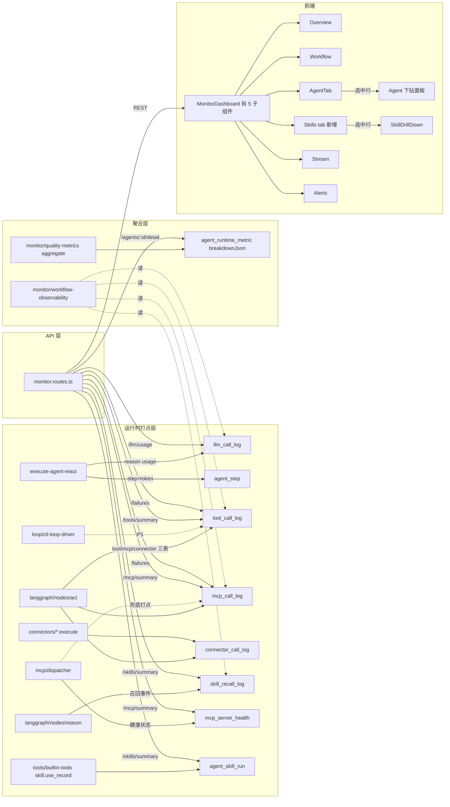

# QUBIT 监控/打点 v2 升级 技术方案

| 项 | 内容 |
|----|------|
| 文档状态 | 草稿（待 review） |
| 版本 | v0.1 |
| 作者 | 吴佳峻 · Cursor Agent |
| 更新日期 | 2026-05-26 |

> **关联记录**：本文档由 [QUBIT 监控/打点 v2 升级 方案对齐](64a1b3df-d8ec-4f96-b9c5-fa1ac3d4ad81)
> 任务发起；前置现状盘点见同会话中 explore 子代理的"现状报告"。

---

## 前言

QUBIT 当前已有 5-tab 的「运行监控」页（整体 / 工作流 / Agent / 实时流 / 告警与评测），
后端配套 `monitor.routes.ts` + `agent_step / tool_call_log / mcp_call_log / acp_call /
agent_runtime_metric / workflow_quality_snapshot / alert_event / agent_skill_run`
等 10+ 张打点/聚合表，已基本覆盖"workflow 维度"。

本次升级聚焦两个高频痛点：

1. **从 Skill / Tool / MCP 维度看不到成功率与失败原因**：现有 UI 只在单工作流详情里展示，
   缺跨工作流聚合 + 失败 case 下钻；`mcp_call_log` 缺 transport / 重试 / 熔断信息；
   `connector_call_log` 表已建但零写入；Skill 召回事件零打点。
2. **从 Agent 维度看不到下钻**：能看到 P50/P95 与运行/错误数（`agent_runtime_metric`），
   但点进去看"这个 Agent 调了哪些工具 / MCP / Skill、消耗多少 token"完全没有；
   token 只持久化了一个合并整数，丢失 model / provider / cost 维度。

**适用性判断**：研发工作量 ≥ 5 人/日、影响 7 张表 + 8 个后端文件 + 前端整页重构，
满足"研发技术优化项目 + 影响面较广"，按 tech-design-doc 团队模板撰写。

---

## 一、背景

### 1.1 技术现状

| 维度 | 现状 | 痛点 |
|---|---|---|
| **Tool** | `tool_call_log` 已记 toolName / status / latencyMs / errorMessage | 缺 workflowRunId 索引、缺 retryCount、缺 traceId、CLI loop 调用零打点 |
| **MCP** | `mcp_call_log` 与 tool_call_log 双写 | 缺 transport、重试、熔断状态；`/agents/mcp/test` 旁路调用不入表 |
| **Connector** | `connector_call_log` 表已建 | **零写入**，前端无视图 |
| **Skill** | `agent_skill_run` 仅在 LLM 调 `skill.use_record` 时写入 | 召回事件零打点（无法判断"召回但没用"） |
| **Agent** | `agent_runtime_metric` 每 24h 聚合一次 | 只有 P50/P95/successCount；无"该 Agent 调用工具/MCP 排行"、无 token 趋势 |
| **Token** | `agent_step.tokenCount` 单整数 | 丢 prompt/completion 分项、model、provider、cost；无 `llm_call_log` 表 |
| **前端监控页** | 5 tab 单文件 `MonitorDashboard.tsx` 1482 行 | 已成"大泥球"，缺下钻、缺失败 case 列表、缺 Skill tab |

### 1.2 期望收益

- **故障定位 -50% 时间**：从前端 monitor 页直接看到失败 case 列表 + 错误消息 + 触发步骤，
  不必再 SSH 进数据库 SELECT。
- **成本可视化**：按 provider / model / agent 切分 token 消耗，避免某次模型切换后账单失控才发现。
- **Agent 能力评估**：上线新 Agent 后，能 24h 内拿到"用了什么工具、token 多少、错误率多少"
  的数据卡，作为是否生产化的依据。
- **MCP 健康透明化**：哪个 MCP server 在熔断、最近一次失败原因，前端可见，对应自检 SOP 可写。

---

## 二、名词解释

| 名词 | 释义 |
|------|------|
| **打点 / 埋点** | 在代码运行时把"事件 + 指标"写入持久化表（区别于 in-memory `stepStreamBus`）。 |
| **Skill** | QUBIT 的"分析师 SOP" 制品，存于 `agent_skill` 表，召回后注入 LLM prompt。 |
| **Skill 召回** | reason 节点根据当前任务向量化检索 skill，注入 system prompt 的过程。 |
| **Tool** | LLM 显式输出的工具调用，分 4 种 `toolKind`：`builtin / acp_connector / mcp / skill`。 |
| **ACP Connector** | QUBIT 抽象的"对外服务客户端"，如 qubit-data、qubit-broker。 |
| **下钻（drilldown）** | 列表行选中后，原页面下方展开详情面板（不打断列表浏览，不弹窗）。 |
| **失败概要（summary）** | 本期失败日志展示粒度：errorMessage + status + stepIndex（不展开 trace）。 |

---

## 三、产研协作信息

| 项 | 内容 |
|----|------|
| 文档状态 | 草稿（待 review） |
| 相关文档 | [HITL_REDESIGN.md](HITL_REDESIGN.md)（监控页同一前端入口，UI 拆分时一并复用） |
| 产品 | 吴佳峻（自驱） |
| 需求技术 owner | 吴佳峻 |
| 服务端 | 吴佳峻 |
| 前端 | 吴佳峻 |
| 外部依赖方 | 无（纯自研，不依赖第三方） |
| 测试 | 自测 + bun test 单测；无独立 QA |

---

## 四、需求分析

### 4.1 功能影响范围

| 类型 | 影响项 | 变更说明 |
|------|--------|----------|
| **模块/服务** | `src/runtime/llm/gateway.ts` | LLM 调用结果落 `llm_call_log` 新表 |
| | `src/runtime/langgraph/execute-agent-react.ts` | `tokenCount` 写入改为 5 字段写入；新增 traceId 透传 |
| | `src/runtime/langgraph/nodes/{act,reason}.ts` | act 节点补 `tool_call_log.workflowRunId/traceId/retryCount`；reason 节点补 skill 召回事件 |
| | `src/runtime/mcp/dispatcher.ts` | `dispatchMcpToolCall` 内置兜底打点（旁路调用方也能写） |
| | `src/runtime/connectors/*` | 各 connector 在 `execute/healthcheck` 时写 `connector_call_log` |
| | `src/runtime/skills/skill-service.ts` | 新增 `recordRecall` 写召回事件 |
| | `src/runtime/monitor/quality-metrics.ts` | `aggregateAgentRuntimeMetrics` 升级为带 Agent 维度聚合明细 |
| | `src/runtime/monitor/workflow-observability.ts` | 增加跨工作流的 by-agent / by-skill / by-mcp 聚合查询 |
| **接口** | `GET /api/v1/monitor/agents/:definitionId/detail` | **新增**：Agent 详情下钻数据 |
| | `GET /api/v1/monitor/skills/summary` | **新增**：Skill 维度跨工作流聚合 |
| | `GET /api/v1/monitor/mcp/summary` | **新增**：MCP 维度跨工作流聚合（含熔断状态） |
| | `GET /api/v1/monitor/tools/summary` | **新增**：Tool 维度跨工作流聚合（含 retry 统计） |
| | `GET /api/v1/monitor/failures` | **新增**：失败 case 列表（按维度过滤） |
| | `GET /api/v1/monitor/llm/usage` | **新增**：token / cost 趋势查询 |
| | `POST /api/v1/monitor/alerts/scan` | **扩展**：增加 token_anomaly / mcp_circuit_open 两类 |
| **数据表/缓存** | `llm_call_log` | **新增**：LLM 调用粒度日志 |
| | `skill_recall_log` | **新增**：Skill 召回事件 |
| | `tool_call_log` | **修改**：+ workflowRunId / traceId / retryCount / tokenCount |
| | `mcp_call_log` | **修改**：+ transport / retryCount / circuitState |
| | `mcp_server_health` | **新增**：每个 server 的最后一次成功/失败时间 + failureStreak |
| | `connector_call_log` | **修改**：补 traceId 索引；增加 execute 时的真实写入路径 |
| | `agent_runtime_metric` | **修改**：增加 `breakdownJson` 存"调用了哪些工具/MCP/Skill 排行" |
| **配置/开关** | `.qubit/monitor.json`（新增） | 控制采样率（请求体大小>N KB 时只存 prefix）；控制 Skill 召回打点是否启用 |
| **前端** | `frontend/src/components/monitor/MonitorDashboard.tsx` | **拆分**为 5 子组件（按 tab） + 新增 `AgentDetailDrillDown / SkillsTab / FailuresPanel` |

### 4.2 问题拆解分析

**大问题**：让用户从 Skill/Tool/MCP/Agent 4 个维度看到成功率、失败原因、token 消耗。

- **子问题 1：数据缺失**——Skill 召回、CLI loop 工具调用、Connector init/health、
  MCP 旁路调用、Token 分项与 model/provider 都没入库。
  - **解法**：先补打点（不补就没数据），再补 API（不补就没视图），最后补 UI。
- **子问题 2：跨表聚合慢**——`tool_call_log` 无 workflowRunId 索引，按工作流过滤要 join
  `agent_step`。
  - **解法**：补冗余字段 + 索引；聚合查询走预聚合表 `agent_runtime_metric.breakdownJson`
    而非每次实时算。
- **子问题 3：UI 单文件 1482 行**——继续在原文件加 Skill tab + Agent 下钻会超 2000 行难维护。
  - **解法**：先拆分（按 tab 拆 5 个子组件），再加新功能；拆分作为本期 P0 第一个 commit。
- **子问题 4：失败日志展示粒度**——用户选了 summary 级，要避免引入 trace UI 的复杂度。
  - **解法**：`/monitor/failures` 接口只返回 `{ toolName, errorMessage, status, stepIndex,
    workflowRunId, agentRole, createdAt }`；前端列表行直接展示，不做 trace。
- **子问题 5：token 成本估算精度**——QUBIT 没接外部计费 API，只能用 provider model 价目表
  本地估算；价目表怎么维护？
  - **解法**：写在 `src/runtime/llm/model-pricing.ts` 内常量；本期不接动态价目，提供默认表 +
    `.qubit/model-pricing.json` 覆写能力。

### 4.3 数据库表结构变更

#### 4.3.1 新增表

##### `llm_call_log`
| 字段 | 类型 | 说明 |
|---|---|---|
| `id` | text PK | UUID |
| `workflowRunId` | text NOT NULL, FK→workflow_run | 归属工作流 |
| `agentStepId` | text NOT NULL, FK→agent_step | 关联 reason step |
| `traceId` | text NOT NULL | 跨表追踪 |
| `provider` | text NOT NULL | openai / anthropic / ollama / qwen / deepseek / mock |
| `model` | text NOT NULL | 实际使用的模型名（fallback 后） |
| `declaredModel` | text | LLM 配置里声明的模型名（与 model 不同代表走了 fallback） |
| `promptTokens` | integer | |
| `completionTokens` | integer | |
| `totalTokens` | integer | |
| `costUsd` | real | 由 model-pricing.ts 本地估算 |
| `latencyMs` | integer | |
| `status` | text enum(success/error/timeout) | |
| `errorMessage` | text | |
| `fallbackUsed` | integer (0/1) | 是否走过 provider fallback |
| `parseRetryUsed` | integer | LLM 响应解析重试次数 |
| `createdAt` | text NOT NULL | ISO timestamp |
| **索引** | `(workflowRunId, createdAt)`、`(provider, model, createdAt)` | |

##### `skill_recall_log`
| 字段 | 类型 | 说明 |
|---|---|---|
| `id` | text PK | |
| `workflowRunId` | text NOT NULL, FK | |
| `agentStepId` | text NOT NULL, FK→agent_step | reason 步 |
| `definitionId` | text NOT NULL, FK→agent_definition | 哪个 Agent 召回的 |
| `skillIdsJson` | text json NOT NULL | 召回的 skill id 数组 |
| `topK` | integer NOT NULL | |
| `latencyMs` | integer | 召回耗时 |
| `createdAt` | text NOT NULL | |
| **索引** | `(workflowRunId, createdAt)`、`(definitionId, createdAt)` | |

##### `mcp_server_health`
| 字段 | 类型 | 说明 |
|---|---|---|
| `id` | text PK | 等于 serverName |
| `serverName` | text NOT NULL UNIQUE | |
| `lastSuccessAt` | text | |
| `lastFailureAt` | text | |
| `lastFailureMessage` | text | |
| `failureStreak` | integer NOT NULL default 0 | 连续失败次数；命中阈值即认为熔断中 |
| `circuitState` | text enum(closed/open/half_open) default 'closed' | 与 dispatcher 内 in-memory 状态对账 |
| `updatedAt` | text NOT NULL | |

#### 4.3.2 修改表

| 表 | 操作 | 字段 | 说明 |
|---|---|---|---|
| `tool_call_log` | ADD | `workflow_run_id text` | 冗余；触发器或写入侧填充；建索引 `(workflow_run_id, created_at)` |
| | ADD | `trace_id text` | 跨表关联 |
| | ADD | `retry_count integer default 0` | 来自 `executeWithPolicy` |
| | ADD | `token_count integer` | 工具内部如果调 LLM（仅 builtin 部分），透传 token |
| `mcp_call_log` | ADD | `transport text` | stdio / http / ws |
| | ADD | `retry_count integer default 0` | |
| | ADD | `circuit_state text` | 失败时记下当时熔断器状态，便于复盘 |
| `connector_call_log` | ADD | `workflow_run_id text` | 同 tool_call_log，方便按工作流过滤 |
| | ADD INDEX | `(connector_instance_id, created_at)` | 列表查询提速 |
| `agent_runtime_metric` | ADD | `breakdown_json text` | 形如 `{tools: [{name,count,errCount}], mcps: [...], skills: [...], llm: {tokens, cost}}` |
| | ADD UNIQUE | `(definition_id, window_start, window_end)` | 防止聚合任务重复插入（**现状是无脑 insert，每次新窗口都重复**） |

#### 4.3.3 迁移与回滚

- 用 drizzle-kit generate 生成 `0047_monitoring_v2_step1.sql`（新增表）+ `0048_monitoring_v2_step2.sql`（修改表）。
- 新字段全部 nullable / 有默认值，不影响 v1 写入路径；**两段式上线**保证回滚安全：
  1. step1：建新表 + 旧字段保留；服务可双写或旁写。
  2. step2：新字段全部上线后，新代码切到"读旧 + 写新"双轨；旧 query 不变。
  3. 灰度后再 cleanup（v3 再考虑下线旧字段，**本期不删任何字段**）。
- 回滚策略：drizzle migration 不支持自动回滚；提供 `down-0047.sql` / `down-0048.sql` 手写脚本（DROP 列 / DROP 表）。生产无（本地优先项目）。

---

## 五、总体设计

### 5.1 技术调研 & 候选方案对比

| 方案 | 优点 | 缺点 | 适用条件 |
|------|------|------|----------|
| **A. 接 OTel / Grafana / Prometheus** | 业界标准；指标/trace/log 三件套 | 增加部署复杂度；与"本地优先 + 用户电脑跑"的产品哲学冲突；新依赖增加 ~50MB | 大规模 SaaS 项目 |
| **B. 在 SQLite 内自建打点表 + 自建 React Dashboard**（**选定**） | 与现有架构一致；零新依赖；前端已有 monitor 页 | 需要自己写聚合查询 + 注意索引 | 单机/桌面应用、数据量 < 千万级 |
| **C. 全量推送到 in-memory `stepStreamBus` 并落 ring buffer 文件** | 极轻；零 schema | 重启丢数据；无聚合能力 | 仅用于实时观测，不适合 24h 趋势 |
| **D. 接 Datadog MCP** | 已有 MCP 集成 | 用户数据要出本机，与产品定位冲突；账号成本 | 商业版本扩展 |

**选定方案**：**B（自建 SQLite + React Dashboard）**。

**选择依据**：
1. 产品定位 "**本地优先**、所有数据在 `~/.quant-agent` 目录"（见 PRODUCT_OVERVIEW.md §安全与可控性）排除了 A/D。
2. 现有 `agent_step / tool_call_log / mcp_call_log` 已是这个方向，本次只是**补齐 + 扩展**。
3. SQLite 在 GB 级数据 + 合理索引下查询能稳定 < 200ms，对单机/桌面够用。
4. 前端已有 Recharts，无需引入新可视化库。

### 5.2 总体架构



**关键设计原则**：

1. **打点优先于 API、API 优先于 UI**：本期分 3 阶段，每阶段都可独立可验证。
2. **写入侧低侵入**：所有新增打点必须 try/catch，失败不影响主链路。
3. **读取侧预聚合**：高频查询走 `agent_runtime_metric.breakdownJson`，避免实时 join 4 张表。
4. **采样与截断**：`requestJson > 8KB` 时只存 `{ truncated: true, head: ..., size: N }`，
   配置在 `.qubit/monitor.json:maxPayloadBytes`，默认 8192。

---

## 六、各模块详细设计

### 6.1 LLM 调用打点（llm_call_log）

- **目标**：把每次 LLM 调用持久化，承载 token / cost / model / fallback 信息。
- **流程**：
  ```mermaid
  sequenceDiagram
      participant R as reason node
      participant G as llmGateway.chat
      participant DB as llm_call_log
      R->>G: chat(messages)
      G->>G: 解析 usage / 估算 cost
      G-->>R: { content, usage, modelUsed, fallbackUsed, latencyMs }
      R->>DB: insert llm_call_log (best-effort)
      R->>S: agent_step.tokenCount = usage.totalTokens
  ```
- **接口/消息**：内部接口，无新 RPC。
- **数据读写**：
  - 写：`reason.ts` 在收到 `gatewayResult` 后 best-effort insert（不阻塞 reason 主链路）。
  - 读：`/monitor/llm/usage` 按 `provider/model/agentDefinitionId/timeRange` 分组聚合。
- **异常与边界**：
  - DB busy → 仅 console.warn，不抛错。
  - usage 全 undefined → 走 `estimateTokens` 兜底（与 mock 一致）；标 `fallbackEstimate=true` 放进 `errorMessage`（暂复用字段，P2 增独立字段）。
  - cost 算不出（pricing 表里没该 model）→ `costUsd = null`，前端展示 `—`。

### 6.2 Tool 调用打点升级

- **目标**：补 `workflowRunId / traceId / retryCount`；保持现有写入点不变（最小侵入）。
- **变更点**：`src/runtime/langgraph/nodes/act.ts`
  - L145-158 的初次 insert 增加 `workflowRunId: state.workflowId, traceId: state.traceId`。
  - 终态 update 时如果走过重试，写入 `retryCount`（重试逻辑在 `executeWithPolicy` 内，
    返回值已带 `attemptCount`，目前丢弃）。
- **CLI loop 工具打点**（P1）：在 `cli-loop-driver.ts:97` 后挂一个 best-effort
  `tool_call_log` 写入（toolKind=`builtin`, toolName=`cli/${command}`，
  requestJson=`{ cliCommand, argsCount }`）。粒度较粗但好歹有。
- **异常与边界**：写入 DB 失败一律不抛；act 节点主链路与打点解耦（已用 try/catch 包裹）。

### 6.3 MCP 调用打点升级 + 健康表

- **目标**：补 `transport / retryCount / circuitState`；新增 `mcp_server_health` 表 + 健康度查询。
- **变更点**：
  - `src/runtime/mcp/dispatcher.ts:dispatchMcpToolCall` 内置兜底打点：如果调用方没写
    `mcp_call_log`，dispatcher 自己写一条最小版本（无 agentStepId，但有 serverName / toolName / status / latencyMs）。**通过参数 `disableAutoLog: true` 允许调用方禁用**（避免 act.ts 双写）。
  - 熔断器状态机仍在内存（`dispatcher.ts` 内 Map），但在状态变化时同步 upsert `mcp_server_health`。
- **接口/消息**：
  ```ts
  // /api/v1/monitor/mcp/summary
  {
    timeRange: '24h' | '7d' | '30d',
    rows: Array<{
      serverName: string,
      toolName: string | null,        // null = server 维度聚合
      totalCalls: number,
      successRate: number,            // 0-1
      p50LatencyMs: number,
      p95LatencyMs: number,
      failureSamples: Array<{          // 最近 3 条失败
        errorCode: string,
        errorMessage: string,
        createdAt: string,
        workflowRunId: string,
      }>,
      circuitState?: 'closed' | 'open' | 'half_open',
      failureStreak?: number,
    }>
  }
  ```
- **异常与边界**：
  - 健康表 upsert 失败 → 不影响主调用。
  - 熔断器 in-memory 与 DB 状态短暂不一致（崩溃恢复期）→ 启动时 dispatcher 读 DB 还原。

### 6.4 Skill 召回打点（skill_recall_log）

- **目标**：在 reason 节点召回 skill 时写一条事件，让前端能展示"召回 N 次 / 实际被显式确认 M 次 / 召回但没用"。
- **变更点**：`src/runtime/langgraph/nodes/reason.ts:156-176`
  - 召回结束后 best-effort insert 一条 `skill_recall_log`。
  - 注意：`reason.ts` 当前可能并发执行多个 agent（MSA 团队），写入要带 `definitionId`。
- **本期定位**：
  - **不做**"自动归因后续工具调用回 skill"——用户选了 explicit_only 策略。
  - "Skill 成功率"前端 = `agent_skill_run.successCount / useCount`（现有数据），来自显式确认。
  - 召回事件只用来辅助展示"召回 vs 显式"对比图。
- **异常与边界**：写入失败 → 不影响 reason。

### 6.5 Connector 调用打点（启用现有空表）

- **目标**：把 `connector_call_log` 从"建了但不用"变成可用。
- **变更点**：各 Connector 类的 `execute / healthcheck / init / shutdown` 在调用前后写日志。
- **统一辅助函数**：`src/runtime/connectors/_log.ts` 新增 `withConnectorLogging(connectorInstanceId, operation, fn)` HOC，所有 connector 用它包裹真实调用。
- **异常与边界**：与上同；记得在 `operation='shutdown'` 时也写一条（追踪 connector 退出原因）。

### 6.6 Agent 维度聚合升级（breakdownJson）

- **目标**：`agent_runtime_metric` 增加 `breakdownJson` 字段，存"调用了哪些工具/MCP/Skill 排行"；前端 Agent tab 选中后下钻展示。
- **变更点**：`src/runtime/monitor/quality-metrics.ts:aggregateAgentRuntimeMetrics`
  - 按 `definitionId` 分组时，从该 Agent 窗口内的 `tool_call_log / mcp_call_log / agent_skill_run / llm_call_log` 聚合 top-10 工具 + token 总量 + cost 总量。
  - `breakdownJson` 结构（凝固契约）：
    ```ts
    type Breakdown = {
      tools: Array<{ toolName: string; toolKind: string; count: number; errCount: number; p50Ms: number }>;
      mcps:  Array<{ serverName: string; toolName: string; count: number; errCount: number }>;
      skills: Array<{ skillId: string; skillName: string; useCount: number; failCount: number }>;
      llm: { totalTokens: number; promptTokens: number; completionTokens: number; costUsd: number; byProvider: Array<{ provider: string; model: string; tokens: number; cost: number }> };
      failures: Array<{ at: string; layer: 'tool' | 'mcp' | 'llm'; name: string; errorMessage: string; workflowRunId: string }>;  // 最近 5 条
    };
    ```
- **聚合表加唯一索引** `(definition_id, window_start, window_end)`，UPSERT；前端不再需要 JS 去重。
- **聚合触发**：保持现状（手动 + 前端按钮），P2 引入定时调度（`scheduledJob` 表已有，挂个 `monitor_agent_aggregate` 任务）。
- **异常与边界**：聚合任务失败 → 不影响业务；该次聚合 row 不写入。

### 6.7 失败 case 列表（/monitor/failures）

- **目标**：一个统一端点返回最近 N 条失败，前端在 Skill/Tool/MCP/Agent 各 tab 内嵌"失败列表"卡。
- **接口**：
  ```ts
  // GET /api/v1/monitor/failures?dimension=tool|mcp|llm|connector
  //                            &scopeId=<toolName|serverName|definitionId>?
  //                            &timeRange=24h|7d|30d
  //                            &limit=50
  {
    rows: Array<{
      layer: 'tool' | 'mcp' | 'llm' | 'connector',
      name: string,             // toolName / serverName/toolName / model / connectorName
      status: string,           // error / timeout / sandbox_blocked
      stepIndex: number | null,
      errorMessage: string,     // 截断 500 字符
      workflowRunId: string,
      agentRole: string,
      createdAt: string,
    }>
  }
  ```
- **数据读写**：联合查询 4 张日志表 + 取最近 N 条 errorMessage（按 dimension 过滤）。SQL 用 UNION ALL + ORDER BY createdAt DESC LIMIT。
- **异常与边界**：每张表 SELECT 都加 `WHERE created_at > now - timeRange` 限制扫描范围；总查询时间 < 500ms。

### 6.8 前端拆分 + 新 tab + 下钻

- **目标**：把 `MonitorDashboard.tsx` 1482 行拆成 6 个子组件，新增 Skills tab + Agent 下钻面板。
- **目录结构**：
  ```
  frontend/src/components/monitor/
    MonitorDashboard.tsx       (主控，路由 tab，~150 行)
    OverviewTab.tsx            (现有内容拆出，~250 行)
    WorkflowTab.tsx            (现有内容拆出，~350 行)
    AgentTab.tsx               (现有内容拆出 + 下钻钩子，~250 行)
    AgentDetailDrillDown.tsx   (新增，~200 行)
    SkillsTab.tsx              (新增，~200 行)
    StreamTab.tsx              (现有，~150 行)
    AlertsEvalTab.tsx          (现有内容拆出，~250 行)
    FailuresPanel.tsx          (共用组件：跨 tab 嵌入失败列表)
  ```
- **下钻交互**：
  - Agent tab 表格行点击 → 触发 `setSelectedDefinitionId(id)` → 表格下方展开 `<AgentDetailDrillDown definitionId={id} />`。
  - 内部分 4 个子卡：工具调用 Top-10 / MCP 调用 Top-10 / Skill 显式确认 Top-10 / LLM token 与 cost 趋势 / 最近失败 5 条。
- **异常与边界**：选中行被删除时 drillDown 自动收起；切换 tab 清空 selection。

### 6.9 Alert 扩展（P1）

- 新增两类告警：
  - `mcp_circuit_open`：扫描 `mcp_server_health.circuitState='open'`，超过 5 分钟未自愈触发。
  - `token_anomaly`：扫描 `llm_call_log`，24h 内某 provider 用量比上周同时段涨 ≥ 2× 触发。
- 实现：`src/runtime/monitor/alert-service.ts` 增加两个扫描函数；`/monitor/alerts/scan-stuck` 端点重命名为 `/monitor/alerts/scan`（向后兼容）。

---

## 七、非功能设计

### 7.1 安全设计

| 数据 | 数据来源 | 数据敏感性(0-9) | 存放方式 | 安全级别 | 隔离级别 |
|------|----------|-------------------|----------|----------|----------|
| LLM prompt（含用户对话内容） | 用户 | 5 | SQLite（`requestJson` 字段，截断 8KB） | 中 | 单机进程内 |
| LLM api_key | 用户输入 | 8 | `.qubit/llm.json`（已有） | 高 | 不进监控表 |
| Token 消耗与 cost | 系统计算 | 2 | SQLite | 低 | 同主表 |

**安全问题一览**：

| 安全事项 | 是否涉及 | 考察结果 |
|----------|----------|----------|
| 监控表是否会把 api_key / secret 写入 `requestJson`？ | 是 | **强制在 `llmGateway` 出口剥除 `Authorization / api_key`**；新增单测 `llm-gateway-strip-secrets.test.ts` |
| `mcp_call_log.requestJson` 是否泄漏 broker 账号 | 是 | broker connector 已用 `redactSensitive`；扩展到 monitor 写入路径 |
| 跨 workflow 聚合是否泄漏跨用户数据 | 否 | 单机单用户，无多租户 |

### 7.2 稳定性设计

- **打点失败不影响主链路**：所有新增 insert/update 都包 try/catch + console.warn。
- **DB busy 重试策略**：复用 `runInTransaction` 既有 SQLITE_BUSY 退避；最多 3 次后放弃。
- **聚合任务幂等**：`(definition_id, window_start, window_end)` 唯一索引 + UPSERT；重复触发不会产生脏数据。
- **熔断器与 DB 状态对账**：dispatcher 启动时读 `mcp_server_health.circuitState` 还原内存状态（替代当前"重启即 closed"的不一致）。

### 7.3 性能设计

- **写入开销估算**：当前一次 reason+act 约写 4 条记录（agent_step + tool_call_log + mcp_call_log + acp_call）。新增 `llm_call_log` + `skill_recall_log` 后变 6 条；SQLite WAL 模式 6 条 insert ~5ms，可接受。
- **聚合查询索引**：
  - `tool_call_log (workflow_run_id, created_at)`
  - `mcp_call_log (server_name, created_at)`
  - `llm_call_log (provider, model, created_at)` + `(workflow_run_id, created_at)`
  - `skill_recall_log (definition_id, created_at)`
- **payload 截断**：`maxPayloadBytes` 默认 8192，对长 prompt / 大数据快照场景必备。
- **聚合频率**：触发式 + P2 定时（5 min 一次，避开整点）；单次聚合 < 200ms。

### 7.4 数据一致性 & 对账

- **打点表与业务表关系**：监控表不参与业务事务；写入失败不导致业务回滚。
- **聚合表与原始表对账**：每次聚合写入时同时更新 `agentRuntimeMetric.windowEnd`，前端展示"截至 X 时"提示，告知用户聚合表可能滞后。
- **MCP 熔断器内存/DB 对账**：dispatcher 启动还原；运行期每 30s 主动 flush 一次 in-memory 状态到 DB。

### 7.5 监控 & 统计

- **业务指标**：在新的 `/monitor/summary` 端点里增加：
  - 24h token 总量（与之前的 KPI 行合并）
  - 24h cost 估算
  - 24h 跨 MCP server 的最高错误率
  - 24h skill 召回数 / 显式确认数
- **报警规则**：mcp_circuit_open、token_anomaly（详见 §6.9）。

### 7.6 容灾设计

- **本地优先**：所有数据在 `~/.quant-agent`；用户备份 .qubit + sqlite 文件即可。
- **打点表丢失**：不影响业务（业务表完整即可恢复）。
- **聚合表丢失**：删除后重新聚合即可，按窗口扫历史日志重算。

### 7.7 部署方案

- 单机/桌面应用，无灰度概念；按"用户升级到下一个 release"作为升级节点。
- migration 自动执行（`db/sqlite/migrate.ts` 启动时跑），新字段 nullable，老数据可读。
- 用户从旧版升级后，**老的 agent_runtime_metric 行没有 breakdownJson**，前端要 fallback 显示"该窗口数据缺 breakdown，请重新聚合"。

---

## 八、工作量和排期

### 8.1 工作量

| 功能 | 项目 | 预估工时 | 备注 |
|------|------|----------|------|
| **P0-1 拆分 MonitorDashboard.tsx** | 前端 | 4h | 5 子组件，无逻辑改动 |
| **P0-2 失败列表组件** | 前端 + 后端 | 6h | FailuresPanel + `/monitor/failures` |
| **P0-3 Agent 下钻** | 前端 + 后端 + DB | 8h | AgentDetailDrillDown + breakdownJson + 聚合升级 + (definition_id, window) 唯一索引 |
| **P0-4 Skills tab** | 前端 + 后端 | 4h | 复用 agent_skill_run；展示召回 vs 显式 |
| **P0 单测** | 测试 | 3h | quality-metrics breakdown 单测、failures 路由单测 |
| **P1-1 llm_call_log + token 升级** | 后端 + DB | 6h | 新表 + gateway 改造 + reason 写入 + pricing |
| **P1-2 skill_recall_log + reason 节点写入** | 后端 + DB | 3h | |
| **P1-3 MCP transport/retry/circuit + 健康表** | 后端 + DB | 5h | dispatcher 改造 + 熔断对账 |
| **P1-4 Tool workflowRunId/traceId/retryCount** | 后端 + DB | 3h | act.ts 微调 |
| **P1-5 跨工作流 summary 端点 3 个** | 后端 | 4h | tools/mcp/llm summary |
| **P1 单测** | 测试 | 3h | gateway secret-strip / pricing 估算 / 健康表对账 |
| **P2-1 Connector 打点启用** | 后端 | 4h | withConnectorLogging HOC + 各 connector 适配 |
| **P2-2 CLI loop 工具粒度补打点** | 后端 | 3h | cli-loop-driver 写 tool_call_log |
| **P2-3 Alert 扩展 mcp_circuit_open / token_anomaly** | 后端 | 4h | alert-service.ts |
| **P2-4 定时聚合调度** | 后端 | 2h | scheduledJob 挂任务 |
| **P2 单测 + 文档收尾** | 测试 | 4h | |
| **总计** | | **~66h ≈ 8.3 人日** | 含自测；不含 review 与改稿 |

### 8.2 Milestone 任务拆分

| 阶段 | 任务 | 负责人 | 工时 | 依赖 |
|------|------|--------|------|------|
| **P0**（~3 天） | 拆分 Dashboard | 吴佳峻 | 0.5d | - |
| | 失败列表 + 端点 | 吴佳峻 | 1d | 拆分完成 |
| | Agent 下钻 + breakdownJson | 吴佳峻 | 1d | 拆分完成 |
| | Skills tab | 吴佳峻 | 0.5d | 拆分完成 |
| | P0 单测 + 提 PR | 吴佳峻 | 0.5d | 全部 P0 完成 |
| **P1**（~3 天） | llm_call_log + gateway | 吴佳峻 | 1d | P0 PR 合并 |
| | skill_recall_log | 吴佳峻 | 0.5d | P1-llm |
| | MCP 健康表 + transport | 吴佳峻 | 1d | - |
| | Tool 字段升级 | 吴佳峻 | 0.5d | - |
| | 3 个 summary 端点 + 前端集成 | 吴佳峻 | 0.5d | 上面全部 |
| | P1 单测 + 提 PR | 吴佳峻 | 0.5d | - |
| **P2**（~2 天） | Connector 打点 | 吴佳峻 | 0.5d | - |
| | CLI loop 打点 | 吴佳峻 | 0.5d | - |
| | Alert 扩展 | 吴佳峻 | 0.5d | P1-MCP |
| | 定时聚合 | 吴佳峻 | 0.25d | - |
| | 收尾 + 提 PR | 吴佳峻 | 0.25d | - |

**关键节点**：
- P0 PR 合并：是其它阶段的前置（前端拆分 + breakdownJson）
- P1 完成：用户即可拿到"跨工作流的 token / MCP 健康"视图，已是最大价值点
- P2：体验完善 + 长期数据质量保障

---

## 九、参考

| 标题 | 链接 |
|------|------|
| HITL_REDESIGN.md | docs/HITL_REDESIGN.md |
| AGENT_STABILITY_REVIEW.md | docs/AGENT_STABILITY_REVIEW.md |
| PRODUCT_OVERVIEW.md | docs/PRODUCT_OVERVIEW.md |
| Drizzle ORM Migration | https://orm.drizzle.team/kit-docs/overview |
| Recharts | https://recharts.org |

---

## 成稿自检

- [x] 适用性判断已说明（§前言）
- [x] 背景与目标清晰，非功能需求已识别（§一、§七）
- [x] 影响范围覆盖模块、接口、数据、配置、上下游（§4.1）
- [x] 问题已拆解；方案对比含取舍依据（§4.2、§5.1）
- [x] 总体架构/主流程有图（§5.2 mermaid）
- [x] 模块设计可指导开发（含错误与边界）（§6.1-6.9）
- [x] 涉及表变更时有字段级说明与迁移/回滚（§4.3）
- [x] 安全/稳定性/性能/监控/部署按需填写（§七）
- [x] 子任务与排期可执行，与协作方对齐（§八）
- [N/A] 新接口有 Proto/Thrift 草案（HTTP REST，TS 类型在 §6.3、§6.7 已给）
- [x] 图表与正文命名一致，关键异常路径已覆盖

---

## 待 review 决策点（请评审时确认）

1. **`tool_call_log` 增加 `workflow_run_id` 是否会破坏既有 join 查询？** —— 我看了 `workflow-observability.ts:78-86` 是 join `agent_step` 取 workflowRunId，新字段冗余后既有 join 仍然能跑，但**建议 P1 内统一改成读冗余字段**（性能更好）。
2. **`llm_call_log` 是否要写入 prompt 摘要？** —— 当前设计只写 token 数 + cost，不写 prompt 内容。如果排查需要"看具体提示词"建议从 `agent_step.action_json.params.messages` 取（已有），不重复存储。
3. **`mcp_server_health` 与 dispatcher 内存熔断器谁是 source of truth？** —— 设计选了"内存为主、DB 为持久化对账副本"。如果未来想跨进程共享熔断状态（多个 QUBIT 实例并发），需要改成 DB 为主，本期不做。
4. **`skill_recall_log` 是否要记录召回内容（skill body 哈希）？** —— 当前只记 skillIds + topK。如果要做"召回质量评估"P2 再加 `vectorScore` 字段。
5. **前端拆分时既有 `useEffect` 大量依赖 closure 怎么办？** —— 用 `useAppStore`（已有 zustand）做跨子组件的状态共享，避免 props drilling 5 层。
