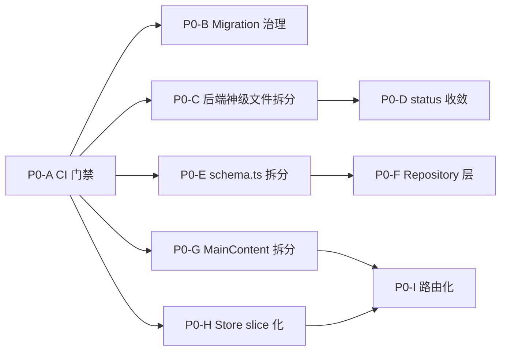

# QUBIT Agent · P0 治理修复方案

| 项 | 内容 |
|----|------|
| 标题 | QUBIT Agent 平台 - 架构 P0 治理修复方案 |
| 文档状态 | 草稿 |
| 版本 | v0.1 |
| 作者 / 日期 | 架构评估 / 2026-06-05 |
| 适用性 | 影响面较广的技术优化项目（工作量 ≥ 8 人/周） |
| 关联文档 | [ARCHITECTURE.md](./ARCHITECTURE.md) · [TODO_STABILITY_AND_HITL.md](./TODO_STABILITY_AND_HITL.md) |

---

## 1. 背景

2026-06-05 完成的架构评估发现，平台在「野心 ≫ 执行纪律」的张力下积累了 9 个 **P0（结构性）** 风险，分布在后端运行时、前端、数据层与工程化三个维度。它们的共同表现：

- **多处"上帝文件"**：单文件 1.6k–8.7k 行（详见 §3）。
- **抽象层"中间真空"**：DB 直写、路由直接挂业务、前端 single God Store + 无路由。
- **测试 / CI / 契约集体缺位**：仓库根 0 个 CI workflow，前端 0 个组件测试，Python 0 个测试。
- **补丁式 migration**：78 条迁移里 13 条是 `fix/drop/restore/consolidate/cleanup/redo`。

不修这些，团队规模交付会被持续放大的回归风险拖垮。但**修复必须保证「不影响当前功能」**——本文档每一项方案的核心约束。

## 2. 目标与不在范围内

### 2.1 目标

1. **行为零回归**：所有改造对外接口、对前端 UI、对持久化数据、对工作流执行行为**完全等价**。
2. **可观测的"债务还款"**：每项有"问题陈述 + 量化指标 + 验收标准 + 回滚预案 + 工作量估算"。
3. **渐进式落地**：12 周分 4 个里程碑，里程碑之间彼此**不阻塞**；任一里程碑可独立 ship。
4. **建立护栏**：CI / lint 规则 / migration checklist 在第 1 个里程碑就位，后续每一步都被自动化保护。

### 2.2 不在本次范围（明确拒绝）

| 拒绝项 | 原因 |
|--------|------|
| 把 SQLite 换成 Postgres | 单写者瓶颈是 P1 议题，先把 Repository 层做出来才有切换基础 |
| 引入 OpenAPI / codegen | 收益大但工作量高，应在前端 API 客户端按域拆分后再做 |
| 重写 LLM Gateway（1322 行） | 当前能跑、4 套 wire format 都活跃；动它收益不抵风险 |
| 重写 A2A 让所有 role handler 真用消息流 | 是 P1 议题，21/22 个 noop 不影响正确性，只影响"承诺感" |
| Tauri 安装包瘦身 | P1，与 P0 解耦 |
| 引入结构化 logger（pino 等） | P2，本次不动 |
| 重做 MainContent.tsx 的 UI / UX | **本次只做"组件提取"，不动一行业务逻辑** |
| 改 Zustand 为 Redux / Jotai | 不切换库，只做 slice 拆分 |

> **YAGNI 红线**：每个 PR 只做一件事；任何"顺手改一下"的诱惑都拒绝，留给后续迭代。

## 3. P0 清单概览

| ID | 主题 | 维度 | 量化指标（现状） | 量化目标 | 工作量 | 依赖 |
|----|------|------|----------------|---------|--------|------|
| P0-A | 拉起最小可用 CI 门禁 | 工程化 | 0 个 workflow；pre-commit 只查 2 条 TS error | 6 个 job（tsc/biome/test/migrate-drift/cargo check/frontend tsc+build）全 PR 必过 | 3 人日 | — |
| P0-B | Migration 治理流程 | 数据层 | 13/78 是补丁式；down 覆盖率 25%；曾出现 `0069 drop → 0072 restore` 与 `0077 静默失败 → 0078 part2` | 100% down 覆盖；强制 `--statement-breakpoint`；PR 评审 checklist；CI dry-run | 2 人日 | P0-A |
| P0-C | 后端神级文件机械拆分 | Runtime | `builtin-tools.ts` 1779、`agent.routes.ts` 2262、`monitor.routes.ts` 1616 | 单文件 ≤ 500 行；导出 API 与 URL 完全不变 | 8 人日（3 子任务） | P0-A |
| P0-D | `workflow_run.status` 写入收敛 | Runtime | `setWorkflowState` 仅 25 处；仍有 20+ 处直写绕过状态机 | 直写 0 处；ESLint/Biome 规则拦截；state machine warn → error | 4 人日 | P0-A, P0-C |
| P0-E | `schema.ts` 按上下文拆分 | 数据层 | 单文件 3292 行 / 100 张表 | 拆成 ~12 个文件；drizzle 多文件 export；命名导出**完全不变** | 3 人日 | P0-A |
| P0-F | 核心表 Repository 层 | 数据层 | 158 文件直接 `getDb`；`runInTransaction` 全仓 6 处 | 6 张核心表（`workflow_run`/`agent_instance`/`agent_step`/`a2a_message`/`agent_definition`/`tool_call_log`）走 Repository；新代码 lint 拦截直写 | 8 人日 | P0-E |
| P0-G | 前端 `MainContent.tsx` 拆分 | Frontend | 8764 行 / 4 业务组件同文件 / 196 useState / 39 useEffect | `MainContent.tsx` ≤ 400 行（只做路由派发）；ChatPanel / ConfigPanel / TeamDashboardPanel 各独立文件夹 | 10 人日（3 子任务） | P0-A |
| P0-H | 前端 Zustand store slice 化 | Frontend | 单 store 80+ 字段 God Object | 拆 5 个 slice（ui / chat / ide / trader / config）；保留兼容 façade 不破坏旧调用方 | 5 人日 | P0-A |
| P0-I | 前端引入路由化 | Frontend | 无 react-router；`activeView` if-else 决定渲染；不可深链 | `react-router-dom@6`；3 级视图 URL 化；store 与 URL 双向同步；浏览器前进后退可用 | 5 人日 | P0-G, P0-H |

**合计**：约 **48 人/日 ≈ 12 周**（按单人 50% 投入估算）。

### 3.1 依赖关系



> 关键路径：A → E → F（数据层）与 A → G → I（前端）并行可走；C/D 自成一条；B 是制度类小工作量。

## 4. 通用原则（如何保证"不影响现有功能"）

这套原则是每一项 P0 都要遵守的工程纪律：

### 4.1 机械重构优先

- **第一优先**：纯文件搬运、纯 import path 改写、纯 re-export 桥接；**不动一行业务逻辑**。
- 单 PR 大小 < 800 行 diff（机械重构允许 > 800 行，但必须仅含 git rename + import 调整）。
- 拆完之后跑：`grep -r 'import .* from .*<old-path>' src/ frontend/` 必须为 0；测试集全绿。

### 4.2 兼容性 façade

- 后端：原 `tools/builtin-tools.ts`、`agent.routes.ts` 等保留**只做 re-export 的薄壳文件**，外部消费者无需改 import path（一个迭代后再删壳）。
- 前端：原 `useAppStore` 保留兼容 façade，把字段透传到 slice store；现有组件零改动。
- 路由：现有 `activeView` Zustand 字段保留，新增 URL 同步层，**双向桥接**。

### 4.3 增量切换 + Feature Flag

- 关键行为切换（如 `setWorkflowState` 从 warn → error）走 env flag `QUBIT_STRICT_WORKFLOW_STATE`，先在 dev/test 开启，灰度 1 周后默认开启，再 1 周后移除 flag。
- React Router 切换：在 `App.tsx` 用 env `VITE_QUBIT_ROUTER=1` 控制是否启用，开发 + 自测期间双轨。

### 4.4 验收三件套

每个 P0 完成必须满足：

1. **`bun test` 全绿**（含新增测试）；
2. **`bun run check`（biome） + `tsc` 全绿**；
3. **手动 smoke checklist**（每项见对应 §5 小节），关键操作 5 分钟内可走完；
4. **性能回归**：关键路径（workflow 创建 → ReAct → final SSE）的端到端时延不超过基线 + 10%。

### 4.5 回滚策略

- **每个 P0 单独成 PR / 多个原子 PR**，commit 粒度可 `git revert` 单回滚。
- 数据库改动（仅 P0-F 的 Repository 层可能引入 transaction 边界）必须**只读语义不变**，所有写入操作可逐表 revert。
- Feature flag 全部默认值 = 旧行为，确保线上始终可回滚到老状态。

### 4.6 不引入新依赖（除非列在下方）

| 项目 | 新依赖 | 必要性 |
|------|--------|--------|
| P0-I | `react-router-dom@6` | 路由化是 P0 目标本身 |
| P0-A | `vitest` 或 `bun test` 已具备，无需新增 | — |
| 其他 P0 | **不引入** | 严格遵守 |

---

## 5. 详细方案（按 P0 编号展开）

> 每个 P0 包含：**问题 · 改造路径 · 验收 · 回滚 · 工作量**。

### P0-A · 拉起最小可用 CI 门禁

#### 问题
- 仓库根目录 0 个 `.github/workflows/*.yml` / 0 个 `.gitlab-ci.yml` / 0 个 `.circleci/`。
- 唯一自动化校验是 `scripts/git-hooks/pre-commit`，且**只 grep `TS2304/TS2552`**，其它 TS 错误、测试失败、Biome 违规、Rust 编译错误、文档漂移**全部依赖人工**。
- 配合 78 条迁移、100 张表的复杂度，回归风险量级很高。

#### 改造路径
1. **新增 `.github/workflows/ci.yml`**，包含以下 6 个 job（GitHub Actions / 内部 GitLab CI 二选一，按团队基础设施定）：
   - `backend-typecheck`: `bun install && bunx tsc -p tsconfig.json --noEmit`
   - `backend-lint`: `bun run check`（Biome）
   - `backend-test`: `bun test`（含 `migrate-drift.test.ts`，自动覆盖 P0-B 的 drift 检查）
   - `frontend-typecheck-build`: `bun --cwd frontend run build`（Vite + tsc）
   - `tauri-check`: `cd src-tauri && cargo check`
   - `acceptance-langgraph`（可选，nightly）：`bun run acceptance:langgraph`
2. **PR 必过门禁**：6 个 job 全绿才能 merge；建议 GitHub branch protection rule 同步打开。
3. **基础设施**：缓存 `bun.lock`、`Cargo.lock`、`~/.bun`、`target/` 加速。
4. **依赖 P0-B**：新增的 `bun test` 自动跑 migration drift 检查（已在 `src/db/sqlite/__tests__/migrate-drift.test.ts`）。

#### 验收
- [ ] 主分支 `main` 设置 branch protection，必须 6 个 job 全绿。
- [ ] 故意提交一个 TS 错误，CI 拦截。
- [ ] 故意提交一个 SQL migration 缺 down 文件，CI 拦截（依赖 P0-B 的 lint 脚本）。
- [ ] CI 单次运行 ≤ 8 分钟（缓存命中后 ≤ 5 分钟）。

#### 回滚
- 直接禁用 workflow 文件或 branch protection；无代码层依赖。

#### 工作量
**3 人日**：1 天写 workflow + 1 天调缓存命中率 + 1 天与团队同步 + 处理首批 false positive。

---

### P0-B · Migration 治理流程

#### 问题
- 78 条迁移里 **≥13 条** 是补丁式（`fix / drop / restore / consolidate / cleanup / redo`）；最戏剧的：
  - `0069_drop_connector_call_log.sql` → **`0072_restore_connector_call_log.sql`**（先删后恢复）
  - `0077_consolidate_user_workspaces.sql` 因缺 `--> statement-breakpoint` 被 bun:sqlite 静默只跑了第一条 → **`0078_consolidate_user_workspaces_part2.sql`** 补刀
- **down 文件覆盖率仅 25%**（98 - 78 = 20 个 down）。
- 无 ADR / CHANGELOG / MIGRATIONS.md，决策上下文埋在 SQL 注释里。

#### 改造路径
1. **新增 `scripts/lint-migrations.ts`**：
   - 每个 forward `0NNN_*.sql` 必须有同号 `down-0NNN.sql`（或允许显式 `0NNN_*.sql.no-down` 哨兵文件 + 评审 sign-off）。
   - 多语句 SQL 必须含 `--> statement-breakpoint`（bun:sqlite 静默截断的根因）。
   - 文件名禁止包含 `fix / restore / part2 / redo`（早期发现"已经在打补丁"的迹象，强迫合并为单条迁移）。
2. **CI 接入**（P0-A 的 backend-lint job 加一行 `bun run scripts/lint-migrations.ts`）。
3. **新增 `docs/MIGRATIONS.md`**，落地 PR 评审 checklist：
   - 是否新增 / 修改 / 删除字段、表？
   - 是否影响 100 个 JSON 列中的哪些？（明确列出）
   - 是否需要回填脚本？回填脚本是否幂等？
   - down 文件是否可逆？
   - 受影响的 runtime 模块（grep 表名）。
4. **`migrate.ts` 现有 drift fail-fast 不动**（这是仓库内最好的工程实践之一）。

#### 验收
- [ ] `scripts/lint-migrations.ts` 在仓库现状下能识别出 13 条历史补丁迁移（不阻塞 CI，只输出报告作为基线）；新增迁移触发硬拦截。
- [ ] `docs/MIGRATIONS.md` 评审 checklist 至少被一次 PR 实际填写。
- [ ] 1 个故意缺 `--> statement-breakpoint` 的 PR 被 CI 拒绝。

#### 回滚
- 删除 `scripts/lint-migrations.ts` 与 CI 步骤即可。

#### 工作量
**2 人日**：1 天写 lint 脚本 + 1 天写 MIGRATIONS.md 与团队同步规则。

---

### P0-C · 后端神级文件机械拆分（3 子任务）

#### 问题
- `src/runtime/tools/builtin-tools.ts` **1779 行**，45 个 handler 跨 `factor / rule / strategy / discovery / skills / memory / exec / sandbox / msa / agent-pool` **9 个域**。
- `src/routes/agent.routes.ts` **2262 行 / 76 端点**：agent definition CRUD + tool catalog + MCP catalog/install + pack 编辑 + 绑定 + prompt preview + reload + provider 设置 + memory inspector + binding override 全在一文件。
- `src/routes/monitor.routes.ts` **1616 行 / 71 端点**：监控全部端点。
- 影响：任何小改 trigger 全模块编译；merge conflict 概率高；新人无法靠目录定位代码。

#### 改造路径

##### 子任务 C-1：`builtin-tools.ts` 按域拆分（4 人日）
1. 新建 `src/runtime/tools/builtin/` 目录，按域建文件：
   - `factor.ts`（与 factor 相关的 handler，如 `factor.compute / factor.evaluate / factor.register`）
   - `strategy.ts`（`strategy.evaluate / strategy.run`）
   - `research.ts`（`research.kline / research.news / research.run_team`）
   - `discovery.ts`
   - `skill.ts`（`skill.list / skill.invoke`）
   - `memory.ts`（`memory.search / memory.write`）
   - `exec.ts`（`cli_agent.run / code.run_python`）
   - `sandbox.ts` / `msa.ts` / `agent.ts` 等按 grep `BUILTIN_HANDLERS` 实际分布定
2. 每个子文件 export `BUILTIN_HANDLERS_<DOMAIN>`，原 `builtin-tools.ts` 改为 ~50 行的 aggregator：
   ```typescript
   export const BUILTIN_HANDLERS = {
     ...BUILTIN_HANDLERS_FACTOR,
     ...BUILTIN_HANDLERS_STRATEGY,
     // ...
   } as const;
   ```
3. **保留 `dispatchBuiltinTool` 函数位置不变**（外部 act 节点依赖它）。
4. **不动 `tool-catalog.ts` / `tool-routes.ts`**（本子任务只拆 handler，元数据保留下一波）。

##### 子任务 C-2：`agent.routes.ts` 按域拆分（2 人日）
1. 新建 `src/routes/agent/` 目录：
   - `definition.routes.ts`（agent definition CRUD）
   - `tool-catalog.routes.ts`
   - `mcp-catalog.routes.ts`
   - `pack.routes.ts`
   - `binding.routes.ts`
   - `memory-inspector.routes.ts`
   - `provider.routes.ts`
2. 每个子文件 export 自己的 `Hono` 子 router，原 `agent.routes.ts` 改为 aggregator：
   ```typescript
   export const agentRouter = new Hono()
     .route("/definitions", definitionRouter)
     .route("/tool-catalog", toolCatalogRouter)
     // ...
   ```
3. **URL 完全不变**：外部 API URL 路径保持向后兼容。

##### 子任务 C-3：`monitor.routes.ts` 同上（2 人日）
- 拆 `monitor/overview.routes.ts`、`workflow.routes.ts`、`agent.routes.ts`、`stream.routes.ts`、`alerts-eval.routes.ts`、`memory.routes.ts`、`diagnostics.routes.ts`、`skills.routes.ts`（前端 `MonitorDashboard` 已经拆出对应 Tab，可作为命名参考）。

#### 验收
- [ ] 拆后所有文件 < 500 行（aggregator 文件除外，aggregator ≤ 100 行）。
- [ ] `bun test` 全绿；新增"工具完整性"测试：枚举 `BUILTIN_HANDLERS` keys 数量 = 拆分前。
- [ ] 手动 smoke：在 UI 触发 5 类常用 builtin tool（research / factor / strategy / skill / memory）行为完全一致。
- [ ] 外部 HTTP API URL 全部保留（curl 现有 `docs/PRODUCT_OVERVIEW.md` 列出的端点全部 200）。

#### 回滚
- 单 PR 粒度小、纯 git rename + import 调整；revert 即可。

#### 工作量
**8 人日**（C-1: 4 + C-2: 2 + C-3: 2）。

---

### P0-D · `workflow_run.status` 写入收敛

#### 问题
- `setWorkflowState`（`src/runtime/workflow/workflow-state-machine.ts:101`）注释里写"修了 25 处直写"，但**grep 下来新代码里仍有 20+ 处绕开它直写**：
  - `runtime/workflow/restore-running-workflows.ts:185`
  - `runtime/trader/trader-workflow.ts`（多处）
  - `runtime/strategy/strategy-runtime-service.ts`
  - `runtime/eval/pipeline.ts`
  - `runtime/discovery/discovery-service.ts`
  - `runtime/loop/external-loop-state.ts`
- 状态机的 transition 校验形同虚设；HITL pause / failed / completed 等状态可能被绕过校验直接写。

#### 改造路径
1. **第一步：让 `setWorkflowState` 成为唯一入口**（新增 ESLint/Biome 规则或自定义 `scripts/lint-status-writes.ts` 拦截 `.update(workflowRun).set({ status: ` 模式，例外名单 white-list）。
2. **第二步：补齐缺失的 transition**——遍历 20+ 处直写点，按它们想要的目标态调用 `setWorkflowState`，必要时给状态机加新的合法 transition。
3. **第三步：env flag `QUBIT_STRICT_WORKFLOW_STATE`**：
   - 当前 `setWorkflowState` 对非法 transition **只 warn 不 throw**；
   - 引入 flag，dev/test 默认 throw，prod 灰度 1 周后默认 throw；
   - 给所有"出错就回滚状态"的 trader / strategy / eval 路径加 unit test 验证状态合法。

#### 验收
- [ ] `rg "update\(workflowRun\)\.set\(\{ ?status" src/` 命中 0 处。
- [ ] `setWorkflowState` 调用点 ≥ 45 处（旧 25 + 新增 20）。
- [ ] `bun test` 全绿，新增 `workflow-state-machine.strict-transitions.test.ts` 至少 6 个用例（合法 / 非法 transition 对照）。
- [ ] 关键路径手动 smoke：workflow 创建 → ReAct 完成 → final SSE / HITL pause / failed / canceled / paused-resume 五条主路径行为完全一致。

#### 回滚
- 关闭 `QUBIT_STRICT_WORKFLOW_STATE` 退回 warn-only；编辑 lint 例外名单可临时放行个别绕过点。

#### 工作量
**4 人日**：1 天 lint 规则 + 2 天遍历 + 1 天 flag + smoke + 测试。

---

### P0-E · `schema.ts` 按上下文拆分

#### 问题
- 单文件 **3292 行 / 134 KB**，100 张表全集中。
- 任何 schema 改动都会触发整个文件重 compile；TS 服务卡顿可感知。

#### 改造路径
1. 按 bounded context 拆 ~12 个文件到 `src/db/sqlite/schema/`：
   - `workspace.ts`（workspace / project）
   - `chat.ts`（chat_session / chat_message / link）
   - `workflow.ts`（workflow_run / workflow_run_status / state machine 相关）
   - `agent.ts`（agent_definition / draft / release / agent_profile / agent_pack）
   - `agent-runtime.ts`（agent_instance / agent_step / a2a_message）
   - `tools.ts`（tool_call_log / mcp_call_log / sandbox_violation_log / mcp_server_config / mcp_tool_binding）
   - `connector.ts`
   - `memory.ts`（memory_v2 + legacy + workspace_memory）
   - `skills.ts`（skill_definition / skill_attempt / skill_promotion / skill_baseline）
   - `monitor.ts`（quality_metrics / timeseries / alerts / eval）
   - `trading.ts`（order_intent / execution / broker / risk）
   - `quant.ts`（factor / rule / strategy / backtest / discovery）
2. 新建 `src/db/sqlite/schema/index.ts` 重新 export 所有命名：
   ```typescript
   export * from "./workspace";
   export * from "./chat";
   // ...
   ```
3. **原 `src/db/sqlite/schema.ts` 文件转为 `export * from "./schema/index"`**，外部消费者零改动。
4. **drizzle 已支持多文件 export**：`drizzle.config.ts` 改 `schema: "src/db/sqlite/schema/index.ts"`，验证 `bun run db:generate` 产物完全一致。

#### 验收
- [ ] `bun run db:generate` 产物 diff = 0（最关键的验证）。
- [ ] `rg "from .* src/db/sqlite/schema" src/` 命中数不变；全部能通过 `index.ts` 解析。
- [ ] 每个拆分后的 `schema/*.ts` < 500 行。
- [ ] `bun test` 全绿。

#### 回滚
- `git revert` 一次性回到单文件 schema.ts。

#### 工作量
**3 人日**：2 天拆 + 1 天验证 + 团队同步 import 风格。

---

### P0-F · 核心表 Repository 层（不一次铺满）

#### 问题
- `src/runtime` 下 **158 个文件** 直接 `import { getDb } from "../../db/sqlite/client"` 后随手 select/insert/update。
- 全仓 `runInTransaction` 只有 **6 处**调用；多步写入大量是"裸 insert/update"，崩溃就半成品。
- 100 张表 + 100 个 JSON 列没有 schema 校验也无法走索引；schema 改字段时无编译器侧统一收口。

#### 改造路径

> **关键决策**：本次 P0 只做**核心 6 表**的 Repository，避免范围爆炸。其余表保留直写，列入 P1 backlog。

1. **新增 `src/db/repositories/`**：
   - `workflow-run.repo.ts`
   - `agent-instance.repo.ts`
   - `agent-step.repo.ts`
   - `a2a-message.repo.ts`
   - `agent-definition.repo.ts`
   - `tool-call-log.repo.ts`
2. **每个 repo 提供**：
   - 基础 CRUD（`findById / list / create / update / delete`）
   - 领域语义方法（如 `workflowRunRepo.markRunning / markCompleted` 内部调 `setWorkflowState`）
   - 显式 `withTransaction(...)` 入口
3. **`setWorkflowState`** 内部改用 `workflowRunRepo.updateStatus`（P0-D 联动）。
4. **lint 规则**：新增代码不允许在 `src/runtime/**` 直接 `import getDb`（已有 158 处旧代码保留，加 lint-baseline，新提交触发 lint error）。
5. **逐步迁移**：每周挑 3–5 个 runtime 文件迁到走 repo，约 10 周走完核心 30 个高频文件。本 P0 不要求全部迁完，只要"新代码走 repo + 6 个核心表的 repo 已建"。

#### 验收
- [ ] 6 个 repo 文件存在，每个 ≥ 80% 测试覆盖。
- [ ] `setWorkflowState` 走 `workflowRunRepo.updateStatus`。
- [ ] lint 规则生效，新增代码 `getDb` 在 runtime 内被拦截。
- [ ] 性能：单次 workflow 创建 + 一轮 ReAct + final 的端到端时延不超过基线 + 5%（用 acceptance:langgraph 跑前后对比）。

#### 回滚
- 删除 repo 文件 + 解除 lint 规则；`setWorkflowState` 内部回退到直接 `db.update`。

#### 工作量
**8 人日**：2 天每个 repo × 6 表里挑 3 张做精细（workflow_run / agent_instance / agent_step）+ 2 天 lint + 2 天测试 + 2 天 buffer。其余 3 个 repo 在后续 sprint 迭代补齐。

---

### P0-G · 前端 `MainContent.tsx` 拆分（3 子任务）

#### 问题
- 单文件 **8764 行**，4 业务组件挤在 layout 目录：
  - `MainContent`（壳）
  - `ChatPanel`（~1100 行）
  - `ConfigPanel`（~2970 行，96 useState）
  - `TeamDashboardPanel`（~4200 行）
  - `PendingHitlFetchRow`
- **196 个 useState / 39 个 useEffect / 100 处内联 `style={`**。
- 仓库内 `monitor/MonitorDashboard.tsx` 已经做过同样拆分（从 1481 行拆到 757 行 + 8 个 Tab），有现成模板。

#### 改造路径（严格机械重构）

##### 子任务 G-1：抽出 `ChatPanel`（3 人日）
1. 新建 `frontend/src/components/chat/ChatPanel.tsx`，把现有 `ChatPanel` 组件、辅助 hooks、styled helpers **整段移过去**。
2. 原 `MainContent.tsx` 改为 `import { ChatPanel } from "../chat/ChatPanel"`。
3. **不拆 props / 不抽 sub-component / 不改样式**——纯文件搬运。

##### 子任务 G-2：抽出 `ConfigPanel`（4 人日）
1. 新建 `frontend/src/components/config/ConfigPanel.tsx`（与现有 `config/` 目录合并）。
2. 把 `MainContent.tsx` 内嵌的 `ConfigPanel` + 子辅助函数搬出。
3. 内联 100 处 `useState` 全部保留（不做状态拆分，下一波再做）。

##### 子任务 G-3：抽出 `TeamDashboardPanel`（3 人日）
1. 新建 `frontend/src/components/team/TeamDashboardPanel.tsx`。
2. 搬运 + 调 import。
3. 验证现有 5 个 `team/` 子组件无 import path 冲突。

#### 验收
- [ ] `MainContent.tsx` ≤ 400 行（只做路由派发 + 顶级 hooks）。
- [ ] 拆后三个 Panel 文件各 < 5000 行（注：本次不要求 < 500，是先把 layout 与业务解耦）。
- [ ] `bun --cwd frontend run build` 全绿，bundle 大小变化 < 5%。
- [ ] 手动 smoke：5 个一级 tab（chat / config / team / monitor / quant）全部正常切换，**所有 useState / 表单状态在切换不丢**（这是为什么不动状态结构）。
- [ ] HMR 重载时间下降（开发体验提升的可观测指标）。

#### 回滚
- 单 PR 粒度小；`git revert` 单条 commit 即可恢复原 `MainContent.tsx`。

#### 工作量
**10 人日**（G-1: 3 + G-2: 4 + G-3: 3）。

---

### P0-H · 前端 Zustand store slice 化

#### 问题
- `frontend/src/store/index.ts` **468 行**单 store，~80 个字段：
  - 后端连通性 + 外观 (palette/style) + `activeView` 路由 + `configSubPage / quantTab` + ChartSpec + IDE 源码 / 面板布局 + Chat 会话/消息 + Stream 事件 + Trader 4 张表 + Trader 配置 + agents config 缓存
- **无 slice 模式 / 无 middleware（无 persist / devtools / immer）**。
- 任意 selector 失误就触发跨页全局重渲染。

#### 改造路径
1. **保留 `useAppStore` 兼容 façade**，对外 API 不变。
2. **拆 5 个 slice**：
   - `useUiStore`：palette / style / activeView / configSubPage / quantTab / explorerOpen
   - `useChatStore`：会话 / 消息 / stream 事件
   - `useIdeStore`：IDE 源码 / ChartSpec / 面板可见性
   - `useTraderStore`：markers / logs / drivers / agent messages / config
   - `useAgentsConfigStore`：agents config 缓存 + setter
3. **`useAppStore` 改为 thin façade**：每个旧字段通过 selector 转发到对应 slice store。
4. **新增 `zustand/middleware/persist`** 显式管理 localStorage key（顺带统一 4 套前缀为 `qubit:` 单一前缀）。
5. **新增 `zustand/middleware/devtools`**（dev 环境开启）。
6. 旧组件**零改动**：仍然 `useAppStore(s => s.activeView)` 能拿到字段。

#### 验收
- [ ] 5 个 slice store 文件各 < 200 行。
- [ ] `useAppStore` façade 文件 < 200 行。
- [ ] React DevTools 中能看到 5 个独立 store；切换 activeView 时 `useChatStore` 内消费者不重渲染（用 React Profiler 验证）。
- [ ] localStorage key 统一前缀；写一个一次性 migration 函数把旧 key（`qubit:` / `qubit-` / `qb.` / `qubit_`）合并到新前缀。
- [ ] 手动 smoke：刷新页面 5 次以上的状态（palette / explorerOpen / trader config）正确恢复。

#### 回滚
- `useAppStore` façade 改回原单 store 实现；slice 文件保留但不被使用。

#### 工作量
**5 人日**。

---

### P0-I · 前端引入路由化

#### 问题
- 前端 **无 react-router**，"路由"靠 `useAppStore.activeView` + `configSubPage` + `quantTab` 三层枚举驱动 if-else 渲染（`MainContent.tsx:205-268`）。
- 后果：**不可深链、不可前进后退、刷新丢上下文**。
- 当前已有 9 个一级视图 + 9 个 config 子页 + 4 个 quant 子页，规模早过了"不需要路由"的阈值。

#### 改造路径
1. **引入 `react-router-dom@6`**（前端依赖唯一新增项）。
2. **URL schema**：
   - `/chat` / `/team` / `/ide` / `/monitor` / `/trader` / `/quant` / `/config`
   - `/config/:subPage`（agent / mcp / model / skill / provider / runtime / binding / pack / inspector）
   - `/quant/:tab`（factor / discovery / backtest / scenario）
3. **store 与 URL 双向同步**：
   - URL 变 → 写 `useUiStore.activeView`（兼容旧 selector）
   - `useUiStore.activeView` 变 → `navigate(url)`
   - 通过 `useEffect` + `useNavigate` 实现，禁止死循环（用 ref 守卫）。
4. **`MainContent.tsx` 改为路由派发器**：
   ```tsx
   <Routes>
     <Route path="/chat" element={<ChatPanel />} />
     <Route path="/config/*" element={<ConfigPanel />} />
     {/* ... */}
   </Routes>
   ```
5. **env flag `VITE_QUBIT_ROUTER=1`**：开发阶段双轨；稳定后默认开启，再 1 周后移除 flag。
6. **Tauri 兼容**：用 `HashRouter` 避免 Tauri WebView 下深链 404（Tauri 不像 web server 能 fallback）。

#### 验收
- [ ] URL `/config/agent` 直接访问可定位到 agent 配置子页。
- [ ] 浏览器前进 / 后退按钮可用，状态正确恢复。
- [ ] 刷新 `/quant/factor` 保留 quant tab 状态。
- [ ] Tauri 桌面端正常工作（HashRouter 不在地址栏暴露 hash 即可）。
- [ ] 手动 smoke：所有现有交互（包括 sidebar 切换 / config 子页 / quant tab）行为完全一致。

#### 回滚
- 关闭 `VITE_QUBIT_ROUTER` flag，回退到旧 `activeView` 渲染。

#### 工作量
**5 人日**。

---

## 6. 排期与里程碑

### 6.1 4 个里程碑（每个 ~3 周）

| 里程碑 | 时间 | 范围 | 出货价值 |
|--------|------|------|---------|
| **M1 · 护栏** | W1–W3 | P0-A（CI 门禁）+ P0-B（migration 治理）+ P0-C-1（builtin-tools 拆分）+ P0-E（schema 拆分） | 自动化护栏到位；最大两座神山倒下；后续每一步都被 CI 兜底 |
| **M2 · 后端治理** | W4–W6 | P0-C-2/C-3（两个 routes 拆分）+ P0-D（status 收敛）+ P0-F 起步（建 3 个核心 repo） | 后端 P0 全部就位；DB 写入有边界 |
| **M3 · 前端结构** | W7–W9 | P0-G-1/G-2（ChatPanel / ConfigPanel 抽出）+ P0-H（store slice 化） | `MainContent.tsx` 从 8.7k → ≤ 5k；store 不再是 God Object |
| **M4 · 前端路由** | W10–W12 | P0-G-3（TeamDashboardPanel 抽出）+ P0-I（路由化）+ P0-F 收尾（剩 3 个 repo） | 前端 P0 全部就位；URL 可深链；P0 总体落地 |

### 6.2 资源假设
- 假设 1 名工程师 50% 投入（每周 ~20 小时净开发时间），可与日常业务并行。
- 如全职投入，工期可压缩到 ~6 周。

### 6.3 关键检查点
- **W3 末**：CI 已生效，至少有 1 个 PR 被 CI 拦下并修复。
- **W6 末**：跑一次 `bun run acceptance:langgraph`，端到端 ReAct 行为零回归。
- **W9 末**：前端 bundle 体积、HMR 时间、首屏 TTI 对比基线，回归 ≤ 5%。
- **W12 末**：所有 9 个 P0 关闭，整理"复盘文档"列出非预期问题与遗留 P1 事项。

## 7. 风险与缓解

| 风险 | 概率 | 影响 | 缓解 |
|------|------|------|------|
| 神级文件拆分时漏抓某个隐式依赖（如顶层 `void registerBuiltinConnectors()`） | 中 | 启动失败 | 拆分前先用 `grep -r '<old-export-name>' src/` 全量找引用；CI 的 `bun test` 兜底 |
| `workflow_run.status` 强校验后线上出现"非法 transition"实际是历史合法（漏标） | 中 | 工作流卡住 | 先 1 周 warn 收集；warn 日志中出现的 transition 全部加入合法集后再升级到 throw |
| Repository 层引入额外函数调用造成性能回归 | 低 | 端到端时延上涨 | acceptance:langgraph 对比基线；不允许 > +10% |
| `schema.ts` 拆分后 drizzle 类型推导失败 | 低 | TS 编译错误 | 先小范围（2 张表）试拆 + `db:generate` diff = 0 验证 |
| 前端拆分后状态丢失（switch tab 表单清空） | 中 | UX 问题 | 子任务 G-1/G-2/G-3 严格机械重构，不动 useState 结构；smoke checklist 校验 |
| 路由化后 Tauri 桌面端 404 | 中 | 桌面功能不可用 | 用 HashRouter；feature flag 双轨期间在 Tauri 端单独验证 |
| Migration lint 误伤合法补丁（如真有"先 drop 再 restore"业务需求） | 低 | PR 被卡 | lint 支持 `--allow-patch` 哨兵注释，PR 评审 sign-off 即可放行 |
| Schema / route 拆分引发大量 merge conflict（其他分支同期改这些文件） | 中 | 协同摩擦 | 在拆分前 freeze 这些文件 1 天 + 通知所有正在开发的分支先 rebase / 合并 |

## 8. 进度跟踪表（待填）

| ID | 状态 | PR | 完成日期 | 备注 |
|----|------|----|---------|------|
| P0-A | TODO | | | |
| P0-B | TODO | | | |
| P0-C-1 | TODO | | | |
| P0-C-2 | TODO | | | |
| P0-C-3 | TODO | | | |
| P0-D | TODO | | | |
| P0-E | TODO | | | |
| P0-F | TODO | | | |
| P0-G-1 | TODO | | | |
| P0-G-2 | TODO | | | |
| P0-G-3 | TODO | | | |
| P0-H | TODO | | | |
| P0-I | TODO | | | |

## 9. 不进入本次 P0 的事项（明确留到下一轮）

为避免 scope creep，下列 **P1 / P2 议题** 明确**不在本文档范围**，但在 P0 完成后应优先评估：

- **P1**：A2A 21/22 role handler 真正用消息流（兑现"事件驱动"承诺）
- **P1**：前端 API 客户端 `backend.ts` 4628 行按域拆分 + 引入 React Query / SWR
- **P1**：Tauri 安装包瘦身（剥离 Python venv / 减小 Bun runtime 占比）
- **P1**：包管理器统一（去掉 frontend/pnpm-lock.yaml 真用 Bun workspace）
- **P1**：Python 连接器加 OpenAPI 契约 + 单元测试
- **P1**：环境变量收敛到 `config.ts` + dump 端点
- **P2**：结构化 logger（pino）
- **P2**：前端样式 token 强制落地（消化 2903 处内联 style）
- **P2**：i18n 在剩余 47 / 72 组件铺满
- **P2**：ADR / CHANGELOG / 文档与代码同步度

---

*本文档随实施进展同步更新；任一节落地后请把 §8 状态从 TODO 改为 IN-REVIEW → DONE，并在 §7 风险表追加实际踩到的坑。*
