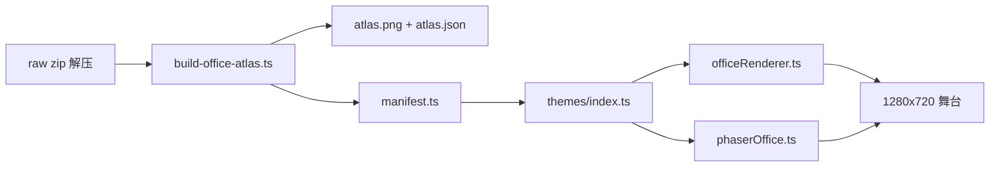

# 像素办公室画风升级计划

> **状态**：待实施（计划已确认，尚未开工）  
> **创建日期**：2026-05-24  
> **前置提交**：`5c73553` — Phaser 引擎 + ArkPixel 字体 + BFS 寻路  
> **相关文档**：[PIXEL_OFFICE_EXTENSIBILITY.md](./PIXEL_OFFICE_EXTENSIBILITY.md)

---

## 1. 背景与目标

用户提供的参考图（水景办公室、精灵森林办公室）来自 [Star-Office-UI](https://github.com/ringhyacinth/Star-Office-UI)。该仓库**代码 MIT**，但**美术资产禁止商用**（仅学习/演示）。因此不能直接拷贝其 PNG，只能借鉴布局与氛围。

**本轮目标**：在保留现有透视场景、猫咪程序化精灵、Phaser/Canvas 双引擎、BFS 寻路的前提下：

1. 将家具/装饰从「程序化 Canvas 绘制」升级为「手绘 sprite 资产」
2. 建立主题切换框架，落地 **Modern / Modern-Night / Cozy** 三套皮肤
3. 画面精致度目标：接近参考图的 **70–80%**（剩余 20–30% 为手绘环境艺术：树根、莲池、苔藓、墙画等，CC0 资产暂无，需后续单独迭代）

**不做的事**：

- 不替换猫咪（继续 `spriteAtlas.ts` 程序化生成，作为项目 IP）
- 本轮不做「精灵森林 / 水景」主题（仅预留主题注册 API）
- 不删除程序化绘制路径（作为 fallback）
- 不改寻路算法核心（仅更新家具阻挡半径数据）

---

## 2. 已确认的决策（2026-05-24 对话）

| 维度 | 选择 |
|------|------|
| 方向 | **D**：手绘 CC0/CC-BY 资产 + 多主题皮肤 |
| 资产来源 | **CC0 + CC-BY 4.0 可商用**（接受 UI 角落署名） |
| 视角 | **A**：保留透视，按 `depthScale` 缩放 sprite |
| 主题范围 | **Modern + Modern-Night + Cozy** 三套 |
| 引擎 | Canvas（默认）+ Phaser（懒加载）均支持主题 |

---

## 3. 资产选型

### 3.1 计划使用的资产包

| 资产 | 协议 | 用途 | 体积 | 下载 |
|------|------|------|------|------|
| [Antea Free Furniture Office Set](https://stcrbcn.itch.io/furniture-office-set) | **CC-BY 4.0** | 40+ 家具：办公桌、椅子、书架、文件柜、打印机、售货机、白板等 | ~37 KB | itch.io「Name your own price」→ 0 |
| [2dPig Pixel Office Asset Pack](https://2dpig.itch.io/pixel-office) | **CC0** | 杂件：植物、电脑、相框、装饰 | ~49 KB | 同上 |
| Ark Pixel 12px proportional | **OFL 1.1** | 字体（已接入 `fonts.ts`） | ~46 KB | 已在仓库 |

### 3.2 明确不使用的资产

| 资产 | 原因 |
|------|------|
| Star-Office-UI 仓库内美术 | LICENSE：禁止商用 |
| LimeZu Modern Interiors **免费版** | 仅非商用；商用需付费 ≥$1.50 |
| Kenney 等通用包 | 无现代办公室精细家具，不足以支撑目标 |

### 3.3 署名要求（CC-BY）

- 左下角状态条旁：极小灰字 `Art: Antea, 2dPig · Font: Ark Pixel`
- 工具栏「i」按钮 → 完整 Credits 弹窗
- 文档：[docs/PIXEL_OFFICE_CREDITS.md](./PIXEL_OFFICE_CREDITS.md)（实施时新建）

---

## 4. 目录结构（实施后）

> 命名约定：**assets 目录用 kebab-case** (`pixel-office`)，**lib/源码模块用 camelCase** (`pixelOffice`)，与现有 `frontend/src/assets/pixel-office/skyline-*.png` 和 `frontend/src/lib/pixelOffice/` 保持一致。

```
frontend/
  scripts/
    build-office-atlas.ts          # 资产构建：raw PNG → atlas + manifest
  src/
    assets/pixel-office/
      README.md                      # 本地下载/解压指引（入库）
      raw/                           # 用户下载的 zip 解压目录（gitignore）
        antea-furniture/
        2dpig-office/
      themes/
        modern/
          atlas.png                  # 构建产物（入库）
          atlas.json                 # Phaser atlas 帧坐标
          manifest.ts                # 语义映射 + attribution
    lib/pixelOffice/
      themes/                        # 新增
        index.ts                     # registerTheme / getActiveTheme
        types.ts                     # ThemeDescriptor
        modern.ts
        modernNight.ts               # 复用 modern atlas + 夜晚滤镜
        cozy.ts                      # 复用 modern atlas + 暖色滤镜
      themeAssets.ts                 # Canvas + Phaser 通用加载
  components/team/
    PixelOfficeCredits.tsx           # 署名弹窗
docs/
  PIXEL_OFFICE_ART_UPGRADE_PLAN.md   # 本文档
  PIXEL_OFFICE_CREDITS.md            # 实施时：完整 attribution
```

### 4.1 `.gitignore` 补充（**已落地** 2026-05-25）

```
frontend/src/assets/pixel-office/raw/
```

仅入库 `themes/modern/atlas.*` 与 `manifest.ts`，不入库原始 zip。

---

## 5. 架构设计

### 5.1 数据流



### 5.2 主题描述符接口

```typescript
// frontend/src/lib/pixelOffice/themes/types.ts

export type ThemeId = "modern" | "modern_night" | "cozy";

export type ThemeDescriptor = {
  id: ThemeId;
  label: string;
  atlas: {
    image: string;       // Vite import URL
    json: string;        // Phaser atlas JSON
    manifest: ThemeManifest;
  };
  palette: ThemePalette; // 地板、墙体、天空、灯光基色
  filter: {
    overlayColor?: string;
    overlayAlpha?: number;
    ambientLight?: number;
    bloom?: number;      // 显示器/台灯发光
  };
  decorations: DecorationPreset;
};

export type ThemeManifest = {
  desk: string[];
  chair: string[];
  monitor: string[];
  bookshelf: string[];
  plant: string[];
  coffee: string[];
  printer: string[];
  // ... 按构建脚本分类结果扩展
  attribution: { name: string; license: string; url: string }[];
};
```

### 5.3 三套主题差异

| 主题 | Atlas | 后处理 | 装饰 |
|------|-------|--------|------|
| `modern` | Antea + 2dPig 合并 | 无 | 默认密度 |
| `modern_night` | 同上 | 蓝紫 overlay α≈0.35；monitor/lamp bloom ×2；窗外深蓝 | 弱化白天装饰 |
| `cozy` | 同上 | 暖橙 overlay α≈0.15；亮度 +5% | 增咖啡杯、画框、地毯密度 |

Night / Cozy **不增加 atlas 体积**，仅滤镜与布置差异。

### 5.4 透视适配（方案 A）

- Sprite 锚点：`(0.5, 1.0)`（底中），与现有 Y 排序 `setDepth(1000 + y)` 一致
- 缩放：沿用 [officePerspective.ts](../frontend/src/lib/pixelOffice/officePerspective.ts) 的 `depthScale(depth)`
- 每个家具：`drawDropShadow`（[starOfficeStyle.ts](../frontend/src/lib/pixelOffice/starOfficeStyle.ts)）+ 椭圆地面阴影
- 寻路： [officePathfinding.ts](../frontend/src/lib/pixelOffice/officePathfinding.ts) 阻挡半径改为基于 sprite 实际尺寸
- 调参旋钮：[config.ts](../frontend/src/lib/pixelOffice/config.ts) 增加 `themeScaleFactor`

---

## 6. 实施步骤（建议顺序）

### Phase 0：换机准备（你来做，~5 分钟）

1. 下载两个 itch.io 包（见 §3.1）
2. 解压到：
   - `frontend/src/assets/pixel-office/raw/antea-furniture/`
   - `frontend/src/assets/pixel-office/raw/2dpig-office/`

> 详细步骤与协议提示见：[`frontend/src/assets/pixel-office/README.md`](../frontend/src/assets/pixel-office/README.md)（已落地，2026-05-25）。
> `raw/` 目录已加入 `.gitignore`，不会误提交。

### Phase 1：资产管线（~60 min）

- [ ] 新增 dev 依赖：`spritesmith`、`sharp`（或等价方案）
- [ ] 实现 [frontend/scripts/build-office-atlas.ts](../frontend/scripts/build-office-atlas.ts)
  - 扫描 raw PNG，按文件名关键词分类（desk/chair/monitor/…）
  - 输出 `themes/modern/atlas.png`、`atlas.json`、`manifest.ts`
  - 打印「未分类 sprite」列表供手动 override
- [ ] `package.json` 增加：`"build:office-atlas": "bun run scripts/build-office-atlas.ts"`
- [ ] 跑通构建，确认 atlas < 80 KB

### Phase 2：主题系统骨架（~60 min）

- [ ] `frontend/src/lib/pixelOffice/themes/*`
- [ ] `themeAssets.ts`：`loadThemeAssetsForCanvas` / `loadThemeAssetsForPhaser`
- [ ] localStorage key：`qb-pixel-office-theme`
- [ ] 默认主题：`modern`

### Phase 3：渲染接入（~90 min）

- [ ] [officeRenderer.ts](../frontend/src/lib/pixelOffice/officeRenderer.ts)：家具绘制「sprite 优先，程序化 fallback」
- [ ] [phaserOffice.ts](../frontend/src/lib/pixelOffice/phaserOffice.ts)：`preload` atlas；家具 `scene.add.sprite`；主题 filter pipeline
- [ ] [officePathfinding.ts](../frontend/src/lib/pixelOffice/officePathfinding.ts)：更新 `buildPathGrid` 阻挡几何
- [ ] 猫咪层不动：[phaserCatAtlas.ts](../frontend/src/lib/pixelOffice/phaserCatAtlas.ts)

### Phase 4：UI 与主题皮肤（~60 min）

- [ ] [TeamAgentPixelOffice.tsx](../frontend/src/components/team/TeamAgentPixelOffice.tsx)：主题下拉 + Credits 按钮
- [ ] [TeamAgentPhaserOffice.tsx](../frontend/src/components/team/TeamAgentPhaserOffice.tsx)：主题变更时 refresh
- [ ] [pixel-office.css](../frontend/src/theme/styles/pixel-office.css)：工具栏主题选择器样式
- [ ] `PixelOfficeCredits.tsx` + `docs/PIXEL_OFFICE_CREDITS.md`

### Phase 5：验收（~30 min）

- [ ] `bun run build:office-atlas` 成功
- [ ] `cd frontend && bun run build`（tsc + vite）无错
- [ ] 现有 pathfinding 测试 + 新增「sprite 尺寸阻挡」测试
- [ ] Canvas / Phaser 三主题切换正常
- [ ] 角落署名 + Credits 弹窗可见

---

## 7. 关键代码改造点（现有文件）

| 文件 | 改动要点 |
|------|----------|
| [officeRenderer.ts](../frontend/src/lib/pixelOffice/officeRenderer.ts) | `drawWorkstation` / 家具：优先 `drawSpriteFromAtlas` |
| [phaserOffice.ts](../frontend/src/lib/pixelOffice/phaserOffice.ts) | 背景仍 CanvasTexture；家具改 Phaser Sprite；主题 overlay |
| [officePathfinding.ts](../frontend/src/lib/pixelOffice/officePathfinding.ts) | `paintCircle` 半径来自 manifest 元数据 |
| [config.ts](../frontend/src/lib/pixelOffice/config.ts) | `themeScaleFactor`、默认主题 id |
| [TeamAgentPixelOffice.tsx](../frontend/src/components/team/TeamAgentPixelOffice.tsx) | 主题 state、持久化、Credits |
| [officeProps.ts](../frontend/src/lib/pixelOffice/officeProps.ts) | 部分程序化装饰可被主题 `decorations` 替代或叠加 |

---

## 8. 风险与缓解

| 风险 | 缓解 |
|------|------|
| Antea/2dPig 为 top-down，透视场景略「飘」 | 底中锚点 + 椭圆阴影 + `themeScaleFactor` 微调 |
| 自动分类漏帧 | 构建脚本输出未分类列表；`manifest.ts` 手动 override |
| 猫咪与家具风格不完全一致 | 接受：猫咪为 IP 核心，差异化可接受 |
| 精灵森林/水景无法本轮交付 | 主题注册表预留 `registerTheme`；后续 AI 生成或付费包 |
| raw 资产未下载导致 CI 失败 | atlas 构建产物**入库**；CI 不跑 `build-office-atlas` |

---

## 9. 工时估算

| 阶段 | 时长 |
|------|------|
| Phase 0 资产下载 | 5 min（用户） |
| Phase 1 资产管线 | 60 min |
| Phase 2 主题骨架 | 60 min |
| Phase 3 渲染接入 | 90 min |
| Phase 4 UI + 三主题 | 60 min |
| Phase 5 验收 | 30 min |
| **合计** | **~5 小时**（不含环境艺术） |

---

## 10. 后续迭代（超出本轮）

1. **环境艺术主题**：水景（莲池、锦鲤）、精灵森林（古树、苔藓、符文）— 需 AI 生成或付费 tileset
2. **商用资产升级**：LimeZu Modern Interiors 付费版（$1.50+）或 Pixel Life Office Essentials
3. **猫咪 HD 化**：可选第二套 cat atlas，与家具风格统一
4. **Star Office 布局编辑器**：参考其 `layout.js` 做可配置工位（见扩展架构文档）

---

## 11. 换机开发 checklist

```bash
git pull origin main
cd frontend && bun install
# 若需重构建 atlas（改了 raw 资产时）：
bun run build:office-atlas
# 开发：
bun run dev
# 验证：
bun run build
bun test src/lib/pixelOffice/officePathfinding.test.ts
```

办公室入口：团队视图 → 像素办公室 → 工具栏可切换 Canvas / Phaser 引擎。

---

## 12. 参考链接

- Star-Office-UI（参考仅，资产不可商用）：https://github.com/ringhyacinth/Star-Office-UI  
- Antea Office Furniture：https://stcrbcn.itch.io/furniture-office-set  
- 2dPig Pixel Office：https://2dpig.itch.io/pixel-office  
- 已落地 Phaser 集成提交：`5c73553`
