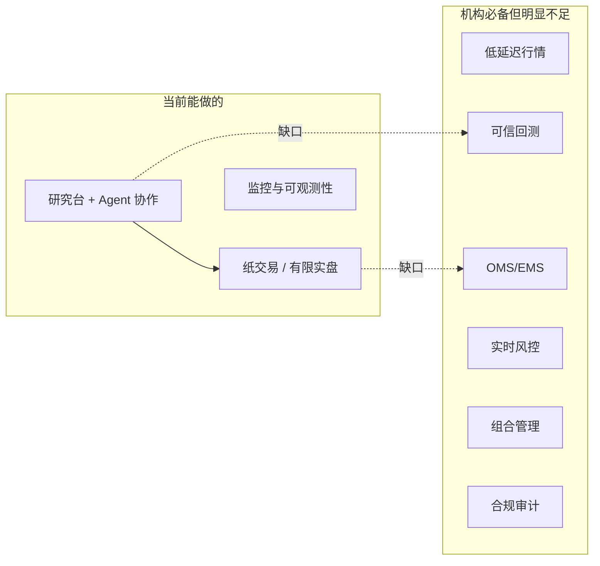

# QUBIT 量化就绪度评估

本文档基于当前代码实现（截至 2026-05），评估 QUBIT Agent 是否具备「像量化公司一样运作」的能力，按层级梳理欠缺，并给出量化执行层的实现建议。

产品定位参见 [`ARCHITECTURE.md`](./ARCHITECTURE.md)：**量化研究多 Agent 平台**——对话驱动研究、多分析师协作、K 线 IDE、回测与实盘编排一体化，而非机构级 OMS/EMS。

---

## 1. 总体结论

**当前更像「Agent 驱动的量化研究工作台 + 轻量执行编排」，尚不能按专业量化公司的标准完整运作。**

已打通的可运行业务链：

```
研究（多 Agent / MSA）→ 信号融合 / veto → 简易回测 → 策略 runtime
    → order_intent → 预交易风控 → execution_task → 券商（纸 / 实盘）
```

| 场景 | 能否承担 |
|------|----------|
| 量化研究员工作台 | ✅ 较好 |
| 策略原型 + 纸交易验证 | ✅ 可用 |
| 小资金、低频、人工确认的实盘 | ⚠️ 有条件（Live 闸门 + 券商桥 + 风控规则需配齐） |
| 多策略自动化实盘、机构资金 | ❌ 不建议 |
| 高频 / 做市 / 严格合规场景 | ❌ 不具备 |

---

## 2. 系统能力概览

### 2.1 项目结构

| 层级 | 路径 | 说明 |
|------|------|------|
| 后端 API + Runtime | `src/` | Bun + TypeScript + Hono；LangGraph ReAct；工作流 / 执行 / 策略 worker |
| 前端 | `frontend/` | Vite + React；研究工作台、IDE、监控、券商配置 |
| 桌面壳 | `src-tauri/` | Tauri v2；Sidecar 拉起 `qubit` 二进制 |
| Python 桥 | `python_connectors/` | AkShare 行情、Futu / IB / CCXT 券商 HTTP 服务 |
| 数据目录 | `~/.quant-agent`（`QUBIT_DATA_DIR`） | SQLite、DuckDB、LanceDB、工作流产物 |

启动顺序（`src/index.ts`）：迁移 → `startAllAgents()` → `restoreRunningStrategies()` → `workflowScheduler` / `executionWorker` / `strategyRuntimeWorker` → HTTP + WS。

### 2.2 关键模块速查

| 主题 | 路径 |
|------|------|
| 架构文档 | `docs/ARCHITECTURE.md` |
| DB Schema | `src/db/sqlite/schema.ts` |
| K 线路由 | `src/runtime/market/klines-data-source.ts` |
| 订单 + 执行 | `src/runtime/execution/order-intent-service.ts` |
| 执行派发 | `src/runtime/execution/execution-dispatcher.ts` |
| 预交易风控 | `src/runtime/execution/pre-trade-risk.ts` |
| 券商服务 | `src/runtime/reia/broker-service.ts` |
| 策略 Worker | `src/runtime/strategy/strategy-runtime-worker.ts` |
| 回测 SMA | `src/runtime/market/backtest-engine.ts` |
| 研究团队 | `src/runtime/msa/analyst-team.ts` |
| 角色 Handler | `src/runtime/handlers/role-handlers.ts` |
| ReAct 核心 | `src/runtime/langgraph/execute-agent-react.ts` |
| 监控 UI | `frontend/src/components/monitor/MonitorDashboard.tsx` |
| Python 券商桥 | `python_connectors/broker_http_server.py` |

---

## 3. 按层级评估：已有能力与欠缺

### 3.1 研究层（Research）——相对最强

**已有：**

- 多分析师 MSA（`analyst-team-pipeline.ts`）：拓扑 wave、信号融合、辩论、veto
- ReAct + MCP + Connector 扩展
- 新闻 RSS、K 线预取、regime 等

**欠缺：**

- 缺乏 **point-in-time** 基本面 / 因子库，研究结论难以严格防前视偏差
- 研究产出与「可交易信号」之间缺少统一的 **信号 schema / 版本化 / 归因**
- 无另类数据、无统一证券主数据（corporate actions、复权一致性）

**评价：** 接近「量化公司的研究台（Research Desk）」雏形，但数据深度和可复现性不足。

---

### 3.2 策略与回测层（Alpha / Backtest）——明显偏弱

**已有：**

- SMA 内置回测（`backtest-engine.ts`）
- Python 信号脚本（`signal-evaluator.ts`）
- `strategy-runtime-worker`（默认约 30s 轮询 + HTTP 拉 K 线）
- `strategy_signal_dedup`、仓位 snapshot

**欠缺：**

- 无 **事件驱动**、无 tick / 逐笔级仿真
- 滑点 / 冲击 / 费率模型简陋；paper 多为即时成交
- 回测与实盘语义不一致（延迟、部分成交、集合竞价等未建模）
- 无多策略资金分配、无组合级约束回测

**评价：** 适合验证想法，**不能**作为上线前的机构级回测依据。

---

### 3.3 风控层（Risk）——有骨架，非实时风险引擎

**已有：**

- `pre-trade-risk.ts`：`kill_switch`、`max_notional`、review 工单
- MSA `veto-engine`（启发式）
- A2A 对 `ORDER_INTENT` 的 HMAC 签名（`role-handlers.ts`）
- `QUBIT_LIVE_TRADING_ENABLED` 闸门（`live-trading-gate.ts`，默认关）

**欠缺：**

- 无 **盘中实时** 敞口 / VaR / 行业集中度监控
- LLM veto 与 DB 规则未完全统一，难审计
- 无分层限额（账户 / 策略 / 品种 / 交易员）
- 无压力测试、无合规规则库、无监管报送链路

**评价：** 有「下单前闸门」，缺「组合级、持续运行的风险中枢」。

---

### 3.4 执行层（Execution / OMS）——最大短板之一

**已有：**

- 统一管线：`order_intent` → `execution_task` → `execution-dispatcher`
- Paper 即时成交；Live 经 Futu / IB / CCXT Python 桥
- `execution-worker` 约 1.5s 轮询

**欠缺：**

- 无 TWAP / VWAP / POV 等算法单
- 无智能路由、无 TCA、无交易所级对账
- 延迟与可靠性不适合低延迟或高频
- **架构债：双轨模型**——`order_intent` 管线 vs 旧 `intent_order` / REIA（`intent-engine.ts`、`reia-bridge.ts`）

**评价：** 是「意图下单 + 简单派发」，不是量化公司的 **EMS / OMS**。

---

### 3.5 行情层（Market Data）——研究够用，交易不够

**已有：**

- 多源 K 线路由：东财 / AkShare / Yahoo / Binance / Tushare（`klines-data-source.ts`）
- REST 拉取；简化 crypto tick

**欠缺：**

- 无统一 L1 / L2、无逐笔、无低延迟推送
- 策略 / runtime 依赖 HTTP 轮询，时钟不同步
- 无行情质量监控（停牌、涨跌停、异常价）
- A 股实盘缺少可靠 tick / 盘口驱动

**评价：** 支撑图表与日线研究；**不能**支撑对执行质量敏感的策略。

---

### 3.6 组合与 PM 层（Portfolio）——几乎空白

**已有：**

- `strategy_position_snapshot`（单策略按 symbol qty）
- `brokerGetPositions` 查询券商持仓
- DuckDB `position_snapshot`（分析向）
- `portfolio_manager` 种子 Agent 定义

**欠缺：**

- 无跨策略 **资金预算、风险预算、再平衡**
- 无目标权重、无优化器、无行业 / 因子暴露管理
- 仓位 sizing 多为固定 `orderQty`；无 vol targeting / Kelly / 风险平价

**评价：** 单策略可跑，**不能**像 PM 一样管多策略组合。

---

### 3.7 平台与运维（Infra / Ops）——单机一体化

**已有：**

- SQLite + DuckDB + LanceDB
- MonitorDashboard + SSE 步骤流（`monitor-summary.ts`、`alert-service.ts`）
- `audit_log`、A2A 消息、tool / MCP 调用日志

**欠缺：**

- 无 HA、无消息队列、无分布式时钟
- 非不可篡改审计；双轨下订单血缘不完整
- 无灾备、无多环境（dev / staging / prod）标准隔离

**评价：** 适合本地 / 小团队；**不能**承载机构级 SLA 与监管要求。

---

## 4. 与量化公司对照



### 4.1 机构级差距对照表

| 领域 | 现状 | 机构级期望 |
|------|------|------------|
| 行情 | REST 多源 K 线；简化 tick | 低延迟 L1/L2、逐笔、统一证券主数据、Corporate Actions |
| 回测 | SMA + 轻量 Python 脚本 | 事件驱动、滑点/冲击模型、多资产组合回测、因子库 |
| 执行 | 市价/限价意图；paper 即时成交 | 智能路由、算法单（TWAP/VWAP）、TCA、多账户 OMS |
| 风控 | 少量 JSON 规则 + MSA 启发式 veto | 实时风险引擎、限额层级、合规规则库、压力测试 |
| 组合 | 单策略 snapshot | PM 系统、风险预算、行业/因子暴露、再平衡 |
| 基础设施 | 单机 Bun + SQLite | 分布式、高可用、消息队列、时钟同步、灾备 |
| 合规审计 | `audit_log` + 步骤日志 | 不可篡改审计、监管报送、完整订单血缘 |
| 研究数据 | 新闻 RSS、Yahoo | 基本面库、另类数据、point-in-time 数据库 |

### 4.2 相对优势

- Agent 编排、可视化 IDE、本地一体化
- MCP / Skills 扩展
- 研究团队协作与可观测性较完整

---

## 5. 量化执行层实现建议

按机构常见分层说明目标形态，并映射到现有代码的演进方向。

### 5.1 目标架构

```
策略 / Agent 信号
    ↓
Order Intent（统一模型，废弃双轨）
    ↓
Pre-Trade Risk（规则引擎 + 可选人工 review）
    ↓
OMS（订单生命周期、改撤、父子单）
    ↓
EMS / 算法执行（TWAP/VWAP/直连）
    ↓
Broker Adapter（Futu / IB / CCXT …）
    ↓
Post-Trade（成交回报、对账、TCA、audit）
```

### 5.2 统一订单领域模型（最先做）

- **单一真相**：以 `order_intent` + `execution_task` 为主路径，逐步弃用 `intent_order` / REIA 并行路径。
- **Intent 字段标准化**：symbol、side、qty/notional、order_type（MKT/LMT/STP）、time_in_force、strategy_id、parent_id、idempotency_key。
- **状态机**：`created → risk_checked → submitted → partial → filled/canceled/rejected`，事件写入 `execution_task_event`。

### 5.3 OMS 层（Order Management）

职责：**管订单，不管怎么成交**。

| 能力 | 说明 |
|------|------|
| 订单簿 | 当日所有 intent / task / broker_order 的可查询视图 |
| 改单 / 撤单 | 向 broker 转发 cancel / replace，并同步状态 |
| 父子单 | 组合调仓拆成多个 child intent，带 `parent_order_id` |
| 幂等 | 将 `strategy_signal_dedup` 提升到 OMS 级 |
| 调度模式 | 统一 `paper` / `live_with_confirm` / `live_direct` |

实现上：在 `order-intent-service.ts`、`execution-worker.ts`、`execution-dispatcher.ts` 外包一层 **OrderService**，避免策略 worker 与 Agent 直接写多张表。

### 5.4 EMS 层（Execution Management）

职责：**管怎么成交、成交质量**。

| 能力 | 优先级 |
|------|--------|
| 直连下单（市价 / 限价） | P0 — Live 路径已有雏形 |
| 算法单（TWAP / VWAP / POV） | P1 — 新建 `execution_algo` 表 + 定时 slice 子单 |
| 智能路由（多券商 / 多通道） | P2 — 在 `broker-service` 上增加 routing 策略 |
| TCA（成交 vs arrival/mid） | P2 — post-trade 分析，反哺策略 |

Paper 模式建议升级：**不是即时满仓成交**，而是带滑点、延迟、部分成交的仿真器（可向 `executeIntentPaper` 模型靠拢并统一到 dispatcher）。

### 5.5 风控与执行解耦

- **Pre-trade**（现有 `pre-trade-risk.ts`）：单笔 notional、kill switch、品种黑白名单、交易时段。
- **Intraday risk**（新建）：定时拉持仓 + 行情，算敞口、集中度、日亏损；触发则 block 新单 + 可选自动 flatten。
- **Post-trade**：成交后更新 `strategy_position_snapshot` 与组合视图；与 broker 持仓对账。

风控结果应 **只写 `risk_decision` + 签名**，执行层只消费 `allow/block/review`，不让 LLM veto 绕过 DB 规则。

### 5.6 行情与执行的耦合

| 策略类型 | 行情需求 | 执行建议 |
|----------|----------|----------|
| 日线 / 低频 | 现有 HTTP K 线 + 30s worker 可接受 | OMS 市价/限价 + 收盘前窗口检查 |
| 分钟级 | 需要分钟 bar 推送或更短轮询 | EMS 简单 TWAP |
| 日内 / tick | 需要 tick/盘口 WebSocket | 独立 **market-data service**，与 Bun 主进程解耦 |

执行层不应在每个 tick 里 `queryBarsRange`；应由 **行情服务推送 bar close 事件** 触发策略，减少与回测的语义偏差。

### 5.7 Broker 适配层

保持 `broker-connector` 抽象，接口对齐机构常见语义：

- `placeOrder` / `cancelOrder` / `replaceOrder`
- `subscribeFills` / `subscribeOrders`（WebSocket 或轮询补偿）
- `getPositions` / `getBuyingPower`
- 统一错误码与重试策略（`executeWithPolicy`）

Python 桥（`broker_http_server.py`）适合原型；规模化后考虑 **独立 broker-gateway 进程** + 消息队列。

### 5.8 可观测与合规（执行侧）

- **订单血缘**：`signal_id → intent_id → task_id → broker_order_id → fill_id`
- **不可变审计**：关键状态变更 append-only；扩展 `audit_log` action 类型
- **对账任务**：日终 broker fills vs 本地 fills；差异告警进 MonitorDashboard

### 5.9 实施路线图

1. **统一订单模型**，消除双轨
2. **加固 pre-trade + 幂等 + 状态机**
3. **Paper 仿真器**（滑点/部分成交）与回测对齐
4. **Live 回报订阅 + 对账**
5. **OMS API**（查询/撤单/组合单）
6. **EMS 算法单**（TWAP 起步）
7. **盘中风控 + 组合视图**
8. **行情服务解耦**（按需）

---

## 6. 总结

| 问题 | 答案 |
|------|------|
| 能否像量化公司一样运作？ | **研究侧接近「量化公司的研究台」；交易侧仍是「研究平台 + 简易执行」**，不能等同于完整量化公司运营体系。 |
| 哪些层面欠缺？ | 行情（实时/质量）、回测（事件驱动/可信度）、执行（OMS/EMS/TCA）、组合 PM、盘中风控、基础设施与合规审计。 |
| 执行层怎么实现？ | **统一 Intent → OMS（生命周期）→ EMS（算法与路由）→ Broker Adapter → Post-Trade/对账**；先收敛双轨与状态机，再补仿真、回报订阅和算法单，最后做盘中风控与行情解耦。 |

核心优势是 **Agent 编排 + 研究协作 + 可观测性**。若目标是「小型量化团队能日常用」，应把投入集中在 **统一执行管线 + 可信 paper + 对账**；若目标是「机构级量化公司」，行情、回测、OMS/EMS、组合风控需要独立建设，而不是在现有 Agent 层上继续堆功能。

---

## 相关文档

- [`ARCHITECTURE.md`](./ARCHITECTURE.md) — 平台架构与领域模型
- [`LOOP_DRIVERS.md`](./LOOP_DRIVERS.md) — Loop Kind 与执行路径
