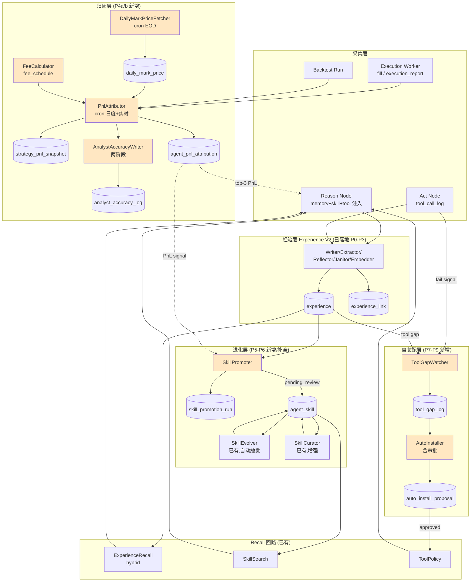

# Self-Evolving Agent + Data Flywheel 技术方案

| 文档状态 | 草稿（持续迭代，每期落地后更新） |
|---|---|
| 版本 | v0.1（P4a 落地） |
| 作者 | Cursor Agent + maintainer |
| 更新日期 | 2026-06-03 |
| 关联文档 | [MEMORY_V2_DESIGN.md](./MEMORY_V2_DESIGN.md) / [MONITORING_V2_DESIGN.md](./MONITORING_V2_DESIGN.md) |

---

## 一、背景

### 1.1 目标定义

把 Qubit Agent 从"听话的 ReAct 执行者"升级为"用得越多越聪明、缺什么自己补"的自进化系统。具体三大能力：

| 能力 | 含义 | 飞轮角色 |
|---|---|---|
| **A. 闭环数据采集** | 从「选股 → 因子 → 策略 → 下单 → 实盘成交 → PnL」全链路打通 lineage | 飞轮的"燃料" |
| **B. Skill 自进化** | 每次任务沉淀为可复用 skill，自动演化 / 淘汰 / 晋升 | 飞轮的"本体" |
| **C. 工具自配置** | Agent 发现工具缺口 → 自主装配 MCP / 升级 builtin tool | 飞轮的"自愈" |

### 1.2 现状评估（2026-06-03）

记号：✅ 已具备 / 🟡 骨架在但断点 / ❌ 不存在。

| 模块 | 现状 | 关键证据 |
|---|---|---|
| Memory V2（5 pipes + hybrid recall） | ✅ | P0-P3 全量落地（[MEMORY_V2_DESIGN.md](./MEMORY_V2_DESIGN.md)） |
| Skill schema + 谱系（4 表） | ✅ | `agent_skill / _run / curator_run / evolution_run`（`schema.ts:2343`） |
| Skill 维护（Curator + Evolver） | ✅ | `skill-curator.ts` + `skill-evolve.ts` |
| Skill 召回 + 注入 prompt | ✅ | `reason.ts:225-267` + `skill_recall_log` |
| Factor / Strategy / Backtest 分层 | ✅ | `factor_definition` → `strategy_version` → `strategy_composition` → `strategy_runtime` |
| 工具调用观测（tool/mcp/acp log） | ✅ | 3 张 log 表 + `workflow_quality_snapshot` 聚合 |
| **🟡 Procedural Experience → Skill 晋升** | 🟡 | Extractor 写 `experience(kind=procedural)`，但**无 Promoter** |
| **🟡 Reflective Experience → Skill 修订** | 🟡 | Reflector 写 reflective，但**不会自动调 SkillEvolver** |
| **❌ PnL 反馈回灌** | ❌ | `fill / execution_report` 只到撮合；无 PnL 时序；`analyst_accuracy_log` 0 writer |
| **❌ Skill / Strategy 真实收益指标** | ❌ | `agent_skill.successCount` 只代表"调用成功"≠"赚钱" |
| **❌ Agent 自主装配工具** | ❌ | 仓库 0 处 `autoInstall`；MCP / Skill Market 全是 UI 手动装 |
| **❌ Tool 失败 → 自动修复 / 替代** | ❌ | reason 解析失败仅重试 1 次，无替代工具推荐 |

### 1.3 飞轮三处断点

```
 ┌─────────────┐   ✅采集    ┌─────────────┐   ❌断点1: PnL 不聚合    ┌─────────────┐
 │  选股决策     │ ─────────→ │ 实盘成交/回测 │ ─────────────────────→ │  收益归因     │
 └─────────────┘             └─────────────┘                          └─────────────┘
        ▲                                                                     │
        │                                                                     ▼
 ┌─────────────┐  🟡断点2: 经验→skill 不晋升  ┌─────────────┐  ❌断点3: agent 不会自配工具
 │ Reason + Skill │ ←────────────────────── │  Memory V2   │ ←──────────────────────┐
 │   召回注入     │                          │  experience  │                          │
 └─────────────┘                            └─────────────┘                          │
        │                                                                              │
        ▼                                                                              │
 ┌─────────────┐                                                                       │
 │ Tool / MCP  │ ──────────────────────────────────────────────────────────────────────┘
 │   调用       │
 └─────────────┘
```

---

## 二、名词解释

| 名词 | 释义 |
|---|---|
| **飞轮 (Flywheel)** | 数据 → 经验 → skill → 决策 → 更多数据 的正向循环 |
| **PnL Attribution** | 把实盘/回测的 PnL 按"哪个 decision / 哪个 skill / 哪个 strategy" 拆分归因 |
| **Skill Promotion** | 把高价值 `experience(kind=procedural)` 晋升为 `agent_skill(state=pending_review)` |
| **Tool Gap** | Agent 在 reason 阶段发现缺工具的事件（unknown_tool / repeated_fail / explicit_report） |
| **Self-Provisioning** | Agent 自主装配工具：propose → 审批 → install → 回归 → enable |

---

## 三、产研协作信息

| 项 | 内容 |
|---|---|
| 文档状态 | 草稿 |
| 相关文档 | MEMORY_V2_DESIGN.md / MONITORING_V2_DESIGN.md |
| 服务端 owner | TBD |
| 前端 owner | TBD |
| 外部依赖 | OpenAI embedding（已接入）；market data connector（已接入） |

---

## 四、需求分析

### 4.1 功能影响范围

| 类型 | 影响项 | 期 | 变更说明 |
|---|---|---|---|
| 数据库 | 新增 `daily_mark_price` / `strategy_pnl_snapshot` / `fee_schedule` | P4a ✅ | EOD 物化 + 时序 PnL + 内置费率 |
| 数据库 | 新增 `agent_pnl_attribution` | P4b | 一次决策的 PnL 归因到 skill |
| 数据库 | 改字段 `agent_skill` + `pnlAttributionJson`、`agent_skill_run` + `pnlDelta` | P4b | skill 真实收益指标 |
| 数据库 | 补 writer `analyst_accuracy_log` | P4a ✅ | 现有表 0 writer 修复 |
| 数据库 | 新增 `skill_promotion_run` | P5 | 经验→skill 晋升留痕 |
| 数据库 | 新增 `tool_gap_log` / `auto_install_proposal` | P7-P8 | 工具缺口与自装配审批 |
| 服务 | 新增 worker：`PnlAttributor` / `SkillPromoter` / `ToolGapWatcher` / `AutoInstaller` | P4b-P8 | 4 个新 worker 接入 `ExperienceMaintenanceWorker` 或独立 cron |
| 服务 | 新增 builtin tool：`skill.propose_promotion` / `tool.report_gap` / `tool.propose_install` | P5/P7/P8 | agent 主动上报通道 |
| 前端 | `MemoryTab` 加 sub-panel：Skill Promotions / Tool Gaps / PnL Attribution | P5/P7/P8 | 复用 P3 结构 |
| 观测 | metrics `self_evolve.*` 三组 | P4b/P5/P7 | 接 `experience/metrics.ts` |
| 开关 | `SELF_EVOLVE_ENABLED` / `AUTO_INSTALL_MODE`（off/propose/auto） | P4b/P8 | 灰度 + 安全护栏 |

### 4.2 问题拆解

```
大问题：让 agent 用得越多越聪明 + 缺什么自己补

├─ 子问题 1：怎么判断 workflow 真的有价值，值得固化为 skill？
│  ├─ 信号 1：procedural experience 被召回 ≥ N 次且 ≥ M 次促成成功
│  ├─ 信号 2：PnL 归因 > 0（需要先解决子问题 4）
│  └─ 信号 3：reflective experience 标 "this play works"
│
├─ 子问题 2：晋升的 skill 怎么保证不污染 Skill 库？
│  ├─ 强制 pending_review → Curator 评审 → active
│  ├─ A/B 影子上线：先 sandbox agent 跑 N 次
│  └─ 失败回滚：用 evolution_run baseline 对比
│
├─ 子问题 3：失败 skill 怎么自动修订？
│  ├─ 触发：skill_recall_log.executed=true + agent_skill_run.outcome=fail 累计 ≥ 阈值
│  ├─ 复用 SkillEvolver，但 prompt 改"基于失败 reflection 修订"
│  └─ parent_skill_id 链路
│
├─ 子问题 4：PnL 怎么归因到 skill / strategy / agent？
│  ├─ 数据源：fill + execution_report + strategy_position_snapshot + daily_mark_price (P4a 新建)
│  ├─ 归因维度：strategy → workflow_run → skill（被该 run 召回的）
│  ├─ 时序：T+1 日度快照 + 实时 1h/4h
│  └─ 算法 v0：等权（一次决策被 K 个 skill 召回，每个分 PnL/K）；v1：Shapley
│
├─ 子问题 5：怎么发现 tool gap？
│  ├─ 显式：tool_call_log.error 含 "unknown tool" / parse_retry 失败
│  ├─ 隐式：reflective experience 提"need tool X"
│  └─ 主动：agent 调 tool.report_gap 上报
│
└─ 子问题 6：怎么安全地让 agent 装工具？
   ├─ 3 档安全级别（off / propose / auto）
   ├─ propose 模式：写 auto_install_proposal 等用户审批
   ├─ auto 模式：仅 skill_market 已审 + MCP allowlist
   └─ 装完跑 SkillEvolver baseline 回归，通过才 enable
```

### 4.3 数据库表结构变更（增量汇总）

| 表 | 类型 | 期 | 关键字段 |
|---|---|---|---|
| `daily_mark_price` | 新增 | P4a ✅ | `market / symbol / trading_day / close / source` + uniq(m,s,d) |
| `strategy_pnl_snapshot` | 新增 | P4a ✅ | `(runtime, day, symbol)` 时序 + realized/unrealized/cum/fee/turnover + market_value |
| `fee_schedule` | 新增 | P4a ✅ | `(broker, market, asset_class, side)` 多维匹配 + priority + 8 行 seed |
| `agent_pnl_attribution` | 新增 | P4b | `workflow_run_id / definition_id / skill_ids_json / strategy_runtime_id / pnl_attributed / attribution_method / as_of_date` |
| `agent_skill` | 改字段 | P4b | + `pnlAttributionJson` / `lastPromotedAt` / `evolutionMode` |
| `agent_skill_run` | 改字段 | P4b | + `pnlDelta` / `attributionConfidence` |
| `skill_promotion_run` | 新增 | P5 | `id / candidate_experience_id / signals_json / decision / decided_by / result_skill_id` |
| `tool_gap_log` | 新增 | P7 | `workflow_run_id / agent_role / gap_kind / signature / suggested_tool / status` |
| `auto_install_proposal` | 新增 | P8 | `gap_log_id / proposal_kind / payload_json / safety_level / approval_state` |

---

## 五、总体设计

### 5.1 飞轮架构



橙色 = 本规划新增的 6 个 worker / 服务。

### 5.2 关键 trade-off 与选型

#### Trade-off 1：Skill Promoter 触发器

| 方案 | 优点 | 缺点 | 选 |
|---|---|---|---|
| **A. 规则触发**（recall ≥ N ∧ success_rate ≥ X ∧ pnl > 0） | 可解释 / 可灰度 / 零成本 | 阈值难调 | ✅ v0 |
| B. LLM 评审（每周扫 procedural 让 LLM 评） | 召回全 | 成本高 / 重复 Curator | v1 |
| C. RL reward | 理论最优 | 周期长 / 冷启动难 | 远期 |

#### Trade-off 2：PnL 归因算法

| 方案 | 优点 | 缺点 | 选 |
|---|---|---|---|
| **A. 等权**（K 个 skill 各分 PnL/K） | 极简 / 立即可用 | 不区分重要性 | ✅ v0 |
| B. 时间衰减加权 | 反映决策序列 | 假设强 | v1 |
| C. Shapley | 严格 | O(2^K) | 远期 |
| D. 反事实 | 因果性 | 算力爆炸 | 不做 |

#### Trade-off 3：工具自装配安全级别

| 模式 | 含义 | 适用 |
|---|---|---|
| **off**（默认） | 只记 `tool_gap_log`，不提议 | 生产初期 |
| **propose** | 写 `auto_install_proposal`，前端 UI 审批 | 生产稳态（推荐） |
| **auto** | 仅 `skill_market` 已审 + MCP allowlist；自动跑 baseline 回归 | 实验环境 |

任何模式都禁止 agent 自主装：涉及 shell / fs / network 出站的 builtin；未在 `mcp_server_allowlist` 的 MCP；影响 `agent_definition.toolsJson` 的全局变更（必须人工）。

---

## 六、各模块详细设计

### 6.1 P4a — PnL 基础设施 ✅（已落地 2026-06-03）

#### 6.1.1 数据表

3 张新表 + 8 行 seed。详见 `src/db/sqlite/migrations/0060_self_evolve_p4a_pnl_infra.sql`。

| 表 | 关键设计 |
|---|---|
| `daily_mark_price` | uniq(market, symbol, trading_day)；EOD close 物化；记录 source（'eastmoney'/'yfinance'/'synthetic' 等） |
| `strategy_pnl_snapshot` | uniq(runtime, day, symbol)；时序快照；含 realized/unrealized/cum/fee/turnover/market_value；`source='pnl_attributor_v0'`（算法版本） |
| `fee_schedule` | (broker, market, asset_class, side) 多维匹配 + priority（精确 100 / 通配 10）；seed 覆盖 CN/US/HK/CRYPTO + paper 兜底零费率 |

#### 6.1.2 模块清单

| 模块 | 文件 | 职责 | 测试 |
|---|---|---|---|
| **time-util** | `src/runtime/attribution/time-util.ts` | epoch day / trading day 转换、跨市场时区、周末过滤、上一交易日回退 | 22 cases |
| **FeeCalculator** | `src/runtime/attribution/fee-calculator.ts` | (broker, market, asset_class, side) 多维匹配 fee_schedule；支持通配 + 优先级 + 最低收费 + effective window | 14 cases |
| **DailyMarkPriceFetcher** | `src/runtime/attribution/mark-price-fetcher.ts` | 批量从 connector 拉 EOD bar 物化；带 source 标记、upsert、失败隔离、batch 上限 | 9 cases |
| **AnalystAccuracyWriter** | `src/runtime/attribution/analyst-accuracy-writer.ts` | 两阶段：syncPlaceholders（同步占位）+ evaluatePending（按 mark 推断 outcome 回填 isCorrect）；end mark 不回退避免污染 | 33 cases |

**总计：78 个新单测全过；tsc 未引入新错误（预存在 976 → 实改 971）。**

#### 6.1.3 关键设计决策

1. **fill.fee 不改写**：PnlAttributor 跑批时 FeeCalculator 估算后写入 `strategy_pnl_snapshot.fee_daily`，不污染原始 fill 行（数据真相单源）。
2. **mark price 物化解耦**：Fetcher 在交易日结束后一次性物化，跑批只读本表，不再依赖 connector 实时健康度。
3. **AnalystAccuracyWriter 不侵入 fusion**：两阶段在 PnlAttributor 跑批时统一调用，零修改 `signal-fusion.ts` 热路径。
4. **agentInstanceId=null 严格跳过**：不写假 definition_id，保持 `analyst_accuracy_log` 与 `agent_definition` FK 真相一致；reader（`loadDynamicWeights`）按 definition_id 聚合时不会被污染。
5. **end mark 精确取**：评估日 mark 缺失时直接跳过（`skippedNoFutureMark`），避免回退取到 start mark 导致 `outcome` 计算错误（实测踩过坑）。

### 6.2 P4b — PnL 反馈环 ✅（已落地 2026-06-03）

#### 6.2.1 数据表（migration 0061）

| 表 / 字段 | 关键设计 |
|---|---|
| **`agent_pnl_attribution`**（新表） | uniq(workflow_run_id, definition_id, as_of_date)；一行 = 一次 workflow 当日的归因记录；`skill_ids_json`（JSON 数组）+ `per_skill_share`（冗余给 reader）；`attribution_method`（'equal_weight_v0' / 未来 'shapley_v2'）；`attribution_confidence`（v0 恒 1.0） |
| `agent_skill.pnl_attribution_json` | 30 天滚动 rollup：`{windowDays, pnlSum, winCount, loseCount, sampleCount, lastUpdatedAt}`；每次跑批覆盖 |
| `agent_skill.last_promoted_at` / `evolution_mode` | P5/P6 留位（P4b 不写） |
| `agent_skill_run.pnl_delta` / `attribution_confidence` | 单次 skill 执行分到的 PnL（nullable，旧 run 不回填） |

#### 6.2.2 模块清单

| 模块 | 文件 | 职责 | 测试 |
|---|---|---|---|
| **pnl-calc**（纯函数） | `src/runtime/attribution/pnl-calc.ts` | FIFO position book 从 fill 序列 → 逐日 realized/unrealized/fee；mark 三级 fallback（today → prev day → avg_cost）；跨 0 反向；增量 prior positions；零 DB | 11 cases |
| **PnlAttributor**（worker） | `src/runtime/attribution/pnl-attributor.ts` | 拉 fill+broker_order+order_intent+strategy_runtime → calc → upsert strategy_pnl_snapshot；按 market 把 fill.filledAt 映射 trading_day；内联调 SkillAttributor + AnalystAccuracyWriter；emit `maintenance_run(pnl_attributor/analyst_accuracy)` | 10 cases |
| **SkillAttributor** | `src/runtime/attribution/skill-attributor.ts` | 接受 PnlAttributor 输出 → 反查 skill_recall_log(executed=true) → upsert agent_pnl_attribution（NULL definition_id）+ 写 agent_skill_run.pnl_delta + 重算 30d rollup；reader: listAttributionsByRuntime / listSkillRankings / getPnlDeltaForRuns | 7 cases |
| **pnl-summary**（reader） | `src/runtime/monitor/pnl-summary.ts` | `getStrategyPnlSummary` 按 (runtime, symbol) 聚合范围内 daily；`getSkillPnlSummary` 按 project 列 skill rollup | — |
| **后端路由** | `src/routes/monitor.routes.ts` | `GET /api/v1/monitor/pnl/strategies` + `GET /api/v1/monitor/pnl/skills` | 5 cases |
| **cron 脚本** | `src/scripts/run-pnl-attribution.ts` | CLI：`--from/to/marketScope/runtimeIds/dryRun/no-skill/no-analyst/json` | smoke |
| **对账脚本** | `src/scripts/run-pnl-reconcile.ts` | 对照 `Σ fill.notional` vs `Σ strategy_pnl_snapshot.turnover_daily` → JSON drift report | smoke |
| **metrics 扩展** | `src/runtime/experience/metrics.ts` + `experience-bus.ts` | Bus event 加 3 个 kind；指标 `self_evolve.pnl_attributor.*` / `self_evolve.analyst_accuracy.*` / `self_evolve.mark_price.*` | 12 cases |

**总计：35+ 个新单测全过；attribution 整体 106/106 通过；后端 PnL 路由 5/5 通过；metrics 12/12 通过。**

#### 6.2.3 数据流（端到端）

```
fill + broker_order + order_intent  ─┐
                                      │
strategy_runtime (market/symbol) ─────┤
                                      │
priorPositions（fromDay-1 snapshot）─┤
                                      ▼
                                  pnl-calc
                                      │
                                      ▼
                       strategy_pnl_snapshot (UPSERT)
                                      │
                                      ▼
                     PnlAttributor.perRunDay { workflow_run_ids, day, pnl }
                                      │
                                      ▼
                           SkillAttributor.attribute
                                      │
        ┌─────────────────────────────┼─────────────────────────────┐
        ▼                             ▼                             ▼
agent_pnl_attribution      agent_skill_run.pnl_delta    agent_skill.pnl_attribution_json
                                                                    (30d rollup 覆盖)
                                      │
                                      ▼
                         AnalystAccuracyWriter.sync + evaluate
                                      │
                                      ▼
                              analyst_accuracy_log
```

#### 6.2.4 关键设计决策

1. **pnl-calc 纯函数化**：所有 DB / fee / mark 依赖通过参数注入；让全部 11 个边界 case（mark fallback / 跨 0 反向 / 增量 prior / 多 symbol 聚合 / fee provider 注入 / 空 fills 漂移等）都能在 0.5ms 内验证，不依赖 sqlite 启动。
2. **增量从 priorPositions 起算**：每日 cron 只算 `[fromDay, toDay]`，不回扫历史 fill；priorPositions 从上一日 snapshot 自动派生，让全量回填只需一次性 `--from=2026-01-01 --to=today`。
3. **markLookup 三级 fallback**：当日 → 上一日已知 → avgCost（unrealized=0）→ null。`markSource` 字段标记 'fallback_prev_day' / 'fallback_avg_cost'，前端可以看出哪些天数据不可信。
4. **definition_id=NULL 兜底归因**：v0 不细分多 definition 的 workflow（一个 workflow 可能 recall 跨多个 agent 的 skill）；SQLite UNIQUE 索引允许多 NULL，但单 (workflow, day) 仅生成一行。P5+ 拆分按 definition。
5. **skill 归因 v0 等权**：`perSkillShare = pnlAttributed / K`，K = executed=true skill 去重数。Shapley 在 P9 接，置信度字段 `attribution_confidence` 先留位（v0 恒 1.0）。
6. **`pnl_attribution_json` 覆盖而非增量**：每次跑批用 LIKE '%"<skill_id>"%' 扫 30 天 agent_pnl_attribution 重算；避免增量漂移（重跑、补算、修边界等场景 caller 不需要关心一致性）。P5 加 normalized 反向索引解决 LIKE 全表扫问题。
7. **三阶段独立可关**：`attributeSkills` / `evaluateAnalystAccuracy` 都是 boolean 开关；cron 出问题时 caller 可以 `--no-skill --no-analyst` 退化到纯策略层快照。
8. **AnalystAccuracyWriter 时区修复（P4a flaky test 顺手修）**：原 `epochDayToDate` 返回 UTC 00:00，在 America/New_York 是前一天 20:00 → `dateToTradingDay` 误判前一日。修法：加 12h offset 让探针落 UTC 中午，跨 GMT−5 ~ GMT+8 都不跨日。
9. **对账走 turnover 而非 PnL**：`Σ |fill.qty * fill.price|` 和 `Σ strategy_pnl_snapshot.turnover_daily` 是恒等关系（无估算项），适合做"快照漏行"探针；PnL 因 fee 估算 / mark fallback 难以对账，前期不查。

#### 6.2.5 触发与运维

| 场景 | 命令 |
|---|---|
| 日度 cron（US，每天 21:30 ET） | `bun run src/scripts/run-pnl-attribution.ts --from=昨天 --to=昨天 --marketScope=US` |
| 日度 cron（CN，每天 15:30 CST） | `bun run src/scripts/run-pnl-attribution.ts --from=今天 --to=今天 --marketScope=CN` |
| 全量回填 | `bun run src/scripts/run-pnl-attribution.ts --from=2026-01-01 --to=今天` |
| dry-run 诊断 | 加 `--dryRun --json` |
| 对账 | `bun run src/scripts/run-pnl-reconcile.ts --from=2026-05-27 --to=今天 --tolerance=0.001` |

**Exit code**：cron 脚本 `0` 全成功 / `1` 有 errors / `2` 参数错。reconcile `0` 无漂移 / `1` 有漂移 / `2` 异常。

### 6.3 P5 — SkillPromoter ✅（已落地 2026-06-03）

#### 6.3.1 数据表（migration 0062）

| 表 / 字段 | 关键设计 |
|---|---|
| **`skill_promotion_run`**（新表） | 一次跑批 = 一行；含 mode/status/triggeredBy + 5 个 counter + `actions_json`（候选明细 + ruleHits，上限 200）+ `elapsed_ms` |
| `agent_skill.promotion_run_id` | 标这个 skill 是哪一次 promoter run 写的；user_authored / pre-P5 不写值；不打 FK（删 run 不级联删 skill） |
| `agent_skill.promotion_score` | promoter 评分 0~1（recall/success/quality/pnl 加权） |
| `agent_skill.promotion_review_at` | user approve/reject 时间，前端列表排序键 |

#### 6.3.2 模块清单

| 模块 | 文件 | 职责 | 测试 |
|---|---|---|---|
| **scoring**（纯函数） | `src/runtime/skill-promoter/scoring.ts` | 4 个 gate + 4 个 weighted 维度（recall/success/quality/pnl）；规则与权重 v0 写死，结构化 ruleHits 给前端 | 9 cases |
| **SkillPromoter**（worker） | `src/runtime/skill-promoter/skill-promoter.ts` | 拉 `procedural.workflow_play` 候选 → 去重（signature 标记 + reject 反馈）→ 评分 → upsert `agent_skill(state='pending_review')` + `skill_promotion_run`；emit `maintenance_run/skill_promoter` | 8 cases |
| **promoter-review** | `src/runtime/skill-promoter/promoter-review.ts` | `approveSkillPromotion` / `rejectSkillPromotion`；reject 时写 `reflective(skill_reject_feedback)` 让下次 promoter 跳过同 signature | 含在 8 cases 内 |
| **后端路由** | `src/routes/monitor.routes.ts` | `/memory/skill-promotions` 列表 / `/runs` 历史 / `:skillId/approve` / `:skillId/reject` 4 个端点 | 9 cases |
| **前端** | `frontend/src/components/monitor/MemoryTab.tsx` + `SkillPromotionsPanel.tsx` | MemoryTab 加 sub-tab；列表 + state 切换 + approve/reject 内联表单 | — |
| **cron 脚本** | `src/scripts/run-skill-promoter.ts` | `--projectId/--mode/--triggeredBy/--json`；smoke 通过 | smoke |
| **metrics 扩展** | `experience-bus.ts` + `metrics.ts` | 新增 `skill_promoter` kind；指标 `self_evolve.skill_promoter.{tick,scanned,qualified,promoted,...}` | 1 case（13/13） |

**总计：18+ 新单测 + 9 集成测全过；前端 tsc 0 错；migrations 62/62 pass。**

#### 6.3.3 候选 → 决策数据流

```
experience(procedural, workflow_play)              ─ candidate 来源（signature 已去重）
        │
        ├─ loadExistingSignatures(agent_skill.bodyMd 末尾 marker)   ─ 跳过 duplicate
        ├─ loadRejectedSignatures(reflective.skill_reject_feedback)  ─ 跳过 rejected
        ▼
scoreCandidate（4 gate + 4 weighted score）
        │
   不合格 ─ skipped_insufficient（actionsJson 留痕）
        │
   合格 ─ live ─→ insert agent_skill(state='pending_review',
                    promotion_run_id, promotion_score, signature marker)
        ▼
skill_promotion_run.actionsJson += { candidate, score, ruleHits, status }
        ▼
emit maintenance_run/skill_promoter（→ metrics）
        ▼
前端 MemoryTab > Skill Promotions sub-tab
        │
   approve ─→ state='active', promotion_review_at, last_promoted_at
   reject  ─→ state='archived' + write reflective(skill_reject_feedback,
              metadataJson.signature)  → 下次 promoter 跳过
```

#### 6.3.4 规则 v0 评分公式

```
gate_recall:        useCount        >= 3
gate_exec:          successCount + failCount >= 2
gate_success_rate:  success / executed >= 0.6
gate_quality:       qualityScore    >= 0.5
─── 全部通过才进入加权 ──────────────────────────────────
score = 0.4 * clamp(log1p(useCount) / log1p(20))
      + 0.3 * (success / executed)
      + 0.2 * qualityScore
      + 0.1 * pnlSignal       # v0 = 0.5 中性，P9 接 agent_skill.pnl_attribution_json
```

#### 6.3.5 关键设计决策

1. **候选源 v0 只取 procedural**：`procedural.workflow_play` 由 Extractor R2 规则按 toolChain signature 去重写入，天然适合做 skill 候选；reflective 留到 P6（Reflector → SkillEvolver 链路时一起处理，避免重复抽取）。
2. **signature 三层去重**：
   - candidate 自己（extractor R2 已去重）
   - agent_skill.bodyMd 末尾 `<!-- signature: xxx -->` marker（兼容 reconciliation 模式）
   - reflective.skill_reject_feedback.metadataJson.signature（用户驳回后永久跳过）
3. **不开 `skill_promotion_candidate` 表**：candidate 直接复用 `agent_skill(state='pending_review')`。approve 只需 UPDATE state；reject 只需 UPDATE state='archived' + 写 reflective。前端列表也只查一张表，少一次 join。
4. **scoring 纯函数化**：全部依赖参数注入（候选 stats + cfg），9 个边界 case 在 1ms 内跑完，零 sqlite。worker 集成测只验编排。
5. **三阶段都不开 LLM**：v0 全规则；P6 起把"是否合并/重写候选 bodyMd"交给 LLM judge，把 scoring 维度拓展到 `scoring.ts`，规则 + LLM 共同打分。
6. **reject 反馈走 reflective**：而不是单独表，让 Reflector 后续可以汇总"用户为什么驳回 X 类签名"形成更高阶的 lesson；同时 promoter 自己消化 `loadRejectedSignatures` 即可，零侵入。
7. **promotion_run_id 不打 FK**：删某次 run 不应级联删被 approve 过的 skill。worker 自己保证写入一致性。
8. **`agent_skill.pnl_attribution_json` 已就绪但 v0 不用**：P4b 跑批已经写满该字段，P5 评分维度 `pnlSignal` 留 0.5 中性；P9 reason 节点 PnL-aware 时一起激活，避免 promoter / reason 双口径不一致。

#### 6.3.6 cron 运维

| 场景 | 命令 |
|---|---|
| 日度 cron（每 30 min） | `bun run src/scripts/run-skill-promoter.ts --projectId=$PRJ --mode=live` |
| dry-run 诊断（不动 skill） | 加 `--mode=dry_run --json` |
| 单 project 全量重扫 | live 模式直跑（duplicate 会被 signature marker 自动跳过） |

**Exit code**：`0` 成功 / `1` 跑批 failed / `2` 参数错。

### 6.4 P6 — Skill 自动修订 ✅（已落地 2026-06-03）

#### 6.4.1 触发约定（与 P5 解耦）

P6 不是 push 型（Reflector 不直接调 LLM 演化）—— 那样会让 reflector 主流程被慢 LLM 阻塞，且
跨模块依赖太重。改成 **pull / 队列模型**：

- 任何方（Reflector / Janitor / 用户手动 trigger / 后端 routes）需要触发某 skill 修订时，
  写一条 reflective experience：

  ```
  kind='reflective'
  subKind='skill_revision_request'
  scope='project' / scopeId=projectId
  metadataJson = {
    baseSkillId,              // 要演化的 base skill id（必填）
    requestedBy,              // 'reflector' | 'user' | 'janitor' | 'api'
    reason?,                  // 自由文字：失败信号 / 用户备注
    iterations?,
    candidatesPerIteration?,
    // ↓ Watcher 跑完回写，标记已处理
    processedAt?, evolutionRunId?, evolveStatus?, evolveError?,
  }
  ```

- 触发去重：同 (projectId, baseSkillId) 在 **6h 窗口内只允许一条 pending request**，
  避免短时间内对同一 skill 重复跑昂贵的 LLM 演化（`requestSkillRevision` 内部 enforce）。
- `request-skill-revision.ts` 同时支持 `sourceReflectiveExperienceId` 参数（Reflector 调时
  会自动建 `experience_link(derive_from)` 关系，方便追溯）。

#### 6.4.2 模块清单

| 模块 | 路径 | 职责 |
|---|---|---|
| `requestSkillRevision` | `src/runtime/skill-evolver-watcher/request-skill-revision.ts` | 给任何调用方用的辅助函数：去重 + 写 reflective request |
| `SkillEvolverWatcher` | `src/runtime/skill-evolver-watcher/watcher.ts` | 周期 worker：扫未处理 request → 调 `SkillEvolver.evolve` → 回写 `processedAt`/`evolutionRunId` |
| `SkillEvolver` | `src/runtime/skills/skill-evolve.ts`（M11.D1 已存在） | LLM mutation × 4 策略 + 离线评分 + 写 evolved skill（`state='pending_review'`, `parentSkillId=base`） |
| `run-skill-evolver-watcher.ts` | `src/scripts/` | CLI；cron 每 60min 一跑（LLM cost 比 promoter 高，频率低一档） |
| `monitor.routes.ts` 3 个新 endpoint | `src/routes/` | GET `/memory/skill-evolutions/runs` / GET `/memory/skill-evolutions/diff` / POST `/memory/skill-evolutions/request` |
| `SkillPromotionsPanel`（扩展） | `frontend/src/components/monitor/` | 复用 P5 UI 展示 evolved skill；evolved 标签 + 按需 fetch parent/child bodyMd + LCS 行级 diff |

#### 6.4.3 数据流（端到端）

```
Reflector / 用户 / Janitor
        │
        ▼   写 reflective(skill_revision_request, metadataJson.baseSkillId=...)
   experience 表（待办队列）
        │
        ▼   cron 每 60min
   SkillEvolverWatcher.runOnce
   ├─ 拉最近 50 条 subKind='skill_revision_request'
   ├─ 已 processedAt 的跳过（重跑安全）
   ├─ base skill 不存在 → skipped_base_missing
   ├─ base skill state=archived → skipped_base_archived
   └─ 调 SkillEvolver.evolve(allowOfflineMutation=true)
              │
              ▼  4×iter 个 mutation 候选 + 离线评分 + best > baseline+0.05 才落版本
        agent_skill (state='pending_review', source='evolved', parentSkillId=base)
        skill_evolution_run（baselineScore / bestScore / winningSkillId）
              │
              ▼  Watcher 回写 metadataJson.processedAt + evolutionRunId 标记 done
        experience 更新；下次跑批跳过此条
              │
              ▼  emit maintenance_run/skill_evolver event
        metrics: self_evolve.skill_evolver.{tick,scanned,processed,...}
              │
              ▼  前端 MemoryTab > Skill Promotions sub-tab
        evolved skill 跟 P5 promoted skill 同列展示（state=pending_review）
        用户点开 → 演化谱系折叠区 → fetch /skill-evolutions/diff → LCS 行级 diff
        用户 approve → state=active；reject → state=archived + 写 reflective(skill_reject_feedback)
```

#### 6.4.4 关键设计决策

- **不复用 P5 SkillPromoter 评分**：P6 评分由 `SkillEvolver` 内部 deterministic `scoreSkillBody`
  完成（长度甜区 + 步骤计数 + 验收/失败词命中 + 反作弊扣 commit/PR 指代），不需要等
  30 天 PnL 累计。Promote vs Evolve 是两条独立的 quality signal。
- **重跑安全（idempotent）**：Watcher 跑批基于 `metadataJson.processedAt` 标记，不依赖物理
  删除 request。跑批失败时也写 `evolveStatus='failed'` + `evolveError`，**不自动重试**，
  要重试只能再发一条 reflective request（避免反复花 LLM）。
- **base archived 不动**：base skill 已被 archive 时跳过演化，前端 UI 还能展示历史，
  避免对已弃用 skill 产生误导性 evolved 版本。
- **离线 fallback 默认开**：开发机无 LLM key 时也能跑 worker，使用 `offlineMutate`（启发式
  改写）+ 评分。生产环境实际跑批会优先 LLM。
- **POST trigger 是开发/手动用，不是公共 API**：前端先不暴露按钮，避免误触；后续 P9
  接 auto 模式时也走 reflective 队列入口。

#### 6.4.5 cron 运维

| 场景 | 命令 |
|---|---|
| 日度 cron（每 60 min） | `bun run src/scripts/run-skill-evolver-watcher.ts --projectId=$PRJ` |
| JSON 输出（接监控） | 加 `--json` |
| 限批大小（防 LLM 风暴） | 加 `--maxBatch=10`（默认 50） |
| 手动触发某 skill 演化 | `curl -XPOST .../memory/skill-evolutions/request -d '{"projectId":"prj_x","baseSkillId":"skill_y","reason":"..."}'` |

**Exit code**：`0` 成功（含 0 候选）/ `1` 有 failed / `2` 参数错。

### 6.5 P7 — ToolGapWatcher

订阅 `tool_call_log`（unknown tool / parse_retry_used）+ reflective experience（正则提"need tool X"）+ builtin `tool.report_gap` → 去重写 `tool_gap_log`。

### 6.6 P8 — AutoInstaller propose 模式

扫 `tool_gap_log.status=open` → 路由（unknown_tool / repeated_fail / explicit_report）→ 写 `auto_install_proposal` 入审批队列。MemoryTab 加 Tool Gaps sub-tab。

### 6.7 P9 — Reason 节点 PnL-aware + auto 模式

reason 注入"该 agent 最近 7 天最赚钱 top-3 skill"；MCP allowlist 全审通过的 + `safetyLevel=low` 自动装；SkillEvolver baseline 回归通过才 enable。

---

## 七、非功能设计

### 7.1 安全设计

| 安全项 | 设计 |
|---|---|
| **自装工具白名单** | `mcp_server_allowlist` + `skill_market_audit_pass` 双门禁；agent 不能装非白名单 MCP |
| **晋升 skill 不直接上线** | 默认 `state=pending_review`；只有 `AUTO_INSTALL_MODE=auto` + 回归通过才自动 active |
| **PnL 数据敏感性** | `agent_pnl_attribution` = 高（真实收益）→ DB 存储 + 项目内隔离；前端读必须经 monitor.routes 鉴权 |
| **审计** | 所有自装/自晋升必须留痕到 `skill_promotion_run` / `auto_install_proposal`，30 天后归档不删 |

### 7.2 稳定性 & 灰度

- **总开关**：
  - `SELF_EVOLVE_ENABLED=false`（默认）→ 4 个新 worker 全停
  - `SELF_EVOLVE_ENABLED=true` + `AUTO_INSTALL_MODE=propose`（稳态）
  - `SELF_EVOLVE_ENABLED=true` + `AUTO_INSTALL_MODE=auto`（限实验）
- **熔断**：4 个新 worker 复用 `ExperienceMaintenanceWorker` 的 budget + 失败计数；连续 3 次失败暂停 1 小时。
- **回滚**：每期都设回滚开关；新表只读不删，down 脚本配套提供。

### 7.3 监控（新增 metric）

```
self_evolve.pnl_attributor.runs_total{status}
self_evolve.pnl_attributor.attributions_emitted_total
self_evolve.pnl_attributor.anomaly_total
self_evolve.analyst_accuracy.placeholders_inserted_total
self_evolve.analyst_accuracy.evaluated_total
self_evolve.analyst_accuracy.skipped_no_mark_total
self_evolve.mark_price.fetched_total{market}
self_evolve.mark_price.failures_total{market}
self_evolve.skill_promoter.candidates_scanned_total
self_evolve.skill_promoter.promoted_total
self_evolve.skill_evolver.tick.total
self_evolve.skill_evolver.scanned
self_evolve.skill_evolver.processed
self_evolve.skill_evolver.skipped_base_missing
self_evolve.skill_evolver.skipped_base_archived
self_evolve.skill_evolver.failed
self_evolve.tool_gap.gaps_logged_total{kind}
self_evolve.tool_gap.proposals_created_total
self_evolve.tool_gap.auto_installed_total
```

接入 `src/runtime/experience/metrics.ts`，前端 MemoryTab 顶部展示。

### 7.4 数据一致性 / 对账

- **PnL ↔ Fill 对账**：每天 04:00 跑 `run-pnl-reconcile.ts`，对比 `Σ fill.notional` vs `Σ strategy_pnl_snapshot.cumPnl` 偏差 > 1% 报警。
- **Skill ↔ Experience 对账**：复用现有 `reconciliation.ts` 框架，加 procedural→skill 维度。

### 7.5 部署 / 灰度策略

| 阶段 | 操作 | 验证信号 |
|---|---|---|
| 接入 | `SELF_EVOLVE_ENABLED=true` + `AUTO_INSTALL_MODE=off` | metrics 看到 attributor / mark_price / accuracy 三组指标有数据 |
| 灰度 1 周 | 同上 | sharpe 数据出现；`agent_skill.pnl_attribution_json` 非空 |
| 灰度 2 周 | + 启 P5 SkillPromoter | 至少 1 个 skill 被晋升且被召回成功 |
| 上线 | `AUTO_INSTALL_MODE=propose` | 用户实际 approve ≥ 1 个 proposal |
| 实验 | `AUTO_INSTALL_MODE=auto`（仅实验 agent） | sandbox agent 完成端到端自装配 |

---

## 八、工作量和排期（6 期路线图）

| 期号 | 主题 | 核心交付 | 工时 | 状态 |
|---|---|---|---|---|
| **P4a** | PnL 基础设施（路面） | `daily_mark_price` / `strategy_pnl_snapshot` / `fee_schedule` + 4 模块 + 78 tests | 2-3 人/日 | ✅ 2026-06-03 |
| **P4b** | PnL 反馈环（燃料） | PnlAttributor worker + SkillAttributor + `agent_pnl_attribution` + skill 字段补齐 + 对账 + metrics + 后端只读接口 | 3-4 人/日 | ✅ 2026-06-03 |
| **P5** | Skill 晋升（齿轮） | SkillPromoter + `skill_promotion_run` + 前端 Skill Promotions sub-tab + cron + approve/reject 闭环 | 3 人/日 | ✅ 2026-06-03 |
| **P6** | Skill 自动修订（自动触发链路） | `requestSkillRevision` 队列 + `SkillEvolverWatcher` worker + cron + 3 个新 routes + 前端 LCS 行级 diff（8 watcher + 1 metrics + 9 routes 单测全过；前端 tsc 全绿） | 2 人/日 | ✅ 2026-06-03 |
| **P7** | Tool Gap 观测 | ToolGapWatcher + `tool_gap_log` + `tool.report_gap` builtin + 前端 Tool Gaps sub-tab | 2 人/日 | TBD |
| **P8** | Tool 自装配 propose | AutoInstaller + `auto_install_proposal` + 前端审批 UI | 4 人/日 | TBD |
| **P9** | PnL-aware reason + auto 模式 | reason 注入 top-3 skill + MCP allowlist + auto 模式 + SkillEvolver baseline 回归 | 3 人/日 | TBD |

**总计：9 人/日（不含 P4a / P4b / P5 / P6 已完成的 12 人/日）。**

---

## 九、参考

| 标题 | 链接 |
|---|---|
| Memory V2 设计 | [MEMORY_V2_DESIGN.md](./MEMORY_V2_DESIGN.md) |
| Monitoring V2 设计 | [MONITORING_V2_DESIGN.md](./MONITORING_V2_DESIGN.md) |
| Environment Manager 设计 | [ENVIRONMENT_MANAGER_DESIGN.md](./ENVIRONMENT_MANAGER_DESIGN.md) |

---

## 十、变更日志

| 版本 | 日期 | 变更 |
|---|---|---|
| v0.1 | 2026-06-03 | 首版（含 P4a 已落地实现） |
| v0.2 | 2026-06-03 | P4b 落地：PnlAttributor + SkillAttributor + agent_pnl_attribution + 后端只读接口 + 对账 + metrics（35+ 单测、5 集成测、attribution 整体 106/106、metrics 12/12）；改写 6.2 章节、修订 8 节排期表 |
| v0.3 | 2026-06-03 | P5 落地：SkillPromoter + scoring + skill_promotion_run + approve/reject + cron + 4 个后端 routes + MemoryTab Skill Promotions sub-tab（9 scoring + 8 worker + 9 routes + 1 metrics 单测全过；migrations 62/62；前端 tsc 全绿）；改写 6.3 章节、修订 8 节排期表 |
| v0.4 | 2026-06-03 | P6 落地：reflective(skill_revision_request) 队列约定 + `requestSkillRevision` 辅助 + `SkillEvolverWatcher` worker（8 集成测）+ Bus event `maintenance_run/skill_evolver` + metrics 1 单测 + cron 脚本 `run-skill-evolver-watcher.ts` + 3 个新 routes（`/skill-evolutions/runs|diff|request`，9 集成测）+ 前端 SkillPromotionsPanel 增 evolved 标签 + LCS 行级 diff 折叠区；新写 6.4 章节、修订 7.3 metrics + 8 节排期表（P4a-P6 全 ✅）；P4b/P5/P6 合计 163/163 测试全过 |
