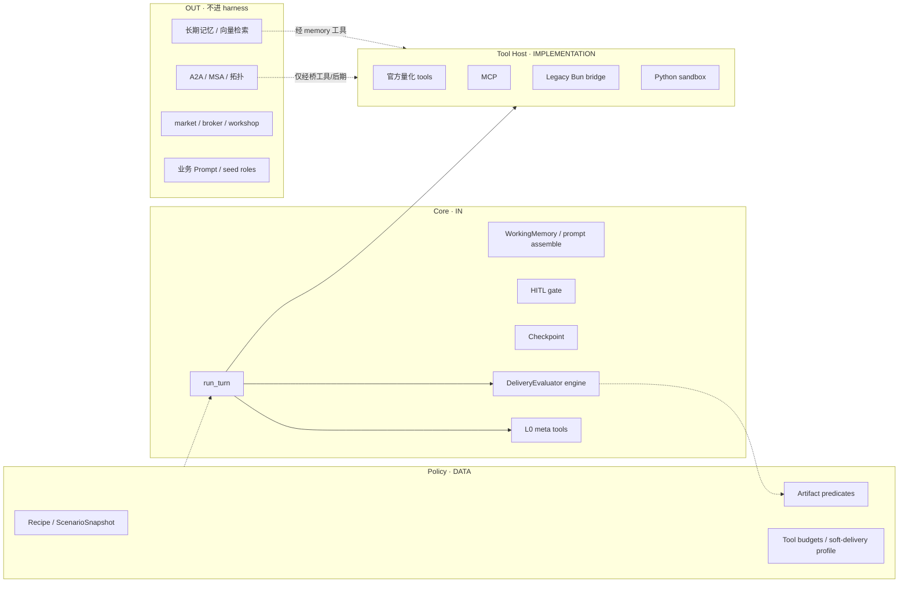
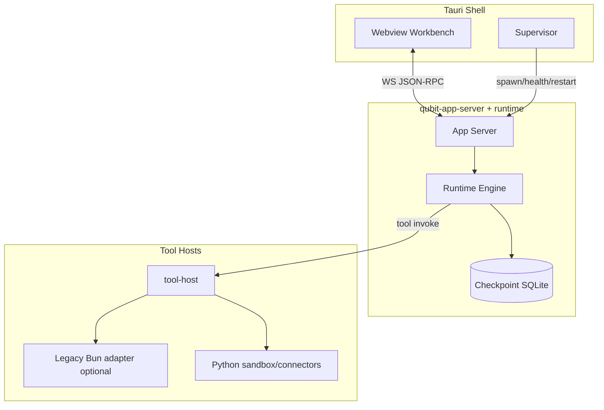
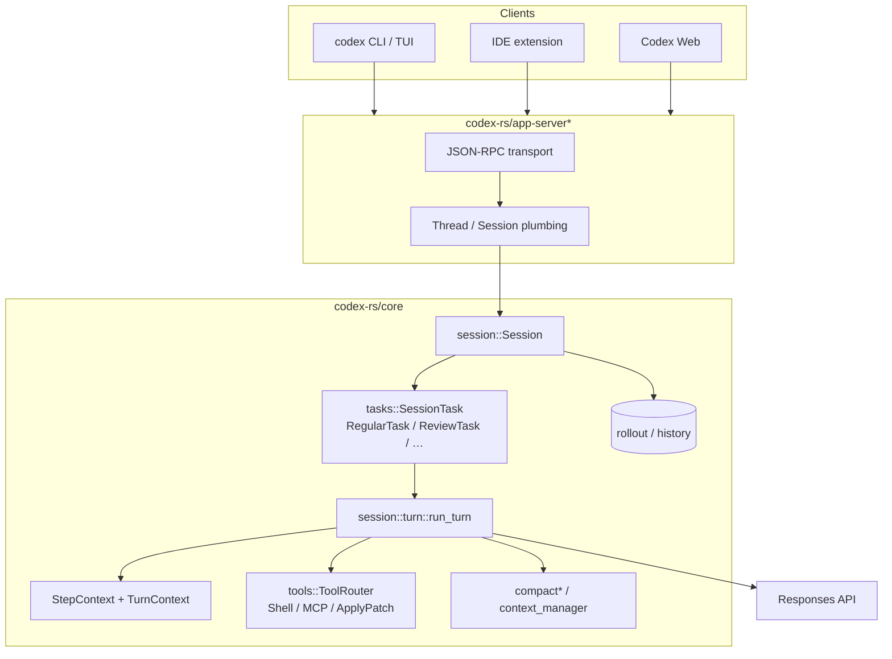
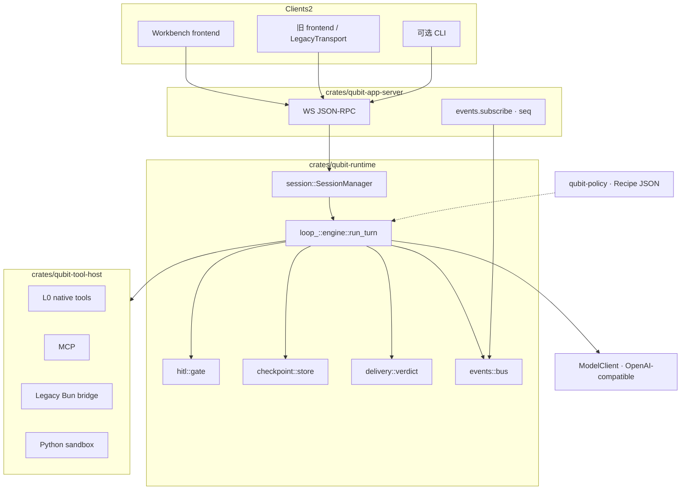
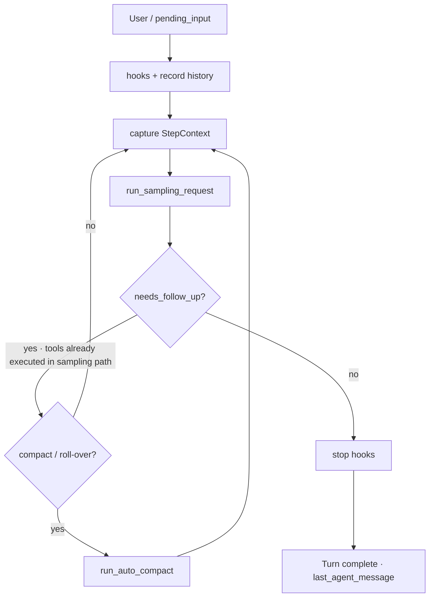
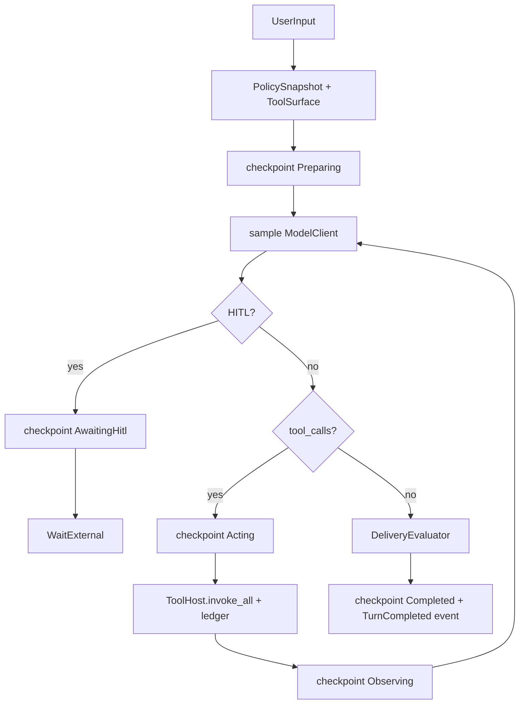
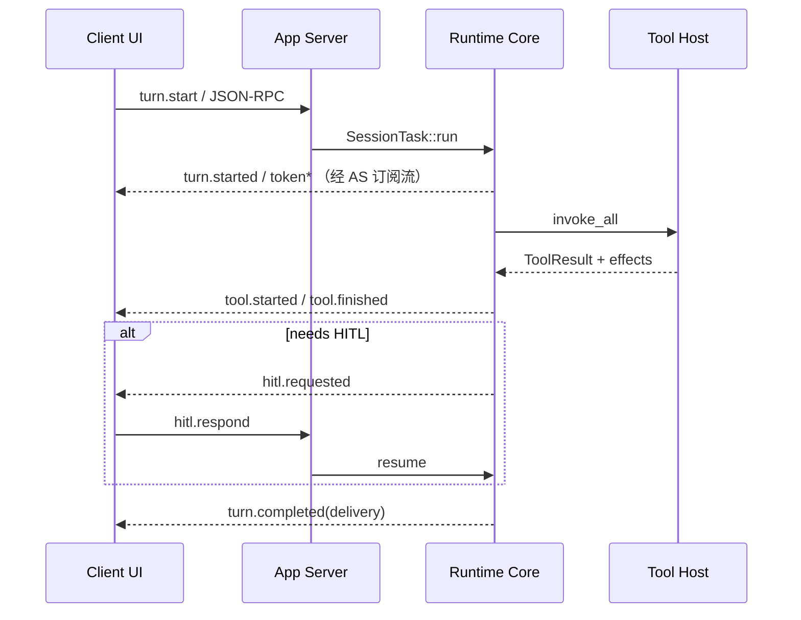
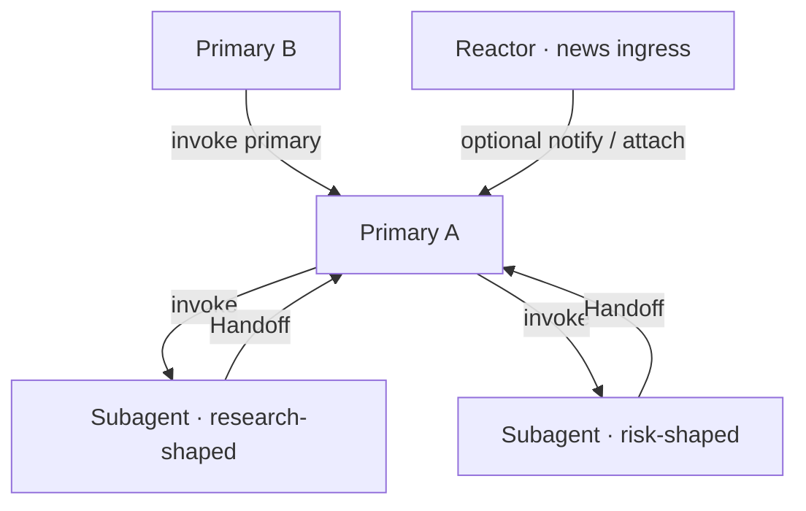
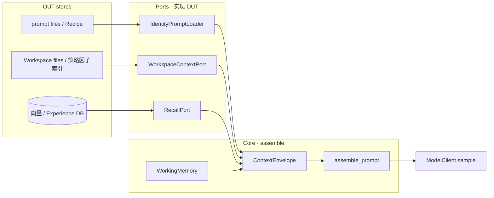

# Qubit Prime — Rust Agent Runtime Core 技术方案

| 项 | 内容 |
|----|------|
| 文档状态 | **落地稿 v0.15 · Agent 配置页 / DB 对齐 ExecutionKind；Core Spec 从 DB 同步** |
| 日期 | 2026-08-05 |
| 目标 | 高可用（HA）、薄循环、可观测、可恢复的 Agent Runtime Core（Rust） |
| 非目标（v1） | 全量搬迁 market / broker / workshop；完整 A2A 多 Agent 拓扑；替换模型供应商；把业务角色（researcher 等）编进 Core |
| 上游对齐 | Codex 式 harness 形状；Claude Code 式槽位组装；现仓 thin-loop / policy / DeliveryVerdict / Context Protocol |
| **代码落点** | 仓库根 `Cargo.toml` workspace：`crates/{qubit-protocol,qubit-policy,qubit-runtime,qubit-tool-host,qubit-app-server}`；Bun 适配 `src/runtime/prime/` |

---

## 目录

1. [问题与目标](#1-问题与目标)
2. [边界：什么是 Core、什么不是](#2-边界什么是-core什么不是)
3. [目标架构](#3-目标架构)
4. [核心 Rust 代码架构与 Codex 对照](#4-核心-rust-代码架构与-codex-对照)
5. [Crate 拆分](#5-crate-拆分)
6. [领域模型与协议草案](#6-领域模型与协议草案)（含 **§6.6 ExecutionKind** · **§6.8 HITL** · **§6.9 InteractionMode**）
7. [薄 Loop 状态机](#7-薄-loop-状态机)
8. [工具执行与宿主隔离](#8-工具执行与宿主隔离)
9. [高可用（HA）设计](#9-高可用ha设计)
10. [Policy / Delivery 与现仓对齐](#10-policy--delivery-与现仓对齐)
11. [与旧 Bun Runtime 的绞杀接法](#11-与旧-bun-runtime-的绞杀接法)（含 **§11.4 双核：进程级 · TS 过渡后删除**）
12. [可观测性与验收](#12-可观测性与验收)
13. [实施里程碑](#13-实施里程碑)
14. [风险、回滚、开放问题](#14-风险回滚开放问题)
15. [Context Protocol（Core 内）](#15-context-protocolcore-内)（Codex / Claude Code 对照 · 量化槽位 · 结构体）

---

## 1. 问题与目标

### 1.1 现状痛点（需被 Core 消除）

| 痛点 | 证据来源 | Core 侧应对 |
|------|----------|-------------|
| Loop 过厚，`act` 兼控制总线 | thin-loop / cohesion 文档 | Loop 只调度；策略外置 |
| `completed ≠ delivered` | DeliveryVerdict | Lifecycle ≠ Delivery 一等字段 |
| 进程/崩溃后难恢复 | 桌面 sidecar 杀进程常见 | Checkpoint + 幂等恢复 |
| 工具副作用与终态脱节 | tool success ≠ artifact | Effect ledger + 谓词 |
| TS 热路径难以做严格并发 / 取消 | Bun 单进程 + 混杂 IO | Rust async + 取消令牌 |

### 1.2 目标（可验收）

1. **薄**：`run_turn` / loop 不知股票、因子、回测；只认 Session / Turn / Tool / Event。
2. **硬**：取消、超时、HITL 暂停、崩溃恢复有明确状态机；无「半写半丢」的默认路径。
3. **真**：成功 = 可观察副作用（文件 / DB 领域行 / 工具 ledger）+ `DeliveryVerdict`，不是「状态机走到 completed」。
4. **HA（desktop-first）**：单机重启后，`AwaitingHitl` / `Running` 可恢复；工具调用幂等；不承诺跨机多活（O6）。
5. **可演进**：协议稳定后可挂多客户端（Workbench / 旧 frontend / CLI）。

### 1.3 非目标（明确砍掉）

- v1 不把 `src/runtime/market/*`、`execution/*`、Python connectors 重写成 Rust。
- v1 不做完整 A2A wave / MSA 融合（可保留「调用旧编排」的桥工具）。
- 不追求字节级兼容现有 Hono REST；用 **协议适配层** 翻译。
- 不以 LOC 指标替代正确性；不以「全 Rust」为进度 KPI。

---

## 2. 边界：什么是 Core、什么不是

> **已拍板（2026-08-04）**：A2A 不进 harness（桥接）；官方工具仅 L0 元工具进 runtime；Artifact/交付 = Core 求值 + Policy 数据；上下文骨架在 Core、长期记忆在外。  
> 本节是 **模块级白名单/黑名单**；实现时以本表为准，冲突以「薄 loop、领域不进 Core」不变式为准。

### 2.1 分层总图

```text
┌─────────────────────────────────────────────────────────────┐
│  Clients: Workbench / 旧 frontend / CLI                     │
└───────────────────────────┬─────────────────────────────────┘
                            │ JSON-RPC / WS
┌───────────────────────────▼─────────────────────────────────┐
│  qubit-app-server                                           │
│  会话路由 · 本地鉴权 · events.subscribe · 取消 · HITL 应答  │
└───────────────────────────┬─────────────────────────────────┘
                            │
┌───────────────────────────▼─────────────────────────────────┐
│  qubit-runtime  【CORE · harness】                          │
│  Session/Turn · run_turn · Cancel · HITL gate · Checkpoint  │
│  上下文组装骨架/WorkingMemory · Observation compact 骨架    │
│  Tool 编排（调用 ToolHost）· DeliveryEvaluator（规则外置）  │
│  L0 元工具：update_plan / workspace files / HITL helpers…   │
└───────┬─────────────────────────┬─────────────┬─────────────┘
        │                         │             │
        ▼                         ▼             ▼
┌───────────────┐   ┌──────────────────┐  ┌──────────────────┐
│ qubit-policy  │   │ qubit-tool-host  │  │ 外部/旧服务       │
│ Recipe JSON   │   │ L1 MCP           │  │ A2A / MSA / 团队  │
│ Artifact 谓词 │   │ L2 Bun bridge    │  │ 长期记忆 / 向量   │
│ 软硬交付档    │   │ L3 Python        │  │ market/broker…   │
│ （数据，非环）│   │ 官方量化 tools   │  │ seed prompts…    │
└───────────────┘   └──────────────────┘  └──────────────────┘
```



### 2.2 归属图例

| 标记 | 含义 |
|------|------|
| **IN** | 进入 `qubit-runtime`（或同进程但属 harness 契约） |
| **DATA** | 以声明数据进 Core（`qubit-policy`），**不**写进 loop 分支代码 |
| **HOST** | `qubit-tool-host` 实现；Core 只看见 `ToolSpec` / `ToolResult` |
| **OUT** | 明确不进 Core；经桥、独立服务或仍留 Bun |
| **LATER** | 方向已定，但 **v1 / M6 前不做** 或先桥接 |

### 2.3 模块边界总表（拍板）

#### A. 循环与控制面

| 模块 | 归属 | 说明 |
|------|------|------|
| `run_turn` / Iteration 状态机 | **IN** | 薄循环；不知场景名 |
| Cancel / timeout | **IN** | 全链路 `CancelToken` |
| Checkpoint / 恢复 | **IN** | desktop HA；见 §9 |
| Event bus + seq | **IN** | 客户端续订 |
| HITL gate（暂停/恢复/幂等） | **IN** | 形态对齐 HITL v2；**权威状态进 HitlInbox**（§6.8） |
| HITL **审批缓冲 / Inbox** | **IN** | IDE / IM 同消费；primary 与 reactor 共用 |
| HITL **硬规则内容**（资金阈值等） | **DATA** | 规则表/配置；求值可在 Core，阈值不写死业务魔法数散落 |
| IM / 飞书等推送适配 | **OUT** | 只转发 Inbox 项并回调 `hitl.respond` |
| App Server（WS JSON-RPC） | **IN**（`app-server` crate） | 与 harness 同发布，但不进 `run_turn` |

#### B. A2A / 多 Agent / 编排

| 模块 | 归属 | 说明 |
|------|------|------|
| A2A 总线、task 生命周期、stale reconciliation | **OUT**（**LATER** 可独立编排服） | **已拍**：M6 前不进 harness；团队路径走旧 Bun 桥 |
| 拓扑 wave / MSA 融合 / Orchestrator 规划专环 | **OUT** | 同上 |
| 「派子任务 / 等结果」若将来需要 | **LATER · 最小端口** | 若做，只加 `OrchestrationPort` trait，不把拓扑装进 `run_turn` |
| 研究团队 UI / 画布 | **OUT** | 客户端 |

#### C. 官方 Tool / MCP / Sandbox

| 模块 | 归属 | 说明 |
|------|------|------|
| Tool 编排、超时、并行上限、幂等键 | **IN** | 只调度 |
| **L0 元工具**（`update_plan`、workspace 读写作、HITL helper、session 诊断类） | **IN**（runtime 内窄模块） | **已拍**：仅此类进 runtime crate |
| **官方量化工具**（klines、factor/strategy 写库、order intent、screener…） | **HOST** | 实现在 tool-host；绞杀期可 L2→Bun |
| MCP client 会话 / 工具发现 | **HOST** | Core 只消费已解析的 `ToolSpec` |
| Python sandbox / connectors | **HOST / OUT** | 现有进程协议封装 |
| 在 `act` 内按场景改写工具默认参数 | **禁止** | 与 thin-loop 一致；见 §7.2 |

#### D. Artifact gate / 交付底线

| 模块 | 归属 | 说明 |
|------|------|------|
| `DeliveryVerdict` 求值引擎 | **IN** | **已拍**：引擎在 Core |
| Lifecycle（Completed/Failed/…）与 Delivery 分离 | **IN** | `completed ≠ delivered` |
| Effect / Artifact **ledger**（工具声明的 effects 记账） | **IN** | 供谓词消费 |
| Artifact / capability **谓词与 schema** | **DATA** | Recipe / policy JSON；换场景不改 loop |
| Soft-delivery / researchOk / upgradeOk 等 profile | **DATA** | 档位数据；引擎按 profile 解释 |
| 「模型说完成了」直接当交付成功 | **禁止** | 必须过 DeliveryEvaluator |
| 场景专用硬编码 if-else 堆在 Rust act | **禁止** | 规则进 DATA |

#### E. 上下文与记忆

| 模块 | 归属 | 说明 |
|------|------|------|
| **Context Protocol**（Envelope / Slot / Budget / Axiom） | **IN** | **已拍方向**：协议与组装在 Core；详见 **[§15](#15-context-protocolcore-内)** |
| WorkingMemory（短时结构化记忆） | **IN** | turn/session 作用域；含量化结构化字段 |
| Prompt **组装骨架**（history + tools + system/user slots） | **IN** | 槽位有序拼接；文案与召回结果外置注入 |
| Observation compact **骨架**（截断/摘要接口） | **IN** | 策略参数可 DATA |
| Token budget 记账 / 超限行为钩子 | **IN** | 限额数字来自配置/DATA |
| `RecallPort` / `WorkspaceContextPort`（检索接口） | **IN（端口）** | Core 只认 trait；实现 OUT |
| 业务 system prompt / seed 文案 / FSI 话术 | **OUT** | 配置或 policy 注入字符串，不编译进 loop |
| **长期记忆**写路径、向量索引、LanceDB/检索实现 | **OUT** | **已拍**：经 memory 类 **HOST 工具**或独立 memory 服，经 `RecallPort` 回填槽位 |
| Workspace 文件树 / 策略·因子索引实现 | **OUT** | 经 `WorkspaceContextPort` 或 L0 文件工具回填 `slot` |
| Experience embedder / pipes | **OUT** | 可工具化后挂 HOST |
| Auto-compact（Codex 级 remote compact） | **LATER** | v1 简单截断 + 本地摘要；远程 compact 后置 |

#### F. Policy / 场景 / 质量

| 模块 | 归属 | 说明 |
|------|------|------|
| Scenario Recipe 装载 → `PolicySnapshot` | **DATA**（`qubit-policy`） | Core 每 iteration 只读一份 snapshot |
| 工具面收窄、探活预算键 | **DATA** | Host 执行时由 Core 传入 surface；预算计数可在 Core |
| Benchmark / AQM 评分 | **OUT** | 评测进程读 ledger/事件；不进热路径 |
| Agent readiness / 质量探活服务 | **OUT** | 控制面外围 |

#### G. 领域与基础设施（默认 OUT）

| 模块 | 归属 | 说明 |
|------|------|------|
| market 路由、行情源、PIT | **OUT** | 仅经工具 |
| broker / 实盘 / REIA | **OUT** | 仅经工具 + 强 HITL 规则 DATA |
| workshop / 因子存储 / 策略运行时 worker | **OUT** | |
| SQLite 业务表 schema 演进 | **OUT**（旧库）/ 桥 | Core checkpoint 库独立（`prime/runtime.sqlite`） |
| 旧 Hono REST / SSE | **OUT** | LegacyTransport 适配 |

### 2.4 一句话裁决（争议场景）

| 若有人提议… | 裁决 |
|-------------|------|
| 「把 A2A 先写进 Rust 和 run_turn 一起」 | **拒**：OUT + 桥；O5/M6 后再议端口 |
| 「官方 `fetch_klines` 放进 runtime crate 省事」 | **拒**：HOST；runtime 只留 L0 |
| 「交付规则先在 Rust 里写死 SP/ST」 | **拒**：引擎 IN、规则 DATA |
| 「长期记忆表也由 Core checkpoint 顺手管」 | **拒**：LTM OUT；避免 harness 变数据平台 |
| 「没有 artifact 谓词就先当 delivered」 | **拒**：无谓词则 verdict 只能是未知/partial，不能默认真交付 |
| 「Core 枚举 researcher / analyst_* 方便派单」 | **拒**：只用 `ExecutionKind`；业务名当 `labels` / prompt（§6.6） |
| 「TS 和 Rust 各维护一套事件类型」 | **拒**：`qubit-protocol` 单源 + conformance（§11.4） |

### 2.5 不变式（硬）

1. Core **永不** `import` 量化领域业务 crate（market/strategy/broker/…）。  
2. 领域能力只能以 **ToolResult / Policy 数据 / 注入字符串** 进入循环。  
3. `DeliveryEvaluator` 可以否决「假完成」；**不可以**替模型写业务工具参数。  
4. A2A 与 LTM 的引入不得扭曲 `run_turn` 形状——只许 **端口 / 工具**，不许嵌套第二套编排状态机进 Acting。  
5. Core **永不**按业务角色名（researcher 等）分支；只按 **`ExecutionKind` + PolicySnapshot`**。  
6. Context 组装在 Core；召回/workspace **实现**在外，经 **Port** 回填槽位（§15）。  
7. TS Core 与 Rust Core 若并存，必须服从同一 **`CoreRuntime` / protocol schema**（§11.4）。

### 2.6 对照旧仓模块目录（迁移动线提示）

| 现仓路径（示意） | Prime 落点 |
|------------------|------------|
| `runtime/react/*` | **IN** → `qubit-runtime`（重写，非直译） |
| `runtime/policy/*` | **DATA** → `qubit-policy` |
| `runtime/tools/*`（元工具） | **IN** L0 |
| `runtime/tools/*`（量化） | **HOST** / L2 桥 |
| `runtime/a2a/*` · `msa/*` · `orchestration/*` | **OUT** 桥 |
| `runtime/context/*` · WorkingMemory | **IN**（骨架） |
| `runtime/experience/*` · 向量 | **OUT** / 工具 |
| `runtime/market/*` · `execution/*` | **OUT** / 工具 |
| `runtime/mcp/*` | **HOST** |
| `runtime/workflow/hitl-*` | **IN**（协议）+ UI OUT |

---

## 3. 目标架构

### 3.1 进程模型（desktop-first HA）



- **Tauri 继续做 Supervisor**：健康检查、端口、崩溃拉起（现有 sidecar 模式可演进为拉起 Rust binary）。
- **Runtime 与 UI 解耦**：UI 挂了不丢 turn；Runtime 挂了从 checkpoint 恢复。
- **Tool Host 可同进程起步，v1.5 再切 subprocess**（降低一次性复杂度，但接口先按隔离设计）。

### 3.2 控制面 vs 数据面

| 面 | 内容 | 可靠性要求 |
|----|------|------------|
| 控制面 | Session/Turn 状态、HITL、取消、delivery | 强一致、可恢复 |
| 数据面 | token 流、tool stdout 片段 | 可丢最新帧；重连后 replay 摘要 |
| 副作用面 | 工具写入的文件/DB | 幂等键 + ledger |

---

## 4. 核心 Rust 代码架构与 Codex 对照

> **目的**：把「学 Codex 的形状」落到可对照的 **crate / 模块 / 函数签名**。  
> Codex 代码摘自公开仓库 [`openai/codex`](https://github.com/openai/codex) 的 `codex-rs/`（路径以 `main` 为准，上游会演进）。  
> Qubit 侧代码为 **规划实现形状**（尚未落地），故意与 Codex 同名核心抽象对齐，便于迁移心智。

### 4.1 总览对照表

| 维度 | Codex（公开实现） | Qubit Prime Core（规划） |
|------|-------------------|--------------------------|
| 语言 / 热路径 | Rust（`codex-rs/core`） | Rust（`crates/qubit-runtime`） |
| 外壳协议 | `codex-rs/app-server*` · JSON-RPC | `qubit-app-server` · **WS + JSON-RPC**（已拍板 O1） |
| 会话 | `Session` + `ActiveTurn` | `Session` + `Turn` |
| 任务抽象 | `SessionTask`（Regular / Review / Compact…） | v1 仅 `RegularTurn`；Compact/Review 后置 |
| 循环入口 | `session/turn.rs::run_turn` | `loop_/engine.rs::run_turn` |
| 步进上下文 | `StepContext` / `TurnContext` | `TurnContext` + `PolicySnapshot`（每 iteration 一次） |
| 模型 | `ModelClientSession` + Responses API | `ModelClient` trait（OpenAI-compatible 子集起步） |
| 工具 | `tools::ToolRouter` / `ToolCallRuntime` | `ToolHost` trait（L0/L1/L2/L3） |
| 取消 | `tokio_util::sync::CancellationToken` | 同：全链路 `CancelToken` |
| 历史 | conversation items / rollout | checkpoint SQLite + event seq（desktop HA） |
| 成功语义 | 文件/shell **副作用**；无业务 DeliveryVerdict | 副作用 ledger + **`DeliveryVerdict`**（量化合同） |
| 业务无知 | loop 不知「改哪个产品需求」 | loop **不知股票/因子**；只认 Tool/Policy 数据 |
| 多 Agent | 上游有 agent / multi-agent 演进 | **O5：M6 后再进 Core**；此前旧桥 |

### 4.2 进程与包架构对照

#### Codex（简化）



公开 crate 切分（子集，便于对照我们的包边界）：

```text
codex-rs/
  protocol/              # 跨端类型
  core/                  # Session / run_turn / tools / compact
  app-server*/           # JSON-RPC 壳
  mcp-server/ rmcp-…     # MCP
  exec* / sandboxing/    # 执行与沙箱
  tui/ cli/              # 客户端
```

#### Qubit Prime（规划）



包映射（学 Codex 切法，但更瘦）：

| Codex | Qubit Prime |
|-------|-------------|
| `codex-protocol` | `qubit-protocol` |
| `codex-core` | `qubit-runtime` + `qubit-policy` |
| `app-server*` | `qubit-app-server` |
| `tools` / MCP / exec | `qubit-tool-host`（显式外置，防厚 loop） |

### 4.3 任务与 Turn：Codex 真实代码 vs Qubit 规划代码

#### Codex — `SessionTask` 与 `RegularTask`

路径：`codex-rs/core/src/tasks/mod.rs`、`tasks/regular.rs`

```rust
// openai/codex — codex-rs/core/src/tasks/mod.rs（摘录，2026-08 附近 main）
pub(crate) trait SessionTask: Send + Sync + 'static {
    fn kind(&self) -> TaskKind;
    fn span_name(&self) -> &'static str;

    fn run(
        self: Arc<Self>,
        session: Arc<Session>,
        ctx: Arc<TurnContext>,
        input: Vec<TurnInput>,
        cancellation_token: CancellationToken,
    ) -> impl std::future::Future<Output = SessionTaskResult> + Send;

    fn abort(
        &self,
        session: Arc<Session>,
        ctx: Arc<TurnContext>,
    ) -> impl std::future::Future<Output = ()> + Send { /* default no-op */ }
}
```

```rust
// openai/codex — codex-rs/core/src/tasks/regular.rs（摘录）
impl SessionTask for RegularTask {
    fn kind(&self) -> TaskKind { TaskKind::Regular }

    async fn run(
        self: Arc<Self>,
        sess: Arc<Session>,
        ctx: Arc<TurnContext>,
        input: Vec<TurnInput>,
        cancellation_token: CancellationToken,
    ) -> SessionTaskResult {
        // 发 TurnStarted，再吃 startup prewarm …
        let mut next_input = input;
        let mut prewarmed_client_session = /* … */;
        loop {
            let last_agent_message = run_turn(
                Arc::clone(&sess),
                Arc::clone(&ctx),
                next_input,
                prewarmed_client_session.take(),
                cancellation_token.child_token(),
            )
            .await?;
            // 若 turn 结束后仍有 pending steer 输入 → 再跑一轮 run_turn
            if !sess.input_queue.has_pending_input(&sess.active_turn).await {
                return Ok(last_agent_message);
            }
            next_input = Vec::new();
        }
    }
}
```

#### Qubit — 对齐但更少 Task 种类（规划）

路径规划：`crates/qubit-runtime/src/session/task.rs`

```rust
// qubit-prime（规划）— 先只做 Regular；不复制 Compact/Review 任务动物园
pub trait SessionTask: Send + Sync + 'static {
    fn kind(&self) -> TaskKind;

    async fn run(
        self: Arc<Self>,
        session: Arc<Session>,
        ctx: Arc<TurnContext>,
        input: UserInput,
        cancel: CancelToken,
    ) -> Result<TurnOutcome, RuntimeError>;
}

pub struct RegularTask {
    pub engine: Arc<TurnEngine>,
}

impl SessionTask for RegularTask {
    fn kind(&self) -> TaskKind { TaskKind::Regular }

    async fn run(
        self: Arc<Self>,
        session: Arc<Session>,
        ctx: Arc<TurnContext>,
        input: UserInput,
        cancel: CancelToken,
    ) -> Result<TurnOutcome, RuntimeError> {
        session.emit(RuntimeEvent::TurnStarted { turn_id: ctx.turn_id.clone() }).await;
        // v1：无 mid-turn steer 外环；需要时再学 Codex input_queue
        self.engine
            .run_turn(session, ctx, input, cancel)
            .await
    }
}
```

**差异要点**：Codex 用 `SessionTask` 把 compact/review/shell 与常规对话拆开；Prime v1 **只落地 Regular**，compact 做成 `run_turn` 内外的策略钩子，避免过早复制任务体系。

### 4.4 `run_turn` 循环对照

#### Codex — 采样环（真实结构）

路径：`codex-rs/core/src/session/turn.rs`

文档注释与签名（上游原文语义）：

```rust
// openai/codex — session/turn.rs
/// Takes initial turn input and runs a loop where, at each sampling request,
/// the model replies with either:
/// - requested function calls
/// - an assistant message
pub(crate) async fn run_turn(
    sess: Arc<Session>,
    turn_context: Arc<TurnContext>,
    input: Vec<TurnInput>,
    prewarmed_client_session: Option<ModelClientSession>,
    cancellation_token: CancellationToken,
) -> CodexResult<Option<String>> {
    // 1) pre-sampling compact
    // 2) capture_step_context / skills+plugins 注入 / hooks
    // 3) loop:
    //      drain pending_input（用户中途插话）
    //      capture StepContext（tools + context 同一视图）
    //      run_sampling_request(...)  // 内部执行工具并写 history
    //      if needs_follow_up || pending → continue（或 mid-turn compact）
    //      else → stop hooks → return last_agent_message
}
```

主循环骨架（按公开源码整理的可读缩略，非逐行粘贴全文）：

```rust
// openai/codex — run_turn 主循环（结构缩略）
let mut next_step_context = Some(first_step_context);
loop {
    let pending_input = if can_drain_pending_input {
        sess.input_queue.get_pending_input(&sess.active_turn).await.0
    } else {
        Vec::new()
    };
    if run_hooks_and_record_inputs(&sess, &turn_context, &pending_input).await {
        break;
    }

    let step_context = /* next_step_context.take() or capture_step_context(...) */;

    let sampling_request_result = run_sampling_request(
        Arc::clone(&sess),
        Arc::clone(&step_context),
        /* extension_data, turn_diff_tracker, client_session, metadata, history, cancel */,
    )
    .await;

    match sampling_request_result {
        Ok((SamplingRequestResult { needs_follow_up: model_needs_follow_up, last_agent_message }, _)) => {
            let has_pending_input = sess.input_queue.has_pending_input(&sess.active_turn).await;
            let needs_follow_up = model_needs_follow_up || has_pending_input;

            if should_roll_over /* token / new window */ {
                run_auto_compact(/* ... */).await?;
                continue;
            }
            if !needs_follow_up {
                // stop hooks；可能被 hook 阻断后 continue
                last_agent_message = last_agent_message;
                break;
            }
            // else：工具已在 sampling 路径执行并写入 history → 再 sample
        }
        Err(err) => { /* TurnAborted / error lifecycle */ }
    }
}
```

循环数据流：



#### Qubit — `run_turn`（规划：薄、显式阶段、可 checkpoint）

路径规划：`crates/qubit-runtime/src/loop_/engine.rs`

```rust
// qubit-prime（规划）
pub struct TurnEngine {
    models: Arc<dyn ModelClient>,
    tools: Arc<dyn ToolHost>,
    policy: Arc<dyn PolicyLoader>,
    checkpoints: Arc<dyn CheckpointStore>,
    delivery: Arc<dyn DeliveryEvaluator>,
    events: Arc<EventBus>,
}

impl TurnEngine {
    pub async fn run_turn(
        &self,
        session: Arc<Session>,
        ctx: Arc<TurnContext>,
        input: UserInput,
        cancel: CancelToken,
    ) -> Result<TurnOutcome, RuntimeError> {
        let turn_id = ctx.turn_id.clone();
        self.checkpoints
            .save(&session, TurnState::Preparing, /*…*/)
            .await?;

        let snapshot = self.policy.load_snapshot(&session, &ctx).await?;
        let surface = self.tools.resolve_surface(&snapshot).await?;

        // 与 Codex 不同：工具执行从「采样黑盒」里拆出来，便于 Acting 态 checkpoint / 幂等重放
        loop {
            cancel.check()?;
            self.checkpoints.save(&session, TurnState::Reasoning, /*…*/).await?;

            let prompt = assemble_prompt(&session, &ctx, &snapshot, &surface)?;
            let sample = self.models.sample(prompt, cancel.child()).await?;
            self.events.emit_tokens(&turn_id, &sample).await;

            if let Some(hitl) = sample.hitl_prompt {
                self.checkpoints
                    .save_hitl(&session, &hitl) // AwaitingHitl · 强制 fsync
                    .await?;
                self.events.emit(RuntimeEvent::HitlRequested { prompt: hitl }).await;
                return Ok(TurnOutcome::AwaitingHitl);
            }

            let calls = parse_tool_calls(&sample)?; // 纯解析，不改写业务参数
            if calls.is_empty() {
                break;
            }

            self.checkpoints.save(&session, TurnState::Acting, /*…*/).await?;
            let results = self
                .tools
                .invoke_all(calls, InvokeContext { session: &session, turn: &ctx, cancel: cancel.child() })
                .await?;
            session.push_observations(compact_observations(&results));
            session.ledger.record(&results);
            self.checkpoints.save(&session, TurnState::Observing, /*…*/).await?;
            // continue → 再 sample（等价 Codex needs_follow_up = true）
        }

        let verdict = self.delivery.evaluate(&snapshot, &session.ledger, &session.turn)?;
        self.checkpoints.save(&session, TurnState::Completed, /*…*/).await?;
        self.events.emit(RuntimeEvent::TurnCompleted {
            turn_id,
            lifecycle: Lifecycle::Completed,
            delivery: verdict.clone(),
        }).await;
        Ok(TurnOutcome::Finished { delivery: verdict })
    }
}
```

循环数据流（故意把 Acting 拉出采样函数）：



### 4.5 工具路径对照

| 点 | Codex | Qubit Prime |
|----|-------|-------------|
| 路由 | `tools::ToolRouter` / `build_tool_router`；并行 `ToolCallRuntime` | `ToolHost::invoke` / `invoke_all` |
| 执行时机 | 多在 `run_sampling_request` **内部**随 response item 执行 | **显式 Acting 阶段**（HA：崩溃可重放） |
| MCP | core + rmcp/mcp crates | `qubit-tool-host` L1 |
| 审批 / HITL | App Server 反向 RPC / elicitation | `HitlPrompt` + `hitl.respond`（对齐现 HITL v2） |
| 编码专用 | ApplyPatch / Shell 一等 | L0 可含 workspace file tools；量化写库走 L2 bridge |

Codex 工具侧引用（模块级，便于去上游对照）：

```text
codex-rs/core/src/tools/
  router.rs / parallel.rs / registry.rs / spec_plan.rs …
codex-rs/core/src/session/turn.rs
  → run_sampling_request → 处理 FunctionCall 等 output items
```

Qubit 规划接口（与 §8 一致）：

```rust
#[async_trait]
pub trait ToolHost: Send + Sync {
    async fn resolve_surface(&self, snap: &PolicySnapshot) -> Result<ToolSurface, ToolError>;
    async fn invoke_all(
        &self,
        calls: Vec<NormalizedToolCall>,
        ctx: InvokeContext<'_>,
    ) -> Result<Vec<ToolResult>, ToolError>;
}
```

### 4.6 事件与客户端协议对照



| Codex | Qubit |
|-------|-------|
| `EventMsg::TurnStarted` / deltas / `TurnComplete`… | `RuntimeEvent`（见 §6.3 事件列表）带 session 单调 `seq` |
| stdio / UDS / app-server transport 多样 | **先 WS JSON-RPC**（桌面 Webview 友好） |
| 成功不绑领域表 | `turn.completed` **必须带 DeliveryVerdict** |

### 4.7 我们「学什么 / 不学什么」

**学（形状）**

1. `Session` + `run_turn` 薄循环，业务不进采样环分叉。  
2. `SessionTask` 任务边界 + `CancellationToken`。  
3. App Server 与 Core 分离，多客户端共用 harness。  
4. `StepContext` 式「单次 iteration 同一工具面/上下文视图」。

**不学 / 后置（避免过拟合编码 Agent）**

1. 不把 Responses API / prompt cache / remote compact 全量搬来当 v1 门槛。  
2. 不复制庞大的 Task 动物园与插件注入体系。  
3. **不把工具执行藏进 sampling 闭包**——量化要 HA 与 Delivery ledger，需要显式 Acting。  
4. 增加 Codex 没有的 **`DeliveryVerdict` + Recipe Policy`**（现仓 thin-loop 的硬约束）。

### 4.8 模块文件级映射清单（落地 checklist）

| Codex 路径 | Qubit 规划路径 | v1 |
|------------|----------------|----|
| `core/src/session/turn.rs` | `runtime/src/loop_/engine.rs` | 必做 |
| `core/src/session/turn_context.rs` | `runtime/src/session/turn_context.rs` | 必做 |
| `core/src/session/step_context.rs` | `runtime/src/loop_/iteration_context.rs` | 必做 |
| `core/src/tasks/{mod,regular}.rs` | `runtime/src/session/task.rs` | Regular only |
| `core/src/tools/*` | `tool-host/src/*` | 必做边界 |
| `core/src/compact*.rs` | `runtime/src/context/compact.rs` | 后置 |
| `app-server*` | `app-server/src/*` | 必做 |
| `protocol` | `protocol/src/*` | 必做 |
| （无直接对应） | `runtime/src/delivery/*` | **Qubit 新增** |
| （无直接对应） | `runtime/src/checkpoint/*` | **Qubit 强化 HA** |
| （无直接对应） | `tool-host/src/legacy_bridge.rs` | 绞杀期 |

## 5. Crate 拆分

```text
crates/
  qubit-protocol/       # 纯类型 + serde + schema export（无业务 IO）
  qubit-runtime/        # SessionManager, TurnEngine, CheckpointStore, DeliveryEval
  qubit-app-server/     # axum/jsonrpsee: WS + 可选 HTTP
  qubit-tool-host/      # ToolRegistry, MCP stdio, legacy HTTP bridge, sandbox spawn
  qubit-policy/         # Recipe 装载与 snapshot 构建（可先薄）
```

| Crate | 职责 | 依赖方向 |
|-------|------|----------|
| `qubit-protocol` | 全部跨端消息类型 | 无 ↓ |
| `qubit-policy` | Recipe → `PolicySnapshot` | → protocol |
| `qubit-runtime` | 状态机与持久化 | → protocol, policy |
| `qubit-tool-host` | 执行工具 | → protocol |
| `qubit-app-server` | 对外 RPC | → runtime, tool-host, protocol |

**禁止**：`qubit-runtime` 依赖 Hono/Bun；`qubit-tool-host` 反向依赖 `app-server`。

### 5.1 建议模块（`qubit-runtime` 内部）

```text
qubit-runtime/
  src/
    lib.rs
    session/
      manager.rs          # Session 生命周期
      turn.rs             # Turn 状态机
      task.rs             # SessionTask（Regular …）
      agent_binding.rs    # AgentSpec 绑定（ExecutionKind，非业务 role）
    loop_/
      engine.rs           # run_turn
      reason_port.rs      # trait ModelClient
      act.rs              # 解析 tool_calls → 调度（薄）
      observe.rs          # 归一化 observation
    context/              # Context Protocol（§15）
      envelope.rs         # ContextEnvelope / slots
      assemble.rs         # 按槽位预算拼装 Prompt
      working_memory.rs
      compact.rs          # v1 截断；LATER 摘要/remote
      ports.rs            # RecallPort / WorkspaceContextPort
    agent/                # 执行类型与调用面（§6.6–§6.7）
      kind.rs             # ExecutionKind
      invocation.rs       # Subagent / Reactor 调用
      handoff.rs
    hitl/
      gate.rs
      inbox.rs            # HitlInbox（IDE/IM 审批缓冲 · §6.8）
    checkpoint/
      store.rs            # SQLite
      recover.rs
    delivery/
      verdict.rs
      ledger.rs
    cancel/
      token.rs
    events/
      bus.rs              # broadcast to subscribers
```

---

## 6. 领域模型与协议草案

### 6.1 核心实体

| 实体 | 含义 | ID |
|------|------|-----|
| `WorkspaceRef` | 本地工作区根 | path / uuid |
| `AgentSpec` / `AgentInstance` | 可配置 Agent（**ExecutionKind**，非业务 role） | `def_*` / `inst_*` |
| `Session` | 一次连续对话 / 研究会话（通常绑 primary） | `ses_*` |
| `Turn` | 用户一条输入或一次 trigger/invoke 触发的完整循环 | `trn_*` |
| `Iteration` | turn 内一次 model→tools 轮 | `u32` |
| `InvocationRecord` | primary→subagent 调用 | `inv_*` |
| `TriggerEvent` | reactor 外部唤醒 | `evt_*`（幂等） |
| `ToolCall` | 单次工具调用 | `tc_*` |
| `HitlPrompt` / `HitlInboxItem` | 人工闸门 + 审批缓冲项 | `hitl_*` / `inbox_*` |
| `ContextEnvelope` | 本轮提示词槽位快照 | 随 turn/iteration |
| `Checkpoint` | 可恢复快照 | `cp_*` / `(session, turn, seq)` |
| `DeliveryVerdict` | 交付判定 | 枚举 + reasons |

### 6.2 生命周期（Turn）

```text
Accepted
  → Preparing          # 装载 policy snapshot / 工具面
  → Reasoning          # 等模型
  → Acting             # 执行工具（可并行受限）
  → Observing          # 压缩 observation、写 ledger
  → (loop Reasoning…)
  → AwaitingHitl       # 可持久化暂停
  → Finalizing         # DeliveryVerdict
  → Completed | Failed | Cancelled
```

**规则**：

- 任一状态可因 `Cancel` → `Cancelled`（Acting 中必须传播取消到 Tool Host）。
- `AwaitingHitl` **必须**落盘后才对客户端声明「已暂停」。
- `Completed` 仅表示生命周期结束；UI 展示以 `DeliveryVerdict` 为准。

### 6.3 JSON-RPC 方法（草案）

传输默认：**WebSocket + JSON-RPC 2.0**（O1 待拍板）。  
通知（server → client）用同连接 `method` 无 `id`，或独立 `events` 订阅流。

#### 客户端 → 服务端

| method | params（摘要） | result |
|--------|----------------|--------|
| `session.create` | `{ workspaceId?, agentRef, mode }` | `{ sessionId }` |
| `session.get` | `{ sessionId }` | `SessionView` |
| `turn.start` | `{ sessionId, input: UserInput, idempotencyKey }` | `{ turnId }` |
| `turn.cancel` | `{ sessionId, turnId }` | `{ ok }` |
| `hitl.respond` | `{ promptId, response }` | `{ ok }` |
| `events.subscribe` | `{ sessionId, fromSeq? }` | `{ subscriptionId }` |
| `events.unsubscribe` | `{ subscriptionId }` | `{ ok }` |
| `checkpoint.list` | `{ sessionId }` | `CheckpointMeta[]` |
| `runtime.health` | `{}` | `{ status, uptimeMs, activeTurns }` |

#### 服务端 → 客户端（事件）

与现有 `StepEventType` 对齐并扩展：

```typescript
type RuntimeEvent =
  | { type: "turn.started"; turnId: string; seq: number; ts: number }
  | { type: "token"; turnId: string; iteration: number; text: string; seq: number }
  | { type: "tool.started"; turnId: string; callId: string; name: string; args: unknown; seq: number }
  | { type: "tool.finished"; turnId: string; callId: string; ok: boolean; observationRef: string; seq: number }
  | { type: "hitl.requested"; prompt: HitlPrompt; seq: number }
  | { type: "plan.updated"; turnId: string; plan: unknown; seq: number }
  | { type: "turn.completed"; turnId: string; lifecycle: Lifecycle; delivery: DeliveryVerdict; seq: number }
  | { type: "turn.failed"; turnId: string; error: ErrorObject; seq: number }
  | { type: "runtime.degraded"; reason: string; seq: number };
```

**事件必须带单调 `seq`（session 作用域）**，以便断线重连 `events.subscribe(fromSeq)`。

### 6.4 `UserInput` / `HitlPrompt`（摘要）

```json
{
  "UserInput": {
    "text": "string",
    "attachments": [{ "kind": "file|kline_context|artifact_ref", "ref": "..." }],
    "clientMeta": {}
  },
  "HitlPrompt": {
    "id": "hitl_...",
    "turnId": "trn_...",
    "inputKind": "approve_only|single_choice|multi_choice|free_form",
    "title": "string",
    "body": "string",
    "options": [{ "id": "string", "label": "string" }],
    "hardRule": false,
    "createdAt": 0
  }
}
```

对齐现有 HITL v2（`docs/HITL_REDESIGN.md`）：`approve_only` / `single_choice` / `free_form` 优先；`multi_choice` 可 P2。

### 6.5 Checkpoint 记录（serde 概念）

```rust
struct CheckpointRecord {
    session_id: String,
    turn_id: String,
    seq: u64,
    state: TurnState,              // 枚举
    iteration: u32,
    working_memory: serde_json::Value,
    pending_tool_calls: Vec<ToolCall>,
    hitl: Option<HitlPrompt>,
    policy_snapshot_hash: String,  // 避免恢复时策略漂移无感
    delivery_partial: Option<DeliveryVerdict>,
    updated_at_ms: i64,
}
```

写入策略：**状态迁移成功后** fsync/事务提交；高频 `token` **不进** checkpoint（只进事件 log，可截断）。

### 6.6 Agent 执行类型（ExecutionKind）——不要业务角色枚举

> **已拍板（2026-08-05）**：Core **不**内建 `researcher` / `analyst_technical` 这类 **业务角色**。  
> 现仓 `AgentRole` 动物园属于 **配置层标签 / Prompt 文案 / 工具面预设**，迁到 Recipe / AgentSpec 的 **标签与字符串**，不进 `run_turn` 分支。  
> Core 只认识 **执行类型（ExecutionKind）**。  
> **O10–O13 同步拍板**：三类 kind 定稿；subagent **隔离窗口**；HITL 走 **审批缓冲**（§6.8）；双核仅 **进程级**且 TS 为过渡（§11.4）。

#### 6.6.1 三种执行类型（v1）

| ExecutionKind | 产品语义 | Core 行为约束 |
|---------------|----------|---------------|
| **`primary`** | 主 Agent：用户对话核心节点；**也可被其他 Agent 调用** | 可拥有用户可见 `Session`；可接 `turn.start` **与** `agent.invoke`；可派 `subagent`；HITL → **审批缓冲**（§6.8） |
| **`subagent`** | 专家 Agent：被调用干活 | **禁止**直接接用户 chat；只接受 `agent.invoke`；**完全隔离上下文窗口**（不灌 parent transcript）；返回 `Handoff` 后窗口可丢 |
| **`reactor`** | 外部消息唤醒（MQ / A2A / webhook / 新闻事件等） | 由 `TriggerIngress` 唤醒；创建短命 `Session`/`Turn` 或挂到指定 primary；若需 HITL → **同一审批缓冲**（非阻塞弹窗独占） |

```text
用户 UI ──turn.start──► primary ◄──agent.invoke── 其他 primary /（授权）调用方
                           │
                           ├──agent.invoke──► subagent（隔离窗口）──Handoff──►
                           │
外部事件 ──TriggerIngress──► reactor ──(可选 notify)──► primary / ledger
                           │
                     HITL ──► HitlInbox（IDE / IM 审批）──respond──► 恢复 turn
```

**刻意不做的**：

- 不把 `news_event` / `researcher_bull` 写进 Rust `match`。
- 不把「辩论 / MSA」做成第四种 ExecutionKind（仍是 OUT 编排或 Recipe 工作流）。
- Codex 的 Compact/Review 是 **TaskKind**，不是 Agent 执行类型；我们继续用 `SessionTask`，与 `ExecutionKind` 正交。
- **不**把 primary 改成「只能人机对话」——primary 是 **可对话 + 可被调用** 的枢纽。

#### 6.6.2 与现仓对照（绞杀映射）

| 现仓 | Prime |
|------|-------|
| `role: "orchestrator"` | `execution_kind: primary` + `labels: ["orchestrator"]`（标签仅供 UI/分析） |
| `role: "researcher" | "analyst_*" | …` | `execution_kind: subagent` + `labels` + `system_prompt_ref` + tool surface |
| 订阅 `TASK_ASSIGN` / 未来 MQ 消费者 | `execution_kind: reactor` + `triggers[]` |
| `AgentRole` 枚举进 loop | **删除**；loop 只读 `ExecutionKind` + `PolicySnapshot` |

#### 6.6.3 核心结构体（协议层 · `qubit-protocol`）

```rust
/// 执行类型：决定「谁可以发起 turn、谁可以被谁调用」
#[derive(Clone, Debug, Serialize, Deserialize)]
#[serde(rename_all = "snake_case")]
pub enum ExecutionKind {
    Primary,
    Subagent,
    Reactor,
}

/// Agent 配置（可版本化；业务语义只活在字符串/标签/策略引用里）
#[derive(Clone, Debug, Serialize, Deserialize)]
pub struct AgentSpec {
    pub id: String,                       // def_* / agt_*
    pub version: String,
    pub display_name: String,
    pub execution_kind: ExecutionKind,
    /// 自由标签：orchestrator / research / news … —— Core 不当分支条件
    pub labels: Vec<String>,
    /// system / identity 文案：外置引用，不编译进 harness
    pub identity_prompt_ref: String,      // file:// or policy key
    pub default_recipe_id: Option<String>,
    pub tool_surface_ref: String,         // → Policy / Host 解析
    pub model_ref: Option<String>,
    pub max_iterations: u32,
    pub hitl_profile_ref: Option<String>,
    /// 谁可以 invoke 本 Agent：spec_id 或 label 选择器；空 = 按 kind 默认策略
    /// - subagent：默认仅 primary（及配置的 callers）
    /// - primary：允许其他 primary / 授权调用方（实现「主 Agent 可被调用」）
    /// - reactor：通常不走 invoke，走 TriggerIngress
    pub allowed_callers: Vec<CallerSelector>,
    /// 仅 reactor：触发源
    pub triggers: Vec<TriggerSpec>,
    pub enabled: bool,
}

#[derive(Clone, Debug, Serialize, Deserialize)]
#[serde(tag = "kind", rename_all = "snake_case")]
pub enum CallerSelector {
    SpecId { id: String },
    Label { label: String },
    ExecutionKind { kind: ExecutionKind },
}

#[derive(Clone, Debug, Serialize, Deserialize)]
#[serde(tag = "kind", rename_all = "snake_case")]
pub enum TriggerSpec {
    /// 消息队列 / 内部 bus
    Queue { topic: String, filter: Option<serde_json::Value> },
    /// A2A / 外部 agent 投递（实现可先桥）
    A2a { capability: String },
    /// HTTP webhook
    Webhook { path: String, secret_ref: Option<String> },
    /// 领域事件名（如 news.ingested）——名字是配置，不是 Core 枚举业务
    DomainEvent { event_name: String },
    /// Cron / 定时
    Schedule { cron: String },
}

/// 运行时实例（绑定工作区）
#[derive(Clone, Debug, Serialize, Deserialize)]
pub struct AgentInstance {
    pub instance_id: String,              // inst_*
    pub spec_id: String,
    pub workspace_id: String,
    pub parent_instance_id: Option<String>, // subagent 隶属（可选；invoke 时也可临时挂载）
    pub status: AgentInstanceStatus,      // Ready | Busy | Disabled | Degraded
}

#[derive(Clone, Debug, Serialize, Deserialize)]
#[serde(rename_all = "snake_case")]
pub enum AgentInstanceStatus {
    Ready,
    Busy,
    Disabled,
    Degraded,
}
```

#### 6.6.4 Core 接口（行为闸门）

```rust
/// 解析「这次 turn 是否合法」——唯一允许按 ExecutionKind 分支的地方之一
pub trait AgentAdmission: Send + Sync {
    fn admit_user_turn(&self, agent: &AgentInstance, spec: &AgentSpec)
        -> Result<(), AdmissionError>;
    fn admit_invocation(&self, caller: &AgentInstance, callee: &AgentSpec)
        -> Result<(), AdmissionError>;
    fn admit_trigger(&self, spec: &AgentSpec, trigger: &TriggerEvent)
        -> Result<(), AdmissionError>;
}

/// 已拍板默认规则：
/// - UserTurn     → 仅 Primary
/// - Invocation   → callee ∈ {Subagent, Primary}；caller 通过 callee.allowed_callers
///                  （primary←primary / primary←授权方 显式允许；subagent 默认仅 primary）
/// - Trigger      → 仅 Reactor；topic/event 匹配 triggers[]
/// - Subagent 禁止 UserTurn；Reactor 禁止 UserTurn（除非将来另开配置，v1 不做）
```

### 6.7 Agent 关系与调用面

#### 6.7.1 关系种类

| 关系 | 含义 | 持久化 |
|------|------|--------|
| **Affiliation（隶属）** | `subagent.instance.parent_instance_id → primary` | AgentInstance |
| **Invocation（调用）** | 一次 caller→callee（含 **primary→primary**、primary→subagent） | InvocationRecord（可进 checkpoint） |
| **Subscription（订阅）** | reactor 订阅 TriggerSpec | AgentSpec.triggers |
| **Delegation report** | callee 完成后 Handoff / artifact 回写 caller WorkingMemory | Handoff + ledger effects |



#### 6.7.2 调用与交接结构体

```rust
#[derive(Clone, Debug, Serialize, Deserialize)]
pub struct InvocationRequest {
    pub invocation_id: String,            // inv_*
    pub parent_session_id: String,
    pub parent_turn_id: String,
    pub caller_instance_id: String,
    pub callee_spec_id: String,
    pub goal: String,
    pub handoff_in: Option<ContextHandoffV1>,
    pub deadline_ms: Option<i64>,
    pub budget: InvocationBudget,         // max_iterations / max_tokens / tool_surface_override
}

#[derive(Clone, Debug, Serialize, Deserialize)]
pub struct InvocationBudget {
    pub max_iterations: u32,
    pub max_tokens: Option<u32>,
    pub tool_surface_override: Option<String>,
}

#[derive(Clone, Debug, Serialize, Deserialize)]
pub struct InvocationRecord {
    pub request: InvocationRequest,
    pub child_session_id: String,
    pub child_turn_id: String,
    pub state: InvocationState,           // Running | Completed | Failed | Cancelled | TimedOut
    pub handoff_out: Option<ContextHandoffV1>,
    pub delivery: Option<DeliveryVerdict>,
}

/// 子 Agent / Reactor / 被调 primary 回传的结构化交接（对齐现仓 ContextHandoffV1）
#[derive(Clone, Debug, Serialize, Deserialize)]
pub struct ContextHandoffV1 {
    pub version: u32,                     // 1
    pub goal: String,
    pub symbols: Vec<String>,
    pub asof: Option<String>,
    pub claims: Vec<WorkingClaim>,
    pub finance_refs: WorkingMemoryFinanceRefs,
    pub evidence: Option<HandoffEvidence>,
    pub debate: Option<WorkingDebate>,
    pub narrative: Option<String>,
}

#[async_trait]
pub trait InvocationPort: Send + Sync {
    /// 派调用；callee 可为 subagent **或** primary（Admission 放行后）
    /// subagent：新建隔离 Session；primary：可挂已有 Session 或按策略开子 Session
    async fn invoke(
        &self,
        req: InvocationRequest,
        cancel: CancelToken,
    ) -> Result<InvocationRecord, RuntimeError>;
}

#[async_trait]
pub trait TriggerIngress: Send + Sync {
    /// 外部适配器（MQ/A2A/webhook）规范化后进入
    async fn ingest(&self, event: TriggerEvent) -> Result<Option<String /*turn_id*/>, RuntimeError>;
}

#[derive(Clone, Debug, Serialize, Deserialize)]
pub struct TriggerEvent {
    pub event_id: String,                 // 幂等键
    pub source: TriggerSpec,              // 或精简 tag
    pub payload: serde_json::Value,       // 原始载荷；Core 不解释业务字段
    pub workspace_id: Option<String>,
    pub target_spec_id: Option<String>,   // 路由提示；缺省按 triggers 匹配
    pub correlation_id: Option<String>,
}
```

#### 6.7.3 `run_turn` 仍薄：调用是工具或端口，不是第二套编排环

- v1 推荐：`agent.invoke` 作为 **L0 元工具**（或薄 `InvocationPort`），Acting 阶段调用；caller turn 可选择等待或挂起。
- **禁止**在 `act` 内嵌 MSA/wave/辩论状态机（与 §2.B / O5 一致）。
- Reactor 的 A2A 传输实现可先走旧 Bun 桥；Core 只看见 `TriggerEvent`。

#### 6.7.4 JSON-RPC 增补（相对 §6.3）

| method | 谁调用 | 说明 |
|--------|--------|------|
| `agent.list` | UI | 返回 AgentSpec 视图（含 execution_kind） |
| `agent.invoke` | primary 工具路径 / 内部 | 可指向 subagent **或** 另一 primary |
| `trigger.ingest` | 内部 ingress 适配器 | MQ/webhook 进程调 App Server |
| `session.create` | UI | `agentRef` 必须解析为 **primary**（Admission） |
| `hitl.inbox.list` / `hitl.respond` | IDE / IM 适配器 | 审批缓冲（§6.8） |

### 6.8 HITL 审批缓冲（Inbox）——IDE / IM 统一出口

> **已拍板（O12）**：Reactor 需要人审时，**不是**在事件循环里堵一个模态框，而是把 `HitlPrompt` **写入审批缓冲区**；用户在 **Workbench IDE** 或 **IM 机器人**里审批。  
> **Primary 同样走这套缓冲**（对话里可同时 toast/面板，但权威状态在 Inbox）。  
> Subagent 默认 **不**直接对用户发 HITL；若工具触发硬规则，上交给 caller（通常 primary）的 Inbox，或按 profile 记到同一 workspace 缓冲。

#### 6.8.1 模型

```text
run_turn 遇 HITL
  → checkpoint AwaitingHitl（强制 fsync）
  → HitlInbox.append(prompt)          # 权威队列
  → emit hitl.requested（带 inboxId） # IDE / IM 订阅同一事件
  → 等待 hitl.respond（任一通道）
  → 恢复 turn
```

```rust
#[derive(Clone, Debug, Serialize, Deserialize)]
pub struct HitlInboxItem {
    pub inbox_id: String,                 // inbox_*
    pub prompt: HitlPrompt,               // 见 §6.4
    pub workspace_id: String,
    pub session_id: String,
    pub turn_id: String,
    pub agent_instance_id: String,
    pub execution_kind: ExecutionKind,
    pub source: HitlSource,               // UserTurn | Invocation | ReactorTrigger
    pub status: HitlInboxStatus,          // Pending | Approved | Rejected | Expired | Cancelled
    pub created_at_ms: i64,
    pub expires_at_ms: Option<i64>,
    pub channel_hints: Vec<HitlChannelHint>, // IdePanel | ImWebhook | …
}

#[derive(Clone, Debug, Serialize, Deserialize)]
#[serde(rename_all = "snake_case")]
pub enum HitlChannelHint {
    IdePanel,
    ImWebhook { target_ref: String },
    Notification,
}

#[async_trait]
pub trait HitlInbox: Send + Sync {
    async fn enqueue(&self, item: HitlInboxItem) -> Result<(), RuntimeError>;
    async fn list_pending(&self, filter: HitlInboxFilter) -> Result<Vec<HitlInboxItem>, RuntimeError>;
    async fn respond(&self, inbox_id: &str, response: HitlResponse) -> Result<(), RuntimeError>;
}
```

#### 6.8.2 通道适配（OUT / App Server 边）

| 通道 | 职责 |
|------|------|
| Workbench IDE | 订阅 `hitl.requested`；Inbox 面板展示；调用 `hitl.respond` |
| IM（飞书/Slack/…） | App Server 或旁路 bot **转发** Inbox 项；回调写入同一 `hitl.respond` |
| Core | **只认 Inbox + respond**；不知 IM 厂商 |

**不变式**：任一通道应答成功后，Inbox 项终态唯一；重复 respond 幂等。

### 6.9 InteractionMode（Plan / Goal / Ask…）——与 ExecutionKind 正交

> **问题**：Cursor 等产品有 Agent / Plan / Debug / Multitask / Ask 等 **runtime 模式**；现仓也有 `agent | plan | goal`。这些 Core 支持吗？和 `primary/subagent/reactor` 什么关系？量化场景怎么用？

#### 6.9.1 两轴分离（硬）

| 轴 | 回答的问题 | 例子 |
|----|------------|------|
| **ExecutionKind** | **谁**在跑、可否对话/被调/被事件唤醒 | `primary` / `subagent` / `reactor` |
| **InteractionMode** | **这一会话允许怎么干活**（工具门禁 / 交付标准 / 提示槽） | `agent` / `plan` / `goal` / `ask` / `diagnose` |

- **不是**第四种 ExecutionKind。  
- **不是**第二套 `run_turn` 状态机。  
- Core **支持**：Session 携带 `interaction_mode`；Acting 前做工具准入；Goal 模式参与 Delivery 谓词；`update_plan` 为 L0 元工具写 `AgentPlanSnapshot`。  
- **Multitask**：**不是**独立 InteractionMode —— 语义是 primary **并行 `agent.invoke` 多个 subagent**（InvocationPort + 并行上限配置）。

#### 6.9.2 与 Cursor 菜单对照

| Cursor UI | Qubit InteractionMode | Core 行为 |
|-----------|----------------------|-----------|
| **Agent** | `agent`（默认） | 全工具面（再经 Policy 收窄） |
| **Plan** | `plan` | **仅**允许 `update_plan`（+ 极少只读 L0）；禁止业务副作用工具 |
| **Ask** | `ask` | 问答 / 只读；拒写库、下单、派单类工具 |
| **Debug**（Cursor） | **`diagnose`** | 根因/失败归因：ledger / `session.diagnose` / 失败重放；Delivery 偏「根因已记录」。**不用 debug 作产品名**（易与调试器混淆） |
| **Multitask** | （无独立枚举） | UI 开关 → `max_parallel_invocations`；loop 仍是多次 invoke |
| （无直接对应） | `goal` | 现仓已有：必须维护 goal+steps；完成度进 Delivery |

#### 6.9.3 量化金融场景：哪些值得做

| 模式 | 量化场景 | 建议 |
|------|----------|------|
| **agent** | 日常研究对话、选股编排、策略迭代 | **必做**（默认） |
| **plan** | 先写「因子→回测→风控」步骤，不跑行情/不写合同 | **必做**（防误触实盘/贵 API） |
| **goal** | 「本周完成某因子 IC>0.03 且过 PIT」多步闭环 | **必做**（对齐 DeliveryVerdict） |
| **ask** | 「解释这根 K 线 / 这个因子公式」纯问答 | **应做**（省工具预算、防误写） |
| **diagnose** | 回测失败、工具幂等冲突、Delivery partial 归因 | **应做**（与 EffectLedger 强相关；wire=`diagnose`，兼容旧串 `debug`） |
| **Multitask** | 多标的并行研究、多分析师 subagent | **应做**（靠 invoke 并行，不新开模式枚举） |

#### 6.9.4 协议形状（已进 `qubit-protocol`）

```rust
pub enum InteractionMode { Agent, Plan, Goal, Ask, Diagnose }

pub struct SessionView {
    // …
    pub interaction_mode: InteractionMode,
    // …
}

pub struct AgentPlanSnapshot {
    pub mode: Option<InteractionMode>,
    pub goal: Option<AgentGoalSnapshot>,
    pub steps: Vec<AgentPlanStep>,
    pub updated_at: Option<String>,
}
```

**门禁落点**：`InteractionMode::allows_tool` 在 Core Acting 前拦截；更细的场景工具面仍由 **PolicySnapshot（DATA）** 决定。Plan 模式与现仓一致：`plan → 只准 update_plan`。

---

## 7. 薄 Loop 状态机

### 7.1 `run_turn` 伪代码

```text
fn run_turn(session, input, cancel):
  turn = Turn::accepted(input, idempotency_key)
  checkpoint(turn, Preparing)
  snapshot = policy.load(session)
  tools = tool_host.resolve_surface(snapshot)

  loop:
    cancel.check()?
    checkpoint(turn, Reasoning)
    model_out = model.sample(prompt_from(session, turn, snapshot, tools))
    emit tokens...

    if model_out.requests_hitl:
      turn.awaiting_hitl(parse_hitl(model_out))
      checkpoint(turn, AwaitingHitl)   # 持久化后再 notify
      return WaitExternal

    calls = parse_tool_calls(model_out)  # 纯解析，不改写业务
    if calls.is_empty():
      break

    checkpoint(turn, Acting)
    results = tool_host.execute_all(calls, cancel, idempotency)
    turn.push_observations(compact(results))
    ledger.record(results)
    checkpoint(turn, Observing)

  verdict = delivery.evaluate(snapshot, ledger, turn)
  checkpoint(turn, Finalizing)
  turn.complete(verdict)
  emit turn.completed
```

### 7.2 明确禁止进入 Core 的逻辑

| 禁止 | 理由 | 去处 |
|------|------|------|
| 按 scenario 改写 tool 参数默认值 | 制造浅交付 | Policy hint / 模型重试，不静默代写 |
| 在 act 内读业务 SQLite 判 artifact | 循环变厚 | `delivery` + ledger 谓词 |
| Orchestrator 探活死循环 | 烧掉预算 | Recipe 预算 + Host 缓存工具 |
| 自动 `dispatchBuiltinTool` 默认参 | 与 thin-loop 计划冲突 | 删除；改为可观测的 nudge 事件 |
| 按 `AgentRole` / researcher 等业务枚举分支 | 把领域角色焊死进 harness | `ExecutionKind` + labels/Recipe（§6.6） |
| 在 Core 内直连向量库拼 prompt | harness 变数据平台 | `RecallPort`（§15） |

### 7.3 Model 端口

```rust
#[async_trait]
trait ModelClient: Send + Sync {
    async fn sample(&self, req: SampleRequest, cancel: CancelToken)
        -> Result<SampleResponse, ModelError>;
}
```

实现可先包一层 OpenAI-compatible HTTP（Rust `reqwest`），与现仓 `llm-router` 行为对齐的部分（长度重试、reasoning content）**分阶段搬**，v1 可先「等价子集」。

---

## 8. 工具执行与宿主隔离

### 8.1 Tool Host 协议

```rust
#[async_trait]
trait ToolHost: Send + Sync {
    async fn list_tools(&self, filter: &ToolSurface) -> Vec<ToolSpec>;
    async fn invoke(&self, call: NormalizedToolCall, ctx: InvokeContext)
        -> ToolResult;
}
```

`ToolResult`：

```json
{
  "callId": "tc_...",
  "ok": true,
  "observation": { "summary": "...", "dataRef": "obs_..." },
  "effects": [{ "kind": "row_upsert|file_write|artifact", "key": "...", "meta": {} }],
  "retryable": false,
  "errorCode": null
}
```

### 8.2 v1 工具来源分层

| 层 | 例子 | 实现 |
|----|------|------|
| L0 Native | `update_plan`, workspace file tools | Rust 直实现 |
| L1 MCP | 外部 MCP server | `qubit-tool-host` stdio/HTTP |
| L2 Legacy Bridge | 现有 builtin 量化工具 | HTTP/IPC 调旧 Bun（绞杀期） |
| L3 Python | sandbox / connectors | 现有进程协议封装 |

**幂等**：每个 `ToolCall` 带 `idempotencyKey = hash(session, turn, callId, name, canonical_args)`；Host 侧短缓存，恢复时防双写。

### 8.3 隔离演进

| Phase | 隔离 | 用途 |
|-------|------|------|
| M1 | 同进程 `ToolHost` trait | 先跑通 |
| M2 | subprocess `tool-host` + JSON-RPC | 防工具 panic 拖死 runtime |
| M3 | 按工具类别分进程 / cgroup（可选） | 实盘相关 |

---

## 9. 高可用（HA）设计

> 目标定位：**Desktop-first High Availability**（单机进程崩溃可恢复），不是云上多活。远端 server HA 留作后续（O6）。

### 9.1 HA 场景矩阵

| 场景 | 期望 | 机制 |
|------|------|------|
| UI 崩溃 / 刷新 | 会话继续；事件从 `fromSeq` 续传 | Event log + subscribe |
| App Server 崩溃 | Supervisor 拉起；Running turn 恢复或标记 degraded | Checkpoint + Tauri restart |
| 正在 Acting 时崩溃 | 工具幂等重放或标记 unknown→reconcile | idempotency + ledger |
| HITL 等待中崩溃 | 恢复后仍停在同一 `HitlPrompt` | Checkpoint `AwaitingHitl` |
| 模型流中断 | 可取消当轮；不污染已提交 observations | 半开 iteration 丢弃 |
| 磁盘满 / SQLite 锁 | `runtime.degraded`；拒新 turn | health + backpressure |
| 用户取消 | 尽快停下工具 | CancelToken 全链路 |

### 9.2 Checkpoint 频率

| 触发点 | 是否 checkpoint |
|--------|-----------------|
| Turn accepted / preparing 完成 | 是 |
| 每次 iteration 进入 Reasoning 前 | 是 |
| 每次工具批次完成 | 是 |
| 进入 AwaitingHitl | 是（强制 fsync） |
| Finalizing / Completed | 是 |
| 每个 token | **否**（仅 event append，可环形缓冲） |

### 9.3 恢复算法

```text
on_boot:
  for turn in store.load_non_terminal():
    match turn.state:
      AwaitingHitl => re-emit hitl.requested; wait
      Reasoning | Preparing => mark Failed(retryable) OR restart iteration (config)
      Acting =>
        for call in pending:
          if ledger.has_success(idempotency): reuse
          else if ledger.has_unknown: reconcile_tool(call)
          else: re-invoke(call)
      Observing | Finalizing => continue evaluate/complete
```

**默认策略（待拍板）**：`Reasoning` 中崩溃 → **不自动静默重试模型**（花费不可控），标记 `Failed { retryable: true }`，由客户端/用户显式 Retry。`Acting` 中崩溃 → 按幂等重放工具。

### 9.4 健康与背压

`runtime.health` 暴露：

- `activeTurns`, `hitlWaiting`, `eventLogLag`
- `checkpointOk`, `toolHostOk`, `modelOk`
- `degradedReasons[]`

当 `activeTurns >= MAX` 或 checkpoint 失败：拒绝 `turn.start`（`429`-语义的 JSON-RPC error）。

### 9.5 本地数据布局

```text
$QUBIT_DATA_DIR/prime/
  runtime.sqlite          # sessions, turns, checkpoints, ledger, event_seq
  event_segments/         # 可选：大体量 token 分段文件
  workspaces/             # 工作区映射
```

与现有 `~/.quant-agent` 并存；**不**直接覆写旧 schema。桥接期用 adapter 读旧库只读或双写关键表（另文）。

---

## 10. Policy / Delivery 与现仓对齐

### 10.1 从现仓继承的概念

| 现仓 | Prime Core |
|------|------------|
| `ScenarioRuntimeSnapshot` | `PolicySnapshot`（hash 固化进 checkpoint） |
| `DeliveryVerdict` | 同名一等字段 |
| Recipe（stock-pick / strategy / …） | JSON 文件装载进 `qubit-policy` |
| soft-delivery / researchOk | verdict profile，不进 loop 分支代码 |
| `IterationContext` | `TurnContext` 值对象（每 iteration 一次） |

### 10.2 DeliveryVerdict（草案枚举）

```text
delivered
delivered_with_gaps
partial
failed
cancelled
```

`reasons[]`：`missing_artifact:*` / `capability_not_succeeded:*` / `answer_schema_unsatisfied` / …（与现仓对齐，便于回归对照）。

### 10.3 配方仍外置

Core 只调用：

```rust
trait DeliveryEvaluator {
    fn evaluate(&self, snap: &PolicySnapshot, ledger: &EffectLedger, turn: &Turn)
        -> DeliveryVerdict;
}
```

业务谓词实现可先用 JSONPath / 声明式 rules；复杂的可落在 policy crate，**禁止**塞回 `act`。

---

## 11. 与旧 Bun Runtime 的绞杀接法

### 11.1 阶段策略

| 阶段 | 用户路径 | Runtime |
|------|----------|---------|
| S0 | 100% 旧 Bun | 仅文档 + protocol crate |
| S1 | feature flag `primeRuntime` 对「单 Agent 文本+少量工具」试跑 | Rust core + Legacy Tool Bridge |
| S2 | 研究对话主路径切 Prime | 回测/团队仍旧 |
| S3 | 团队编排以桥工具或第二期 Rust 模块迁入 | 旧 loop 缩容 |
| S4 | 旧 `executeAgentReact` 只读退役 | 删除热路径 |

### 11.2 Bridge 形态

旧 Bun 提供内部端点（或 stdio JSON-RPC）：

- `legacy.tools.invoke`
- `legacy.tools.list`

Prime 将其注册为 L2 tools。桥必须返回标准 `ToolResult.effects`，否则 delivery 无法求值。

### 11.3 兼容性测试

每个迁移场景保留：

1. 同 fixture 双跑（旧 vs Prime）事件轨迹 diff（允许 seq/ts 差）
2. DeliveryVerdict 对照
3. HITL round-trip 对照

### 11.4 双核可切换（TS Core ↔ Rust Core）——**过渡阀门，非长期双栈**

> **已拍板（O13）**：切换粒度 = **进程级**（`QUBIT_CORE_BACKEND=ts|rust`）。  
> **不做** per-session / per-recipe 切换。  
> **意图**：只为绞杀期保留 TS harness；**Rust 稳定并切流完成后删除 TS Core 热路径**，不保留双实现。  
> `packages/protocol-ts`（给 frontend 的类型）可长期保留；`src/runtime` 里的 loop/core **退役删除**。

#### 11.4.1 单一事实来源：`qubit-protocol`

```text
                    ┌─────────────────────────┐
                    │  schemas/ (JSON Schema) │
                    │  qubit-protocol (Rust)  │
                    └───────────┬─────────────┘
                                │ codegen
              ┌─────────────────┼─────────────────┐
              ▼                                   ▼
     packages/protocol-ts/                 crates/* 使用同构类型
     (Zod / TS types · 可长期)             serde 结构体
              │                                   │
              ▼                                   ▼
     src/runtime/prime-adapter/            crates/qubit-runtime
     TsCoreRuntime（过渡期）               实现同一 RPC 语义
              │                                   │
              └────────────┬──────────────────────┘
                           ▼
              进程启动时二选一（QUBIT_CORE_BACKEND）
              Rust 稳定后：只留 rust；删除 TS adapter + 旧 loop
```

**规则**：

1. 一切跨端消息 **只**从 schema 生成；禁止 TS/Rust 各写一份漂移类型。  
2. **仅进程级**选择后端；重启进程才能切换。  
3. Tool Host / Policy / 客户端 **禁止**依赖「背后是哪国语言」。  
4. 迁移完成定义：默认 `rust`、conformance 全绿、**删除** `TsCoreRuntime` 与旧 `executeAgentReact` 热路径。

#### 11.4.2 同构端口（过渡期 TS 与 Rust 共用语义）

```typescript
// packages/protocol-ts — 概念接口（过渡期 TsCoreRuntime 与 Rust 都必须满足）
export interface CoreRuntime {
  createSession(req: SessionCreate): Promise<SessionView>;
  startTurn(req: TurnStart): Promise<{ turnId: string }>;
  cancelTurn(req: TurnCancel): Promise<{ ok: true }>;
  respondHitl(req: HitlRespond): Promise<{ ok: true }>;
  listHitlInbox?(req: HitlInboxFilter): Promise<HitlInboxItem[]>;
  subscribeEvents(req: EventsSubscribe): AsyncIterable<RuntimeEvent>;
  invokeAgent(req: InvocationRequest): Promise<InvocationRecord>;
  ingestTrigger(req: TriggerEvent): Promise<{ turnId?: string }>;
  health(): Promise<RuntimeHealth>;
}
```

```rust
// crates/qubit-runtime — 同名语义（终态唯一实现）
#[async_trait]
pub trait CoreRuntime: Send + Sync {
    async fn create_session(&self, req: SessionCreate) -> Result<SessionView, RuntimeError>;
    async fn start_turn(&self, req: TurnStart) -> Result<TurnStartResult, RuntimeError>;
    async fn cancel_turn(&self, req: TurnCancel) -> Result<(), RuntimeError>;
    async fn respond_hitl(&self, req: HitlRespond) -> Result<(), RuntimeError>;
    async fn list_hitl_inbox(&self, filter: HitlInboxFilter) -> Result<Vec<HitlInboxItem>, RuntimeError>;
    fn subscribe_events(&self, req: EventsSubscribe) -> EventStream;
    async fn invoke_agent(&self, req: InvocationRequest) -> Result<InvocationRecord, RuntimeError>;
    async fn ingest_trigger(&self, req: TriggerEvent) -> Result<Option<String>, RuntimeError>;
    async fn health(&self) -> RuntimeHealth;
}
```

过渡期：把现有 `executeAgentReact` **包一层** `TsCoreRuntime`，对齐事件 / Delivery / HitlInbox，再切进程到 Rust。

#### 11.4.3 切换矩阵

| 层 | 可切换？ | 做法 |
|----|----------|------|
| UI / Workbench | 否（应无感） | 只认 JSON-RPC |
| 进程后端 | **是 · 仅进程级** | `QUBIT_CORE_BACKEND=ts\|rust` |
| per-session / per-recipe | **否** | 已拍板不做 |
| Context Protocol 组装 | 过渡期双实现 | 同一 fixture；Rust 稳后删 TS |
| Tool Host | 共享 | 两边打同一 Host |
| Checkpoint 库 | **分目录** | `prime/runtime.sqlite` vs 旧库 |
| Policy Recipe | 共享文件 | 两边只读同一 JSON |

#### 11.4.4 一致性闸门（过渡期防漂移）

| 闸门 | 内容 |
|------|------|
| Schema CI | 改 protocol → 同时生成 TS + Rust |
| Conformance suite | 同一 fixture：事件序 + DeliveryVerdict + HitlInbox |
| Context golden | Envelope → rendered 槽位边界一致 |
| Kill-switch | 进程改回 `ts`；Rust 稳后 **移除该开关与 TS 实现** |

#### 11.4.5 落地顺序（以删除 TS Core 为终点）

1. **冻 protocol schema**（M0）并生成 TS 包（frontend 长期用）。  
2. TS 侧 `TsCoreRuntime` 适配器（旧 loop 外包）——过渡。  
3. Rust 实现同一 RPC；进程 flag 灰度。  
4. 默认切 `rust` → soak → **删除 TS harness / TsCoreRuntime**（S4）；只留 `protocol-ts` 给 UI。

---

## 12. 可观测性与验收

### 12.1 结构化日志 / Trace

- 每个 turn：`trace_id`（与现仓字段兼容）
- OpenTelemetry 可选；v1 至少 JSON 行日志 + SQLite span 表

### 12.2 验收门槛（Core MVP）

| ID | 验收项 | 通过标准 |
|----|--------|----------|
| C1 | 单 turn happy path | model→tool→final 事件齐全 |
| C2 | HITL 暂停恢复 | kill -9 server 后 prompt 仍在，应答后继续 |
| C3 | 取消 | Acting 中 cancel，工具停止，turn=Cancelled |
| C4 | 幂等 | 同一 idempotencyKey 的 turn.start 不双跑 |
| C5 | Delivery | 缺 artifact 时 lifecycle=Completed 且 verdict=partial |
| C6 | 背压 | 打满 activeTurns 时新 turn 被拒 |
| C7 | Bridge | 至少 3 个旧 builtin 经 bridge 成功 |
| C8 | 回归 | smoke 子集（可先 SP 或 research-only）不差于旧路径基线 |

---

## 13. 实施里程碑

| 里程碑 | 产出 | 预估 | **状态（2026-08-05）** |
|--------|------|------|------------------------|
| **M0 · 协议冻结** | `qubit-protocol` + JSON Schema（含 ExecutionKind / ContextEnvelope）；O1–O13 拍板 | 1–2 周 | ✅ |
| **M1 · 骨架** | app-server + 内存 Session + 假 Model/Tool；HTTP JSON-RPC | 2–3 周 | ✅ |
| **M2 · Checkpoint HA** | SQLite checkpoint + 恢复 + HITL Inbox | 2–3 周 | ✅ |
| **M3 · 真模型 + L0 + Context** | OpenAI-compatible + `update_plan` L0 + ContextAssembler | 3–4 周 | ✅ 骨架 |
| **M4 · Legacy Bridge** | Bun `prime-bridge` + `qubit-tool-host`；灰度 market.* | 2–3 周 | ✅ |
| **M5 · Delivery + Policy + invoke** | `qubit-policy` Recipe → snapshot；DeliveryEvaluator；`agent.invoke` 隔离窗口 | 2–3 周 | ✅ |
| **M6 · 硬化 + Reactor** | cancel 可抢；supervisor 背压；`trigger.ingest`；kill-9 checkpoint | 2 周 | ✅ |
| **M6+ · Bun 接入** | `QUBIT_CORE_BACKEND` + `src/runtime/prime/`；seed → AgentSpec；可行性冒烟 | — | ✅ 阀门 + 冒烟 |
| **M6++ · Chat 适配** | `orchestrator_chat`→Core；session↔workflow；投影拓扑 | — | ✅ 阀门（默认仍 `ts`） |
| **M6+++ · Resume/Team** | `workflow_resume`/默认任务→Core；Core HITL→Bun Inbox；team MSA 桥接投影 | — | ✅ 阀门 |
| **M6++++ · Slot/A2A** | `NativeRoleReasoner` + `runA2aReactTaskAssign` → `agent.invoke` | — | ✅ 阀门 |
| **M6+++++ · 裁剪前置** | `executeAgentReact` 硬护栏；残留调用面清单；删除闸门 | — | ✅ |
| **M7 · 接入** | boot `attachPrimeCore`（auto）；`prime:up`；bridge+`market.snapshot.get`；`/health.prime` | — | ✅ |
| **M7+ · 自启 Core** | Bun `ensureRustCoreRunning`；Tauri/dev 注入 rust；默认 `QUBIT_CORE_BACKEND=rust`；打包带 app-server | — | ✅ |

合计约 **3.5–5 人月** 到「可灰度的 Core」（单 Agent）。不含完整 A2A / UI。

### 13.1 当前能力速查

| 能力 | RPC / 入口 | 备注 |
|------|------------|------|
| Session / Turn | `session.create` / `turn.start` / `turn.cancel` | start 立即返回 turnId；`TurnView.answer_text` 终态回传 |
| HITL | `hitl.inbox.list` / `hitl.respond` | Core awaiting_hitl → Bun `createHitlRequest`（`primeCoreInboxId`） |
| Agents | `agent.list` / `agent.upsert` | Core 只认 ExecutionKind |
| Invoke | `agent.invoke` | slot / A2A 专家 → `reasonSpecialistViaCore` |
| Bridge | Bun `/api/v1/prime-bridge` | resolve_symbol / readiness / data_sources / snapshot.get |
| **默认路径** | `QUBIT_CORE_BACKEND=rust` | Bun **自动 spawn** `qubit-app-server`；失败回落 ts（除非 STRICT） |
| Boot | `ensureRustCoreRunning` + `attachPrimeCore` | 先听 HTTP → spawn Core → sync specs |
| 客户端 | Tauri / `dev:backend` | 只起 Bun；Core 随 Bun 生命周期 |
| TS ReAct 护栏 | `assertTsReactAllowed` | rust 下默认禁止 `executeAgentReact` |
| 健康检查 | `GET /health` → `prime` | mode / activeBackend / syncedSpecs |

### 13.2 接入用法

**客户端 / 开发（推荐）**：只起 Bun/Tauri——Bun 会自动 spawn Core，默认 rust。

```bash
bun run dev:tauri
# 或
bun run dev:backend
```

`GET /health` → `prime.activeBackend` 应为 `"rust"`（需已 `cargo build -p qubit-app-server`）。

强制旧路径：`QUBIT_CORE_BACKEND=ts`。禁止自启：`QUBIT_SKIP_CORE_SPAWN=1`。严格模式：`QUBIT_CORE_STRICT=1`。

### 13.3 删除 TS ReAct 前置清单

**直接调用 `executeAgentReact(` 仅 2 处**（均已阀门，见 `src/runtime/prime/ts-react-residual.ts`）：

| 文件 | rust 行为 |
|------|-----------|
| `a2a/a2a-react-task.ts` | Core turn / invoke |
| `msa/role-reasoner.ts` | Core invoke |

**明确 OUT（不进 Core loop，可长期留 Bun）**：

- `order-intent-handler.ts`（ORDER_INTENT 签名转发，无 ReAct）
- MSA wave/fusion 协调（`analyst-team.ts` 等）
- CLI reasoner（`claude_cli` / `codex_cli`）

**删除闸门**（满足后再删 `execute-agent-react` / `run-react-loop`）：

1. 默认长期跑 `activeBackend=rust` soak（无 `QUBIT_ALLOW_TS_REACT_UNDER_RUST`）
2. Bridge 覆盖 primary/subagent 所需 L2 工具（持续扩 allowlist）
3. 生产流量不再走 `ts` 后端
4. CI 以 rust 路径冒烟为 gate

---

## 14. 风险、回滚、开放问题

### 14.1 风险

| 风险 | 缓解 |
|------|------|
| 双实现漂移 | 协议单源；bridge 对照测试 |
| HA 过度设计拖死 MVP | 先单机 checkpoint，不做分布式 |
| 过早 subprocess | 接口先隔离，实现同进程 |
| 把业务又写进 Rust act | code review 清单 + crate 边界 lint |
| 与旧 HITL/SSE 分叉 | 事件模型先对齐 StepEventType |

### 14.2 回滚

- Feature flag 关闭 → 全部回旧 Bun。
- Prime 数据目录独立，删除不影响旧库。
- Bridge 单向依赖旧服务：旧服务挂 → Prime 仅失去 L2 工具，不腐蚀 checkpoint。

### 14.3 开放问题（待你拍板）

| ID | 问题 | 选项 | 建议 |
|----|------|------|------|
| O1 | 传输 | A) WS JSON-RPC  B) HTTP+SSE 双通道  C) 两者都做 | **已拍板：A** |
| O2 | Checkpoint 存储 | A) 单 SQLite  B) SQLite+segment 文件 | **A 起步，token 多再上 B** |
| O3 | Recipe 格式 | A) JSON（兼容现 policy） B) YAML  C) Rhai/DSL | **A** |
| O5 | A2A 进 Core 时机 | A) M6 后  B) 与 M3 并行  C) 永不进 Core，永桥 | **已拍板：A** |
| O6 | 部署 | A) desktop-first  B) 同时设计远端 server | **A** |
| O7 | Reasoning 崩溃策略 | A) Failed+retryable  B) 自动重采样 | **A** |
| O8 | App Server 框架 | A) axum+手写 JSON-RPC  B) jsonrpsee | **B 或 axum 自研轻量；偏好实现简单者** |
| O9 | Model 路由复用 | A) v1 子集  B) 完整搬迁 length-retry 等 | **A，列差距表逐项补** |
| **O10** | Agent 执行类型集合 | A) primary/subagent/reactor  B) 再加 teammate  C) 仅 primary+subagent | **已拍板：A**；且 **primary 可被其他 Agent invoke** |
| **O11** | Subagent 上下文 | A) 完全隔离窗口  B) 共享 parent transcript | **已拍板：A** |
| **O12** | Reactor / Primary HITL | A) 禁止  B) 升级到 primary 会话弹窗  C) **统一审批缓冲（IDE/IM）** | **已拍板：C**（§6.8；primary 同款） |
| **O13** | 双核切换粒度 | A) **进程级**  B) per-session  C) per-recipe | **已拍板：A**；TS 仅过渡，Rust 稳后删除 TS Core |

---

## 15. Context Protocol（Core 内）

> **结论**：上下文协议属于 **Core**。  
> Core 负责 **Envelope / 槽位预算 / 拼装顺序 / WorkingMemory / compact 骨架 / 召回端口**；  
> 长期记忆索引、向量库、workspace 扫描实现、业务文案 **OUT**，经端口回填槽位。  
> 现仓 `src/runtime/context/*` 是直接迁移动线（重写进 `qubit-runtime/src/context/`，协议形状保持）。

### 15.1 上游怎么做（对照）

#### Codex

| 机制 | 做法 | 我们学什么 |
|------|------|------------|
| `ContextManager` | 维护 conversation items；注入 World State（CWD、shell、日期） | Session 级「环境槽」与历史分列 |
| `Prompt` 组装 | instructions + tools + history → sample | 组装在 Core，不在 UI |
| Compact | 超阈值：`/responses/compact`（远程 opaque）或本地 summary handoff | v1 本地截断/摘要；远程后置 |
| 业务无知 | 不知「改哪个产品需求」 | 同：不知股票；量化结构走 **typed slots** 而非 loop 分支 |

参考：[Unrolling the Codex agent loop](https://openai.com/index/unrolling-the-codex-agent-loop/) · 上游 `codex-rs/core/src/context_manager/` · `compact*.rs`

#### Claude Code

| 机制 | 做法 | 我们学什么 |
|------|------|------------|
| Fragment pipeline | ~数十片段 → 有序 system sections；静态/动态分区以利 prompt cache | **槽位 + 优先级**；identity/tools 偏静态，recall/working 偏动态 |
| CLAUDE.md | 项目指令作 user/project context 注入，不一定进 system 前缀 | Workspace 约定文件 → `slot` 槽（OUT 扫描，IN 注入） |
| Subagent 窗口 | Explore/Plan 等子代理 **独立 context**，只回摘要 | 对齐 `ExecutionKind::Subagent`（§6.6） |
| Compaction cascade | tool result 预算 → collapse → fork 摘要 | Observation compact + 后置 auto-compact |
| 条件片段 | 按 agent 类型省略昂贵片段 | 按 ExecutionKind / Recipe **开关槽位**，不是按业务 role 写死 |

参考：Claude Code 公开文档 [context window](https://code.claude.com/docs/en/context-window.md) · 社区对 assembly pipeline 的拆解（fragment / cache boundary）

#### 共通命题 → Qubit 映射

```text
有限 context budget
  → 分槽 + 优先级裁剪（我们已有 ContextSlotBudget）
  → 历史 compact（Codex/Claude）
  → 检索外置、结果进槽（我们的 RecallPort）
  → 子 Agent 隔离窗口（Claude；我们的 subagent）
  → 结构化领域记忆（我们的 finance slots / DecisionRecord —— Codex/Claude 无，Qubit 增量）
```

### 15.2 协议不变式（对齐现仓 A1–A6）

| ID | 公理 | Core 含义 |
|----|------|-----------|
| A1 | 结构化交接 | Subagent/Reactor 回传优先 `ContextHandoffV1`，辩论不当真相 |
| A2 | 分层衰减 | MemoryTier：working → shallow → intermediate → deep |
| A3 | 决策可后验 | `DecisionRecord` 含 confidence / asof / outcome |
| A4 | 结果加权召回 | `recall_finance` 合分含 outcomeWeight（实现 OUT，字段 IN） |
| A5 | 工具定真 | Experience 只存 ref/摘要；计算走 Tool |
| A6 | 防前视 PIT | `decisionCutoff` 硬过滤召回 |

### 15.3 槽位模型（拼装骨架 · IN）

沿用并冻结现仓 `ContextSlotId`（可在 schema 演进，但 v1 不改名）：

| Slot | 侧 | 内容来源 | 典型压缩 |
|------|----|----------|----------|
| `identity` | system | AgentSpec.identity_prompt_ref + ExecutionKind 约束文案 | truncate |
| `tools` | system | ToolSurface 摘要 / 策略提示 | truncate |
| `control` | system/user | 预算、HITL、安全提醒 | truncate |
| `goal` | user | 本 turn 用户目标 / InvocationRequest.goal | truncate |
| `slot` | user | **Workspace** 上下文：打开文件、策略/因子焦点、CLAUDE.md 类约定 | truncate |
| `recall_finance` | user | LTM/Experience **金融结构化**召回 | truncate（高优先，硬限下不 omit） |
| `recall_skill` | user | Skill / playbook 召回 | truncate |
| `recall_general` | user | 通用记忆召回 | 可 omit |
| `session` | user | 会话级摘要 / 最近 handoff | truncate |
| `working` | user | WorkingMemory 渲染 | stub / summarize |

**拼装顺序（与现仓一致）**：

- System：`identity` → `tools` → `control`
- User：`goal` → `slot` → `recall_finance` → `recall_skill` → `recall_general` → `session` → `working` → `control`



### 15.4 量化金融结构化内容（协议内一等公民）

这些类型进 **`qubit-protocol`**，由 WorkingMemory / Handoff / recall 槽消费；**不是** loop 分支：

```rust
#[derive(Clone, Debug, Serialize, Deserialize)]
pub struct WorkingMemory {
    pub version: u32,                     // 1
    pub hypotheses: Vec<WorkingClaim>,
    pub open_questions: Vec<String>,
    pub decisions: Vec<String>,
    pub debate: Option<WorkingDebate>,
    pub finance_refs: WorkingMemoryFinanceRefs,
    pub trail_stub: Vec<TrailStub>,
    pub updated_at: String,
}

#[derive(Clone, Debug, Serialize, Deserialize)]
pub struct WorkingMemoryFinanceRefs {
    pub factor_ids: Vec<String>,
    pub composition_ids: Vec<String>,
    pub evaluation_ids: Vec<String>,
    pub symbols: Vec<String>,
}

#[derive(Clone, Debug, Serialize, Deserialize)]
pub struct DecisionRecord {
    pub id: String,
    pub domain: DecisionDomain,           // research|factor|strategy|trade|regime
    pub symbols: Vec<String>,
    pub stance: Option<Stance>,
    pub confidence: f64,
    pub asof: String,
    pub thesis: String,
    pub horizon: Option<String>,
    pub quant_anchor: Option<QuantAnchor>,
    pub source_run_id: String,
    pub outcome: Option<DecisionOutcome>,
}

/// Experience / LTM 条目的金融 subKind（召回路由用；实现 OUT）
pub const FINANCE_SUB_KINDS: &[&str] = &[
    "factor_archive",
    "strategy_eval",
    "regime",
    "market_snapshot",
    "research_conclusion",
    "pnl_episode",
    "strategy_recipe",
    "playbook",
    "postmortem",
    "execution_profile",
];
```

**`recall_finance` 槽渲染约定（规划）**：

1. 条目必须带 `asof`；若 Envelope 有 `decision_cutoff`，过滤 `asof > cutoff`（A6）。  
2. 优先 subKind：`research_conclusion` / `factor_archive` / `strategy_recipe` / `regime` / `strategy_eval` / `playbook`。  
3. 正文只放 **摘要 + ref**；全量行情/回测曲线不进 prompt（A5）。

### 15.5 组装与端口接口

```rust
#[derive(Clone, Debug, Serialize, Deserialize)]
pub struct ContextEnvelope {
    pub version: String,                  // "1"
    pub session_id: Option<String>,
    pub turn_id: Option<String>,
    pub agent_spec_id: String,
    pub execution_kind: ExecutionKind,
    pub decision_cutoff: Option<String>,
    pub axioms_applied: Vec<String>,      // A1..A6
    pub slots: BTreeMap<String, ContextSlotContent>,
    pub budget: BTreeMap<String, ContextSlotBudget>,
    pub rendered: Option<RenderedPrompt>, // system + user
}

#[derive(Clone, Debug, Serialize, Deserialize)]
pub struct ContextSlotBudget {
    pub max_chars: u32,
    pub compress: CompressMode,           // truncate|stub|summarize|omit
    pub priority: u32,
}

#[async_trait]
pub trait ContextAssembler: Send + Sync {
    async fn build(
        &self,
        sess: &Session,
        ctx: &TurnContext,
        snap: &PolicySnapshot,
        surface: &ToolSurface,
    ) -> Result<ContextEnvelope, ContextError>;
}

#[async_trait]
pub trait RecallPort: Send + Sync {
    async fn recall_finance(&self, q: FinanceRecallQuery) -> Result<Vec<RecallHit>, ContextError>;
    async fn recall_skill(&self, q: SkillRecallQuery) -> Result<Vec<RecallHit>, ContextError>;
    async fn recall_general(&self, q: GeneralRecallQuery) -> Result<Vec<RecallHit>, ContextError>;
}

#[async_trait]
pub trait WorkspaceContextPort: Send + Sync {
    /// 打开文件、焦点资产、工作区约定（类 CLAUDE.md）→ 填 slot
    async fn snapshot(&self, workspace_id: &str, focus: &WorkspaceFocus)
        -> Result<WorkspaceContextSlice, ContextError>;
}

#[async_trait]
pub trait IdentityPromptLoader: Send + Sync {
    async fn load(&self, spec: &AgentSpec) -> Result<String, ContextError>;
}
```

`run_turn` 内调用点（接 §4.4 / §7）：

```text
snapshot = policy.load(...)
surface  = tools.resolve_surface(...)
envelope = context_assembler.build(...)   # 内部打 Recall/Workspace/Identity 端口
sample   = models.sample(envelope.rendered + history_tail, ...)
```

### 15.6 Compact 策略（v1 → LATER）

| 阶段 | 策略 |
|------|------|
| v1 | 按槽 `max_chars` truncate；observation stub；超硬限按 priority omit（永不 omit `goal` / `slot` / `recall_finance`） |
| v1.5 | WorkingMemory LLM/规则折叠（现仓 flag 形） |
| LATER | Codex 式 mid-turn compact；可选 provider compact endpoint |

### 15.7 与 ExecutionKind 的交互

| Kind | Context 差异 |
|------|----------------|
| `primary` | 全槽位；可含长 session；HITL → Inbox（control 槽可提示「有待审项」） |
| `subagent` | **已拍：完全隔离窗口**——只带 `identity` + `goal` + `handoff_in` + 必要 `recall_*`；**不灌** parent 全文 transcript |
| `reactor` | 偏 `goal`（TriggerEvent 映射）+ `recall_finance`；精简 `session`；HITL → **同一 HitlInbox** |

### 15.8 迁移动线（现仓 → Prime）

| 现仓路径 | Prime |
|----------|-------|
| `context/types.ts` | `qubit-protocol` + `runtime/context/envelope.rs` |
| `assemble-context-prompt.ts` | `runtime/context/assemble.rs` |
| `working-memory.ts` / `handoff.ts` | `working_memory.rs` / `agent/handoff.rs` |
| `finance-recall.ts` / memory writers | **OUT** 实现 `RecallPort`（HOST 或 memory 服） |
| `axioms.ts` | 文档 + 配置；断言进 conformance |

---

## 附录 A — Codex 对照快速卡

完整对照见 **[§4](#4-核心-rust-代码架构与-codex-对照)**（架构图 + 真实路径代码 + 规划代码）。

| Codex | Qubit Prime Core |
|-------|------------------|
| `run_turn` 不知业务 | 同左 |
| App Server JSON-RPC | WS + JSON-RPC（同形） |
| 成功=副作用 | DeliveryVerdict + EffectLedger |
| Compact / prompt cache | 后期；v1 简单截断 + 槽位预算（§15） |
| 工具多在 sampling 内执行 | **显式 Acting**（HA） |
| 多客户端共用 harness | Workbench / 旧 UI / CLI |
| （无）业务角色枚举 | **ExecutionKind** only（§6.6）；业务标签外置 |
| （弱）领域结构化记忆 | **Finance slots + DecisionRecord**（§15） |

## 附录 B — 修订记录

| 日期 | 版本 | 说明 |
|------|------|------|
| 2026-08-04 | v0.1 | 首版深度规划，待拍板后开 `crates/` |
| 2026-08-04 | v0.2 | 新增 §4：Rust 代码架构与 Codex 对照（图 + 代码） |
| 2026-08-04 | v0.3 | §2 模块边界拍板：A2A/Tool/Artifact·交付/上下文·LTM 总表 |
| 2026-08-05 | v0.4 | §6.6–6.7 ExecutionKind；§11.4 双核切换；§15 Context Protocol |
| 2026-08-05 | v0.5 | 拍板 O10–O13：primary 可被 invoke；subagent 隔离窗；HITL Inbox（§6.8）；双核仅进程级且 TS 过渡后删除 |
| 2026-08-05 | v0.6 | §6.9 InteractionMode（Agent/Plan/Goal/Ask/Diagnose · Multitask=并行 invoke）；M2 checkpoint |
| 2026-08-05 | v0.7 | `debug`→`diagnose`；启动 M3（ContextAssembler / OpenAI client / L0 update_plan） |
| 2026-08-05 | v0.8 | Bun 双核阀门 + seed→AgentSpec 冒烟 |
| 2026-08-05 | v0.9 | `orchestrator_chat`→Core；session↔workflow 绑定；拓扑投影；`TurnView.answer_text` |
| 2026-08-05 | v0.10 | resume/默认任务→Core；Core HITL↔Bun Inbox；team MSA 桥接投影 |
| 2026-08-05 | v0.11 | slot / A2A 专家 → `agent.invoke`（`reasonSpecialistViaCore`） |
| 2026-08-05 | v0.12 | `executeAgentReact` 硬护栏 + 残留调用面清单 + 删除闸门 |
| 2026-08-05 | v0.13 | boot `attachPrimeCore`（默认 auto）；`prime:up`；bridge 扩 snapshot；`/health.prime` |
| 2026-08-05 | v0.14 | Bun 自启 Core；默认 rust；Tauri/dev-backend 注入；打包复制 app-server |
| 2026-08-05 | v0.15 | `agent_definition.execution_kind`；配置页可编 Core 类型；release/reload → DB→AgentSpec 同步 Core |
