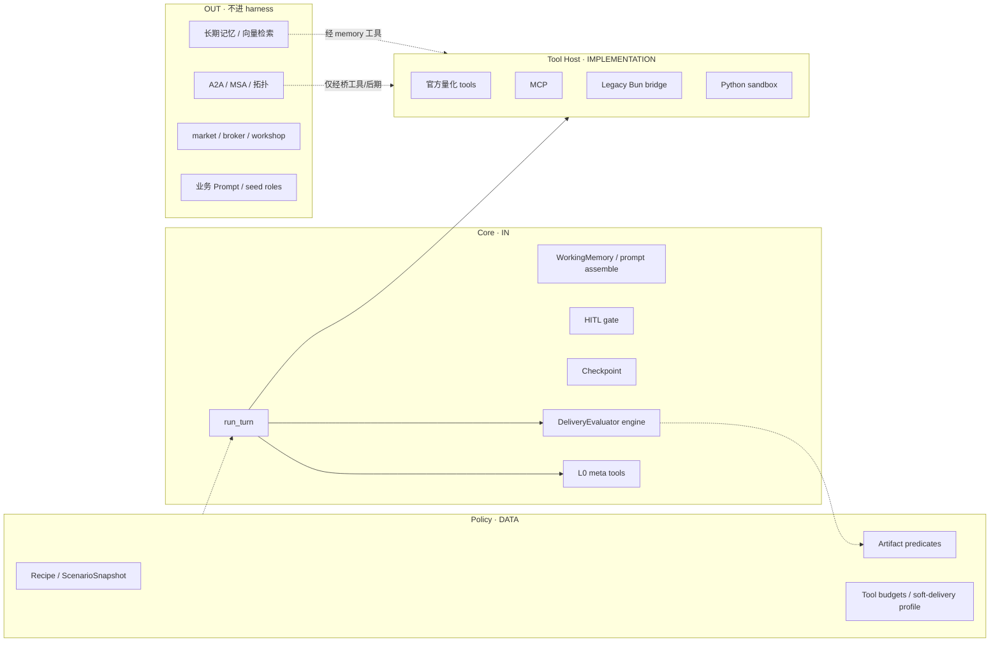
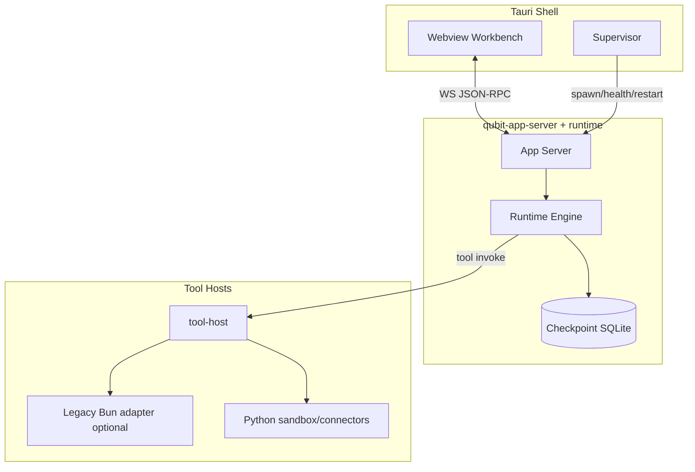
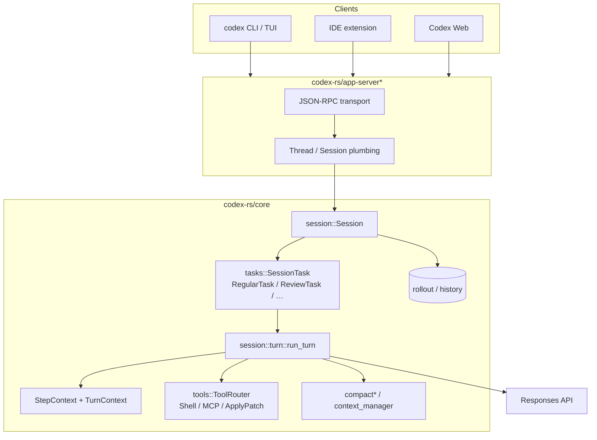
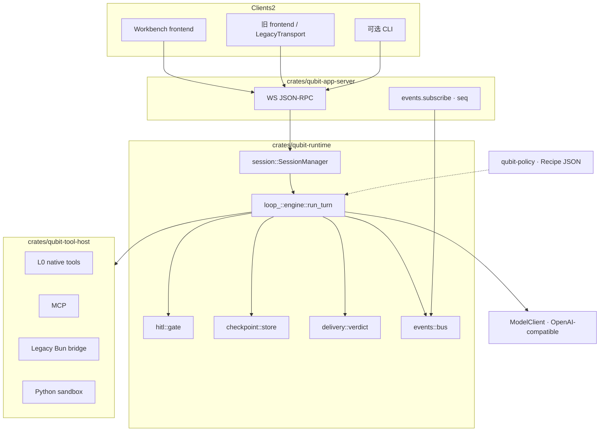
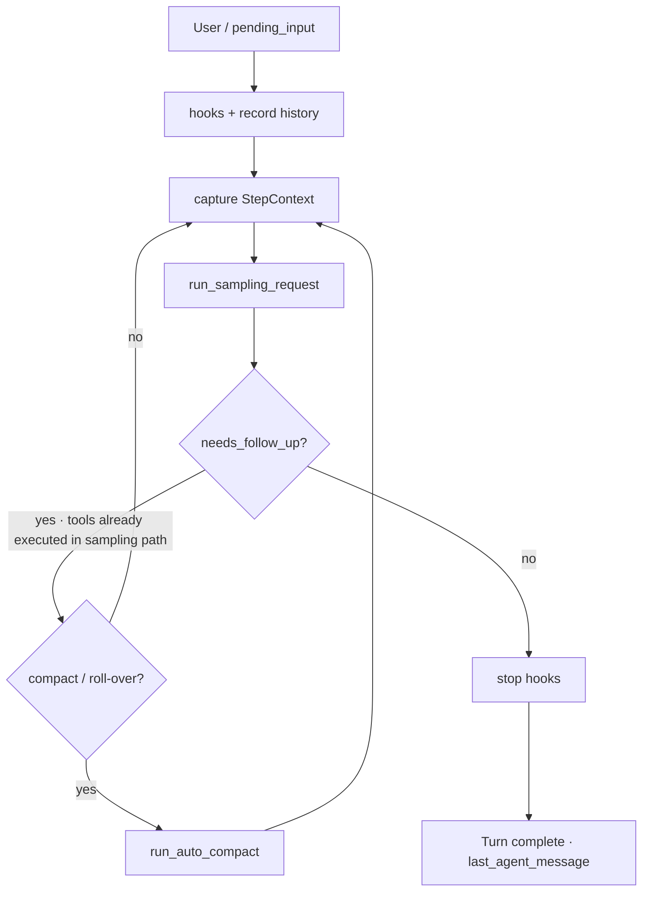
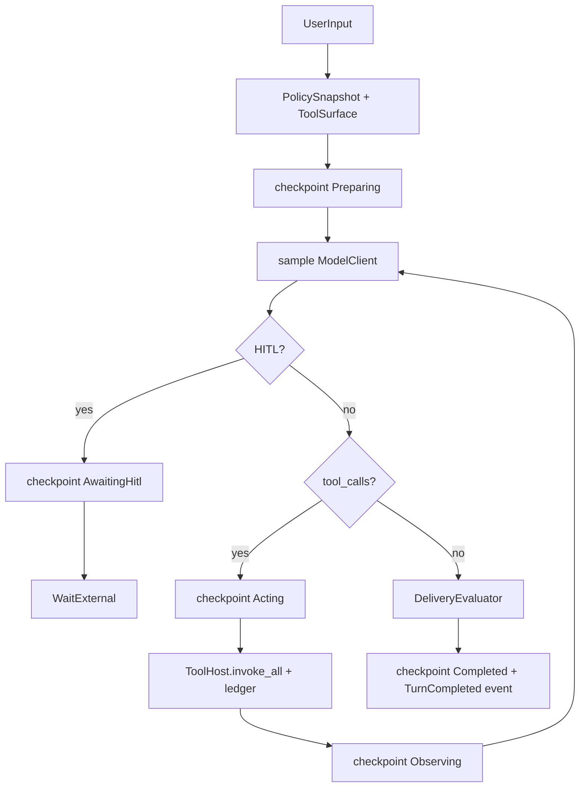
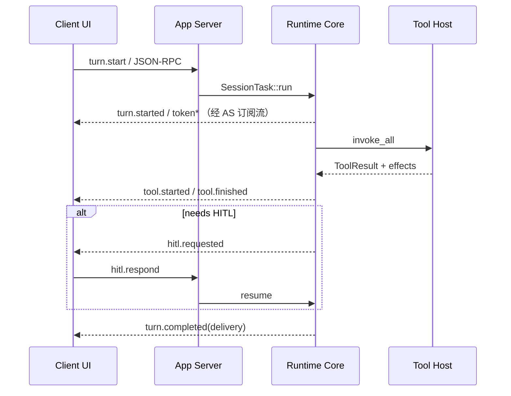

# Qubit Prime — Rust Agent Runtime Core 技术方案

| 项 | 内容 |
|----|------|
| 文档状态 | **规划稿 v0.3 · 边界已拍（§2）· 其余待拍板** |
| 日期 | 2026-08-04 |
| 目标 | 高可用（HA）、薄循环、可观测、可恢复的 Agent Runtime Core（Rust） |
| 非目标（v1） | 全量搬迁 market / broker / workshop；完整 A2A 多 Agent 拓扑；替换模型供应商 |
| 上游对齐 | Codex 式 harness 形状；现仓 thin-loop / policy / DeliveryVerdict |

---

## 目录

1. [问题与目标](#1-问题与目标)
2. [边界：什么是 Core、什么不是](#2-边界什么是-core什么不是)
3. [目标架构](#3-目标架构)
4. [核心 Rust 代码架构与 Codex 对照](#4-核心-rust-代码架构与-codex-对照)
5. [Crate 拆分](#5-crate-拆分)
6. [领域模型与协议草案](#6-领域模型与协议草案)
7. [薄 Loop 状态机](#7-薄-loop-状态机)
8. [工具执行与宿主隔离](#8-工具执行与宿主隔离)
9. [高可用（HA）设计](#9-高可用ha设计)
10. [Policy / Delivery 与现仓对齐](#10-policy--delivery-与现仓对齐)
11. [与旧 Bun Runtime 的绞杀接法](#11-与旧-bun-runtime-的绞杀接法)
12. [可观测性与验收](#12-可观测性与验收)
13. [实施里程碑](#13-实施里程碑)
14. [风险、回滚、开放问题](#14-风险回滚开放问题)

---

## 1. 问题与目标

### 1.1 现状痛点（需被 Core 消除）

| 痛点 | 证据来源 | Core 侧应对 |
|------|----------|-------------|
| Loop 过厚，`act` 兼控制总线 | thin-loop / cohesion 文档 | Loop 只调度；策略外置 |
| `completed ≠ delivered` | DeliveryVerdict | Lifecycle ≠ Delivery 一等字段 |
| 进程/崩溃后难恢复 | 桌面 sidecar 杀进程常见 | Checkpoint + 幂等恢复 |
| 工具副作用与终态脱节 | tool success ≠ artifact | Effect ledger + 谓词 |
| TS 热路径难以做严格并发 / 取消 | Bun 单进程 + 混杂 IO | Rust async + 取消令牌 |

### 1.2 目标（可验收）

1. **薄**：`run_turn` / loop 不知股票、因子、回测；只认 Session / Turn / Tool / Event。
2. **硬**：取消、超时、HITL 暂停、崩溃恢复有明确状态机；无「半写半丢」的默认路径。
3. **真**：成功 = 可观察副作用（文件 / DB 领域行 / 工具 ledger）+ `DeliveryVerdict`，不是「状态机走到 completed」。
4. **HA（desktop-first）**：单机重启后，`AwaitingHitl` / `Running` 可恢复；工具调用幂等；不承诺跨机多活（O6）。
5. **可演进**：协议稳定后可挂多客户端（Workbench / 旧 frontend / CLI）。

### 1.3 非目标（明确砍掉）

- v1 不把 `src/runtime/market/*`、`execution/*`、Python connectors 重写成 Rust。
- v1 不做完整 A2A wave / MSA 融合（可保留「调用旧编排」的桥工具）。
- 不追求字节级兼容现有 Hono REST；用 **协议适配层** 翻译。
- 不以 LOC 指标替代正确性；不以「全 Rust」为进度 KPI。

---

## 2. 边界：什么是 Core、什么不是

> **已拍板（2026-08-04）**：A2A 不进 harness（桥接）；官方工具仅 L0 元工具进 runtime；Artifact/交付 = Core 求值 + Policy 数据；上下文骨架在 Core、长期记忆在外。  
> 本节是 **模块级白名单/黑名单**；实现时以本表为准，冲突以「薄 loop、领域不进 Core」不变式为准。

### 2.1 分层总图

```text
┌─────────────────────────────────────────────────────────────┐
│  Clients: Workbench / 旧 frontend / CLI                     │
└───────────────────────────┬─────────────────────────────────┘
                            │ JSON-RPC / WS
┌───────────────────────────▼─────────────────────────────────┐
│  qubit-app-server                                           │
│  会话路由 · 本地鉴权 · events.subscribe · 取消 · HITL 应答  │
└───────────────────────────┬─────────────────────────────────┘
                            │
┌───────────────────────────▼─────────────────────────────────┐
│  qubit-runtime  【CORE · harness】                          │
│  Session/Turn · run_turn · Cancel · HITL gate · Checkpoint  │
│  上下文组装骨架/WorkingMemory · Observation compact 骨架    │
│  Tool 编排（调用 ToolHost）· DeliveryEvaluator（规则外置）  │
│  L0 元工具：update_plan / workspace files / HITL helpers…   │
└───────┬─────────────────────────┬─────────────┬─────────────┘
        │                         │             │
        ▼                         ▼             ▼
┌───────────────┐   ┌──────────────────┐  ┌──────────────────┐
│ qubit-policy  │   │ qubit-tool-host  │  │ 外部/旧服务       │
│ Recipe JSON   │   │ L1 MCP           │  │ A2A / MSA / 团队  │
│ Artifact 谓词 │   │ L2 Bun bridge    │  │ 长期记忆 / 向量   │
│ 软硬交付档    │   │ L3 Python        │  │ market/broker…   │
│ （数据，非环）│   │ 官方量化 tools   │  │ seed prompts…    │
└───────────────┘   └──────────────────┘  └──────────────────┘
```



### 2.2 归属图例

| 标记 | 含义 |
|------|------|
| **IN** | 进入 `qubit-runtime`（或同进程但属 harness 契约） |
| **DATA** | 以声明数据进 Core（`qubit-policy`），**不**写进 loop 分支代码 |
| **HOST** | `qubit-tool-host` 实现；Core 只看见 `ToolSpec` / `ToolResult` |
| **OUT** | 明确不进 Core；经桥、独立服务或仍留 Bun |
| **LATER** | 方向已定，但 **v1 / M6 前不做** 或先桥接 |

### 2.3 模块边界总表（拍板）

#### A. 循环与控制面

| 模块 | 归属 | 说明 |
|------|------|------|
| `run_turn` / Iteration 状态机 | **IN** | 薄循环；不知场景名 |
| Cancel / timeout | **IN** | 全链路 `CancelToken` |
| Checkpoint / 恢复 | **IN** | desktop HA；见 §9 |
| Event bus + seq | **IN** | 客户端续订 |
| HITL gate（暂停/恢复/幂等） | **IN** | 形态对齐 HITL v2；文案/选项可来自模型或硬规则数据 |
| HITL **硬规则内容**（资金阈值等） | **DATA** | 规则表/配置；求值可在 Core，阈值不写死业务魔法数散落 |
| App Server（WS JSON-RPC） | **IN**（`app-server` crate） | 与 harness 同发布，但不进 `run_turn` |

#### B. A2A / 多 Agent / 编排

| 模块 | 归属 | 说明 |
|------|------|------|
| A2A 总线、task 生命周期、stale reconciliation | **OUT**（**LATER** 可独立编排服） | **已拍**：M6 前不进 harness；团队路径走旧 Bun 桥 |
| 拓扑 wave / MSA 融合 / Orchestrator 规划专环 | **OUT** | 同上 |
| 「派子任务 / 等结果」若将来需要 | **LATER · 最小端口** | 若做，只加 `OrchestrationPort` trait，不把拓扑装进 `run_turn` |
| 研究团队 UI / 画布 | **OUT** | 客户端 |

#### C. 官方 Tool / MCP / Sandbox

| 模块 | 归属 | 说明 |
|------|------|------|
| Tool 编排、超时、并行上限、幂等键 | **IN** | 只调度 |
| **L0 元工具**（`update_plan`、workspace 读写作、HITL helper、session 诊断类） | **IN**（runtime 内窄模块） | **已拍**：仅此类进 runtime crate |
| **官方量化工具**（klines、factor/strategy 写库、order intent、screener…） | **HOST** | 实现在 tool-host；绞杀期可 L2→Bun |
| MCP client 会话 / 工具发现 | **HOST** | Core 只消费已解析的 `ToolSpec` |
| Python sandbox / connectors | **HOST / OUT** | 现有进程协议封装 |
| 在 `act` 内按场景改写工具默认参数 | **禁止** | 与 thin-loop 一致；见 §7.2 |

#### D. Artifact gate / 交付底线

| 模块 | 归属 | 说明 |
|------|------|------|
| `DeliveryVerdict` 求值引擎 | **IN** | **已拍**：引擎在 Core |
| Lifecycle（Completed/Failed/…）与 Delivery 分离 | **IN** | `completed ≠ delivered` |
| Effect / Artifact **ledger**（工具声明的 effects 记账） | **IN** | 供谓词消费 |
| Artifact / capability **谓词与 schema** | **DATA** | Recipe / policy JSON；换场景不改 loop |
| Soft-delivery / researchOk / upgradeOk 等 profile | **DATA** | 档位数据；引擎按 profile 解释 |
| 「模型说完成了」直接当交付成功 | **禁止** | 必须过 DeliveryEvaluator |
| 场景专用硬编码 if-else 堆在 Rust act | **禁止** | 规则进 DATA |

#### E. 上下文与记忆

| 模块 | 归属 | 说明 |
|------|------|------|
| WorkingMemory（短时结构化记忆） | **IN** | turn/session 作用域 |
| Prompt **组装骨架**（history + tools + system slots） | **IN** | 槽位有，文案外置 |
| Observation compact **骨架**（截断/摘要接口） | **IN** | 策略参数可 DATA |
| Token budget 记账 / 超限行为钩子 | **IN** | 限额数字来自配置/DATA |
| 业务 system prompt / seed roles / FSI 文案 | **OUT** | 配置或 policy 注入字符串，不编译进 loop |
| **长期记忆**写路径、向量索引、LanceDB/检索 | **OUT** | **已拍**：经 memory 类 **HOST 工具**或独立 memory 服 |
| Experience embedder / pipes | **OUT** | 可工具化后挂 HOST |
| Auto-compact（Codex 级 remote compact） | **LATER** | v1 简单截断即可 |

#### F. Policy / 场景 / 质量

| 模块 | 归属 | 说明 |
|------|------|------|
| Scenario Recipe 装载 → `PolicySnapshot` | **DATA**（`qubit-policy`） | Core 每 iteration 只读一份 snapshot |
| 工具面收窄、探活预算键 | **DATA** | Host 执行时由 Core 传入 surface；预算计数可在 Core |
| Benchmark / AQM 评分 | **OUT** | 评测进程读 ledger/事件；不进热路径 |
| Agent readiness / 质量探活服务 | **OUT** | 控制面外围 |

#### G. 领域与基础设施（默认 OUT）

| 模块 | 归属 | 说明 |
|------|------|------|
| market 路由、行情源、PIT | **OUT** | 仅经工具 |
| broker / 实盘 / REIA | **OUT** | 仅经工具 + 强 HITL 规则 DATA |
| workshop / 因子存储 / 策略运行时 worker | **OUT** | |
| SQLite 业务表 schema 演进 | **OUT**（旧库）/ 桥 | Core checkpoint 库独立（`prime/runtime.sqlite`） |
| 旧 Hono REST / SSE | **OUT** | LegacyTransport 适配 |

### 2.4 一句话裁决（争议场景）

| 若有人提议… | 裁决 |
|-------------|------|
| 「把 A2A 先写进 Rust 和 run_turn 一起」 | **拒**：OUT + 桥；O5/M6 后再议端口 |
| 「官方 `fetch_klines` 放进 runtime crate 省事」 | **拒**：HOST；runtime 只留 L0 |
| 「交付规则先在 Rust 里写死 SP/ST」 | **拒**：引擎 IN、规则 DATA |
| 「长期记忆表也由 Core checkpoint 顺手管」 | **拒**：LTM OUT；避免 harness 变数据平台 |
| 「没有 artifact 谓词就先当 delivered」 | **拒**：无谓词则 verdict 只能是未知/partial，不能默认真交付 |

### 2.5 不变式（硬）

1. Core **永不** `import` 量化领域业务 crate（market/strategy/broker/…）。  
2. 领域能力只能以 **ToolResult / Policy 数据 / 注入字符串** 进入循环。  
3. `DeliveryEvaluator` 可以否决「假完成」；**不可以**替模型写业务工具参数。  
4. A2A 与 LTM 的引入不得扭曲 `run_turn` 形状——只许 **端口 / 工具**，不许嵌套第二套编排状态机进 Acting。

### 2.6 对照旧仓模块目录（迁移动线提示）

| 现仓路径（示意） | Prime 落点 |
|------------------|------------|
| `runtime/react/*` | **IN** → `qubit-runtime`（重写，非直译） |
| `runtime/policy/*` | **DATA** → `qubit-policy` |
| `runtime/tools/*`（元工具） | **IN** L0 |
| `runtime/tools/*`（量化） | **HOST** / L2 桥 |
| `runtime/a2a/*` · `msa/*` · `orchestration/*` | **OUT** 桥 |
| `runtime/context/*` · WorkingMemory | **IN**（骨架） |
| `runtime/experience/*` · 向量 | **OUT** / 工具 |
| `runtime/market/*` · `execution/*` | **OUT** / 工具 |
| `runtime/mcp/*` | **HOST** |
| `runtime/workflow/hitl-*` | **IN**（协议）+ UI OUT |

---

## 3. 目标架构

### 3.1 进程模型（desktop-first HA）



- **Tauri 继续做 Supervisor**：健康检查、端口、崩溃拉起（现有 sidecar 模式可演进为拉起 Rust binary）。
- **Runtime 与 UI 解耦**：UI 挂了不丢 turn；Runtime 挂了从 checkpoint 恢复。
- **Tool Host 可同进程起步，v1.5 再切 subprocess**（降低一次性复杂度，但接口先按隔离设计）。

### 3.2 控制面 vs 数据面

| 面 | 内容 | 可靠性要求 |
|----|------|------------|
| 控制面 | Session/Turn 状态、HITL、取消、delivery | 强一致、可恢复 |
| 数据面 | token 流、tool stdout 片段 | 可丢最新帧；重连后 replay 摘要 |
| 副作用面 | 工具写入的文件/DB | 幂等键 + ledger |

---

## 4. 核心 Rust 代码架构与 Codex 对照

> **目的**：把「学 Codex 的形状」落到可对照的 **crate / 模块 / 函数签名**。  
> Codex 代码摘自公开仓库 [`openai/codex`](https://github.com/openai/codex) 的 `codex-rs/`（路径以 `main` 为准，上游会演进）。  
> Qubit 侧代码为 **规划实现形状**（尚未落地），故意与 Codex 同名核心抽象对齐，便于迁移心智。

### 4.1 总览对照表

| 维度 | Codex（公开实现） | Qubit Prime Core（规划） |
|------|-------------------|--------------------------|
| 语言 / 热路径 | Rust（`codex-rs/core`） | Rust（`crates/qubit-runtime`） |
| 外壳协议 | `codex-rs/app-server*` · JSON-RPC | `qubit-app-server` · **WS + JSON-RPC**（已拍板 O1） |
| 会话 | `Session` + `ActiveTurn` | `Session` + `Turn` |
| 任务抽象 | `SessionTask`（Regular / Review / Compact…） | v1 仅 `RegularTurn`；Compact/Review 后置 |
| 循环入口 | `session/turn.rs::run_turn` | `loop_/engine.rs::run_turn` |
| 步进上下文 | `StepContext` / `TurnContext` | `TurnContext` + `PolicySnapshot`（每 iteration 一次） |
| 模型 | `ModelClientSession` + Responses API | `ModelClient` trait（OpenAI-compatible 子集起步） |
| 工具 | `tools::ToolRouter` / `ToolCallRuntime` | `ToolHost` trait（L0/L1/L2/L3） |
| 取消 | `tokio_util::sync::CancellationToken` | 同：全链路 `CancelToken` |
| 历史 | conversation items / rollout | checkpoint SQLite + event seq（desktop HA） |
| 成功语义 | 文件/shell **副作用**；无业务 DeliveryVerdict | 副作用 ledger + **`DeliveryVerdict`**（量化合同） |
| 业务无知 | loop 不知「改哪个产品需求」 | loop **不知股票/因子**；只认 Tool/Policy 数据 |
| 多 Agent | 上游有 agent / multi-agent 演进 | **O5：M6 后再进 Core**；此前旧桥 |

### 4.2 进程与包架构对照

#### Codex（简化）



公开 crate 切分（子集，便于对照我们的包边界）：

```text
codex-rs/
  protocol/              # 跨端类型
  core/                  # Session / run_turn / tools / compact
  app-server*/           # JSON-RPC 壳
  mcp-server/ rmcp-…     # MCP
  exec* / sandboxing/    # 执行与沙箱
  tui/ cli/              # 客户端
```

#### Qubit Prime（规划）



包映射（学 Codex 切法，但更瘦）：

| Codex | Qubit Prime |
|-------|-------------|
| `codex-protocol` | `qubit-protocol` |
| `codex-core` | `qubit-runtime` + `qubit-policy` |
| `app-server*` | `qubit-app-server` |
| `tools` / MCP / exec | `qubit-tool-host`（显式外置，防厚 loop） |

### 4.3 任务与 Turn：Codex 真实代码 vs Qubit 规划代码

#### Codex — `SessionTask` 与 `RegularTask`

路径：`codex-rs/core/src/tasks/mod.rs`、`tasks/regular.rs`

```rust
// openai/codex — codex-rs/core/src/tasks/mod.rs（摘录，2026-08 附近 main）
pub(crate) trait SessionTask: Send + Sync + 'static {
    fn kind(&self) -> TaskKind;
    fn span_name(&self) -> &'static str;

    fn run(
        self: Arc<Self>,
        session: Arc<Session>,
        ctx: Arc<TurnContext>,
        input: Vec<TurnInput>,
        cancellation_token: CancellationToken,
    ) -> impl std::future::Future<Output = SessionTaskResult> + Send;

    fn abort(
        &self,
        session: Arc<Session>,
        ctx: Arc<TurnContext>,
    ) -> impl std::future::Future<Output = ()> + Send { /* default no-op */ }
}
```

```rust
// openai/codex — codex-rs/core/src/tasks/regular.rs（摘录）
impl SessionTask for RegularTask {
    fn kind(&self) -> TaskKind { TaskKind::Regular }

    async fn run(
        self: Arc<Self>,
        sess: Arc<Session>,
        ctx: Arc<TurnContext>,
        input: Vec<TurnInput>,
        cancellation_token: CancellationToken,
    ) -> SessionTaskResult {
        // 发 TurnStarted，再吃 startup prewarm …
        let mut next_input = input;
        let mut prewarmed_client_session = /* … */;
        loop {
            let last_agent_message = run_turn(
                Arc::clone(&sess),
                Arc::clone(&ctx),
                next_input,
                prewarmed_client_session.take(),
                cancellation_token.child_token(),
            )
            .await?;
            // 若 turn 结束后仍有 pending steer 输入 → 再跑一轮 run_turn
            if !sess.input_queue.has_pending_input(&sess.active_turn).await {
                return Ok(last_agent_message);
            }
            next_input = Vec::new();
        }
    }
}
```

#### Qubit — 对齐但更少 Task 种类（规划）

路径规划：`crates/qubit-runtime/src/session/task.rs`

```rust
// qubit-prime（规划）— 先只做 Regular；不复制 Compact/Review 任务动物园
pub trait SessionTask: Send + Sync + 'static {
    fn kind(&self) -> TaskKind;

    async fn run(
        self: Arc<Self>,
        session: Arc<Session>,
        ctx: Arc<TurnContext>,
        input: UserInput,
        cancel: CancelToken,
    ) -> Result<TurnOutcome, RuntimeError>;
}

pub struct RegularTask {
    pub engine: Arc<TurnEngine>,
}

impl SessionTask for RegularTask {
    fn kind(&self) -> TaskKind { TaskKind::Regular }

    async fn run(
        self: Arc<Self>,
        session: Arc<Session>,
        ctx: Arc<TurnContext>,
        input: UserInput,
        cancel: CancelToken,
    ) -> Result<TurnOutcome, RuntimeError> {
        session.emit(RuntimeEvent::TurnStarted { turn_id: ctx.turn_id.clone() }).await;
        // v1：无 mid-turn steer 外环；需要时再学 Codex input_queue
        self.engine
            .run_turn(session, ctx, input, cancel)
            .await
    }
}
```

**差异要点**：Codex 用 `SessionTask` 把 compact/review/shell 与常规对话拆开；Prime v1 **只落地 Regular**，compact 做成 `run_turn` 内外的策略钩子，避免过早复制任务体系。

### 4.4 `run_turn` 循环对照

#### Codex — 采样环（真实结构）

路径：`codex-rs/core/src/session/turn.rs`

文档注释与签名（上游原文语义）：

```rust
// openai/codex — session/turn.rs
/// Takes initial turn input and runs a loop where, at each sampling request,
/// the model replies with either:
/// - requested function calls
/// - an assistant message
pub(crate) async fn run_turn(
    sess: Arc<Session>,
    turn_context: Arc<TurnContext>,
    input: Vec<TurnInput>,
    prewarmed_client_session: Option<ModelClientSession>,
    cancellation_token: CancellationToken,
) -> CodexResult<Option<String>> {
    // 1) pre-sampling compact
    // 2) capture_step_context / skills+plugins 注入 / hooks
    // 3) loop:
    //      drain pending_input（用户中途插话）
    //      capture StepContext（tools + context 同一视图）
    //      run_sampling_request(...)  // 内部执行工具并写 history
    //      if needs_follow_up || pending → continue（或 mid-turn compact）
    //      else → stop hooks → return last_agent_message
}
```

主循环骨架（按公开源码整理的可读缩略，非逐行粘贴全文）：

```rust
// openai/codex — run_turn 主循环（结构缩略）
let mut next_step_context = Some(first_step_context);
loop {
    let pending_input = if can_drain_pending_input {
        sess.input_queue.get_pending_input(&sess.active_turn).await.0
    } else {
        Vec::new()
    };
    if run_hooks_and_record_inputs(&sess, &turn_context, &pending_input).await {
        break;
    }

    let step_context = /* next_step_context.take() or capture_step_context(...) */;

    let sampling_request_result = run_sampling_request(
        Arc::clone(&sess),
        Arc::clone(&step_context),
        /* extension_data, turn_diff_tracker, client_session, metadata, history, cancel */,
    )
    .await;

    match sampling_request_result {
        Ok((SamplingRequestResult { needs_follow_up: model_needs_follow_up, last_agent_message }, _)) => {
            let has_pending_input = sess.input_queue.has_pending_input(&sess.active_turn).await;
            let needs_follow_up = model_needs_follow_up || has_pending_input;

            if should_roll_over /* token / new window */ {
                run_auto_compact(/* ... */).await?;
                continue;
            }
            if !needs_follow_up {
                // stop hooks；可能被 hook 阻断后 continue
                last_agent_message = last_agent_message;
                break;
            }
            // else：工具已在 sampling 路径执行并写入 history → 再 sample
        }
        Err(err) => { /* TurnAborted / error lifecycle */ }
    }
}
```

循环数据流：



#### Qubit — `run_turn`（规划：薄、显式阶段、可 checkpoint）

路径规划：`crates/qubit-runtime/src/loop_/engine.rs`

```rust
// qubit-prime（规划）
pub struct TurnEngine {
    models: Arc<dyn ModelClient>,
    tools: Arc<dyn ToolHost>,
    policy: Arc<dyn PolicyLoader>,
    checkpoints: Arc<dyn CheckpointStore>,
    delivery: Arc<dyn DeliveryEvaluator>,
    events: Arc<EventBus>,
}

impl TurnEngine {
    pub async fn run_turn(
        &self,
        session: Arc<Session>,
        ctx: Arc<TurnContext>,
        input: UserInput,
        cancel: CancelToken,
    ) -> Result<TurnOutcome, RuntimeError> {
        let turn_id = ctx.turn_id.clone();
        self.checkpoints
            .save(&session, TurnState::Preparing, /*…*/)
            .await?;

        let snapshot = self.policy.load_snapshot(&session, &ctx).await?;
        let surface = self.tools.resolve_surface(&snapshot).await?;

        // 与 Codex 不同：工具执行从「采样黑盒」里拆出来，便于 Acting 态 checkpoint / 幂等重放
        loop {
            cancel.check()?;
            self.checkpoints.save(&session, TurnState::Reasoning, /*…*/).await?;

            let prompt = assemble_prompt(&session, &ctx, &snapshot, &surface)?;
            let sample = self.models.sample(prompt, cancel.child()).await?;
            self.events.emit_tokens(&turn_id, &sample).await;

            if let Some(hitl) = sample.hitl_prompt {
                self.checkpoints
                    .save_hitl(&session, &hitl) // AwaitingHitl · 强制 fsync
                    .await?;
                self.events.emit(RuntimeEvent::HitlRequested { prompt: hitl }).await;
                return Ok(TurnOutcome::AwaitingHitl);
            }

            let calls = parse_tool_calls(&sample)?; // 纯解析，不改写业务参数
            if calls.is_empty() {
                break;
            }

            self.checkpoints.save(&session, TurnState::Acting, /*…*/).await?;
            let results = self
                .tools
                .invoke_all(calls, InvokeContext { session: &session, turn: &ctx, cancel: cancel.child() })
                .await?;
            session.push_observations(compact_observations(&results));
            session.ledger.record(&results);
            self.checkpoints.save(&session, TurnState::Observing, /*…*/).await?;
            // continue → 再 sample（等价 Codex needs_follow_up = true）
        }

        let verdict = self.delivery.evaluate(&snapshot, &session.ledger, &session.turn)?;
        self.checkpoints.save(&session, TurnState::Completed, /*…*/).await?;
        self.events.emit(RuntimeEvent::TurnCompleted {
            turn_id,
            lifecycle: Lifecycle::Completed,
            delivery: verdict.clone(),
        }).await;
        Ok(TurnOutcome::Finished { delivery: verdict })
    }
}
```

循环数据流（故意把 Acting 拉出采样函数）：



### 4.5 工具路径对照

| 点 | Codex | Qubit Prime |
|----|-------|-------------|
| 路由 | `tools::ToolRouter` / `build_tool_router`；并行 `ToolCallRuntime` | `ToolHost::invoke` / `invoke_all` |
| 执行时机 | 多在 `run_sampling_request` **内部**随 response item 执行 | **显式 Acting 阶段**（HA：崩溃可重放） |
| MCP | core + rmcp/mcp crates | `qubit-tool-host` L1 |
| 审批 / HITL | App Server 反向 RPC / elicitation | `HitlPrompt` + `hitl.respond`（对齐现 HITL v2） |
| 编码专用 | ApplyPatch / Shell 一等 | L0 可含 workspace file tools；量化写库走 L2 bridge |

Codex 工具侧引用（模块级，便于去上游对照）：

```text
codex-rs/core/src/tools/
  router.rs / parallel.rs / registry.rs / spec_plan.rs …
codex-rs/core/src/session/turn.rs
  → run_sampling_request → 处理 FunctionCall 等 output items
```

Qubit 规划接口（与 §8 一致）：

```rust
#[async_trait]
pub trait ToolHost: Send + Sync {
    async fn resolve_surface(&self, snap: &PolicySnapshot) -> Result<ToolSurface, ToolError>;
    async fn invoke_all(
        &self,
        calls: Vec<NormalizedToolCall>,
        ctx: InvokeContext<'_>,
    ) -> Result<Vec<ToolResult>, ToolError>;
}
```

### 4.6 事件与客户端协议对照



| Codex | Qubit |
|-------|-------|
| `EventMsg::TurnStarted` / deltas / `TurnComplete`… | `RuntimeEvent`（见 §6.3 事件列表）带 session 单调 `seq` |
| stdio / UDS / app-server transport 多样 | **先 WS JSON-RPC**（桌面 Webview 友好） |
| 成功不绑领域表 | `turn.completed` **必须带 DeliveryVerdict** |

### 4.7 我们「学什么 / 不学什么」

**学（形状）**

1. `Session` + `run_turn` 薄循环，业务不进采样环分叉。  
2. `SessionTask` 任务边界 + `CancellationToken`。  
3. App Server 与 Core 分离，多客户端共用 harness。  
4. `StepContext` 式「单次 iteration 同一工具面/上下文视图」。

**不学 / 后置（避免过拟合编码 Agent）**

1. 不把 Responses API / prompt cache / remote compact 全量搬来当 v1 门槛。  
2. 不复制庞大的 Task 动物园与插件注入体系。  
3. **不把工具执行藏进 sampling 闭包**——量化要 HA 与 Delivery ledger，需要显式 Acting。  
4. 增加 Codex 没有的 **`DeliveryVerdict` + Recipe Policy`**（现仓 thin-loop 的硬约束）。

### 4.8 模块文件级映射清单（落地 checklist）

| Codex 路径 | Qubit 规划路径 | v1 |
|------------|----------------|----|
| `core/src/session/turn.rs` | `runtime/src/loop_/engine.rs` | 必做 |
| `core/src/session/turn_context.rs` | `runtime/src/session/turn_context.rs` | 必做 |
| `core/src/session/step_context.rs` | `runtime/src/loop_/iteration_context.rs` | 必做 |
| `core/src/tasks/{mod,regular}.rs` | `runtime/src/session/task.rs` | Regular only |
| `core/src/tools/*` | `tool-host/src/*` | 必做边界 |
| `core/src/compact*.rs` | `runtime/src/context/compact.rs` | 后置 |
| `app-server*` | `app-server/src/*` | 必做 |
| `protocol` | `protocol/src/*` | 必做 |
| （无直接对应） | `runtime/src/delivery/*` | **Qubit 新增** |
| （无直接对应） | `runtime/src/checkpoint/*` | **Qubit 强化 HA** |
| （无直接对应） | `tool-host/src/legacy_bridge.rs` | 绞杀期 |

## 5. Crate 拆分

```text
crates/
  qubit-protocol/       # 纯类型 + serde + schema export（无业务 IO）
  qubit-runtime/        # SessionManager, TurnEngine, CheckpointStore, DeliveryEval
  qubit-app-server/     # axum/jsonrpsee: WS + 可选 HTTP
  qubit-tool-host/      # ToolRegistry, MCP stdio, legacy HTTP bridge, sandbox spawn
  qubit-policy/         # Recipe 装载与 snapshot 构建（可先薄）
```

| Crate | 职责 | 依赖方向 |
|-------|------|----------|
| `qubit-protocol` | 全部跨端消息类型 | 无 ↓ |
| `qubit-policy` | Recipe → `PolicySnapshot` | → protocol |
| `qubit-runtime` | 状态机与持久化 | → protocol, policy |
| `qubit-tool-host` | 执行工具 | → protocol |
| `qubit-app-server` | 对外 RPC | → runtime, tool-host, protocol |

**禁止**：`qubit-runtime` 依赖 Hono/Bun；`qubit-tool-host` 反向依赖 `app-server`。

### 5.1 建议模块（`qubit-runtime` 内部）

```text
qubit-runtime/
  src/
    lib.rs
    session/
      manager.rs          # Session 生命周期
      turn.rs             # Turn 状态机
    loop_/
      engine.rs           # run_turn
      reason_port.rs      # trait ModelClient
      act.rs              # 解析 tool_calls → 调度（薄）
      observe.rs          # 归一化 observation
    hitl/
      gate.rs
    checkpoint/
      store.rs            # SQLite
      recover.rs
    delivery/
      verdict.rs
      ledger.rs
    cancel/
      token.rs
    events/
      bus.rs              # broadcast to subscribers
```

---

## 6. 领域模型与协议草案

### 6.1 核心实体

| 实体 | 含义 | ID |
|------|------|-----|
| `WorkspaceRef` | 本地工作区根 | path / uuid |
| `Session` | 一次连续对话 / 研究会话 | `ses_*` |
| `Turn` | 用户一条输入触发的完整循环 | `trn_*` |
| `Iteration` | turn 内一次 model→tools 轮 | `u32` |
| `ToolCall` | 单次工具调用 | `tc_*`（客户端或模型提供；服务端规范化） |
| `HitlPrompt` | 人工闸门请求 | `hitl_*` |
| `Checkpoint` | 可恢复快照 | `cp_*` / `(session, turn, seq)` |
| `DeliveryVerdict` | 交付判定 | 枚举 + reasons |

### 6.2 生命周期（Turn）

```text
Accepted
  → Preparing          # 装载 policy snapshot / 工具面
  → Reasoning          # 等模型
  → Acting             # 执行工具（可并行受限）
  → Observing          # 压缩 observation、写 ledger
  → (loop Reasoning…)
  → AwaitingHitl       # 可持久化暂停
  → Finalizing         # DeliveryVerdict
  → Completed | Failed | Cancelled
```

**规则**：

- 任一状态可因 `Cancel` → `Cancelled`（Acting 中必须传播取消到 Tool Host）。
- `AwaitingHitl` **必须**落盘后才对客户端声明「已暂停」。
- `Completed` 仅表示生命周期结束；UI 展示以 `DeliveryVerdict` 为准。

### 6.3 JSON-RPC 方法（草案）

传输默认：**WebSocket + JSON-RPC 2.0**（O1 待拍板）。  
通知（server → client）用同连接 `method` 无 `id`，或独立 `events` 订阅流。

#### 客户端 → 服务端

| method | params（摘要） | result |
|--------|----------------|--------|
| `session.create` | `{ workspaceId?, agentRef, mode }` | `{ sessionId }` |
| `session.get` | `{ sessionId }` | `SessionView` |
| `turn.start` | `{ sessionId, input: UserInput, idempotencyKey }` | `{ turnId }` |
| `turn.cancel` | `{ sessionId, turnId }` | `{ ok }` |
| `hitl.respond` | `{ promptId, response }` | `{ ok }` |
| `events.subscribe` | `{ sessionId, fromSeq? }` | `{ subscriptionId }` |
| `events.unsubscribe` | `{ subscriptionId }` | `{ ok }` |
| `checkpoint.list` | `{ sessionId }` | `CheckpointMeta[]` |
| `runtime.health` | `{}` | `{ status, uptimeMs, activeTurns }` |

#### 服务端 → 客户端（事件）

与现有 `StepEventType` 对齐并扩展：

```typescript
type RuntimeEvent =
  | { type: "turn.started"; turnId: string; seq: number; ts: number }
  | { type: "token"; turnId: string; iteration: number; text: string; seq: number }
  | { type: "tool.started"; turnId: string; callId: string; name: string; args: unknown; seq: number }
  | { type: "tool.finished"; turnId: string; callId: string; ok: boolean; observationRef: string; seq: number }
  | { type: "hitl.requested"; prompt: HitlPrompt; seq: number }
  | { type: "plan.updated"; turnId: string; plan: unknown; seq: number }
  | { type: "turn.completed"; turnId: string; lifecycle: Lifecycle; delivery: DeliveryVerdict; seq: number }
  | { type: "turn.failed"; turnId: string; error: ErrorObject; seq: number }
  | { type: "runtime.degraded"; reason: string; seq: number };
```

**事件必须带单调 `seq`（session 作用域）**，以便断线重连 `events.subscribe(fromSeq)`。

### 6.4 `UserInput` / `HitlPrompt`（摘要）

```json
{
  "UserInput": {
    "text": "string",
    "attachments": [{ "kind": "file|kline_context|artifact_ref", "ref": "..." }],
    "clientMeta": {}
  },
  "HitlPrompt": {
    "id": "hitl_...",
    "turnId": "trn_...",
    "inputKind": "approve_only|single_choice|multi_choice|free_form",
    "title": "string",
    "body": "string",
    "options": [{ "id": "string", "label": "string" }],
    "hardRule": false,
    "createdAt": 0
  }
}
```

对齐现有 HITL v2（`docs/HITL_REDESIGN.md`）：`approve_only` / `single_choice` / `free_form` 优先；`multi_choice` 可 P2。

### 6.5 Checkpoint 记录（serde 概念）

```rust
struct CheckpointRecord {
    session_id: String,
    turn_id: String,
    seq: u64,
    state: TurnState,              // 枚举
    iteration: u32,
    working_memory: serde_json::Value,
    pending_tool_calls: Vec<ToolCall>,
    hitl: Option<HitlPrompt>,
    policy_snapshot_hash: String,  // 避免恢复时策略漂移无感
    delivery_partial: Option<DeliveryVerdict>,
    updated_at_ms: i64,
}
```

写入策略：**状态迁移成功后** fsync/事务提交；高频 `token` **不进** checkpoint（只进事件 log，可截断）。

---

## 7. 薄 Loop 状态机

### 7.1 `run_turn` 伪代码

```text
fn run_turn(session, input, cancel):
  turn = Turn::accepted(input, idempotency_key)
  checkpoint(turn, Preparing)
  snapshot = policy.load(session)
  tools = tool_host.resolve_surface(snapshot)

  loop:
    cancel.check()?
    checkpoint(turn, Reasoning)
    model_out = model.sample(prompt_from(session, turn, snapshot, tools))
    emit tokens...

    if model_out.requests_hitl:
      turn.awaiting_hitl(parse_hitl(model_out))
      checkpoint(turn, AwaitingHitl)   # 持久化后再 notify
      return WaitExternal

    calls = parse_tool_calls(model_out)  # 纯解析，不改写业务
    if calls.is_empty():
      break

    checkpoint(turn, Acting)
    results = tool_host.execute_all(calls, cancel, idempotency)
    turn.push_observations(compact(results))
    ledger.record(results)
    checkpoint(turn, Observing)

  verdict = delivery.evaluate(snapshot, ledger, turn)
  checkpoint(turn, Finalizing)
  turn.complete(verdict)
  emit turn.completed
```

### 7.2 明确禁止进入 Core 的逻辑

| 禁止 | 理由 | 去处 |
|------|------|------|
| 按 scenario 改写 tool 参数默认值 | 制造浅交付 | Policy hint / 模型重试，不静默代写 |
| 在 act 内读业务 SQLite 判 artifact | 循环变厚 | `delivery` + ledger 谓词 |
| Orchestrator 探活死循环 | 烧掉预算 | Recipe 预算 + Host 缓存工具 |
| 自动 `dispatchBuiltinTool` 默认参 | 与 thin-loop 计划冲突 | 删除；改为可观测的 nudge 事件 |

### 7.3 Model 端口

```rust
#[async_trait]
trait ModelClient: Send + Sync {
    async fn sample(&self, req: SampleRequest, cancel: CancelToken)
        -> Result<SampleResponse, ModelError>;
}
```

实现可先包一层 OpenAI-compatible HTTP（Rust `reqwest`），与现仓 `llm-router` 行为对齐的部分（长度重试、reasoning content）**分阶段搬**，v1 可先「等价子集」。

---

## 8. 工具执行与宿主隔离

### 8.1 Tool Host 协议

```rust
#[async_trait]
trait ToolHost: Send + Sync {
    async fn list_tools(&self, filter: &ToolSurface) -> Vec<ToolSpec>;
    async fn invoke(&self, call: NormalizedToolCall, ctx: InvokeContext)
        -> ToolResult;
}
```

`ToolResult`：

```json
{
  "callId": "tc_...",
  "ok": true,
  "observation": { "summary": "...", "dataRef": "obs_..." },
  "effects": [{ "kind": "row_upsert|file_write|artifact", "key": "...", "meta": {} }],
  "retryable": false,
  "errorCode": null
}
```

### 8.2 v1 工具来源分层

| 层 | 例子 | 实现 |
|----|------|------|
| L0 Native | `update_plan`, workspace file tools | Rust 直实现 |
| L1 MCP | 外部 MCP server | `qubit-tool-host` stdio/HTTP |
| L2 Legacy Bridge | 现有 builtin 量化工具 | HTTP/IPC 调旧 Bun（绞杀期） |
| L3 Python | sandbox / connectors | 现有进程协议封装 |

**幂等**：每个 `ToolCall` 带 `idempotencyKey = hash(session, turn, callId, name, canonical_args)`；Host 侧短缓存，恢复时防双写。

### 8.3 隔离演进

| Phase | 隔离 | 用途 |
|-------|------|------|
| M1 | 同进程 `ToolHost` trait | 先跑通 |
| M2 | subprocess `tool-host` + JSON-RPC | 防工具 panic 拖死 runtime |
| M3 | 按工具类别分进程 / cgroup（可选） | 实盘相关 |

---

## 9. 高可用（HA）设计

> 目标定位：**Desktop-first High Availability**（单机进程崩溃可恢复），不是云上多活。远端 server HA 留作后续（O6）。

### 9.1 HA 场景矩阵

| 场景 | 期望 | 机制 |
|------|------|------|
| UI 崩溃 / 刷新 | 会话继续；事件从 `fromSeq` 续传 | Event log + subscribe |
| App Server 崩溃 | Supervisor 拉起；Running turn 恢复或标记 degraded | Checkpoint + Tauri restart |
| 正在 Acting 时崩溃 | 工具幂等重放或标记 unknown→reconcile | idempotency + ledger |
| HITL 等待中崩溃 | 恢复后仍停在同一 `HitlPrompt` | Checkpoint `AwaitingHitl` |
| 模型流中断 | 可取消当轮；不污染已提交 observations | 半开 iteration 丢弃 |
| 磁盘满 / SQLite 锁 | `runtime.degraded`；拒新 turn | health + backpressure |
| 用户取消 | 尽快停下工具 | CancelToken 全链路 |

### 9.2 Checkpoint 频率

| 触发点 | 是否 checkpoint |
|--------|-----------------|
| Turn accepted / preparing 完成 | 是 |
| 每次 iteration 进入 Reasoning 前 | 是 |
| 每次工具批次完成 | 是 |
| 进入 AwaitingHitl | 是（强制 fsync） |
| Finalizing / Completed | 是 |
| 每个 token | **否**（仅 event append，可环形缓冲） |

### 9.3 恢复算法

```text
on_boot:
  for turn in store.load_non_terminal():
    match turn.state:
      AwaitingHitl => re-emit hitl.requested; wait
      Reasoning | Preparing => mark Failed(retryable) OR restart iteration (config)
      Acting =>
        for call in pending:
          if ledger.has_success(idempotency): reuse
          else if ledger.has_unknown: reconcile_tool(call)
          else: re-invoke(call)
      Observing | Finalizing => continue evaluate/complete
```

**默认策略（待拍板）**：`Reasoning` 中崩溃 → **不自动静默重试模型**（花费不可控），标记 `Failed { retryable: true }`，由客户端/用户显式 Retry。`Acting` 中崩溃 → 按幂等重放工具。

### 9.4 健康与背压

`runtime.health` 暴露：

- `activeTurns`, `hitlWaiting`, `eventLogLag`
- `checkpointOk`, `toolHostOk`, `modelOk`
- `degradedReasons[]`

当 `activeTurns >= MAX` 或 checkpoint 失败：拒绝 `turn.start`（`429`-语义的 JSON-RPC error）。

### 9.5 本地数据布局

```text
$QUBIT_DATA_DIR/prime/
  runtime.sqlite          # sessions, turns, checkpoints, ledger, event_seq
  event_segments/         # 可选：大体量 token 分段文件
  workspaces/             # 工作区映射
```

与现有 `~/.quant-agent` 并存；**不**直接覆写旧 schema。桥接期用 adapter 读旧库只读或双写关键表（另文）。

---

## 10. Policy / Delivery 与现仓对齐

### 10.1 从现仓继承的概念

| 现仓 | Prime Core |
|------|------------|
| `ScenarioRuntimeSnapshot` | `PolicySnapshot`（hash 固化进 checkpoint） |
| `DeliveryVerdict` | 同名一等字段 |
| Recipe（stock-pick / strategy / …） | JSON 文件装载进 `qubit-policy` |
| soft-delivery / researchOk | verdict profile，不进 loop 分支代码 |
| `IterationContext` | `TurnContext` 值对象（每 iteration 一次） |

### 10.2 DeliveryVerdict（草案枚举）

```text
delivered
delivered_with_gaps
partial
failed
cancelled
```

`reasons[]`：`missing_artifact:*` / `capability_not_succeeded:*` / `answer_schema_unsatisfied` / …（与现仓对齐，便于回归对照）。

### 10.3 配方仍外置

Core 只调用：

```rust
trait DeliveryEvaluator {
    fn evaluate(&self, snap: &PolicySnapshot, ledger: &EffectLedger, turn: &Turn)
        -> DeliveryVerdict;
}
```

业务谓词实现可先用 JSONPath / 声明式 rules；复杂的可落在 policy crate，**禁止**塞回 `act`。

---

## 11. 与旧 Bun Runtime 的绞杀接法

### 11.1 阶段策略

| 阶段 | 用户路径 | Runtime |
|------|----------|---------|
| S0 | 100% 旧 Bun | 仅文档 + protocol crate |
| S1 | feature flag `primeRuntime` 对「单 Agent 文本+少量工具」试跑 | Rust core + Legacy Tool Bridge |
| S2 | 研究对话主路径切 Prime | 回测/团队仍旧 |
| S3 | 团队编排以桥工具或第二期 Rust 模块迁入 | 旧 loop 缩容 |
| S4 | 旧 `executeAgentReact` 只读退役 | 删除热路径 |

### 11.2 Bridge 形态

旧 Bun 提供内部端点（或 stdio JSON-RPC）：

- `legacy.tools.invoke`
- `legacy.tools.list`

Prime 将其注册为 L2 tools。桥必须返回标准 `ToolResult.effects`，否则 delivery 无法求值。

### 11.3 兼容性测试

每个迁移场景保留：

1. 同 fixture 双跑（旧 vs Prime）事件轨迹 diff（允许 seq/ts 差）
2. DeliveryVerdict 对照
3. HITL round-trip 对照

---

## 12. 可观测性与验收

### 12.1 结构化日志 / Trace

- 每个 turn：`trace_id`（与现仓字段兼容）
- OpenTelemetry 可选；v1 至少 JSON 行日志 + SQLite span 表

### 12.2 验收门槛（Core MVP）

| ID | 验收项 | 通过标准 |
|----|--------|----------|
| C1 | 单 turn happy path | model→tool→final 事件齐全 |
| C2 | HITL 暂停恢复 | kill -9 server 后 prompt 仍在，应答后继续 |
| C3 | 取消 | Acting 中 cancel，工具停止，turn=Cancelled |
| C4 | 幂等 | 同一 idempotencyKey 的 turn.start 不双跑 |
| C5 | Delivery | 缺 artifact 时 lifecycle=Completed 且 verdict=partial |
| C6 | 背压 | 打满 activeTurns 时新 turn 被拒 |
| C7 | Bridge | 至少 3 个旧 builtin 经 bridge 成功 |
| C8 | 回归 | smoke 子集（可先 SP 或 research-only）不差于旧路径基线 |

---

## 13. 实施里程碑

| 里程碑 | 产出 | 预估 |
|--------|------|------|
| **M0 · 协议冻结** | `qubit-protocol` + JSON Schema；O1–O6 拍板回写 README | 1–2 周 |
| **M1 · 骨架** | app-server + 内存 Session + 假 Model/Tool | 2–3 周 |
| **M2 · Checkpoint HA** | SQLite checkpoint + 恢复 + HITL | 2–3 周 |
| **M3 · 真模型 + L0/L1 工具** | OpenAI-compatible + MCP + file tools | 3–4 周 |
| **M4 · Legacy Bridge** | 接 关键量化 builtin；flag 灰度 | 2–3 周 |
| **M5 · Delivery + Policy** | Recipe snapshot + verdict；对照测试 | 2–3 周 |
| **M6 · 硬化** | 取消、背压、supervisor、soak kill-9 | 2 周 |

合计约 **3.5–5 人月** 到「可灰度的 Core」（单 Agent）。不含完整 A2A / UI。

---

## 14. 风险、回滚、开放问题

### 14.1 风险

| 风险 | 缓解 |
|------|------|
| 双实现漂移 | 协议单源；bridge 对照测试 |
| HA 过度设计拖死 MVP | 先单机 checkpoint，不做分布式 |
| 过早 subprocess | 接口先隔离，实现同进程 |
| 把业务又写进 Rust act | code review 清单 + crate 边界 lint |
| 与旧 HITL/SSE 分叉 | 事件模型先对齐 StepEventType |

### 14.2 回滚

- Feature flag 关闭 → 全部回旧 Bun。
- Prime 数据目录独立，删除不影响旧库。
- Bridge 单向依赖旧服务：旧服务挂 → Prime 仅失去 L2 工具，不腐蚀 checkpoint。

### 14.3 开放问题（待你拍板）

| ID | 问题 | 选项 | 建议 |
|----|------|------|------|
| O1 | 传输 | A) WS JSON-RPC  B) HTTP+SSE 双通道  C) 两者都做 | **已拍板：A** |
| O2 | Checkpoint 存储 | A) 单 SQLite  B) SQLite+segment 文件 | **A 起步，token 多再上 B** |
| O3 | Recipe 格式 | A) JSON（兼容现 policy） B) YAML  C) Rhai/DSL | **A** |
| O5 | A2A 进 Core 时机 | A) M6 后  B) 与 M3 并行  C) 永不进 Core，永桥 | **已拍板：A** |
| O6 | 部署 | A) desktop-first  B) 同时设计远端 server | **A** |
| O7 | Reasoning 崩溃策略 | A) Failed+retryable  B) 自动重采样 | **A** |
| O8 | App Server 框架 | A) axum+手写 JSON-RPC  B) jsonrpsee | **B 或 axum 自研轻量；偏好实现简单者** |
| O9 | Model 路由复用 | A) v1 子集  B) 完整搬迁 length-retry 等 | **A，列差距表逐项补** |

---

## 附录 A — Codex 对照快速卡

完整对照见 **[§4](#4-核心-rust-代码架构与-codex-对照)**（架构图 + 真实路径代码 + 规划代码）。

| Codex | Qubit Prime Core |
|-------|------------------|
| `run_turn` 不知业务 | 同左 |
| App Server JSON-RPC | WS + JSON-RPC（同形） |
| 成功=副作用 | DeliveryVerdict + EffectLedger |
| Compact / prompt cache | 后期；v1 简单截断 |
| 工具多在 sampling 内执行 | **显式 Acting**（HA） |
| 多客户端共用 harness | Workbench / 旧 UI / CLI |

## 附录 B — 修订记录

| 日期 | 版本 | 说明 |
|------|------|------|
| 2026-08-04 | v0.1 | 首版深度规划，待拍板后开 `crates/` |
| 2026-08-04 | v0.2 | 新增 §4：Rust 代码架构与 Codex 对照（图 + 代码） |
| 2026-08-04 | v0.3 | §2 模块边界拍板：A2A/Tool/Artifact·交付/上下文·LTM 总表 |
