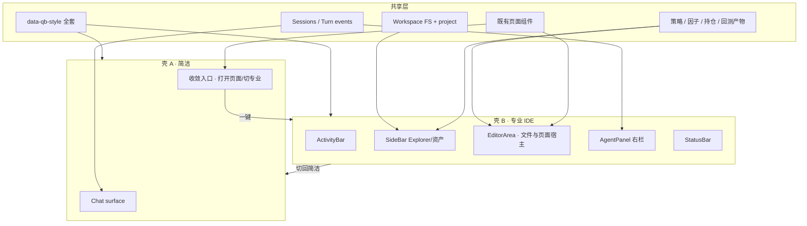

# Qubit Prime — Cursor 风 Workbench UI 技术方案

| 项 | 内容 |
|----|------|
| 文档状态 | **规划稿 v0.4 · Workspace FS 契约与可插拔 Provider 已写清** |
| 日期 | 2026-08-04 |
| 目标 | **保留现有风格与页面**；在此之上演进双壳：简洁=对话优先，专业=可操作 IDE 工作区 |
| 参考 | Cursor 三栏密度；Claude Code / Codex 项目管理；现仓 `displayMode` 与 `data-qb-style` |
| 非目标（v1） | 完整 VS Code 扩展生态；扔掉旧皮肤/旧页面重做站 |

---

## 目录

1. [目标与非目标](#1-目标与非目标)
2. [已拍板产品模型：双壳](#2-已拍板产品模型双壳)
3. [保留资产：风格类型与现有页面](#3-保留资产风格类型与现有页面)
4. [参考拆解（Cursor → 专业壳）](#4-参考拆解cursor--专业壳)
5. [与现状差距](#5-与现状差距)
6. [目标信息架构](#6-目标信息架构)
7. [专业工作区：Workspace 与投研资产](#7-专业工作区workspace-与投研资产)
8. [视觉与字体密度 Token](#8-视觉与字体密度-token)
9. [核心组件规格](#9-核心组件规格)
10. [编辑器与 LSP 路线](#10-编辑器与-lsp-路线)
11. [与 Runtime 事件的绑定](#11-与-runtime-事件的绑定)
12. [工程落点与绞杀迁移](#12-工程落点与绞杀迁移)
13. [实施里程碑](#13-实施里程碑)
14. [验收标准](#14-验收标准)
15. [开放问题](#15-开放问题)

---

## 1. 目标与非目标

### 1.1 目标

1. **双壳并存（已拍）**：  
   - **简洁（Simple）**：对话优先，低噪音，能完成「问 → 答 → 带上下文再问」。  
   - **专业（Pro / Workbench）**：贴近 Cursor/VS Code 的可操作工作区。  
   两壳 **共享会话、项目、workspace 数据与 Runtime 事件**。
2. **保留现有风格类型**：`default` / `feishu-clean` / `industrial` / `bauhaus` / `sci-fi-hud` / `comic-book`（见 `frontend/src/theme/appearance.ts`）继续可用，不在 Prime 里砍掉。
3. **保留现有页面能力**：研究对话、研究团队、量化工坊、行情/资讯、监控、配置、交易相关等 **入口仍在**；专业壳用 IDE 方式挂载，简洁壳用收敛入口达到。
4. **专业壳贴 IDE**：Activity Bar + 侧栏 + 中栏编辑/页面宿主 + 右栏 Agent + Status Bar；密度与弱分隔参考 Cursor。
5. **工作区可操作**：专业模式下可浏览 **FS 优先的 Workspace 课题树**，管理/查看 **策略、因子、持仓、长期记忆**（及回测/产物/Runs）；能力面经 **Provider 接口**可插拔。
6. **Runtime 可切换**：LegacyTransport / PrimeTransport 对 UI 透明。

### 1.2 非目标

- 不做完整 VS Code fork / Theia 重基。
- v1 不做扩展市场。
- **不**「为了像 Cursor」删掉多风格或多页面。
- 不追求与 Cursor 私有品牌资源像素一致。
- 不把简洁壳做成残缺产品：关键研究能力仍要可达，只是默认不铺满 chrome。

---

## 2. 已拍板产品模型：双壳

> **壳模型**：双壳（`simple` / `pro`），共享会话与数据。  
> **资产挂接**：现有风格 + 现有页面在两种模式下都可达到（专业用 IDE 嵌页，简洁用入口收敛）。

### 2.1 模式定义

| | 简洁 `uxMode=simple` | 专业 `uxMode=pro` |
|--|----------------------|-------------------|
| 心智 | ChatGPT / Cursor Chat 感 | Cursor Workbench / 量化 IDE |
| 主表面 | 对话 transcript + composer | 工作区 + 编辑器/页面宿主 + Agent 右栏 |
| Chrome | 薄顶栏 / 最少侧栏 | ActivityBar + SideBar + StatusBar |
| 工作区树 | 默认隐藏；需要时抽屉/命令打开 | **一等公民**（Explorer） |
| 策略/因子/持仓 | 从对话结果跳转或「打开高级」 | SideBar / Editor Tab **可直接操作** |
| 现有整页 | 顶栏/菜单收敛入口进入（可暂时全屏叠层） | Activity 视图或 Editor Tab 内嵌 |
| 风格 `data-qb-style` | **保留全套** | **保留全套**（chrome 密度叠加 `--qb-p-*`） |
| 与现仓关系 | 演进现有 `displayMode=simple` + `simple-mode.css` | 演进现有高级布局 → `shell/prime` |



### 2.2 切换与持久化

- 存储键建议：`qubit-ux-mode-v1 = simple | pro`（可与现有 `displayMode` 迁移合并）。
- 简洁壳显著入口：**「专业工作区」**；专业壳：**「简洁对话」**。
- 切换 **不丢** 当前 `sessionId`、未完成 HITL、已打开的上下文芯片。
- 命令面板（专业）与简洁顶栏均提供切换。

### 2.3 简洁壳信息架构（对话优先）

```text
┌──────────────────────────────────────────────┐
│ Brand · 会话选择 · [风格] · [专业工作区]     │
├──────────────────────────────────────────────┤
│                                              │
│            Chat transcript                   │
│            （可展示 tool/HITL 轻量块）         │
│                                              │
├──────────────────────────────────────────────┤
│ Composer（附件/标的 chip · 发送）            │
└──────────────────────────────────────────────┘
     │
     ├─ 「打开报告/策略/K线」→ 全屏或抽屉挂载既有页面
     └─ 「专业工作区」→ 切 pro，并尽量定位到对应资源
```

### 2.4 专业壳信息架构（IDE）

```text
┌────┬───────────────────────┬────────────────────────┬─────────────┐
│ AB │ SideBar               │ EditorArea             │ AgentPanel  │
│    │ · Workspace Explorer  │ · 文件 Monaco          │ Run 条(可折叠)│
│    │   (课题树·资产·记忆·Run)│ · 既有页面 Tab 宿主   │ 对话/工具/  │
│    │ · 策略/因子/持仓      │ · K线/回测 Custom      │ HITL        │
├────┴───────────────────────┴────────────────────────┴─────────────┤
│ StatusBar · Agent State · Runtime · Workspace                     │
└───────────────────────────────────────────────────────────────────┘
```

**研究团队页绞杀约定（v0.3）**：

| 现位置 | 目标 |
|--------|------|
| 左栏「研究与工作流」整块（配置 / 选取 / 启动 / 列表） | **迁入右栏 AgentPanel 顶：可折叠 Run 条** |
| 左栏空间 | **Workspace Explorer**（课题树，见 §7） |
| 中栏 | 仍为研究画布（拓扑 / 行情 / 新闻 / 工具等） |

---

## 3. 保留资产：风格类型与现有页面

### 3.1 风格类型（必须保留）

来源：`frontend/src/theme/appearance.ts` → `UI_STYLE_IDS`：

| id | 标签 |
|----|------|
| `default` | 默认 |
| `feishu-clean` | 简洁 |
| `industrial` | 工业设计 |
| `bauhaus` | Bauhaus 包豪斯 |
| `sci-fi-hud` | 科幻 HUD |
| `comic-book` | Comic Book |

约束：

1. Prime **不得**删除或合并掉上述 id（可新增，不可偷偷映射吞掉）。
2. 专业壳的 IDE 密度（字号/栏宽/直角）通过 **`html[data-qb-ux=pro]` + `--qb-p-*`** 叠加，而不是换成唯一 Cursor 皮肤。
3. 各 `theme/styles/*.css` 继续作用于组件 class（拓扑、监控卡等）；专业 chrome 选择器需兼容 `html[data-qb-style=…]`。
4. 简洁壳继续尊重风格；若某风格与 simple 浅底冲突，用风格自己的变量覆盖，而不是禁用风格。

### 3.2 现有页面（必须可达）

> 下列按产品能力归类（实现上对应现有 `components/*` / MainContent 路由）。名称以现产品为准，迁移时做 **页面注册表**，禁止静默下线。

| 页面/能力域 | 简洁如何达到 | 专业如何达到 |
|-------------|--------------|--------------|
| 研究对话 / 会话 | **主表面** | Agent 右栏 + research 视图 |
| 研究团队 / 拓扑 | 入口 → 页面宿主 | Activity `team` → Editor Tab |
| 量化工坊（因子/策略/脚本） | 入口 / 对话跳转 | Activity `lab` + Workspace 树 |
| 行情 / K 线 / 资讯 | 入口或 chip 打开 | Activity `charts` / Custom Editor |
| 运行监控 | 入口 | Activity `run` |
| 配置中心（模型/MCP/Skills…） | 入口 | Activity `settings` |
| 交易 / 持仓相关面板 | 入口 | SideBar「持仓」+ Editor/面板 |
| 环境 / 其它已有模块 | 入口 | 注册到 Activity 或命令面板 |

**页面宿主（Page Host）**：专业中栏的一种 Editor Tab 类型 = `kind: "page"`，渲染既有页面组件；简洁用同一注册表全屏/路由打开。这样「保持页面」≠「永远留着巨型 MainContent 神组件」。

### 3.3 注册表草案

```typescript
type PageId =
  | "chat"
  | "research-team"
  | "quant-lab"
  | "charts"
  | "news"
  | "monitor"
  | "config"
  | "trader"
  | "environment"
  // …与现网对齐扩展
  ;

type PageRegistration = {
  id: PageId;
  titleKey: string;
  stylesOk: true; // 必须吃 data-qb-style
  simpleEntry: "nav" | "command" | "deep-link";
  proActivity?: ActivityId;
  render: React.ComponentType<PageProps>;
};
```

---

## 4. 参考拆解（Cursor → 专业壳）

用户参考图呈现的关键结构（用于 **pro**，不是用来消灭简洁壳）：

```text
┌────┬──────────────────────────────┬──────────────────────┐
│ AB │ Side Bar (Explorer/Recent)   │                      │
│    ├──────────────────────────────┤   Editor Group       │
│    │                              │   (tabs + markdown/  │
│    │                              │    code / pages)     │
│    │                              ├──────────────────────┤
│    │                              │   (optional bottom)  │
├────┴──────────────────────────────┴──────────────────────┤
│ Status Bar                                               │
└──────────────────────────────────────────────────────────┘
```

| 原则 | 含义（pro） |
|------|-------------|
| 三栏稳 | 左导航 / 中编辑或页面 / 右 Agent |
| Agent 右侧常驻 | 非 modal |
| 弱分隔 / 高密度 | 专业 chrome；**不剥夺**风格表达 |
| Status 信息密 | Agent State / Runtime / Workspace |

量化差异化：

- SideBar：**Workspace 树 + 策略/因子/持仓**（不只是通用文件）
- Editor：文件 + **既有页面 Tab** + K 线/回测
- HITL：贴 Agent 列，不用 `window.confirm`

---

## 5. 与现状差距

| 维度 | 现状 | 目标 |
|------|------|------|
| 模式 | 已有 simple / 高级，但高级偏「站点页」 | **双壳清晰**：simple 对话；pro = IDE 工作区 |
| 风格 | 6 套 `data-qb-style` | **全部保留**，pro 叠加密度 token |
| 页面 | MainContent 巨型聚合 | **注册表 + 宿主**；能力不砍 |
| 导航 | 顶栏切页 | pro：Activity；simple：收敛入口 |
| Agent | 嵌在页内 | pro：右栏常驻；simple：主表面即对话 |
| 工作区 | 有数据目录，UI 不成一等公民 | pro：可浏览/打开 workspace 与投研对象 |
| 研究团队左栏 | 「研究与工作流」配置+列表占满 Explorer 位 | 左=课题树；启动/切换进右栏可折叠 Run 条 |
| 长期记忆 | 散落会话/未见工作区归属 | 每个 Workspace 下一等节点「长期记忆」 |
| 编辑 | TokyoCodeEditor | Monaco（主）；旧编辑器可降级只读 |

结论：不是「扔掉现站重做 Cursor」，而是 **站内资产保留 + 专业壳 IDE 化 + 简洁壳对话化**。

---

## 6. 目标信息架构

### 6.1 专业壳分区

| 区 | 名称 | 职责 |
|----|------|------|
| A | `ActivityBar` | 工作区 / 资产 / 研究 / 行情 / 团队 / 运行 / 配置 |
| B | `SideBar` | Explorer、策略/因子/持仓列表、会话、run |
| C | `EditorArea` | Monaco / Page Host / Custom Editor（K 线等） |
| D | `AgentPanel` | 右栏对话 + 工具 + HITL |
| E | `Panel`（底） | 回测输出 / 问题 / 终端预留 |
| F | `StatusBar` | workspace · runtime · agent state · uxMode |

### 6.2 Activity 视图（pro v1）

| id | SideBar | 中栏默认 |
|----|---------|----------|
| `explorer` | **Workspace 课题树**（输入/研究/决策/产出/记忆/Runs） | 打开的文件/产物/页面 |
| `assets` | **策略 / 因子 / 持仓**（可分 section；与树内节点双入口） | 详情页或源码 Tab |
| `research` | 按 Workspace 过滤的会话短列表（完整列表见树 `Runs/`） | 报告 / plan；Agent 在右栏 |
| `charts` | 自选标的 | Kline Editor |
| `lab` | 工坊列表（可与 assets 合并，若重复则 lab 强调编辑运行） | 源码 + 回测 |
| `team` | 当前课题摘要（非「新建工作流」表单） | 拓扑 Page Host |
| `run` | **全局** run 列表（跨 Workspace） | monitor Page Host / trace |
| `settings` | 配置树 | config Page Host |

心智：**左栏管「书房里有什么」；右栏管「此刻跑哪一次」；中栏管「打开什么看」。**

### 6.3 命令面板

`Cmd/Ctrl+Shift+P`（pro；simple 可用 `Cmd/Ctrl+K` 收敛版）：

- 切换 **简洁 / 专业**
- 打开 PageId / 文件 / 标的 / 会话
- 切换 `data-qb-style`
- Agent 模式、取消 turn、启动回测

---

## 7. 专业工作区：Workspace 与投研资产

> 专业模式的核心价值：**可操作的工作区**，而不只是「更好看的聊天」。  
> **v0.3 已拍**：顶层按**研究课题（Workspace）**切分；课题内按**生命周期 + 资产类型**混排；历次 Run/会话与**长期记忆**均为树上的一等节点；「研究与工作流」启动能力迁右栏。  
> **v0.4 加厚**：Workspace = **本地文件系统上的项目根**（可不依赖 DB）；目录契约 + `struct` + **可插拔 Provider**（记忆 / 决策引擎 / 行情域等）；向 Claude Code / Codex 的项目管理取经，让 Agent 能「站在这个树上面好好干活」。

### 7.0 设计原则（v0.4 已拍）

| # | 原则 | 含义 |
|---|------|------|
| P1 | **FS 是真相源** | 一个 Workspace = 磁盘上一个目录树；复制/备份/Git/打开文件夹即带走课题 |
| P2 | **DB 可选** | SQLite 仅作加速投影（列表缓存、跨 Workspace 搜索、旧 API 兼容），**不得**成为打开课题的硬前置 |
| P3 | **管理树 ≠ 裸文件浏览器** | Explorer 是逻辑视图；底层仍是稳定、可脚本化的路径契约 |
| P4 | **能力可插拔** | 长期记忆、决策/量化引擎、行情宇宙等经 Provider 绑定；可换自研或外部实现 |
| P5 | **Agent 可读可写可约定** | 根指令文件 + `.qubit/` 清单让 Agent 启动即知「这里是谁、能干什么、不能干什么」 |
| P6 | **Core 领域无知** | Runtime Core 只经由工具拿到 `workspaceRef` / `path` / `memoryRef`；不内嵌课题业务（对齐 01 / 03） |

与现仓关系：今日 UI/`workspace` 表 / 工坊 API 仍存在；绞杀方向是 **FS Workspace 为权威**，DB `workspace` 行退化为「已索引课题」的可选登记。

### 7.1 维度模型（已拍：混合）

| 层级 | 定义 | 不是 |
|------|------|------|
| **Workspace** | 长期课题 / 「书房」= **一个项目根目录** | 不是点一次「新建工作流」的瞬时会话 |
| **域文件夹** | 课题内：输入 → 研究 → 决策 → 产出；外加记忆与 Runs | 不是全局扁平文件堆 |
| **Run / Session** | 该 Workspace 下的一次编排执行 | 不替代资产本体；也不等于 Workspace |
| **长期记忆** | **归属该 Workspace** 的持久记忆空间（可枚举条目 + Provider 索引） | 不是账号全局唯一记忆池（全局记忆另议） |
| **Provider 绑定** | `.qubit/providers/*.json` 声明实现与配置 | 不是写死在前端组件里的 API |

关系（已拍：两者都要）：

```text
Workspace 根目录（FS）
  ├─ 指令与契约（QUBIT.md · .qubit/）
  ├─ 资产树（行情输入、因子、策略、报告…）
  ├─ 🧠 长期记忆（entries + Provider 索引）
  └─ ▶ Runs / Sessions（多次研究会话）
```

**新建 Workspace 的入口（避免维度爆炸）**：

1. **命名课题**：在 `QUBIT_DATA_DIR/workspaces/<slug>/` 初始化骨架；  
2. **从研究范围生成**：标的 / 篮子 / 板块 → 种子化 `input/`；  
3. **从对话落地**：首次产出策略/报告时询问写入哪个 Workspace；  
4. **打开已有文件夹**：用户指定本地路径 → 校验 `.qubit/workspace.json` 或引导 `/init`。

### 7.2 向 Claude Code / Codex 借鉴什么

| 模式 | Claude Code | Codex | Qubit Workspace 采纳 |
|------|-------------|-------|----------------------|
| 项目说明书 | `CLAUDE.md` / `.claude/CLAUDE.md`；local 覆盖 | `AGENTS.md` / `AGENTS.override.md`；根→cwd 拼接 | **优先 `QUBIT.md`**，回退 `AGENTS.md` / `CLAUDE.md`；支持 `QUBIT.local.md`（gitignore） |
| 配置舱 | `.claude/settings.json` + `settings.local.json` | `~/.codex` + 项目配置 | **`.qubit/workspace.json` + `settings.json` + `settings.local.json`** |
| 模块化规则 | `.claude/rules/*.md` | 子目录 `AGENTS.md` 叠加 | **`.qubit/rules/`**；子域可选 `research/QUBIT.md` 等 near-file 指令 |
| 记忆分层 | 静态说明书 vs auto memory（`MEMORY.md` 索引 + topic 文件） | 指令文件为主 | **说明书 ≠ 长期记忆**：说明书进根 md；动态沉淀进 `memory/` + MemoryProvider |
| 发现顺序 | 自 cwd 向上拼 CLAUDE.md | 自项目根向下拼到 cwd | **打开 Workspace 根时**：全局用户偏好 → 根 `QUBIT.md` → local → rules；进子目录工作再叠加近邻 md |
| 全局 vs 项目 | `~/.claude` vs 项目 `.claude` | `~/.codex` vs 仓库 | **`QUBIT_DATA_DIR`（现默认 `~/.quant-agent`）** 管全局；每个课题自有根目录 |

不照搬：我们不是纯代码仓 Agent——多出 **行情输入、决策引擎、回测产物、Run 痕迹**；这些必须在目录契约里一等公民，而不是全塞进一个 `src/`。

### 7.3 目录契约（Filesystem Contract）

默认课题落点（与 `app-paths` / `QUBIT_DATA_DIR` 对齐）：

```text
$QUBIT_DATA_DIR/                    # 默认 ~/.quant-agent
  workspaces/
    <slug>/                         # Workspace 根（可整体 Git）
      QUBIT.md                      # Agent 项目说明书（建议提交）
      QUBIT.local.md                # 本机覆盖（建议 gitignore）
      .qubit/
        workspace.json              # 清单（权威元数据）
        settings.json               # 可共享设置
        settings.local.json         # 本机覆盖
        rules/                      # 模块化规则（投研口径、风控红线…）
          research.md
          risk.md
        providers/
          memory.json               # MemoryProvider 绑定
          decision.json             # DecisionEngineProvider 绑定
          market.json               # 行情/宇宙 Provider（可选）
        locks/                      # 可选：写锁/占位
      input/                        # 📥 输入
        universe.json               # 标的/篮子/板块种子
        watchlist.json
        news/                       # 资讯快照或指针
      research/                     # 🔬 研究
        factors/
        notes/
        reports/
      decision/                     # ⚙️ 决策
        strategies/
        scripts/
        backtests/
      output/                       # 📤 产出
        artifacts/
        exports/
      memory/                       # 🧠 长期记忆落点（与 Provider 协同）
        MEMORY.md                   # 人类/Agent 可读索引（类 Claude MEMORY.md）
        entries/                    # 可枚举条目（md/json）
        index/                      # Provider 派生索引（默认 gitignore）
      runs/                         # ▶ Runs
        <runId>/
          run.json                  # 状态、绑定 workflowId/sessionId、模型快照
          transcript/               # 可选局部缓存或指针
          artifacts/                # 本次 Run 专属产出（可硬链到 output/）
      .gitignore                    # 至少忽略 *.local.json、memory/index、locks
```

**契约硬规则**：

1. **识别一个目录是 Workspace**：存在可读的 `.qubit/workspace.json`（`schemaVersion` 兼容）。  
2. **缺骨架可修复**：打开时若缺标准空目录，由 `WorkspaceFs.ensureSkeleton()` 幂等创建；**不**静默改用户已有文件。  
3. **对外路径一律逻辑 POSIX 相对根**（`research/factors/foo.py`）；禁止工具把绝对本机路径写进跨机器产物。  
4. **`index/`、`locks/`、`*.local.*` 为派生/本机态**：默认可删可重建，不进「课题真相」。  
5. **外部引擎产出**：可写在 `decision/backtests/` 或 `output/artifacts/`，并用 sidecar `*.meta.json` 记录 `provider`、`externalRef`、`checksum`。

### 7.4 核心 struct（清单与树）

> 下列 TypeScript 形状为跨前后端的**合同草案**；实现可落在 `frontend/src/workspace/` 与后端 `src/runtime/workspace/`（命名以落地为准）。

```typescript
/** .qubit/workspace.json */
type WorkspaceManifest = {
  schemaVersion: 1;
  id: string;                 // 稳定 UUID；slug 只用于目录名
  name: string;
  createdAt: string;          // ISO
  updatedAt: string;
  description?: string;
  defaultFocus?: { symbol: string; exchange?: string };
  tags?: string[];
  /** Provider 绑定；细节文件见 providers/*.json，这里可冗余摘要 */
  providers: {
    memory: ProviderRef;
    decision: ProviderRef;
    market?: ProviderRef;
  };
};

type ProviderRef = {
  /** 实现 id，如 builtin.fs_memory / builtin.local_quant / external.xxx */
  kind: string;
  /** 实现私有配置；密钥只进 settings.local 或系统密钥环，不进可提交文件 */
  config?: Record<string, unknown>;
};

/** Provider 配置文件通用壳：.qubit/providers/<slot>.json */
type ProviderBindingFile = {
  schemaVersion: 1;
  slot: "memory" | "decision" | "market";
  ref: ProviderRef;
  /** 可选：健康检查端点、超时、能力声明 */
  capabilities?: string[];
};

type WorkspaceTreeNode = {
  id: string;                 // 稳定 id：path:... 或 mem:... 或 run:...
  name: string;
  kind:
    | "folder"
    | "file"
    | "universe"
    | "symbol"
    | "factor"
    | "strategy"
    | "report"
    | "artifact"
    | "memory_entry"
    | "run"
    | "virtual";              // 无落盘、仅导航（如「打开行情」）
  relPath?: string;           // FS 相对路径；virtual 可空
  providerOwned?: boolean;    // true = 由 Provider 投影，不一定直接对应单文件
  meta?: Record<string, unknown>;
  children?: WorkspaceTreeNode[];
};

type RunRecord = {
  id: string;
  title: string;
  status: "queued" | "running" | "awaiting_hitl" | "done" | "failed" | "cancelled";
  createdAt: string;
  updatedAt: string;
  workflowId?: string;        // 兼容现网 monitor workflow
  sessionId?: string;
  modelId?: string;
  focus?: { symbol?: string; exchange?: string };
};
```

### 7.5 接口能力（WorkspaceFs + Providers）

#### 7.5.1 `WorkspaceFs` — 目录管理面（必备，无 DB 可工作）

```typescript
interface WorkspaceFs {
  readonly rootPath: string;
  readManifest(): Promise<WorkspaceManifest>;
  writeManifest(patch: Partial<WorkspaceManifest>): Promise<WorkspaceManifest>;
  ensureSkeleton(): Promise<void>;
  listTree(opts?: { maxDepth?: number; includeIndex?: boolean }): Promise<WorkspaceTreeNode>;
  readText(relPath: string): Promise<string>;
  writeText(relPath: string, content: string, opts?: { createDirs?: boolean }): Promise<void>;
  readJson<T>(relPath: string): Promise<T>;
  writeJson(relPath: string, value: unknown): Promise<void>;
  exists(relPath: string): Promise<boolean>;
  remove(relPath: string): Promise<void>;
  watch(relPath: string, onChange: () => void): { dispose(): void };
  /** 根指令加载：QUBIT.md → AGENTS.md → CLAUDE.md，再叠 QUBIT.local.md 与 rules/ */
  loadAgentInstructions(): Promise<{ layers: Array<{ path: string; text: string }> }>;
}
```

#### 7.5.2 `MemoryProvider` — 长期记忆（可替换）

内置默认：`builtin.fs_memory`（读写 `memory/entries` + 维护 `MEMORY.md`；`memory/index` 可选本地倒排/向量）。

```typescript
type MemoryEntry = {
  id: string;
  title: string;
  body: string;
  createdAt: string;
  updatedAt: string;
  pinned?: boolean;
  tags?: string[];
  source?: "user" | "agent_proposal" | "import";
  relPath?: string;           // FS 条目路径（builtin 时有）
};

interface MemoryProvider {
  readonly kind: string;
  list(ws: WorkspaceFs, q?: { pinned?: boolean; limit?: number }): Promise<MemoryEntry[]>;
  get(ws: WorkspaceFs, id: string): Promise<MemoryEntry | null>;
  upsert(ws: WorkspaceFs, entry: Omit<MemoryEntry, "id" | "createdAt" | "updatedAt"> & { id?: string }): Promise<MemoryEntry>;
  remove(ws: WorkspaceFs, id: string): Promise<void>;
  search(ws: WorkspaceFs, query: string, opts?: { limit?: number }): Promise<Array<MemoryEntry & { score?: number }>>;
  /** Run 启动时可选：取索引摘要注入（类 MEMORY.md 前 N 行） */
  loadBootstrap(ws: WorkspaceFs, opts?: { maxChars?: number }): Promise<string>;
}
```

外部记忆模块：实现同一接口，在 `.qubit/providers/memory.json` 指向 `kind`；条目仍建议在树中可导航（Provider 返回 `MemoryEntry[]`，Explorer 投影为「置顶/最近」）。

#### 7.5.3 `DecisionEngineProvider` — 决策 / 量化引擎（可替换）

内置默认：`builtin.local_quant`（对接现网工坊因子/策略/回测 API，并把材料**同步或投影**到 `decision/`）。  
外部：券商量化平台、自研回测服务等。

```typescript
interface DecisionEngineProvider {
  readonly kind: string;
  listStrategies(ws: WorkspaceFs): Promise<Array<{ id: string; name: string; relPath?: string }>>;
  listFactors(ws: WorkspaceFs): Promise<Array<{ id: string; name: string; relPath?: string }>>;
  openStrategy(ws: WorkspaceFs, id: string): Promise<{ relPath?: string; externalUrl?: string }>;
  runBacktest?(ws: WorkspaceFs, req: { strategyId: string; params?: Record<string, unknown> }): Promise<{ runId: string; artifactRelPath?: string }>;
  syncIntoWorkspace?(ws: WorkspaceFs): Promise<void>;  // 把外部世界拉回 FS 投影
}
```

#### 7.5.4 `MarketDataProvider`（可选）

负责宇宙解析、行情指针、权限档位提示（L0–L3 见 03 文档）；**不**把实时流塞进 Git。`input/universe.json` 存意图；真实 bar 仍走数据面工具。

#### 7.5.5 解析与注册

```typescript
interface WorkspaceRuntime {
  open(rootPath: string): Promise<{ fs: WorkspaceFs; providers: ResolvedProviders }>;
  create(opts: { name: string; parentDir?: string; seedUniverse?: unknown }): Promise<string /* rootPath */>;
  discover(dataDir?: string): Promise<Array<{ rootPath: string; manifest: WorkspaceManifest }>>;
}

type ResolvedProviders = {
  memory: MemoryProvider;
  decision: DecisionEngineProvider;
  market?: MarketDataProvider;
};
```

工具层对 Agent 暴露稳定工具名（示意）：`workspace.read` / `workspace.write` / `workspace.list` / `memory.search` / `memory.upsert_proposed` / `decision.run_backtest`——内部再路由到当前 Workspace 的 Provider。

### 7.6 Explorer 逻辑视图（UI）

UI 为**投研 Explorer**（类型图标 + 过滤）；数据来自 `WorkspaceFs.listTree` + Provider 投影，禁止前端写死绝对路径。

```text
📁 半导体龙头 · 2026Q3                 ← Workspace（课题根）
├─ 📥 输入
│  ├─ 行情 / 自选 (AAPL, NVDA…)      ← universe / virtual → 中栏 K 线
│  ├─ 板块 / 宇宙
│  └─ 资讯摘要
├─ 🔬 研究
│  ├─ 因子
│  ├─ 笔记 / Thesis
│  └─ 分析报告
├─ ⚙️ 决策                            ← DecisionEngineProvider 投影可混入
│  ├─ 策略
│  ├─ 脚本 / Notebook
│  └─ 回测配置与结果
├─ 📤 产出
│  ├─ artifacts
│  └─ 交付件 / 导出
├─ 🧠 长期记忆                         ← MemoryProvider
│  ├─ 📌 置顶
│  ├─ 最近
│  └─ （隐式）index · 树不铺满
└─ ▶ Runs
   ├─ run_0821 … (进行中)
   └─ run_0819 …
```

**树交互约定**：

| 动作 | 行为 |
|------|------|
| 点击叶子 | 中栏开 Tab（K 线 / Monaco / 报告 / 记忆 / 工坊） |
| 右键 / `…` | 打开、**@ 进对话**、设为焦点标的、在当前 Run 引用 |
| Agent 写入 | 对应节点短暂高亮；新 artifact → `output/` |
| 顶部过滤 | 类型芯片 + 搜索 |
| 空态 | 「从标的新建课题」/「打开本地文件夹」/「从 Run 归档」 |

### 7.7 「研究与工作流」迁出（已拍：右栏可折叠）

原研究团队左栏能力拆解：

| 能力 | 新位置 |
|------|--------|
| 当前会话 / 工作流切换 | AgentPanel 顶 **Run 选择条**（**默认可折叠**） |
| 新建工作流 | Run 条「＋」或 Composer 旁「启动研究」 |
| 模型 / 范围 / 启动参数 | 折叠面板内 `研究设置`（收起时只露 Run 名 + 状态） |
| 历史列表 | 树 `runs/` 完整；右栏折叠区保留「最近」短列表 |
| Run 落盘 | `runs/<runId>/run.json`（可与 DB workflow 双向指针） |

折叠缺省：进行中 Run 展开一行状态；空闲仅「当前：xxx ▾」+「新建」。

过渡：左栏顶 `工作流 | 工作区` → 默认工作区 → 表单迁右栏 → 接通 FS/Provider。

### 7.8 Workspace 长期记忆（可插拔 + 可枚举）

| 项 | 约定 |
|----|------|
| 归属 | Workspace 根；切换课题即切换记忆边界 |
| 树形态 | 置顶 / 最近可点开；全量靠 `search`，不强行铺满 |
| 默认实现 | `builtin.fs_memory`：`memory/entries` + `MEMORY.md` |
| 替换 | `.qubit/providers/memory.json` 换 `kind`（外部/自研模块） |
| 写入 | 用户手动；或 Run 结束 **提议沉淀**（可拒绝） |
| 读取 | 同课题新 Run：`loadBootstrap` + 按需 `search`；跨课题默认不串 |
| 与 Runtime | Core 只拿工具返回的文本 / `memoryRef` |

### 7.9 Agent 在 Workspace 上的工作协议

Run 启动时宿主应注入（摘要级，控 token）：

1. `loadAgentInstructions()` 拼接结果（QUBIT.md 链 + rules）；  
2. `memory.loadBootstrap()`（如 `MEMORY.md` 前段）；  
3. `input/universe.json` 与当前 focus；  
4. 当前 `run.json` 元数据；  
5. 可用工具与路径边界（仅 Workspace 根内写；越权拒绝）。

Agent 行为期望：

- **读**：先 `workspace.list` / 读 `QUBIT.md`，再深潜；  
- **写**：策略/报告进约定目录，并更新近邻索引（如报告 frontmatter）；  
- **记**：重要结论走 `memory.upsert_proposed`，不把长 transcript 整份当记忆；  
- **算**：回测/组合优化走 `DecisionEngineProvider`，结果落 `decision/backtests` 或 `output/artifacts` 并带 meta。

### 7.10 与现网 DB / 工坊的兼容

| 现网 | FS Workspace 关系 |
|------|-------------------|
| 表 `workspace` / `project` | 可选登记：`id` 对齐 `manifest.id`，`rootPath` 指向磁盘 |
| 因子/策略 API | `builtin.local_quant.syncIntoWorkspace` 投影到 `research|decision/`；或以 Provider 虚拟节点呈现 |
| workflow / orchestrator | `runs/<id>/run.json.workflowId` 指针；无 DB 时 Run 仍可只活在 FS + 本地会话 |
| 现 `ExplorerWorkspaceTree` | 绞杀为 `WorkspaceFs.listTree` 消费者，去掉「仅 API 假树」 |

### 7.11 用户投研对象（SideBar `assets`）

| 对象 | 用户可做什么（pro） | 数据来源 |
|------|---------------------|----------|
| **策略 / 因子** | 打开源码 / 版本 / 回测 | DecisionEngineProvider + FS |
| **持仓** | 摘要与明细 | 交易 API（可非本 Workspace FS） |
| **记忆** | 浏览 / 检索 / 钉选 | MemoryProvider |
| 关联 | 跳 K 线 / 回测 / 对话 | Page Host / Editor |

简洁模式：对话卡片跳转同一详情组件，不铺树。

### 7.12 Agent 与工作区联动（UI）

| 动作 | UI |
|------|----|
| 工具写文件 | Explorer 高亮；可开 diff |
| 产出 artifact | `output/artifacts` 出现节点 |
| @文件 / @策略 / @记忆 | composer chip |
| Run 切换 | 右栏 Run 条 ↔ 树 `runs/` |
| 提议写记忆 | Agent 列确认卡 → MemoryProvider.upsert |
| Provider 不健康 | StatusBar / Run 条警告；降级只读 FS |

---

## 8. 视觉与字体密度 Token

### 8.1 原则

1. **风格保留，chrome 分层**：`data-qb-style` 管气质；`data-qb-ux=pro|simple` 管壳与密度。
2. 专业壳：**矮 chrome、弱分隔、高信息密度**（学 Cursor）。
3. 简洁壳：**呼吸感更强**，可沿用现 `simple-mode.css` 的布局合同（壳占视口、仅消息区滚动）。
4. 不要求所有风格在 pro 下都变成灰黑 VS Code；允许 industrial/HUD/comic 继续染色组件。

### 8.2 专业壳密度变量（叠加，不取代风格）

```css
html[data-qb-ux="pro"] {
  --qb-p-fs-xs: 11px;
  --qb-p-fs-sm: 12px;
  --qb-p-fs-md: 13px;
  --qb-p-fs-lg: 14px;
  --qb-p-activity-w: 48px;
  --qb-p-statusbar-h: 22px;
  --qb-p-tab-h: 35px;
  --qb-p-radius-chrome: 2px; /* 仅壳层；页面内部仍可由风格控制 */
}
```

既有 `--qb-*`（`qb-themes.css` + styles）**继续保留**。`--qb-p-*` 只约束 Activity/Side/Tab/Status/Agent chrome。

### 8.3 Compact 密度档（pro 可选）

| Token | Default | Compact |
|-------|---------|---------|
| `--qb-p-fs-md` | 13px | 12px |
| `--qb-p-fs-lg` | 14px | 13px |
| `--qb-p-tab-h` | 35px | 30px |

### 8.4 中文排版

- Agent / Markdown：优先系统中文 UI 字体。
- 简洁壳可维持更大英雄区标题；专业壳区标题控制在 13px 级，避免导航吼叫。

### 8.5 专业壳 chrome 约束（不对页面内部一刀切）

- 壳层避免超大圆角卡片堆叠当主布局。
- StatusBar 聚合 Agent State，减少壳层 pill 海洋。
- **页面内部**（监控图表、漫画风卡片等）仍跟随 `data-qb-style`。

---

## 9. 核心组件规格

### 9.1 简洁壳

- 演进 `qb-simple-shell`：主列对话；保留风格切换。
- 必须有：**专业工作区**、会话列表、风格、到注册页面的入口。
- HITL / tool 轻量展示；复杂轨迹可提示「在专业模式查看」。

### 9.2 ActivityBar / SideBar / Editor / Agent / Status（pro）

同前版 IDE 规格：Activity 48px；SideBar 行高 ~22px；Agent 右栏可拖（默认约 400px）；Status 22px。

额外：

- SideBar **必须**能切换 Workspace Explorer（课题树） vs 策略/因子/持仓。
- Workspace 树 **必须**含：输入 / 研究 / 决策 / 产出 / **长期记忆** / Runs（见 §7）。
- Editor 支持 `file` | `page` | `kline` | `diff` | `backtest` | `memory` tab kinds。

### 9.3 AgentPanel

两壳共用 transcript/composer 核心逻辑（抽 hook/store），壳只变布局 chrome。

**专业壳 / 研究团队右栏（v0.3）**：

- 顶部 **Run 条（可折叠）**：当前 Run、切换、新建、研究设置（模型/范围/启动）。
- 下方：对话 / 工具 / HITL / 专家进度（既有能力保留）。
- 与 Explorer：`Runs/` 节点与 Run 条双向高亮；沉淀记忆走确认卡片。

### 9.4 布局拖拽（pro）

优先 `react-resizable-panels`（O-U2 建议）；宽度持久化。

---

## 10. 编辑器与 LSP 路线

| 阶段 | 能力 |
|------|------|
| U1 | 双壳骨架 + 页面注册表 + 风格保留验收 |
| U2 | 专业：WorkspaceFs + Explorer 可读可打开（含骨架） |
| U3 | 研究团队：左栏切 Explorer；右栏 Run 条可折叠（工作流迁出） |
| U4 | QUBIT.md 链 + builtin.fs_memory；策略/因子经 DecisionProvider |
| U5 | Monaco 为主编辑器；旧 Tokyo 降级 |
| U6 | Page Host 嵌团队/监控/配置等 |
| U7 | 外部 Memory/Decision Provider 适配；@记忆 |
| U8 | Python LSP；diff；Kline/Backtest Custom Editor |

---

## 11. 与 Runtime 事件的绑定

### 11.1 共享 Session Store

```typescript
type AppSession = {
  sessionId: string;
  uxMode: "simple" | "pro";
  fromSeq: number;
  lifecycle: "idle" | "running" | "awaiting_hitl" | "degraded";
  messages: ChatItem[];
  activeHitl?: HitlPrompt;
  openEditors: EditorTab[]; // pro 为主；simple 可空或仅预览
};
```

### 11.2 事件 → UI

| RuntimeEvent | simple | pro |
|--------------|--------|-----|
| `token` | 主列气泡 | 右栏气泡 |
| `tool.*` | 轻量 chip | chip + 可开中栏 |
| `hitl.requested` | 主列横幅 | Agent 列横幅 |
| `turn.completed` | delivery 轻提示 | Status + badge |

### 11.3 Transport

```text
UI Transport
  ├─ PrimeTransport (WS JSON-RPC)
  └─ LegacyTransport (REST + SSE)
```

---

## 12. 工程落点与绞杀迁移

### 12.1 落点（O4 已拍：现有 `frontend/`）

```text
frontend/src/
  shell/
    simple/              # 演进简洁壳（现 simple-mode）
    pro/                 # IDE Workbench 壳
  pages/registry.ts      # PageId → 组件（保住现有页面）
  workspace/             # WorkspaceFs · Provider 注册 · Explorer 适配 · 记忆/决策默认实现
  theme/
    appearance.ts        # 风格 id 保留
    styles/*             # 原风格 CSS 保留
    prime-chrome.css     # 仅 pro chrome 密度
  transport/
```

约束：

1. `data-qb-style` 全套保留；加 `data-qb-ux=simple|pro`。
2. **禁止**继续膨胀 `MainContent.tsx`；页面迁注册表。
3. 旧布局可作 `legacy` 回退 flag，但默认路径走向双壳。
4. Feature：`QUBIT_UX_MODE` / localStorage；Tauri 菜单可切换。

### 12.2 复用

| 复用 | 重建/演进 |
|------|-----------|
| 全部 `data-qb-style` 与页面组件 | pro chrome 布局 |
| simple-mode 布局合同 | 简洁壳信息架构收敛 |
| API / HITL / K 线 / 拓扑 | Page Host 与资产 SideBar |
| i18n | 增量键（工作区/双壳切换） |

---

## 13. 实施里程碑

| 里程碑 | 产出 | 预估 |
|--------|------|------|
| **U0** | 页面注册表盘点 + 风格在双壳冒烟 | 3–5 天 |
| **U1** | 双壳可切换；共享会话；简洁=对话 | 1–2 周 |
| **U2** | pro：Activity + 右栏 Agent + Status | 1–2 周 |
| **U3** | WorkspaceFs + 目录骨架 + Explorer 读树（无 DB 可打开本地课题） | 1–2 周 |
| **U3b** | 研究团队：工作流迁右栏 Run 条（可折叠）；左栏改 Explorer | 1 周 |
| **U3c** | QUBIT.md 指令链 + Run 注入；builtin.fs_memory | 1 周 |
| **U4** | DecisionEngine builtin.local_quant 投影；策略/因子双入口 | 1–2 周 |
| **U5** | Page Host 迁入团队/工坊/监控/配置 | 2–3 周 |
| **U6** | Monaco + 密度档 + 命令面板 | 1–2 周 |
| **U7** | 可插拔 Memory/Decision Provider 外部适配样例 + @记忆 | 1–2 周 |
| **U8** | PrimeTransport | 与 Core 并行 |

---

## 14. 验收标准

| ID | 标准 |
|----|------|
| V0 | 6 种 `data-qb-style` 在 simple/pro 下均可切换且无白屏 |
| V1 | 现有页面能力经注册表在 simple 入口与 pro Tab **均可打开** |
| V2 | simple 默认几乎全是对话；无需先懂 IDE |
| V3 | pro 同时可见 Activity + Side + Editor/宿主 + Agent |
| V4 | 无 DB 也能打开本地 Workspace 目录树并读写约定路径下的文件/产物 |
| V5 | pro 可查看并打开 **策略 / 因子 / 持仓** 相关视图（经 DecisionEngine 或双入口） |
| V5b | 研究团队：左栏为 Explorer；新建/切换工作流在右栏 **可折叠 Run 条**完成 |
| V5c | 每个 Workspace 可见 **长期记忆**；经 MemoryProvider；可 @ 进对话 |
| V5d | 根指令优先加载 `QUBIT.md`，可回退 `AGENTS.md` / `CLAUDE.md`；Run 启动注入说明书摘要 |
| V6 | 切换 simple↔pro 不丢失当前会话与 HITL |
| V7 | Status/壳层显示 Agent State；HITL 不依赖 `window.confirm` |
| V8 | （后续）Monaco 编辑策略源码并保存 |

---

## 15. 开放问题

| ID | 问题 | 选项 | 状态 / 建议 |
|----|------|------|-------------|
| O4 | 工程落点 | frontend 改造 | **已拍：B** |
| O-U8 | 壳模型 | 双壳 vs 单壳折叠 | **已拍：双壳** |
| O-U9 | 风格与页面 | 双模式都可达 vs 仅 pro 完整页 | **已拍：双模式都可达** |
| O-U12 | Workspace 顶层切分 | 资产类型 / 课题 / 生命周期 / 混合 | **已拍：混合（课题 → 生命周期+类型）** |
| O-U13 | 研究与工作流摆放 | 右栏 Run 条 / 中栏命令 / Activity Jobs / 弹层 | **已拍：右栏可折叠 Run 条** |
| O-U14 | Workspace 与会话关系 | 仅 Run / 课题≈会话 / 课题+Runs 子节点 | **已拍：长期 Workspace + Runs/Sessions 子节点** |
| O-U15 | 长期记忆树形态 | 仅虚拟入口 / 条目枚举+索引 / 双视图 | **已拍：文件夹（置顶/最近可枚举）+ 隐式索引** |
| O-U18 | Workspace 真相源 | FS 优先 / DB 优先 / 双写 | **已拍：FS 优先；DB 可选投影** |
| O-U19 | Agent 说明书文件名 | 仅 QUBIT.md / 仅 AGENTS.md / 优先 QUBIT 回退 AGENTS/CLAUDE | **已拍：优先 QUBIT.md，回退 AGENTS.md / CLAUDE.md** |
| O-U20 | 默认 MemoryProvider | builtin.fs_memory / 外挂优先 | **已拍：builtin.fs_memory 默认，可替换** |
| O-U21 | 默认 DecisionProvider | builtin.local_quant / 外挂优先 | **已拍：builtin.local_quant 默认，可替换** |
| O-U1 | StatusBar 色 | 深灰底+蓝点 vs 经典蓝 | 建议深灰底 |
| O-U2 | split 库 | `react-resizable-panels` | 建议 B |
| O-U3 | pro 默认密度 | Default 13/14 | 建议 A |
| O-U7 | Agent 默认宽 | 400px | 建议 A |
| O-U10 | `assets` 与 `lab` 是否合并 | 合并 vs 分视图 | 建议 v1 分设，重复则后再合并 |
| O-U11 | 持仓是否进简洁顶栏 | 要 / 不要 | 建议不要，入口二级即可 |
| O-U16 | 跨 Workspace 记忆共享 | 禁止 / 显式分享 | 建议默认禁止，显式分享另开 |
| O-U17 | 记忆写入是否默认自动 | 全自动 / 提议确认 / 仅手动 | 建议 **提议确认**（与 §7.4 一致） |

---

## 附录 A — 字体大小速查（pro chrome）

| 表面 | px | 字重 |
|------|---:|------|
| Activity 提示 | 11 | 400 |
| SideBar 项 | 12 | 400 |
| Tab | 13 | 400 |
| Editor | 14 | 400 |
| Agent 正文 | 13 | 400 |
| StatusBar | 12 | 400 |

简洁壳正文字号可略大，以现 `simple-mode` 为准，不强制与 pro 同一密度。

## 附录 B — 修订记录

| 日期 | 版本 | 说明 |
|------|------|------|
| 2026-08-04 | v0.1 | 首版；偏单一 IDE 壳 |
| 2026-08-04 | v0.2 | **纠偏**：保留全部风格与页面；双壳 simple/pro；专业工作区含 workspace + 策略/因子/持仓 |
| 2026-08-04 | v0.3 | **Workspace 混合树**（课题→生命周期/类型）；**Runs 子节点**；**长期记忆**节点（条目+索引）；研究团队「研究与工作流」**迁右栏可折叠 Run 条** |
| 2026-08-04 | v0.4 | **FS 优先 Workspace**：目录契约、`WorkspaceManifest`/`WorkspaceFs`、可插拔 Memory/Decision/Market Provider；借鉴 Claude Code / Codex（QUBIT.md 优先并回退 AGENTS/CLAUDE）；Agent 工作协议与 DB 兼容策略 |
