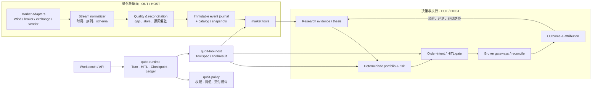

# Qubit Prime — 量化 Agent、实时数据与决策闭环升级方案

| 项 | 内容 |
|----|------|
| 文档状态 | **规划稿 v0.2 · 归属裁决已与 01 边界对齐；券商行情桥已落地可插拔骨架** |
| 日期 | 2026-08-04 |
| 目标 | 把量化 Agent 从「会调用行情工具」升级为**可验证数据 → 可审计判断 → 确定性风控执行 → 事后归因**的闭环 |
| 依赖 | [01 Runtime Core](./01-runtime-core-rust.zh-CN.md) 的 §2 模块边界；现有 Bun `market/*`、`execution/*`、A2A 与 Python connectors |
| 非目标 | 将市场数据、券商、研究团队拓扑塞进 Rust `run_turn`；为追求“实时”而把免费网页数据用于实盘 |

---

## 1. 结论先行：模块归属裁决

> **裁决：量化数据面、数据质量、券商与组合构建均不进入 `qubit-runtime` Core。**
> 
> 它们属于 `qubit-tool-host` 后的领域服务/connector/harness 能力；Core 只保存和解释标准的 `ToolSpec`、`ToolResult`、`dataRef`、`effects`、HITL 与 `DeliveryVerdict`。阈值、准入档位和交付谓词属于 `qubit-policy` 的声明数据。

这是 [01 §2](./01-runtime-core-rust.zh-CN.md#2-边界什么是-core什么不是) 的直接推论：Core 必须保持领域无知，不能因量化产品而长出行情路由、tick 订阅、下单、组合优化或多 Agent 拓扑。否则 HA checkpoint、取消、工具幂等和交付判定会再次被业务分支污染。

| 能力 | Prime 归属 | 理由 |
|------|------------|------|
| Turn / 工具调度 / checkpoint / HITL / effect ledger | **IN · `qubit-runtime`** | 所有场景共同的 harness 语义 |
| 数据准入阈值、市场/策略权限、交付谓词 | **DATA · `qubit-policy`** | 配置可变，不能写死在 loop |
| 行情流接入、标准化、回补、源间校验、快照、数据目录 | **HOST / OUT · 数据面服务** | 强领域、强 I/O、可独立扩缩；只以工具暴露 |
| `fetch_market_snapshot`、`screen_universe`、`compute_features` | **HOST · 官方量化工具** | 对齐 01：Core 仅调度 `ToolHost` |
| 组合构建、风险约束、订单意图、券商执行 / 对账 | **HOST / OUT · 执行服务** | 决策须可验证、幂等并隔离，不能被 LLM loop 内嵌 |
| 基本面/新闻/技术/情绪/反方研究角色 | **OUT · 旧 A2A 桥 / 后续编排服务** | 01 已冻结：M6 前不进 Core |
| 单个 Agent 的工具调用、研究产物和可观察结果 | **IN + HOST** | Core 管生命周期；工具提供领域事实和效果 |
| 离线评测、回放、策略归因、模型/提示词 benchmark | **OUT · harness / 控制面** | 不阻塞 `run_turn` 热路径，读取 ledger 与数据快照 |

### 1.1 推荐形状



## 2. 现状与升级缺口

当前仓库已有扎实基础：行情源控制面记录凭证、健康度、P95、熔断和 fallback；K 线有 point-in-time 基础校验；行情流有 Binance 原生 WS、Futu/IB bridge、gap/backfill；执行侧已有风险、订单意图、对账和事件驱动回测。这些能力应保留并被逐步包进新数据契约，而不是重写。

主要缺口不在“有没有更多 API”，而在以下四层没有形成同一条可审计链：

1. **事实不可完全复现**：一次研究、回测或订单很难精确固定到供应商版本、事件序列、修订记录和原始数据证据。
2. **流式质量不是一等状态**：现在可发现 gap 和 freshness，但缺少跨源偏差、事件版本、补数完成度与可交易性的一体化准入判定。
3. **LLM 判断与确定性决策边界还可更硬**：研究结论应该是输入证据，仓位、限额、交易成本、风控与下单必须由可测试的确定性模块做最终裁决。
4. **结果没有自动反哺**：每次 thesis 的预测、失效条件、持有期与实际结果应组成 forecast book，归因后才能真正评测 Agent 与提示词，而不是只看单次文本质量。

## 3. 数据面：从“行情请求”升级为“可验证事件与快照”

### 3.1 数据分层与准入原则

| 层级 | 允许用途 | 数据来源原则 | 是否可直接驱动实盘 |
|------|----------|--------------|--------------------|
| L0 · 研究 fallback | 探索、图表、非交易性分析 | 公共 API、网页聚合、延迟源；必须标示延迟/许可 | **否** |
| L1 · 策略验证 | 回测、模拟、因子研究 | 版本化历史数据、复权和 corporate action 完整 | **否** |
| L2 · 实时观察 | 告警、人工研判、纸交易 | 有时间戳/序列的推流；可存在受控降级 | 默认否 |
| L3 · 交易级 | 自动下单定价、风控、订单簿策略 | 受许可实时 feed 或券商/交易所 gateway；独立冗余与质量 SLA | **是，但须通过准入** |

**硬规则**：公共源、抓取源和来源不明的聚合数据可以继续是 L0 fallback，但不能被静默提升为 L3。实时并不等于高质量；高质量至少要可说明授权范围、延迟、事件顺序、缺口处理和历史回放一致性。

### 3.1.1 券商行情桥（可插拔 L2）

交易与行情**分进程、分协议**：

| 能力 | 实现 | 扩展方式 |
|------|------|----------|
| 下单 / 持仓 / 成交 | `python_connectors/broker_http_server.py` → `broker_gateway/*` | 新增 adapter + `BrokerProvider` |
| 实时 quote / trade 推流 | `python_connectors/market_bridge/` + Bun `broker-market-bridge.ts` | 注册 descriptor + provider + env URL |

内置桥：`futu`（OpenQuote）、`ib`（TWS/Gateway）、`alpaca`（美股 quote/trade）、`qmt`（Windows miniQMT）与 `supermind`（交易侧槽位）。控制面源 id：`futu_bridge` / `ib_bridge` / `alpaca_bridge` / `qmt_bridge` / `supermind_bridge`；其中 Alpaca/QMT 是实时桥，不进入历史 K 线 plan。详见 [market-data-realtime.md](../market-data-realtime.md) 与 `python_connectors/market_bridge/README.md`。

**Futu 打通**：官方插件 `connector:futu` + `futu-runtime.ts` 读取券商账户 OpenD 配置，自动拉起交易 HTTP（:18765）与行情 WS（:8765），并写入 `QUBIT_FUTU_MARKET_WS_URL`。保存 Futu sandbox/live 账户或调用 `POST /market/stream/bridges/futu/ensure` 即可。

### 3.1.2 交易接入现状与缺口（审计）

| Provider | 交易 HTTP | 行情 WS 桥 | 备注 |
|----------|-----------|------------|------|
| futu | ✅ OpenSecTradeContext | ✅ OpenQuote（需 OpenD + 行情权限） | 交易/行情可同机双进程 |
| ib | ✅ ib_insync | ✅ TWS/Gateway quote / depth / trade | 需订阅对应行情权限 |
| supermind（同花顺） | ✅ tick_trade_api | 🟡 stub 槽位 | SDK 偏交易；行情 API 待厂商环境 |
| alpaca / ccxt | ✅ | — | 美股/加密；行情另走交易所源 |
| eastmoney_emt | ✅（Windows） | — | 交易专用 |

缺口：同花顺/IB 真实 quote push；L3 交易级 feed 准入与双源冗余；桥进程健康进 readiness（当前以 env URL 配置为 credentialsReady）。

### 3.2 统一市场事件契约（Market Event Contract v2）

所有 adapter 在写入 journal 前归一为统一事件。这个 schema 是数据面的协议，不进入 Core 的业务逻辑；Core 只持有其不可变 `dataRef`。

```json
{
  "eventId": "mev_01...",
  "kind": "quote|trade|book_delta|bar|corporate_action|news",
  "instrument": { "symbol": "600519", "venue": "SSE", "assetClass": "equity" },
  "eventTs": "2026-08-04T01:30:00.123456Z",
  "recvTs": "2026-08-04T01:30:00.130000Z",
  "source": { "provider": "wind", "feed": "licensed_realtime", "upstreamFamily": "wind" },
  "sequence": { "channel": "quote:SSE:600519", "value": 981273, "isContiguous": true },
  "schemaVersion": 2,
  "payload": {},
  "rawPayloadHash": "sha256:...",
  "quality": { "state": "verified", "freshnessMs": 7, "revision": 0 },
  "ingestedAt": "2026-08-04T01:30:00.131000Z"
}
```

必备语义：

- `eventTs` 与 `recvTs` 分离，允许分析供应商延迟与乱序；禁止用本机接收时间伪装为市场时间。
- `sequence` 不是所有供应商都提供；缺失时必须显式标为 unavailable，不能假装连续。
- bar 必须注明是否 closed、复权方式、构建依据；不能把未收盘 K 线当已确认历史事实。
- 原始载荷不必全部进入 SQLite；应保存 hash 和可受控访问的原始记录位置，兼顾审计与存储成本。
- 对供应商更正、回补和 corporate action 使用 `revision` / supersedes 关系，绝不就地悄悄覆盖。

### 3.3 数据质量门与降级

数据质量服务持续给每个 `(instrument, feed, kind)` 计算状态；它不是单次 HTTP 成功率面板。

| 规则 | 输入 | 结果 |
|------|------|------|
| 新鲜度 | `now - eventTs`、市场时段、feed 承诺 | `fresh / stale / unknown` |
| 序列完整性 | provider sequence、事件时间、断连区间 | `complete / gap_pending / gap_unrecoverable` |
| 源间一致性 | 独立 upstream 的价格、盘口、成交量差 | `verified / divergent / insufficient_peers` |
| 结构有效性 | bid/ask、OHLC、负量、交易日历、停复牌 | `valid / malformed / market_closed` |
| PIT 合规 | 事件/公告发布日期、复权版本、标的存续期 | `point_in_time_valid / invalid` |
| 许可与用途 | provider 许可、使用场景、用户账户权限 | `allowed / research_only / denied` |

判定输出应为 `DataQualityVerdict`，并在工具结果和订单意图中一起传递。交易级工具只有同时满足 `allowed + fresh + complete + point_in_time_valid`，且无 `divergent` 才能返回 `tradable=true`。其余情况可以服务研究，但必须降级为 `research_only` 或 `observe_only`。

### 3.4 事件日志、快照与回放

建议将数据面拆为四个可替换组件：

1. **Adapter**：Wind/券商/交易所/数据商 WebSocket、REST、文件或 Python bridge；仅负责认证、订阅、协议解析。
2. **Normalizer + Validator**：写入统一 schema、检测乱序/断档，触发 backfill，并生成质量 verdict。
3. **Event journal / catalog**：按市场、日期、symbol 分区存不可变事件和历史 bars；开发初期可从本地 Parquet + manifest 起步，生产规模再选独立日志/对象存储。
4. **Snapshot service**：按 `asOf`、数据版本、用途和权限生成不可变 `snapshotId`；研究、回测、风险与订单只能引用 snapshot，而不是“再取一次最新数据”。

`snapshotId` 需要至少固定：universe、时间窗口、数据源选择、各 source revision、质量 verdict、复权/时区/交易日历版本。这样“回测结果”和“Agent 说当时看到了什么”才可重放。

## 4. Agent：把研究、决策和执行拆成可验证边界

### 4.1 角色不是第二个 runtime

可借鉴 TradingAgents 的基本面、情绪、新闻、技术、多空研究、交易、风险、组合经理分工，但它的价值在**证据分工和反方审查**，不是把这些角色嵌进 `run_turn`。在 Prime M6 前，研究团队仍通过现有 A2A/编排桥运行；Prime 单 Agent 只以工具调用获得结构化研究输入或提交研究产物。

| 阶段 | 输入 | 输出 | 实现归属 |
|------|------|------|----------|
| Evidence | 固定 `snapshotId`、公告、新闻、基本面 | 带引用的 facts / features | HOST tools |
| Research | facts、工具观察、历史经验 | `ResearchThesis` | Agent / A2A 编排 OUT |
| Challenge | thesis、反证、风险情景 | 支持/反对论据与未知项 | Agent / A2A 编排 OUT |
| Construct | 已批准 thesis、约束、账户状态 | `TargetPortfolio`、风险报告 | HOST 确定性服务 |
| Authorize | 风险 verdict、质量 verdict、HITL policy | `OrderIntent` 或拒绝原因 | HOST + Core HITL |
| Execute | 签名 intent | broker 订单、成交回报、对账 | OUT / gateway |
| Learn | 已实现收益、成本、风险事件 | attribution / evaluation record | OUT harness |

### 4.2 `ResearchThesis` 与 forecast book

所有面向决策的 Agent 产物都应为结构化对象，而非只保留 Markdown：

```json
{
  "thesisId": "thesis_...",
  "snapshotId": "mkt_snapshot_...",
  "instrumentScope": ["SSE:600519"],
  "direction": "long|short|neutral",
  "horizon": "5d",
  "confidence": 0.0,
  "claims": [{ "claim": "...", "evidenceRefs": ["obs_..."], "counterEvidenceRefs": [] }],
  "invalidation": [{ "condition": "...", "observable": "..." }],
  "knownUnknowns": [],
  "modelAndPromptVersion": "...",
  "createdAt": "..."
}
```

`forecast book` 把 thesis、风险审批、真实成交、持有期结果和归因关联起来。它的目的不是让模型“自我感觉更好”，而是回答：哪个角色、数据源、提示词、模型版本、市场 regime 和风险假设真正改善了风险调整后结果；什么情况下应被禁用或降权。

### 4.3 LLM 与确定性代码的责任边界

| 能力 | LLM 是否可做最终裁决 | 规则 |
|------|----------------------|------|
| 研究假设、事件解释、反方论证 | 可以提出 | 必须附 evidence refs 与未知项 |
| 特征计算、估值、收益/风险统计 | 否 | 可复现的确定性工具输出 |
| 仓位、杠杆、行业/单标的限额 | 否 | Portfolio/Risk 服务按 policy 求值 |
| 是否允许用当前数据交易 | 否 | `DataQualityVerdict` + 风控硬门 |
| 下单、撤单、重试、对账 | 否 | 幂等 gateway 与账户状态机 |
| 是否交付研究成果 | 否 | Core `DeliveryEvaluator` + policy 谓词 |

这与 FinRobot “Agent 分析 + 确定性财务计算”、Qlib 的研究/模型/执行层分离，以及 LEAN/vn.py 的事件驱动执行边界一致；QUBIT 不需要直接引入这些框架，但应吸收它们的边界设计。

## 5. Prime 与 Tool Host 的协议落点

### 5.1 对 Core 暴露的最小工具面

Core 不订阅 tick，也不理解 `SSE`、`Wind` 或 `order book`。它只看到普通工具和结构化效果：

| ToolSpec（示例） | 返回核心字段 | 是否有副作用 |
|-----------------|--------------|--------------|
| `market.snapshot.get` | `snapshotId`、`dataRef`、`qualityVerdict`、`asOf` | 否 |
| `market.evidence.query` | evidence refs、来源、时间、许可/质量 | 否 |
| `research.thesis.write` | `thesisId`、artifact effect | 是，幂等写入 |
| `portfolio.construct` | target、约束检查、风险 report ref | 否 |
| `execution.order_intent.create` | intent、质量/风险 verdict、HITL requirement | 是，幂等 |
| `execution.reconcile` | broker snapshot、差异与 effect | 是，幂等 |

标准 `ToolResult` 在 01 的 `effects` 外增加可选 `evidence`，但不改变 Core 的领域无知：

```json
{
  "ok": true,
  "observation": { "summary": "交易级快照已生成", "dataRef": "obs_..." },
  "effects": [{ "kind": "market_snapshot", "key": "mkt_snapshot_...", "meta": {} }],
  "evidence": [{
    "ref": "mkt_snapshot_...",
    "asOf": "2026-08-04T01:30:00Z",
    "quality": "verified",
    "licenseUse": "trading_allowed"
  }]
}
```

`evidence` 是可选、可索引的审计信号；`DeliveryEvaluator` 仅按 policy 解释它，不能因为看到市场字段就改写下单参数。

### 5.2 外部事件如何影响 Agent

行情流不能直接把每个 tick 推入 LLM 上下文。正确路径是：数据面产生**经过策略筛选的 alert**（例如停牌、质量降级、止损条件触发、公告事件），由编排/策略 worker 决定是否创建或恢复一个 turn。Core 处理的是常规的 `turn.start` / 工具观察 / HITL，不新增金融专用的 tick 状态机。

这样可以避免 token 风暴、不可控成本和“每个行情事件重新问一次模型”，同时保留事件驱动实时性。

## 6. 供应商与接入策略

供应商选择应由市场、资产类别、许可与交易频率决定，而不是单个 API 的易用性。

| 市场 / 用途 | 主路径 | 备用路径 | 禁止事项 |
|-------------|--------|----------|----------|
| A 股 / 港股研究 | Wind 等授权数据；交易所/券商 gateway | Tushare、东方财富、AKShare 作为 research fallback | 把网页/聚合报价默认为交易级 |
| A/HK 实盘或观察 | Futu、XTP、CTP、EMT 等账户/交易 gateway，按许可选择 | 独立授权源做交叉校验 | 用与主源同 upstream 的“fallback”充当容灾 |
| 美股 | 券商实时 feed 或授权 WebSocket feed | 独立数据商、研究级历史源 | 以 Yahoo 数据对实时成交作最终定价 |
| 期货 / 期权 / 订单簿 | 交易所/交易级授权 feed，要求 sequence/时间戳 | 具备逐笔/订单簿/回放能力的专业供应商 | 用分钟 bar 回测代替订单簿策略验证 |
| 加密 | 实际成交 venue 的 WS 与账户事件 | 至少一个独立交易所校验 | 跨 venue 的价格直接作为市价单定价 |

供应商 adapter 是插件式 HOST 能力。现有 `market-data-source-control` 可继续做控制面注册、健康与凭证管理，但要补 `licenseUse`、`feedClass`、`upstreamFamily`、数据版本与用途准入字段。每次 fallback 都应以可观察事件写入 journal 和 tool ledger，不能只在日志里悄悄发生。

## 7. 绞杀式迁移路线

遵守 01 的 S0–S4：不停止现有 Bun 产品，不等待 Prime Core 全部完成才升级数据质量。

| 阶段 | 产出 | 归属 / 风险控制 |
|------|------|-----------------|
| D0 · 契约冻结 | `MarketEvent v2`、`DataQualityVerdict`、`snapshotId`、`ResearchThesis` JSON Schema 与 fixture | DATA / protocol；先不改生产流 |
| D1 · 旁路观测 | 在现有 market gateway 后镜像标准事件、记录 freshness/gap/source | OUT；只读、不影响用户路径 |
| D2 · 快照工具 | 新增 `market.snapshot.get` L2 Bun bridge；研究 Agent 开始引用 `snapshotId` | HOST；feature flag 灰度 |
| D3 · 质量门 | 主备源差异、许可档位、可交易性 verdict；先阻断自动交易，研究只告警 | DATA + HOST；默认 fail closed |
| D4 · thesis / forecast book | 结构化 thesis 与自动结果关联；在 benchmark 中评估模型、角色、源 | OUT harness；不改变下单逻辑 |
| D5 · 确定性组合与意图 | 将构建、风控、order intent 的输入强制绑定快照与 thesis | HOST / execution；HITL 保持 Core 协议 |
| D6 · Prime 接管单 Agent | Prime 通过 Tool Host 消费快照、thesis、intent 工具；A2A 仍走旧桥 | IN + HOST；对照旧路径 |
| D7 · 研究团队演进 | M6 后只评估最小 `OrchestrationPort`；不要反向污染 `run_turn` | LATER |

### 7.1 初期不建议引入的基础设施

- 不先上 Kafka/ClickHouse/复杂云流处理。Desktop-first 的第一版可用本地 append-only 分区文件 + manifest + SQLite 索引验证契约和回放。
- 不先重写现有 market/execution 为 Rust；用 L2 Bun bridge 和 L3 Python connector 包装，等协议与测试稳定后再替换 adapter。
- 不把所有新闻和逐笔事件输入 LLM；由规则/策略 worker 先筛选为有限、可解释的 alert。
- 不把任何单一公共数据源宣称为“高质量实时交易数据”。

## 8. 验收标准与失败安全

| ID | 验收项 | 通过标准 |
|----|--------|----------|
| Q1 | 可重放 | 相同 `snapshotId` 在相同 catalog revision 下得到相同工具数据与特征结果 |
| Q2 | 断档可见 | 模拟 WS 中断/序列跳跃后，生成 gap 事件；未补齐前质量 verdict 不可交易 |
| Q3 | 独立冗余 | 主备同 upstream 时标为 `insufficient_peers`，不得报告为已验证 |
| Q4 | 降级安全 | stale、divergent、许可不足时可研究但不能创建可执行订单意图 |
| Q5 | 账本完整 | thesis、portfolio、intent、成交和对账均能链到 snapshot/evidence refs |
| Q6 | Core 不泄漏领域 | `qubit-runtime` 不依赖市场/券商 crate；仅见 `ToolResult` 与 policy snapshot |
| Q7 | 崩溃恢复 | 工具执行中重启后，快照/intent 以幂等键复用或显式 reconcile，不双写 |
| Q8 | 回归 | 现有行情、回测、纸交易路径在 feature flag 关闭时行为不变 |

默认失败策略：交易准入 **fail closed**；研究展示 **fail transparent**（展示来源、延迟、质量和降级原因）。这比“数据为空时给模型一个看似合理的答案”安全得多。

## 9. 对现仓的文件级映射

| 现有实现 | Prime 迁移位置 | 首步 |
|----------|---------------|------|
| `src/runtime/market/market-stream-gateway.ts` | OUT 数据面 gateway | 镜像写 `MarketEvent v2`、补 `dataRef` |
| `src/runtime/market/broker-market-bridge.ts` | OUT 券商行情桥注册表 | 可插拔 futu/ib/alpaca/qmt/supermind；与交易 HTTP 分离 |
| `python_connectors/market_bridge/` | OUT 行情 WS 桥进程 | OpenQuote / stub；契约对齐 realtime 文档 |
| `python_connectors/broker_http_server.py` | OUT 交易 HTTP 桥 | 保持与行情桥进程隔离 |
| `src/runtime/market/market-data-source-control.ts` | OUT 控制面 / HOST 配置 | 增加许可、feed class、upstream independence |
| `src/runtime/market/point-in-time-contract.ts` | OUT 数据质量服务 | 升级为 snapshot-level verdict；保留基础 OHLC 校验 |
| `src/runtime/market/market-data-health.ts` | OUT 质量与观测 | 从健康检查扩到 freshness/gap/divergence |
| `src/runtime/execution/*` | OUT 执行服务 | intent / risk report 强制引用 snapshot 与质量 verdict |
| `src/runtime/conversation/*`、`src/runtime/prime/*` | IN 对话与 Core 适配 | 研究只由 conversational turn 触发；Rust Core 负责编排、执行与恢复 |
| `src/runtime/experience/*` | OUT 评测与经验层 | 建 forecast book 与归因，不写入 Core checkpoint |
| `crates/qubit-tool-host`（规划） | HOST | 暴露 snapshot / thesis / portfolio / intent ToolSpec |
| `crates/qubit-runtime`（规划） | IN | 只记录工具 effect/evidence ref、HITL 与恢复 |

## 10. 待拍板项

| ID | 问题 | 推荐默认 |
|----|------|----------|
| QO1 | 本地 event journal 第一版：SQLite blob、Parquet 分区还是二者组合？ | **Parquet + manifest，SQLite 索引**；避免把大流量塞 checkpoint 库 |
| QO2 | L3 交易级数据的首个覆盖市场 | **先选当前最常用的单一市场/券商路径**，以完整性优先于广度 |
| QO3 | source divergence 的默认阈值 | 作为 `qubit-policy` 配置，按资产类别/流动性分层；不写死 |
| QO4 | 自动执行默认权级 | **默认 observe/paper，自动实盘必须账户级显式开启 + HITL policy** |
| QO5 | 研究团队何时接 Prime | **D6 后再评估**；M6 前仍用旧 A2A 桥 |

## 11. 参考实现与设计来源

- [TradingAgents](https://github.com/TauricResearch/TradingAgents)：仅作为历史研究闭环参考；不引入其 MSA、辩论拓扑或批量启动接口。
- [FinRobot](https://github.com/AI4Finance-Foundation/FinRobot)：多数据源与确定性金融计算；借鉴 LLM/计算边界。
- [Qlib / Qlib-Server](https://github.com/microsoft/qlib)：在线数据服务、共享缓存、研究到执行的分层；借鉴 snapshot/catalog 方向。
- [QuantConnect LEAN](https://github.com/QuantConnect/Lean)、[vn.py](https://github.com/vnpy/vnpy)、[NautilusTrader](https://github.com/nautechsystems/nautilus_trader)：事件驱动行情与执行边界；借鉴 adapter、回放与实盘同构原则。

---

## 修订记录

| 日期 | 版本 | 说明 |
|------|------|------|
| 2026-08-05 | v0.2 | 接入可插拔券商行情桥；审计交易 vs 行情分轨与缺口 |
| 2026-08-04 | v0.1 | 初稿：冻结数据面/研究/执行归属，定义 Market Event、Snapshot、Thesis 与绞杀路径 |
