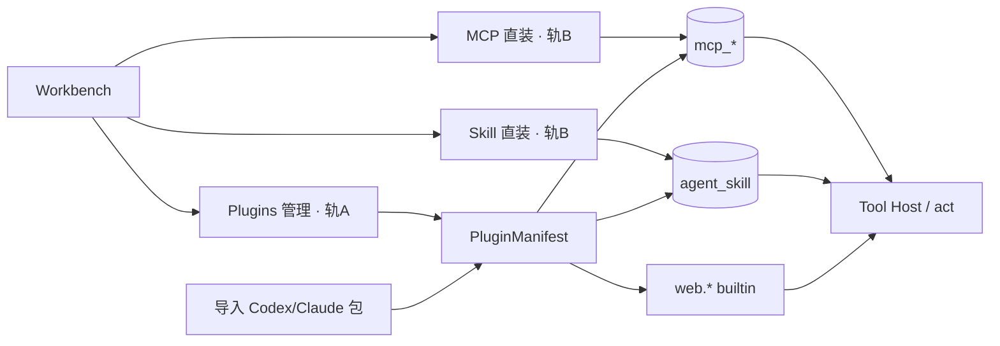

# Qubit Prime — 互联网工具包与插件体系

| 项 | 内容 |
|----|------|
| 文档状态 | **规划稿 v0.5 · P0/P1/P2 已落地（联网 + 插件双轨 + OAuth 连接器）** |
| 日期 | 2026-08-05 |
| 目标 | 官方联网 + 自建插件管理 + Skill/MCP 直装 + **自建 OAuth2 连接器**；复用开放标准，不复刻 Codex 宿主 |
| 依赖 | [01 Runtime Core](./01-runtime-core-rust.zh-CN.md) §2；现有 Bun MCP catalog / Skill market / `web.*` |
| 非目标 | 用 Plugin 取代 MCP/Skill 直装；实现 Codex/Claude 插件宿主；托管 OpenAI App Connector OAuth |

---

## 1. 结论先行

1. **联网是 L0 官方能力，不是可选插件。** `web.search` → `web.fetch` 已落地；不依赖市场安装。
2. **插件体系不重做执行引擎。** 在现有三路（builtin / MCP / ACP connector）上加 `PluginManifest` 包装层。
3. **归属：HOST，不进 Core。** 抓取、搜索、OAuth、MCP、插件安装均在 Tool Host；Core 只认 `ToolSpec` / `ToolResult`。
4. **产品模型拍板 · 双轨并存（非互斥）：**
   - **轨 A · 自建插件管理**：统一 Plugins 页（浏览 / 分类 / 已安装 / 导入包 / 启停）；实体是 `PluginManifest`（可聚合 builtin + MCP + Skill）。
   - **轨 B · 直接安装 Skill / MCP**：保留并强化现有 MCP Market、Skill Market、手动加 server、装 `SKILL.md`；**不强制先变成「插件」才能用**。
   - 两轨写同一套底层表（`mcp_*` / `agent_skill`）；Plugins 视图可汇总「直接安装」的条目（自动投影为 `kind: mcp|skill`）。
5. **互操作拍板：**
   - **能复用内容物**：MCP、[Agent Skills](https://agentskills.io) `SKILL.md`。
   - **不能当运行时直接装**：Codex/Claude 的 `.codex-plugin` / `.claude-plugin` 发行包装。
   - **策略**：自建管理面 + 导入适配器；不 fork 其宿主。

---

## 2. 现状与缺口

| 能力 | 现状 | 缺口 |
|------|------|------|
| `web.fetch` / `web.search` | ✅ P0 已落地（SSRF、授权放行、默认工具面） | 生产建议切 Brave/Serper |
| MCP 目录安装 | ✅ `mcp_catalog` + market API + AutoInstaller | 无统一「Plugin」实体与 UI |
| Skill 市场 | ✅ Open Skill Market / SkillsMP → `agent_skill` | 与 MCP 分叉；未对齐 Agent Skills 目录导入 |
| OAuth 连接器 | ❌ | Gmail / Slack 类能力 |
| Codex/Claude 插件包导入 | ❌ | 需适配器（见 §5） |

执行路径（不变）：

```text
ReAct act → admitTool → builtin | ACP connector | MCP
```

---

## 3. 互联网工具包（P0 · 已交付）

### 3.1 工具面

| 工具 | 职责 | 参数 | 返回要点 |
|------|------|------|----------|
| `web.search` | 查询 → 结果列表 | `query`, `count?`≤10 | `{ ok, provider, results[{title,url,snippet}], source:"web" }` |
| `web.fetch` | 已知 URL → 正文 | `url`, `maxChars?` | `{ ok, title?, finalUrl, text, source:"web" }` |
| `web.browse` | JS 渲染（**不做**） | — | 后期独立 host + HITL |

### 3.2 Provider / 环境变量

| Provider | 环境变量 |
|----------|----------|
| `duckduckgo`（默认） | 无 |
| `brave` | `WEB_SEARCH_PROVIDER=brave` + `BRAVE_SEARCH_API_KEY` |
| `serper` | `WEB_SEARCH_PROVIDER=serper` + `SERPER_API_KEY` |

代码：`internet-tools.ts` / `web-search-handler.ts` / `web-fetch-handler.ts` / `web-ssrf.ts`；sandbox 对 `web.*` 授权放行。

---

## 4. 能否复用 Codex / 其他 Agent 的「插件」？

### 4.1 分层看清：包装 ≠ 协议

业界其实是三层东西，常被统称「插件」：

| 层 | 是什么 | 跨产品可复用？ | 代表 |
|----|--------|----------------|------|
| **A. 工具协议** | 进程/HTTP 暴露 tools | **是 · 一等公民** | **MCP**（stdio / HTTP / WS） |
| **B. 流程知识** | Markdown 程序性说明 | **是 · 开放标准** | **Agent Skills**（`SKILL.md` + YAML frontmatter） |
| **C. 发行包装** | 市场安装单元：manifest + 目录约定 + 宿主 hooks | **否 · 宿主私有** | Codex `.codex-plugin/`、Claude `.claude-plugin/`、ChatGPT 旧 Plugins |

Codex 官方把 Plugin 定义为：**Skills +（可选）MCP / App 连接的安装包**；底层工具仍是 MCP，流程仍是 Skill。  
Claude Code 同理：Skill 跟 [agentskills.io](https://agentskills.io)；加 `.claude-plugin/plugin.json` 才变成「插件」。

因此：

> **不要问「能不能跑 Codex 插件」——要问「包里的 MCP / Skill 能否被我们导入」。答案是：能导入内容物；不能嵌入其宿主与 OAuth App 图。**

### 4.2 分项对照

| 来源 | 可直接复用 | 需适配 | 不可复用 / 慎用 |
|------|------------|--------|-----------------|
| **任意 MCP server** | ✅ 协议本身；已有 catalog / dispatcher | transport 差异（streamable-http 等） | 依赖宿主注入密钥且无标准 auth 的私货 |
| **Agent Skills `SKILL.md`** | ✅ `name` + `description` + body；与 Claude/Codex/Cursor 等同源 | 可选扩展字段（`agents/openai.yaml`、Claude `context:fork`）忽略或降级 | 依赖专用子 agent / 宿主-only hook 的 skill |
| **Codex 插件包** | ✅ 抽出 `skills/**/SKILL.md`、`.mcp.json` | 读 `.codex-plugin/plugin.json` → 填我们的 `PluginManifest` | `.app.json` 的 `plugin_asdk_app…`（OpenAI 注册连接器 ID）；Codex marketplace / config.toml 策略；hooks |
| **Claude 插件包** | ✅ 抽出 skills + 声明的 MCP | 读 `.claude-plugin/plugin.json` | Claude 专用 agents/hooks/subagent |
| **ChatGPT 图示 Apps**（Gmail/Slack…） | ❌ 产品级 OAuth 连接器 | 自建 connector + OAuth（P2） | 不能「安装 Codex 同款 App」就拥有其 token 保险箱 |
| **Qubit ACP connector** | 代码内 bootstrap | 可打成 `builtin_pack` 对外展示 | 不是跨产品标准 |

### 4.3 架构选择（已拍板）

```text
                    ┌─────────────────────────────┐
  外部生态输入      │  Import Adapters（只做抽取）   │
  Codex 插件夹 ──►  │  · parse .codex-plugin       │
  Claude 插件夹 ──► │  · parse .claude-plugin      │
  裸 MCP / SKILL ─► │  · 直通                       │
                    └──────────────┬──────────────┘
                                   ▼
                    ┌─────────────────────────────┐
                    │  Qubit PluginManifest        │  ← 我们的唯一安装实体
                    │  kind: builtin_pack|mcp|     │
                    │        skill|connector       │
                    └──────────────┬──────────────┘
                                   ▼
                    ┌─────────────────────────────┐
                    │  既有执行面（不新开引擎）      │
                    │  builtin · MCP · ACP · skill │
                    └─────────────────────────────┘
```

**明确不做：**

- 实现 `codex plugin marketplace add` 兼容层或 Claude marketplace 宿主。
- 在 Core sampling 路径注入「庞大插件清单」（01 已否决抄 Codex 插件注入体系）。
- 假装能一键获得 OpenAI 托管的 Gmail/Slack 连接（那是其账号体系，不是开源包）。
- **用插件管理层废掉 MCP/Skill 直装入口**（两轨必须并存）。

**明确要做：**

- 自建 Plugins 管理面（`PluginManifest`）。
- **并行保留** MCP / Skill 直装（市场 + 手动配置 + 本地 `SKILL.md`）。
- 直装结果可在 Plugins「已安装」中可见（投影，不必用户二次包装）。
- 可选：导入 Codex/Claude 插件目录 → 拆成 MCP + Skill。

---

## 5. 插件体系设计（P1 · 下一步实现）

### 5.0 双轨安装模型（已拍板）

```text
用户意图                         入口                              底层落点
─────────────────────────────────────────────────────────────────────────
装一个「能力包 / 官方包」     →  Plugins 管理（轨 A）      →  PluginManifest
                                                          →  再委托 mcp/skill/builtin
只装一个 MCP server          →  MCP Market / 手动配置（轨 B）→  mcp_server_config + binding
                                                          →  可选投影进 Plugins 已安装
只装一个 Skill               →  Skill Market / 本地 SKILL（轨 B）→ agent_skill
                                                          →  可选投影进 Plugins 已安装
导入 Codex/Claude 插件夹     →  Plugins「导入」（轨 A）    →  拆成 mcp + skill + Manifest
```

| 原则 | 说明 |
|------|------|
| Plugin ≠ 唯一入口 | 高级用户 / 自动化 / AutoInstaller 可继续只碰 MCP 或 Skill |
| Plugin = 产品聚合面 | 适合「已安装总览、分类发现、官方包、多件套 bundle」 |
| 单一执行面 | 无论从哪轨进来，act 仍只走 builtin / MCP / skill 召回 |
| 幂等 | 同一 MCP 经轨 A 或轨 B 安装，不产生两套互斥配置 |

Workbench 建议信息架构（可同页 Tab，不必拆成三个 App）：

- **Plugins**：总览 / Featured / 已安装 / 导入包  
- **MCP**：直装与 server 详情（现有能力保留）  
- **Skills**：直装与技能详情（现有能力保留）  

### 5.1 产品映射（对齐 ChatGPT Plugins 图）

| ChatGPT / Codex 概念 | Qubit 映射 |
|----------------------|------------|
| Featured / 分类 | `PluginManifest.category` + catalog 标签 |
| Install / 已安装 | Plugins 总览 + 投影自 MCP/Skill 直装记录 |
| Public / Personal | 先 **project**；再 personal；官方 catalog = public |
| Computer Use / Chrome | 高权限 MCP / 独立 host，默认关 |
| Gmail / Slack / Notion | `kind: connector` + OAuth（**P2**） |
| Codex Plugin 包 | **导入源**，不是原生运行格式 |
| 「只装 MCP / 只装 Skill」 | **一等公民保留**（轨 B），不强制走 Plugin 向导 |

### 5.2 `PluginManifest`（安装实体）

```ts
type PluginManifest = {
  id: string;
  name: string;
  version?: string;
  description: string;
  category: string;
  visibility: "public" | "personal" | "project";
  kind: "builtin_pack" | "mcp" | "skill" | "connector" | "bundle";
  /** bundle = 同时含 skill + mcp（对应 Codex 插件包导入结果） */
  ref: {
    mcpCatalogId?: string;
    mcpServers?: Array<{ name: string; command?: string; url?: string; env?: Record<string, string> }>;
    skillIds?: string[];
    skillPaths?: string[]; // 导入时暂存，安装后变 skillIds
    builtinTools?: string[]; // e.g. Internet → web.search, web.fetch
  };
  auth?: { type: "none" | "api_key" | "oauth2"; scopes?: string[] };
  safetyLevel: "low" | "medium" | "high";
  /** 溯源：便于审计「从哪个生态导入」 */
  origin?: {
    format: "native" | "mcp" | "agent_skills" | "codex_plugin" | "claude_plugin";
    sourcePath?: string;
    sourceUrl?: string;
  };
};
```

### 5.3 导入适配器（P1 可先做本地目录）

| 适配器 | 输入 | 输出 |
|--------|------|------|
| `importCodexPluginDir` | 含 `.codex-plugin/plugin.json` 的目录 | Manifest：skills → `agent_skill`；`.mcp.json` → `mcp_server_config`；忽略/告警 `.app.json` |
| `importClaudePluginDir` | 含 `.claude-plugin/plugin.json` 的目录 | 同上；忽略 Claude-only hooks |
| `importAgentSkillDir` | 单 skill 目录（`SKILL.md`） | `kind: skill` |
| `importMcpDescriptor` | 现有 catalog 行 / `.mcp.json` 片段 | `kind: mcp` |

导入 UX：Workbench「从本地插件包导入」→ 预览将安装的 MCP/Skill → 确认 → 写 install 记录。

### 5.4 官方内置包（展示用，非新执行路径）

| Pack | 内容 | kind |
|------|------|------|
| Internet | `web.search` + `web.fetch` | `builtin_pack` |
| Quant Data | 现有行情/新闻 connector 工具组 | `builtin_pack` 或 connector 聚合 |

### 5.5 节奏

| 阶段 | 内容 | 状态 |
|------|------|------|
| **P0** | `web.search` + 增强 `web.fetch` + 授权 + 默认工具面 | **已完成** |
| **P1a** | `PluginManifest` 模型 + API；UI 包装现有 MCP/Skill 安装 | **已完成** |
| **P1b** | Codex/Claude/Agent Skills **本地目录导入适配器** | **已完成** |
| **P2** | OAuth connector（自建 generic OAuth2 + GitHub 预置；MCP HTTP Bearer 注入） | **已完成** |
| **P3** | 迁入 `qubit-tool-host`；可选远程 marketplace 同步；`web.browse` | 待做 |

### 5.6 代码落点（已落地）

| 路径 | 职责 |
|------|------|
| `src/runtime/plugins/types.ts` | `PluginManifest` / `PluginListItem` |
| `src/runtime/plugins/official-packs.ts` | Internet / Quant Data / GitHub / Generic OAuth2 |
| `src/runtime/plugins/registry.ts` | 列举 / 安装 / 卸载 / 导入（委托 MCP/Skill） |
| `src/runtime/plugins/import-*.ts` | Codex / Claude / Agent Skills 适配 |
| `src/runtime/plugins/oauth-service.ts` | OAuth2 upsert / authorize / callback / refresh / disconnect |
| `src/routes/plugins-oauth.routes.ts` | `/api/v1/plugins/oauth/*` |
| `src/db/sqlite/migrations/0104_connector_auth.sql` | `connector_auth` 表 |
| `src/runtime/mcp/dispatcher.ts` | HTTP MCP 调用注入 `Authorization` |
| `frontend/.../PluginsPanel.tsx` | 配置中心「插件」子页 + 连接/断开 |

不新开执行器：install 最终仍写 `mcp_*` / `agent_skill` / binding；OAuth token 仅经 `connector_auth` + dispatch 注入。

### 5.7 P2 OAuth 用法（已落地）

1. 插件页选 **GitHub** 或 **Generic OAuth2** →「连接」  
2. 填 Client ID/Secret（Generic 还需 authorize/token URL）  
3. 可选填「绑定 MCP server 名」→ 该 server 的 HTTP MCP 调用自动带 Bearer  
4. 授权回调：`{QUBIT_PUBLIC_BASE_URL}/api/v1/plugins/oauth/callback`  
5. 「断开」清除 access/refresh token（status=`revoked`）

**不做：** OpenAI App ID、硬编码 Gmail SDK、OS keychain 加密（与现有 `api_key_secret` 同级明文本地策略）。

---

## 6. 与 01 / 03 的边界对齐

| 能力 | Prime 归属 |
|------|------------|
| Turn / admission / HITL / effects | **IN · `qubit-runtime`** |
| `web.*`、MCP、插件安装、OAuth | **HOST · `qubit-tool-host`** |
| 「网页不可交易」等谓词 | **DATA · `qubit-policy`** |
| Plugins UI / 导入向导 | **OUT · Workbench** |



---

## 7. 验收标准

### P0（已满足）

1. 无搜索 API key 时 `web.search` 可用（duckduckgo）。
2. `web.fetch` 含 `title` / `finalUrl` / `source:"web"`；内网拒。
3. 默认工具面含二者；sandbox 不误杀；Plan 模式仍禁用。

### P1（已落地）

1. Plugins API/UI：统一列表浏览/安装；官方 Internet pack 显示为内置。
2. **轨 B 仍可用**：仅经 MCP Market / Skill Market 直装，无需先创建 Plugin。
3. 轨 B 直装结果出现在 Plugins「已安装」（投影为 `kind: mcp|skill`）。
4. 本地导入 Codex/Claude/Agent Skills 目录 → skills 镜像 + MCP server 写入。
5. 含 `.app.json` 的包：告警「OpenAI App Connector 不可移植」。

### P2（已落地）

1. `connector_auth` 表 + `/api/v1/plugins/oauth/*`（配置 / authorize / callback / disconnect）。
2. 官方 **GitHub**（预置 URL）与 **Generic OAuth2**（自填 URL）连接器。
3. 绑定 `mcp_server_name` 后，HTTP MCP dispatch 自动注入 Bearer（近过期 refresh）。
4. Plugins UI：连接 / 断开；状态不含明文 token。
5. 不依赖 OpenAI App ID。

---

## 8. 修订记录

| 日期 | 版本 | 说明 |
|------|------|------|
| 2026-08-05 | v0.1 | 初稿：互联网工具包 P0 + 插件体系规划 |
| 2026-08-05 | v0.2 | P0 标完成；拍板互操作：复用 MCP + Agent Skills，Codex/Claude 插件仅作导入源；展开 P1 Manifest/适配器 |
| 2026-08-05 | v0.3 | 拍板双轨：自建插件管理 + 用户仍可直接安装 Skill/MCP；§5.0 信息架构与验收 |
| 2026-08-05 | v0.4 | P1a/P1b 落地：plugins registry/API、导入适配器、配置中心 Plugins 页 |
| 2026-08-05 | v0.5 | P2 落地：`connector_auth` + generic/GitHub OAuth2 + MCP HTTP Bearer 注入 + Plugins 连接 UI |
