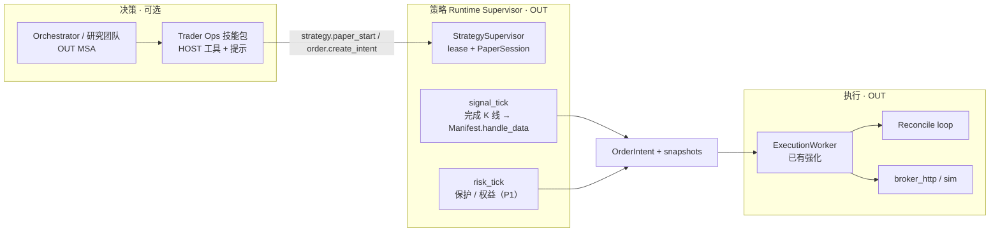

# Qubit Prime — 执行监督与交易 Agent（规划）

| 项 | 内容 |
|----|------|
| 文档状态 | **规划稿 v0.1 · 先规划后编码** |
| 日期 | 2026-08-07 |
| 对标 | QuantDinger `TradingExecutor` + `trading_worker` + `PendingOrderWorker`（**不是**独立 LLM Trading Agent） |
| 依赖 | [06](./06-strategy-contract.zh-CN.md) Manifest/Intent · [08](./08-data-catalog-pit.zh-CN.md) 快照强制 · [01](./01-runtime-core-rust.zh-CN.md) B5/B1 |
| 定位修正 | 「执行监督进程」≈ **OUT Runtime Supervisor + Execution Worker**；交易 Agent 是 **HOST 工具技能包 + 可选决策角色**，二者勿混 |

---

## 1. 问题陈述

QuantDinger 精读结论：

- 长驻的是 **Trading Worker（租约 + 命令）+ 每策略一线程的 Executor + PendingOrderWorker**。  
- Agent Gateway/MCP 只下命令/查状态，**不是**行情驱动环。  
- 保护分层：策略保护（L1）/ 权益（L2）/ 交易所原生（L3）/ 账户暴露（L4）/ 仓位所有权（L5）。

我们现有误解澄清：

| 已有 | 证据 |
|------|------|
| 进程内 `executionWorker`（1.5s） | `src/index.ts` + `execution/execution-worker.ts` |
| 进程内 `strategyRuntimeWorker`（30s） | `strategy/strategy-runtime-worker.ts` |
| Intent / 闸门 / 对账服务 | `order-intent-service` · `live-trading-gate` · `position-reconciliation-service` |
| `def-execution-trader` | **已退役**（`RETIRED_BUILTIN_DEFINITION_IDS`） |

**真缺口**：不是「没有 worker」，而是：

1. Worker 与 API **同生死**，无租约/接管/fencing；  
2. 无「完成 bar 信号钟 vs 保护实时钟」清晰拆分；  
3. 对账是 cron/REST，不是执行环一等公民；  
4. 误把「复活 LLM trader 角色」当成监督进程。

---

## 2. 角色拆分（拍板建议）

| 名字 | 是什么 | 不是什么 |
|------|--------|----------|
| **StrategySupervisor** | Manifest 驱动的长驻环（先同进程线程/异步，P1 可拆进程） | LLM Agent |
| **ExecutionWorker** | Intent 派发、券商轮询、条件单 | 策略逻辑 |
| **Trader Ops** | seed 提示 + 授权 HOST 工具（编译/回测/启停纸交易/查持仓） | 把撮合塞进 Core |
| **Research 交易角色** | 可选证据分工（订单前后检查） | 独立实盘环 |

**Core**：永不实现仓位/保护；只允许 primary 调 HOST 工具并 HITL。

---

## 3. QuantDinger → Qubit 映射

| QD | Qubit 落点 | P0/P1 |
|----|------------|-------|
| `trading_worker` + lease | `StrategySupervisor` 进程内 + 健康探针；P1 文件锁/`qd_strategy_runtime_leases` 表 | P1 |
| `TradingExecutor` 双时钟 | PaperSession：`signal_poll`（bar）+ `risk_tick`（保护 stub→真） | P0 bar / P1 risk |
| `PendingOrderWorker` | 强化现有 `executionWorker` + 明确 pending/sent/fill 状态机文档化 | P0 |
| `account_risk` | 扩 `pre-trade-risk` / `portfolio-risk-service` | P1 |
| `native_protection` | 后期 OUT；纸交易不需要 | P2 |
| Agent Gateway | Trader Ops 工具 + REST `trader.routes` | P0 |

---

## 4. 保护单（纸交易优先）

P0：`OrderIntent.protection` 字段保留，评估器可 no-op。  
P1：移植 QD `ProtectionEngine` 思路（进程侧状态机，非交易所条件单）：

- 输入：纸账户标记价或最新 bar；  
- 输出：再生成 `target_quantity=0` Intent；  
- 状态进 `strategy_runtime_state`（可恢复）。

---

## 5. 交易 Agent（Trader Ops）规格

**不要**复活 `def-execution-trader` 进 Core。

新建或扩权建议：

| 项 | 内容 |
|----|------|
| Definition | `def-trader-ops`（ExecutionKind=`primary` 可被调，或仅工具包挂 orchestrator） |
| 授权工具 | `strategy.compile` · `strategy.backtest` · `strategy.paper_start/stop` · `market.snapshot.get` · `portfolio.construct` · `order.create_intent` · `execution.reconcile`（P1） |
| 禁止 | 绕过 gate 的「直接 broker 下单」工具 |
| HITL | live 意图 `always`/高危硬规则；paper 默认 AI/自动可配置 |
| UI | 继续 `TraderLivePanel` / `trader.routes`，展示 Supervisor 状态 |

「交易 Agent」= **会说话的运维员**，真正跑圈的是 Supervisor。

---

## 6. 里程碑

| ID | 产出 | 验收 |
|----|------|------|
| **EX0** | 文档化现有两 Worker + 健康 `/health` 暴露 running sessions | 运维可观测 |
| **EX1** | PaperSession + signal_tick 消费 Manifest（接 06 SC2） | 重启后至少 log 级恢复策略列表 |
| **EX2** | Intent 状态机与对账一轮进执行环（非仅 cron） | 错账可检出 |
| **EX3** | Trader Ops 工具包 + HITL 路径 | 对话可启停纸交易 |
| **EX4** | （可选）独立 `qubit-execution` 进程 + lease | Bun 挂后纸交易可接管 |

依赖顺序：**06 SC1 → EX1 → 06 SC2**；EX3 可与 SC3 并行。

---

## 7. 风险

| 风险 | 缓解 |
|------|------|
| 与实盘过早绑定 | Gate 默认 paper；live 仍 `QUBIT_LIVE_TRADING_ENABLED` |
| Supervisor 拖垮 API | 限会话数；P1 拆进程 |
| 角色语义回潮 | 卫生测试继续禁止退役 role 回流 Core |

---

## 8. 修订记录

| 日期 | 版本 | 说明 |
|------|------|------|
| 2026-08-07 | v0.1 | 澄清 Worker vs Trading Agent；对照 QD 进程模型 |
