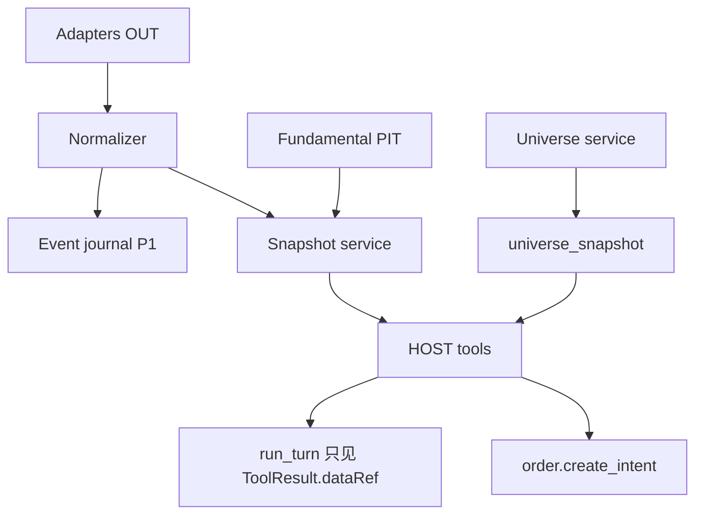

# Qubit Prime — 数据目录一等公民（Universe · 基本面 PIT · Snapshot 绑订单）

| 项 | 内容 |
|----|------|
| 文档状态 | **规划稿 v0.1 · 主战场之一** |
| 日期 | 2026-08-07 |
| 对标 | QuantDinger `qd_universes` / `qd_universe_members(valid_from/to)` / `qd_fundamental_snapshots(available_at)` / OHLCV content-hash snapshot |
| 对齐 | [03](./03-quant-agent-data-decision-upgrade.zh-CN.md) §3 · [06](./06-strategy-contract.zh-CN.md) Manifest · [07](./07-execution-trader-agent.zh-CN.md) Intent |
| 非目标 | 一上来做完整 Parquet 多活湖仓；把行情适配塞进 Core |

---

## 1. 问题陈述

03 已画清：可复现事实 = **事件序列 + Snapshot + 绑定引用**。  
QuantDinger 精读补充：

| 已做对 | 未做满 |
|--------|--------|
| Universe 成员 `valid_from/to` 时点解析 | `qd_universe_snapshots` 几乎无消费者 |
| 基本面 `available_at` 防前瞻 | 回测 run / 订单 **不强制** `universe_snapshot_id` |
| OHLCV 可用 content-hash 文件快照 | 与策略意图审计链分离 |

我们现有：

- `market/contracts/market-snapshot-service.ts`、`point-in-time-contract.ts`、内存 `market-event-mirror`  
- Intent 已支持 `snapshotId` / `thesisId` 字段，但生产路径 **未 fail-closed**  
- 无一等 `universe` 表服务（筛票多是控制面/临时 screener）

**目标**：目录级 Universe + 基本面 PIT + 「跑一次研究/回测/纸单必须钉住 snapshot」。

---

## 2. 目标数据模型

### 2.1 Universe

```text
universe
  id, code, name, market, kind(static|index|custom), status, meta_json

universe_member
  universe_id, instrument_id, valid_from, valid_to NULL, weight, rank, source_version

universe_snapshot          -- 不可变
  snapshot_id, universe_id, as_of, content_hash, members_json, created_at
```

解析语义（抄 QD 硬核）：

```text
resolve_members(universe_id, as_of) :=
  members where valid_from <= as_of AND (valid_to IS NULL OR as_of < valid_to)
```

Manifest `set_universe` / `index=` / `pool=` → compile 期解析为 `InstrumentSpec[]` 或 reference；**回测开跑前**物化 `universe_snapshot_id`。

### 2.2 基本面 PIT

```text
fundamental_snapshot
  market, symbol, period_end, available_at, source,
  fields_json,   -- ROE / earnings_yield / market_cap …
  UNIQUE(market, symbol, period_end, available_at, source)
```

查询：`available_at <= as_of` 后按字段 ffill（禁止用「尚未发布」的财报）。

### 2.3 Market Snapshot（行情）

演进现有服务：

| 层 | P0 | P1 |
|----|----|----|
| API | `market.snapshot.get` 返回稳定 `snapshotId` | 强制写入 content-hash |
| 存储 | SQLite 索引 + JSON/blob payload | Parquet + manifest（03 QO1） |
| Mirror | 可选落盘最近 N 事件 | 不可变 journal 分区 |

### 2.4 绑定矩阵（强制点）

| 对象 | 必绑字段 | Fail 策略 |
|------|----------|-----------|
| 回测 run | `market_snapshot_id` 或 bars_hash · `universe_snapshot_id` · `manifest_code_hash` | 无则拒跑 |
| `OrderIntent`（paper/live） | `market_snapshot_id` · `universe_snapshot_id?` · `thesis_id?` · `manifest_code_hash?` | live **fail-closed**；paper 可 warn→P1 升级为必填 |
| ResearchThesis | `evidence.snapshot_ids[]` | 工具写 thesis 时校验 |
| Forecast book 条目 | `snapshot_id` + 持有期 | P1 |

---

## 3. 架构归属



全部 **HOST/OUT**；Core 只拿到 `dataRef` / 质量标签。

---

## 4. HOST 工具面（增量）

| 工具 | 作用 |
|------|------|
| `universe.list` / `universe.resolve` | as_of 成员 |
| `universe.snapshot.create` | 物化不可变成员表 |
| `market.snapshot.get` | 已有；加强 hash/质量门 |
| `fundamentals.get` | PIT 切片 |
| `catalog.cite` | 把 snapshotIds 打进 thesis/intent 的统一助手 |

`order.create_intent`：**live** 缺 `snapshotId` → 拒绝；与 03 evidence-binding 对齐。

---

## 5. 与 06/07 的接合点

1. **Compile**：Manifest 可只含 universe **引用**。  
2. **Backtest.start**：`resolve + snapshot.create` → runner 只读该 snapshot。  
3. **PaperSession.signal_tick**：每个 intent 带当前 `market_snapshot_id`（bar 收盘快照）+ run 级 `universe_snapshot_id`。  
4. **对账/归因**：forecast book 用同一 id 回放。

---

## 6. 里程碑

| ID | 产出 | 验收 |
|----|------|------|
| **DC0** | migration：universe / member / universe_snapshot 表 | CRUD + `resolve_members` 单测 |
| **DC1** | 种子池：最少 `US:SP500` 或 `CN:CSI300` 之一（可静态文件导入） | as_of 前后成员变化可测 |
| **DC2** | `market.snapshot.get` 稳定 id + intent 绑定（live fail-closed） | 集成测：无 snapshot 拒单 |
| **DC3** | 基本面表 + `available_at` 查询；回测 panel enrich | 前瞻用例红/绿测 |
| **DC4** | 回测 run 强制 `universe_snapshot_id` + bars hash | 同码同快照可复现权益 |
| **DC5** | （P1）Parquet journal + catalog manifest | 对齐 03 |

建议节奏：DC0–DC2 与 06 SC0–SC1 **并行**；DC3–DC4 绑 SC2。

---

## 7. 种子与许可

- 公开指数成分可用定期 CSV/脚本导入（对标 QD `refresh_public_universe_snapshots.py`）。  
- 基本面：可先接已有 connector / 延迟源，**一律标 L0/L1**；禁止静默当 L3。  
- 文档标注许可与延迟，呼应 03 「公共数据不可升交易级」。

---

## 8. 风险

| 风险 | 缓解 |
|------|------|
| 表空导致 compile 失败 | 提供 `static` 内联 universe 逃生舱 |
| Snapshot 体积 | members_json 压缩；行情 snapshot 分 symbol 切片 |
| 双系统（旧 screener） | screener 输出可「另存为」universe 草稿 |

---

## 9. 修订记录

| 日期 | 版本 | 说明 |
|------|------|------|
| 2026-08-07 | v0.1 | 对照 QD PIT 与 03；强制绑定矩阵 |
